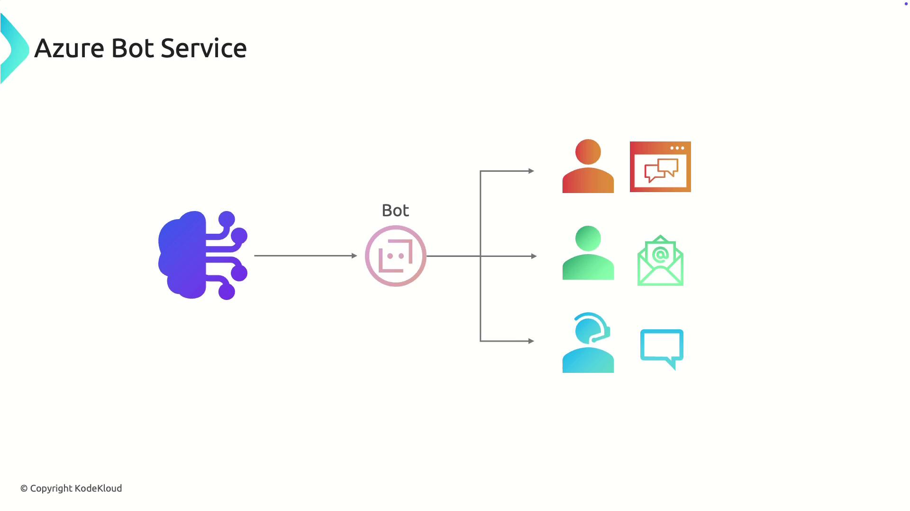
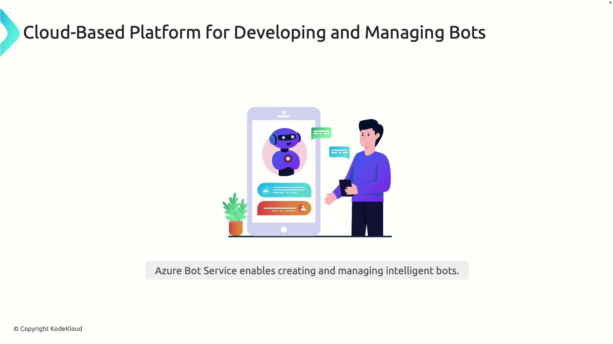
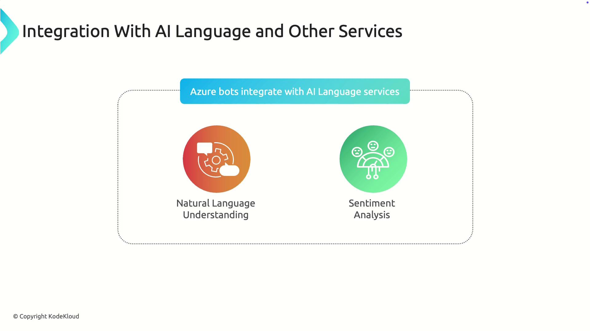
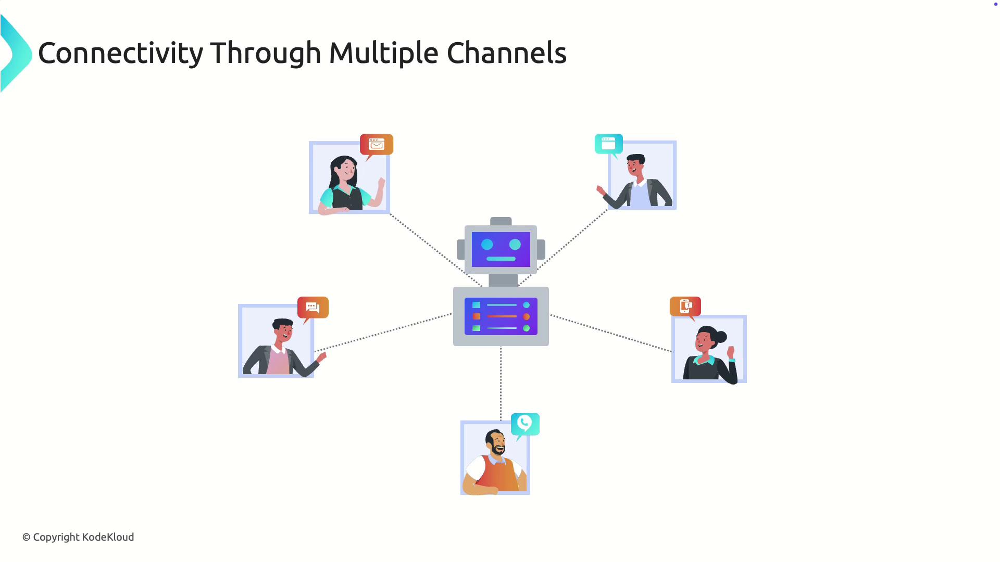
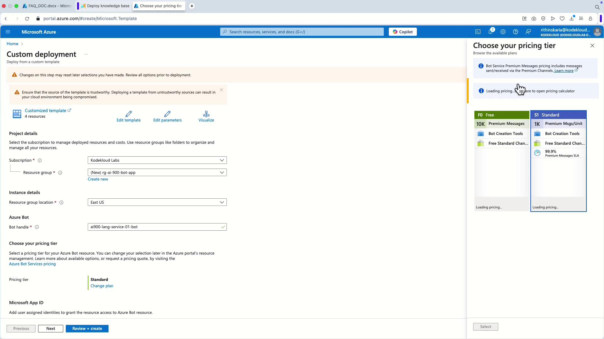
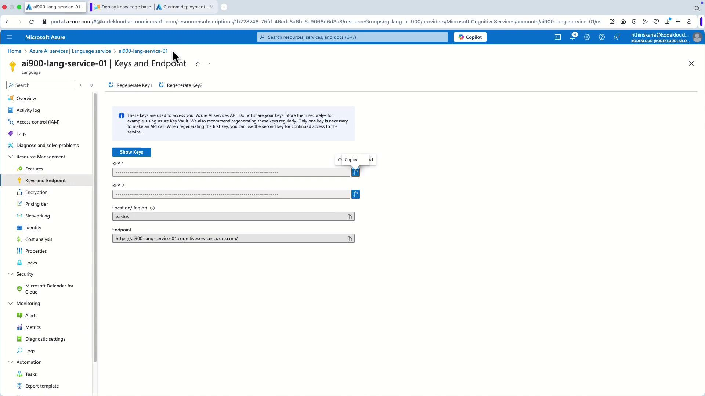
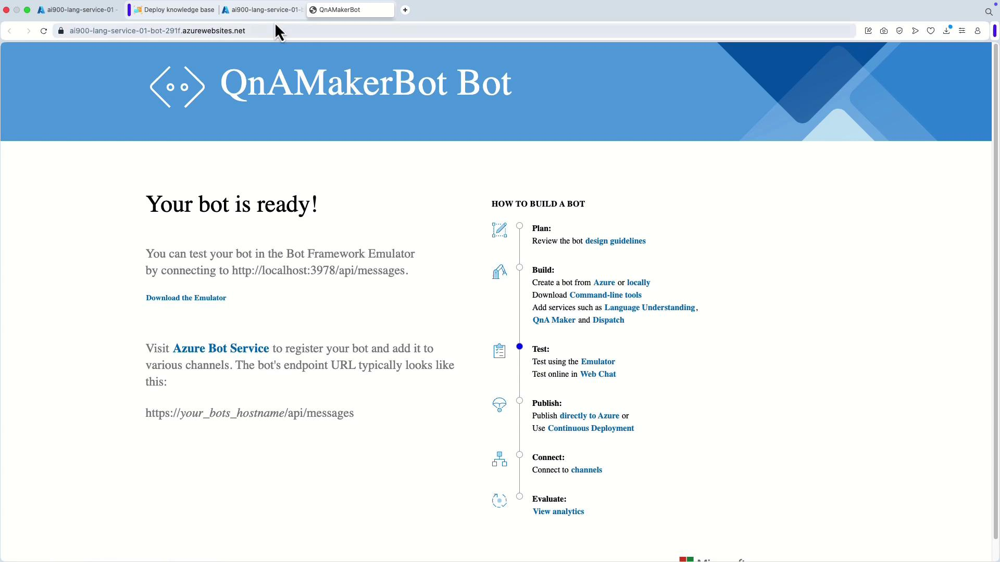
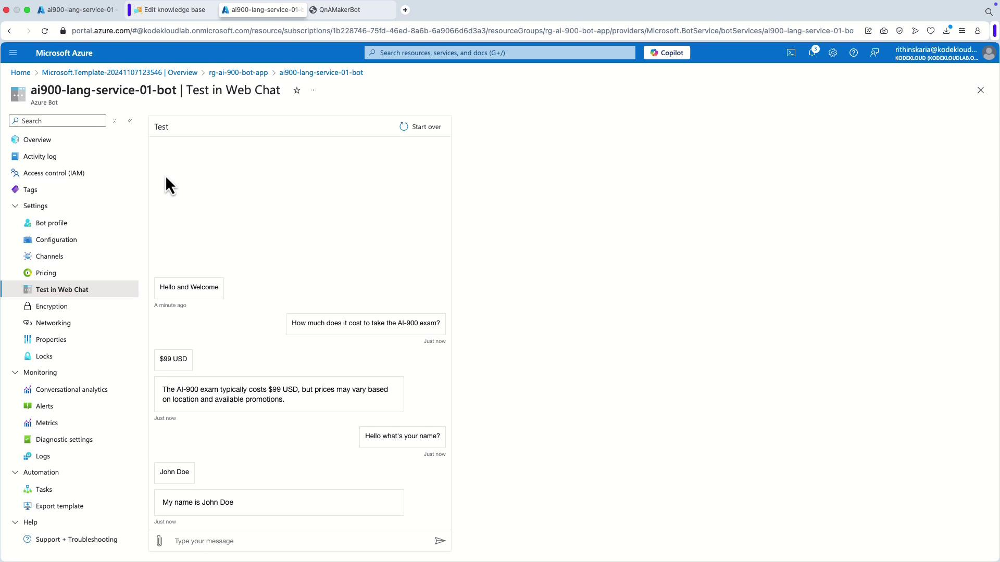

# Azure Bot Service

Source: https://notes.kodekloud.com/docs/AI-900-Microsoft-Certified-Azure-AI-Fundamentals/Azure-NLP-Services/Azure-Bot-Service/page

This article explores Azure Bot Service, a cloud platform for building and managing intelligent bots that enhance user interactions across multiple channels.

In this lesson, we explore Azure Bot Service—a powerful cloud platform for building and managing intelligent bots that interact naturally with users. Azure Bot Service offers an end-to-end environment for creating, deploying, and managing bots, so developers can focus on the logic and functionality without worrying about the underlying infrastructure.

Azure Bot Service is perfect for various scenarios, such as a customer support bot that provides 24/7 assistance by answering common inquiries and completing transactions.

<Frame>
  
</Frame>

## Advanced Capabilities

Azure Bot Service is designed to integrate seamlessly with natural language processing and sentiment analysis. These integrations enable your bot to understand complex user inputs, detect emotional nuances, and adjust responses accordingly. For example, a retail bot might analyze customer sentiment to provide more empathetic assistance if it detects frustration.

<Frame>
  
</Frame>

<Frame>
  
</Frame>

## Multi-Channel Connectivity

One of the key strengths of Azure Bot Service is its ability to deploy a single bot across multiple channels. Whether it's a website, email, social media, or messaging apps, your bot remains accessible, ensuring seamless engagement with your audience.

<Frame>
  
</Frame>

In summary, Azure Bot Service provides a scalable, AI-powered solution for creating bots that can understand, interact with, and assist users on a wide variety of platforms—enhancing customer engagement and streamlining processes.

***

## Demonstration: Deploying and Testing a Bot

Continuing from our demonstration in Azure Language Studio, the following steps guide you through creating a bot resource directly in Azure.

1. In the Language Studio, click on **Create a Bot**. This action redirects you to the Azure portal.

2. In the Azure portal, you will see a deployment template for both the bot service and a web app. Begin by creating a new resource group, then configure the bot service settings:
   * Adjust the plan as needed (e.g., selecting a free plan).

<Frame>
  
</Frame>

3. Select a web app. The portal will suggest an app name by default, and the primary language is pre-set to C# (C Sharp).

4. Create a new App Service plan. Next, you need to provide the language resource key. To obtain the key:

   * Return to the Azure portal.
   * Navigate to AI Services and select the Language Service.
   * Copy one of the available keys and paste it into the designated field.

   The project name and language endpoint will be automatically pre-filled based on your configuration.

<Frame>
  
</Frame>

5. Review your configuration carefully and click on **Create** to deploy the resource. Once the deployment is complete, click **Go to Resource Group** to view all created resources, which should include the web app and the bot.

Opening the web app will redirect you to the QnA Model bot overview page. This page outlines steps for publishing the bot, interfacing with its API, and registering it with the bot service. Although these details are beyond the scope of this lesson, you can test the bot directly via the Web Chat interface.

<Frame>
  
</Frame>

## Testing the Bot

To verify the bot's functionality:

1. Click the test option in Web Chat.
2. The interface will display a welcome message.
3. Enter a query from your knowledge base. For example, entering "Hello, what's your name?" should trigger a custom response like "My name is John Doe."

<Frame>
  
</Frame>

Once you see the appropriate response, your bot is ready for integration across various applications—be it a web app, social media channel, or company website.

<Callout icon="lightbulb">
  For additional details on deploying and configuring Azure Bot Service, please refer to the [Azure Bot Service Documentation](https://learn.microsoft.com/en-us/azure/bot-service/).
</Callout>

***

This concludes our in-depth exploration of Azure Bot Service. With its scalable AI-driven capabilities and support for multiple channels, Azure Bot Service is a robust tool for enhancing customer interactions and streamlining digital workflows. Continue exploring further features and integration strategies to make the most of this platform.

<CardGroup>
  <Card title="Watch Video" icon="video" href="https://learn.kodekloud.com/user/courses/ai-900-microsoft-azure-ai-fundamental/module/c436dcc7-e534-4650-a968-ea64da5e3aee/lesson/1a5b68e6-e73e-421f-88ce-455eee1278a4" />
</CardGroup>
