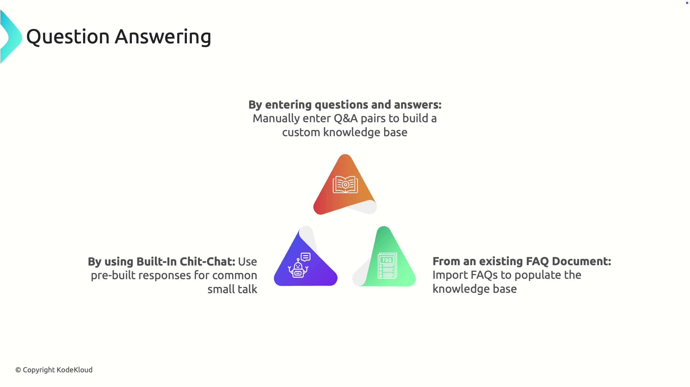
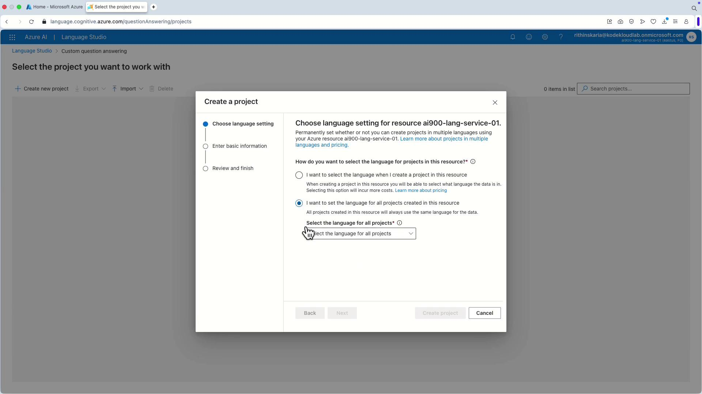
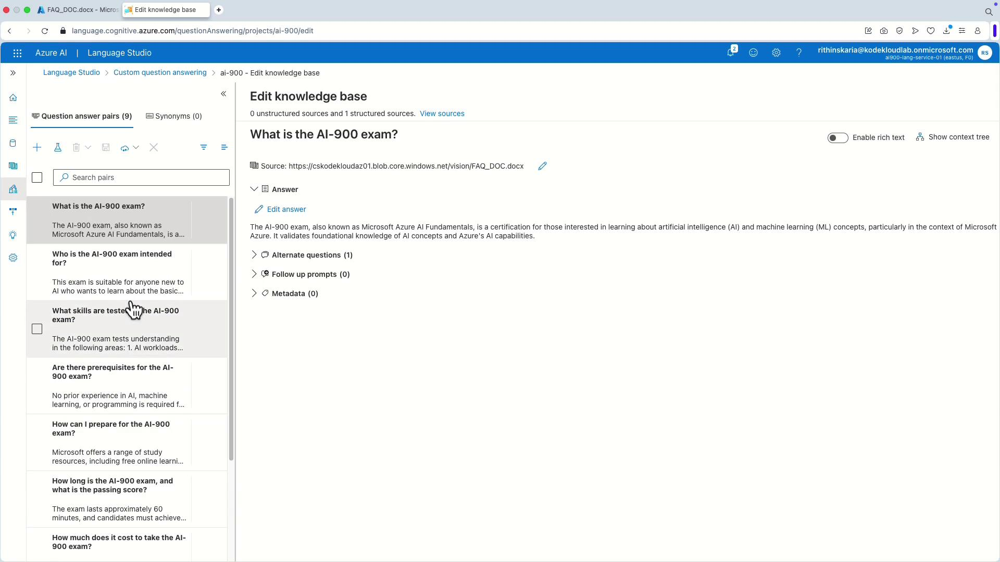
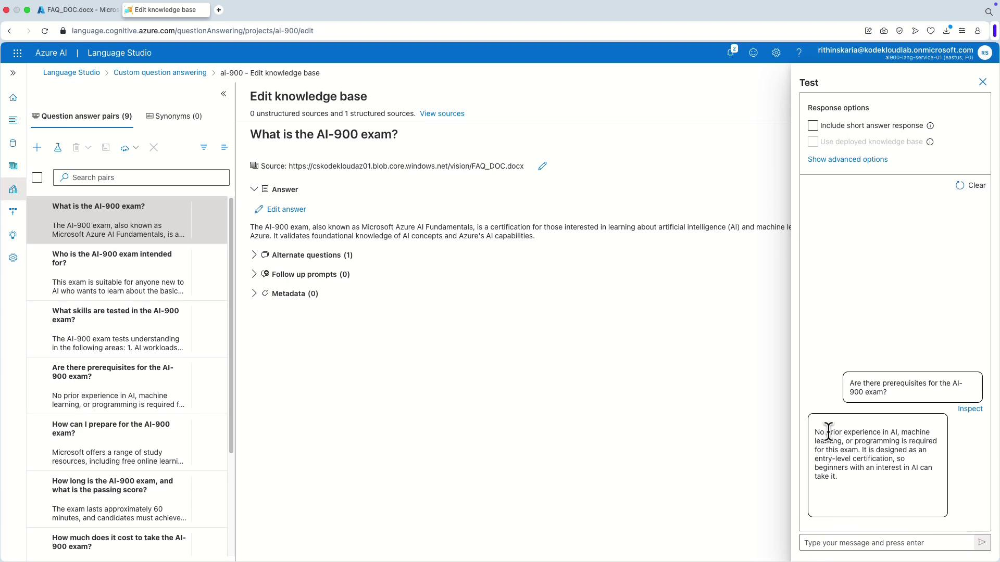
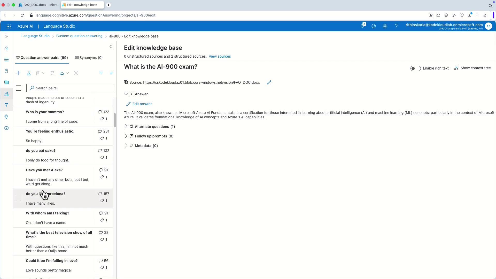
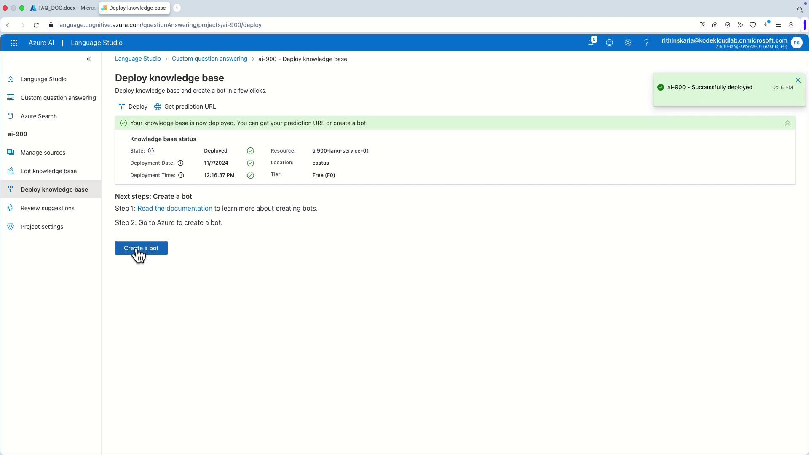

# Question Answering

Source: https://notes.kodekloud.com/docs/AI-900-Microsoft-Certified-Azure-AI-Fundamentals/Azure-NLP-Services/Question-Answering/page

This article explores how to create and manage a knowledge base for question answering using Azure services.

In this lesson, we explore how Azure services power question answering by enabling you to create and manage a comprehensive knowledge base of question-and-answer pairs. This guide shows you how to build, customize, and deploy a knowledge base to support your chatbot or interactive application.

## Building the Knowledge Base

There are several effective methods to construct your knowledge base:

1. **Manually Entering Questions and Answers**\
   Create a highly customized knowledge base by manually entering questions along with their corresponding answers. For example, a company may develop a list of frequently asked questions about its products or services to enhance customer support through chatbots.

2. **Importing an Existing FAQ Document**\
   If you already have a FAQ document (such as a PDF or a web page containing common support questions), you can import it directly. This method saves time and ensures your new knowledge base aligns with your existing content.

3. **Using Built-In Chitchat**\
   Leverage Azure's pre-built conversational responses designed to handle casual interactions and small talk. This built-in chitchat feature enhances the natural feel of your chatbot.

<Frame>
  
</Frame>

With built-in chitchat, if a user greets the chatbot with phrases like "hello" or "how are you?", the chatbot can respond appropriately without requiring custom responses for each scenario.

Once your knowledge base is populated, you can integrate it into various applications and chatbots. Azure's Question Answering service helps ensure that user queries are resolved accurately and consistently, bolstering customer support and engagement with minimal manual effort.

*Later in this series, we will examine how to integrate your knowledge base with a bot service for enhanced interactive customer support.*

## Creating a Custom Knowledge Base in Azure

Follow these steps to upload your knowledge base to the Azure Question Answering service via the Language Studio.

### 1. Accessing Language Studio

Start by navigating to Language Studio in the Azure portal. Click on "Create new custom question answering" and choose a language for your project.

<Frame>
  
</Frame>

In this example, we select English.

### 2. Project Setup

Enter the basic information needed for your project:

* **Project Name:** AI900
* **Description:** (optional)
* **Default Answer:** "I'm sorry, I don't know." (Displayed when no matching answer is found.)

Click "Create" to initialize your project. All subsequent management of your knowledge base resources will be done within this project.

### 3. Adding a Source

To add source content, click on "Add source." You can either supply a URL (for example, from a storage account) or upload your file directly. Here, the file URL is obtained from a storage account container.

After entering the source name (e.g., AI900) and the URL, the file is integrated as a new source. The platform also supports direct file uploads.

### 4. Editing the Knowledge Base

Navigate to the "Edit knowledge base" section to review and manage the imported questions. Typical questions might include:

* What is the AI-900 exam?
* Who is the AI-900 exam intended for?
* What skills are tested in the AI-900 exam?

<Frame>
  
</Frame>

Test the responses by selecting an entry from the list. For instance, if you test a question such as "No prior experience in AI, machine learning, or programming is required for this exam," the system returns your default answer.

<Frame>
  
</Frame>

### 5. Enabling Chitchat for Small Talk

To add casual conversational responses:

* Return to the "Sources" tab and add a new source for chitchat.
* Choose the tone for these responses (options include friendly, professional, caring, or enthusiastic).

In this guide, we select "friendly." The added chitchat responses integrate into your overall knowledge base.

### 6. Further Customization

Returning to the "Edit knowledge base" section, additional custom question-and-answer pairs become visible. Examples might include:

* Have you met Alexa?
* Do you eat cake?

<Frame>
  
</Frame>

You can add new custom entries such as "hello, what's your name?" with a corresponding answer "My name is John Doe." Save your changes, and testing confirms that the correct response is returned.

### 7. Deploying the Knowledge Base

After finalizing edits, click on "Deploy" to publish your knowledge base. This published version can then be consumed by a chatbot. Although integration with Azure Bot Service is not covered in detail here, you can create an Azure Bot Service directly from Language Studio after deployment.

<Frame>
  
</Frame>

<Callout icon="lightbulb">
  Once deployed, your knowledge base is ready for integration with other Azure services, enriching your application with sophisticated question answering capabilities.
</Callout>

***

Congratulations on deploying your knowledge base with Azure Question Answering! In the next article, we will cover how to integrate this service with Azure Bot Service to create an engaging and interactive customer support experience.

Happy learning, and see you in the next session!

***

## Useful Links and References

* [Azure Question Answering Documentation](https://learn.microsoft.com/azure/cognitive-services/question-answering/)
* [Azure Language Studio Overview](https://learn.microsoft.com/azure/cognitive-services/language-service/)
* [Microsoft AI Fundamentals Certification (AI-900)](https://learn.microsoft.com/certifications/azure-ai-fundamentals/)

<CardGroup>
  <Card title="Watch Video" icon="video" href="https://learn.kodekloud.com/user/courses/ai-900-microsoft-azure-ai-fundamental/module/c436dcc7-e534-4650-a968-ea64da5e3aee/lesson/1f97d73a-0262-46ca-bec5-16a245b7104d" />
</CardGroup>
