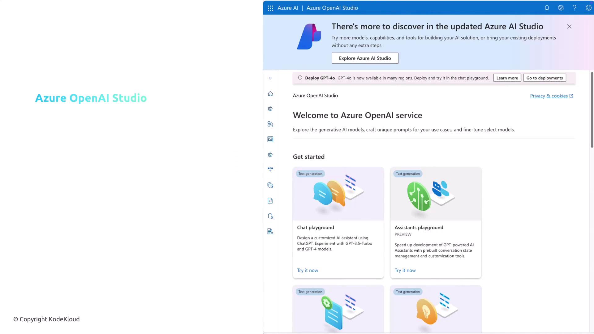
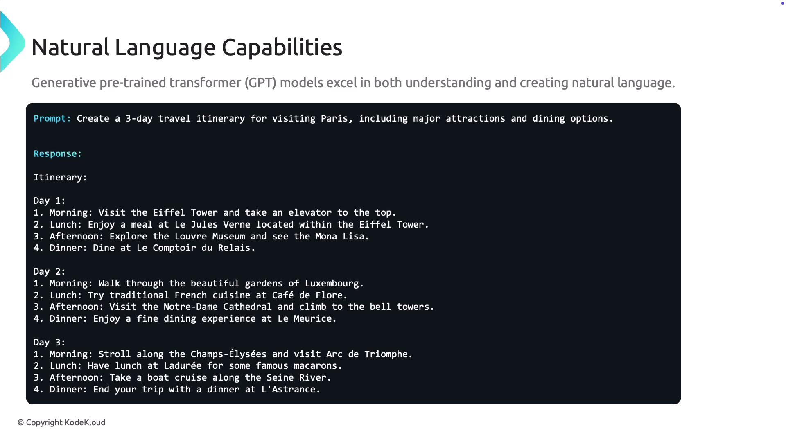

# Azure OpenAI Capabilities

Source: https://notes.kodekloud.com/docs/AI-900-Microsoft-Certified-Azure-AI-Fundamentals/Fundamentals-of-Azure-OpenAI/Azure-OpenAI-Capabilities/page

Azure OpenAI provides AI services integrated into Azure, guiding users through setup, model management, and unique capabilities for enhancing applications.

Azure OpenAI offers a robust suite of AI services seamlessly integrated into the Azure ecosystem. In this guide, we will walk you through getting started with Azure OpenAI, exploring its essential components, and highlighting the unique capabilities available to enhance your applications.

***

## Getting Started with Azure OpenAI

Understanding the key building blocks of the Azure OpenAI platform is vital for deploying, managing, and interacting with AI models effectively.

### Azure OpenAI Studio

Azure OpenAI Studio is your centralized hub for model management. This intuitive interface allows you to deploy models, explore pre-trained generative AI solutions, and manage your experiments.

<Frame>
  
</Frame>

Within the Studio, you can build and deploy AI models tailored to your specific applications, including natural language processing, image generation, and data insights.

### Model Deployment and Generative AI

Azure OpenAI Studio supports the deployment of specialized models, whether your application requires NLP, image generation, or data interpretation. The platform offers a variety of pre-trained generative AI models such as GPT-4.0, GPT-4, GPT-3.5, and image generation models like DALL·E. These tools allow you to integrate advanced AI capabilities into your solutions efficiently.

### Playgrounds for Experimentation

The Playgrounds in Azure OpenAI Studio provide an interactive environment to experiment with and fine-tune your AI models without writing extensive code. You can adjust parameters, modify response styles via Assistant Setup, and observe how models interact with varied inputs.

<Callout icon="lightbulb">
  The Playground is an excellent environment for quick testing and prototyping. It enables you to experiment and refine your model interactions before full deployment.
</Callout>

***

## Natural Language Capabilities

Azure OpenAI Service leverages state-of-the-art Generative Pre-trained Transformer (GPT) models that excel in understanding and generating human-like text. These models can handle complex tasks like generating detailed travel itineraries based on simple prompts.

For example, when a user requests a three-day travel itinerary for Paris that includes major attractions and dining recommendations:

<Frame>
  
</Frame>

The model processes the prompt and generates a structured itinerary, dividing each day into morning, afternoon, and evening sessions. It highlights iconic landmarks such as the Eiffel Tower and suggests dining venues, serving as an efficient virtual assistant for travel planning, chatbots, and content creation tools.

***

## Code Generation Capabilities

Developers can significantly benefit from Azure OpenAI's ability to generate and validate code. For instance, if you need a Python function to add two numbers, the model can provide both the implementation and corresponding unit tests.

Below is an improved example demonstrating this functionality:

```python theme={null}
