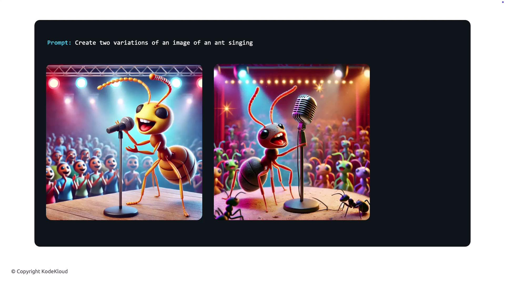
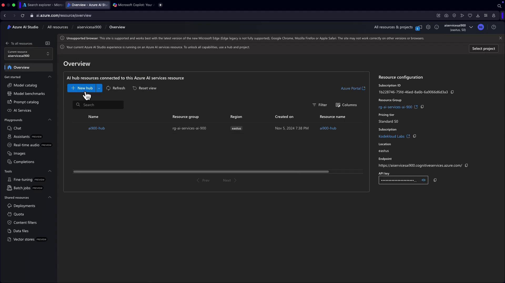
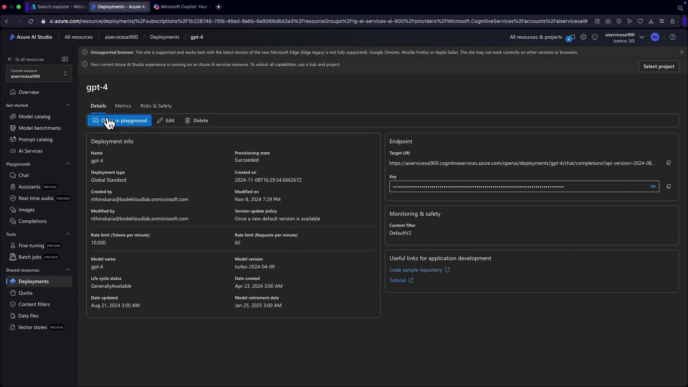
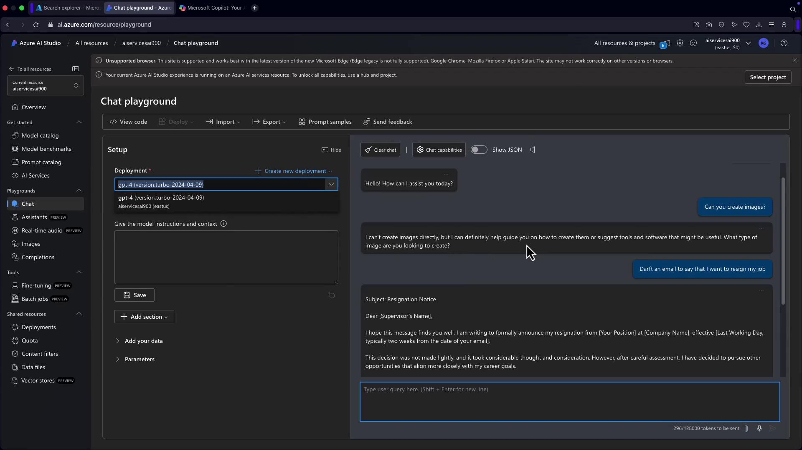

# Python 3
def add_numbers(a, b):
    return a + b

# Simple unit tests for add_numbers function
if __name__ == "__main__":
    # Test cases
    assert add_numbers(3, 5) == 8, "Test Case 1 Failed"
    assert add_numbers(-1, -1) == -2, "Test Case 2 Failed"
    assert add_numbers(0, 0) == 0, "Test Case 3 Failed"
    print("All test cases passed!")
```

In this example, the model not only produces a functional code snippet but also delivers comprehensive tests to validate its correctness. This capability ultimately expedites development and minimizes potential errors.

***

## Image Generation Capabilities

Azure OpenAI also excels in image generation through models like DALL·E. These models generate and edit images based on textual prompts. For example, if you request an image of a "singing ant," DALL·E generates a creative interpretation of the prompt. Additionally, it supports image editing, allowing adjustments like color changes, additions, or stylistic modifications, and can produce multiple variations of a given image.



These robust image generation features are particularly useful in advertising, content creation, and design by delivering quick, flexible, and unique visual outputs based on your specifications.

***

## Deploying Models with Azure AI Studio

Once you have explored the features and capabilities, the next step is deploying your models using Azure AI Studio.

### Setting Up Your Project and Hub

Begin by creating an AI hub and project within Azure AI Studio. This centralized area will help you manage all your AI resources conveniently.



### Browsing the Model Catalog

Within the model catalog, you can explore various models including GPT, OpenAI, and Whisper models among others. This catalog simplifies selecting the ideal model to match your needs.


### Deploying a GPT Model

To deploy a model, navigate to the deployments section and select your desired base model (e.g., GPT-4.0). The interface presents details like task type, limitations, and version information. Once confirmed, the model is deployed and available for use.

After deployment, click "Open in Playground" to interact with the model in a chat-based interface. This setup lets you send prompts, draft emails, and handle queries with ease.



Within the playground, you can seamlessly interact with the model. Whether drafting a resignation email or responding to queries, the playground facilitates real-time, intuitive interactions.



You can deploy and test multiple models directly from the Playground, removing the need for immediate integration into your applications.

***

## Responsible AI

Implementing AI responsibly is crucial. This section outlines best practices and guidelines for deploying your AI models ethically and securely. Adhering to these principles ensures that your implementations are not only effective but also socially responsible and compliant with industry standards.

> **triangle-alert** Always evaluate and monitor AI models for fairness, transparency, and security to maintain ethical standards and build trust with your users.

***

This guide has outlined the process of setting up and exploring Azure OpenAI capabilities—from managing models in Azure OpenAI Studio to deploying GPT models for text, code, and image generation. With these advanced tools at your disposal, you are well-equipped to integrate cutting-edge AI functionalities into your applications.

For further reading, check out the following resources:

* [Azure OpenAI Documentation](https://docs.microsoft.com/en-us/azure/cognitive-services/openai/)
* [Microsoft AI](https://www.microsoft.com/en-us/ai)
* [Azure AI Platform](https://azure.microsoft.com/en-us/services/machine-learning/)

- [Watch Video](https://learn.kodekloud.com/user/courses/ai-900-microsoft-azure-ai-fundamental/module/cedfb9c5-9860-4830-9d1b-e30827006991/lesson/1a325f90-d65d-405b-a73e-9ed9352b3178)


# Models Supported by Azure Open AI

Source: https://notes.kodekloud.com/docs/AI-900-Microsoft-Certified-Azure-AI-Fundamentals/Fundamentals-of-Azure-OpenAI/Models-Supported-by-Azure-Open-AI/page

This article provides a comprehensive guide on the models supported by Azure OpenAI and their unique capabilities for various applications.

Welcome to this comprehensive guide on the models supported by Azure OpenAI. Discover how each model brings unique capabilities to power a wide range of applications across different industries.

## GPT-4.0 and GPT-4.0 Turbo

The GPT-4.0 and GPT-4.0 Turbo models represent the cutting edge in AI technology available through Azure OpenAI. These models are designed to process both text and images, enabling visually integrated applications alongside advanced natural language and code generation.

> **lightbulb** These models are ideal for projects that demand high-level comprehension and generation for complex language and visual content.

## GPT-4

Building on the advancements introduced in GPT-3.5, the GPT-4 model offers a markedly improved understanding of language and code. Although it does not process images, its enhanced linguistic capabilities make it perfectly suited for applications requiring refined language processing.

## GPT-3.5

GPT-3.5 builds on the strengths of its predecessor, GPT-3, providing robust performance in natural language understanding and code generation. Even though it isn’t as advanced as GPT-4, GPT-3.5 remains a dependable option for many standard applications that rely on strong language comprehension.

## Embeddings

The Embeddings model converts text into numerical vectors that capture the semantic meaning of the content. This transformation is particularly valuable for tasks such as text similarity analysis, clustering, and improving search accuracy, where understanding relationships between words is crucial.

## DALL·E (Preview)

DALL·E, currently available in preview, is a transformative tool that generates unique images from natural language descriptions. Imagine describing a scene in text and seeing it materialize as a visual artwork—DALL·E makes this creative process accessible.

> **triangle-alert** Since DALL·E is in preview mode, it is recommended to test thoroughly before deploying it in a production environment.

## Summary

Azure OpenAI offers an extensive range of models designed to meet diverse requirements across text, image, and code-based applications. By selecting the right model for your specific needs, you can tailor your AI solutions to achieve optimal business outcomes.

Explore the broader capabilities of Azure OpenAI and discover new possibilities for your applications.

## Additional Resources

* [Azure OpenAI Documentation](https://azure.microsoft.com/en-us/services/cognitive-services/openai-service/)
* [Getting Started with Azure OpenAI](https://learn.microsoft.com/en-us/azure/cognitive-services/openai/)

- [Watch Video](https://learn.kodekloud.com/user/courses/ai-900-microsoft-azure-ai-fundamental/module/cedfb9c5-9860-4830-9d1b-e30827006991/lesson/464f2890-97b6-4b99-a18a-87b2634ec446)
