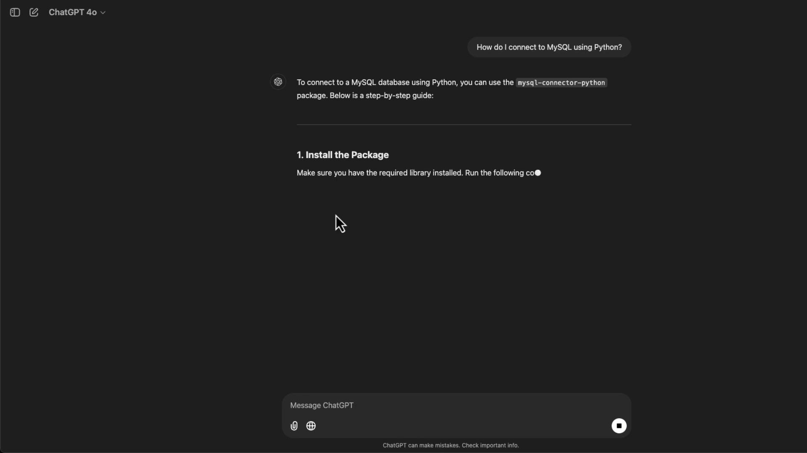

# A Quick Look ChatGPT

Source: https://notes.kodekloud.com/docs/AI-Assisted-Development/Introduction-to-AI-Assisted-Development/A-Quick-Look-ChatGPT/page

This article explores how ChatGPT serves as a versatile programming assistant for generating code, debugging, and enhancing productivity.

If you've ever spent hours debugging code only to later find a much simpler solution, you know how valuable a coding companion can be. ChatGPT serves as an excellent pair-programming buddy by allowing you to input error messages or ask questions like "How do I do X?" and receive immediate assistance. Whether it's generating documentation, scaffolding applications, or debugging code, ChatGPT is a versatile tool for addressing various programming challenges.

While there are specialized tools such as GitHub Copilot, Tabnine, and BlackboxAI explicitly designed for software development, ChatGPT remains an outstanding starting point for many programming tasks.

***

## ChatGPT Interface and Basic Usage

The ChatGPT interface is designed to be both intuitive and minimalistic. Your ongoing conversation history is visible on the left side, allowing you to pick up where you left off or revisit earlier sessions. For example, if you need to connect to a MySQL database using Python, you might ask:

"How do I connect to MySQL using Python?"

In response, ChatGPT produces a detailed, step-by-step guide that includes installing the necessary `mysql-connector-python` package and providing sample code. Below is an image that illustrates this interaction:



Here’s a Python snippet demonstrating basic database query operations:

```python theme={null}
def query_database(connection):
    try:
        cursor = connection.cursor()
        query = "SELECT * FROM your_table_name;"  # Replace with your query
        cursor.execute(query)
        rows = cursor.fetchall()
        for row in rows:
            print(row)
    except Error as e:
        print(f"Error querying the database: {e}")
    finally:
        if 'cursor' in locals():
            cursor.close()
