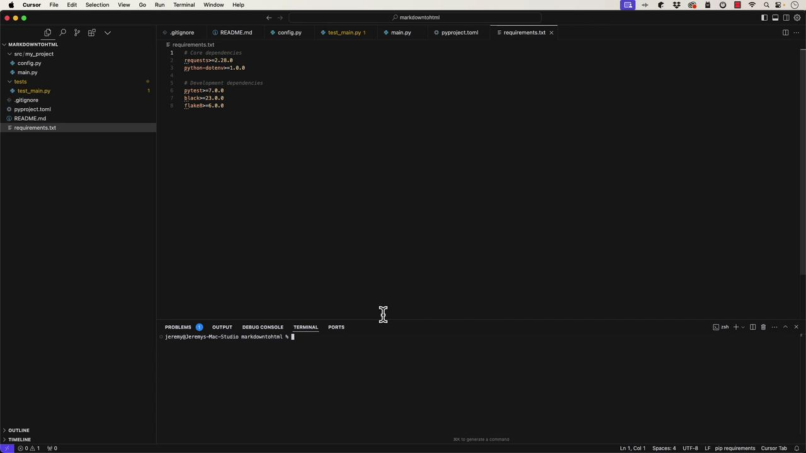
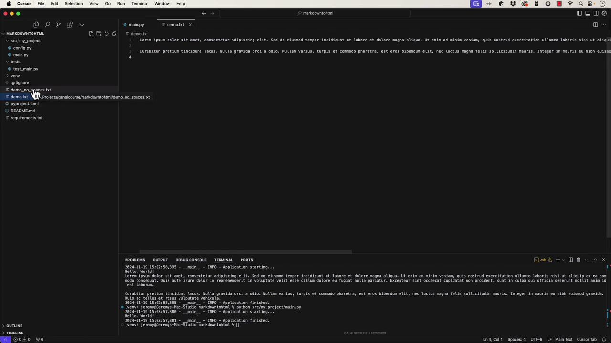

# Main application module.
logging.basicConfig(
    level=logging.INFO,
    format='%(asctime)s - %(name)s - %(message)s'
)
logger = logging.getLogger(__name__)

def main():
    """Main application entry point."""
    logger.info('Application starting...')
    # Your application logic here
    logger.info('Application finished.')

if __name__ == '__main__':
    main()
```

A configuration file, `config.py`, is also generated. It uses a dataclass to manage configuration variables such as the API key and debug mode:

```python theme={null}
import os
from dataclasses import dataclass
from typing import Optional

@dataclass
class Config:
    """Application configuration."""
    app_name: str = "my_project"
    debug: bool = False
    api_key: Optional[str] = os.getenv("API_KEY")

    @classmethod
    def load(cls) -> "Config":
        """Load configuration from environment."""
        return cls(
            debug=os.getenv("DEBUG", "false").lower() == "true",
            api_key=os.getenv("API_KEY")
        )

config = Config.load()
```

A simple test file is generated to serve as a placeholder for your test cases:

```python theme={null}
import pytest
from my_project.main import main

def test_main():
    """Test main function execution."""
    # Add your test cases here
    assert True
```

Additionally, the project includes a `.gitignore` file for ignoring file patterns (like virtual environments), a `pyproject.toml` with metadata and dependency details, and a basic `requirements.txt` listing both core and development dependencies.

The `pyproject.toml` file looks like this:

```toml theme={null}
[build-system]
requires = ["hatchling"]
build-backend = "hatchling.build"

[project]
name = "my_project"
authors = [
    { name = "Your Name", email = "your.email@example.com" }
]
description = "A short description of your project"
readme = "README.md"
requires-python = ">=3.8"
dependencies = []

[project.optional-dependencies]
dev = [
    "pytest>=7.0",
    "pytest-cov>=4.0",
    "black>=23.0",
    "isort>=5.0",
    "flake8>=6.0",
]

[tool.pytest.ini_options]
testpaths = ["tests"]
python_files = ["test_*.py"]
```



## Setting Up and Running the Application

To set up your Python environment, open the terminal and create a virtual environment:

```bash theme={null}
python -m venv venv
# If "python" is not recognized, try:
python3 -m venv venv

source venv/bin/activate
```

Once the virtual environment is activated, install the dependencies:

```bash theme={null}
pip install -r requirements.txt
```

You can then run your application:

```bash theme={null}
python src/main.py
```

If you encounter an error like "can't open file 'src/main.py'", verify your directory structure. For instance, if your main file resides at `src/my_project/main.py`, run:

```bash theme={null}
python src/my_project/main.py
```

Upon execution, you should see log output indicating the application has started and finished, similar to:

```bash theme={null}
2022-11-19 14:59:16,537 __main__ INFO - Application starting...
Hello, World!
2022-11-19 14:59:16,537 __main__ INFO - Application finished.
```

## Modifying the Application

Cursor supports interactive code generation. For example, you can modify your code so that it reads from a text file (`demo.txt`) and prints its contents line by line. An updated version of `main.py` might look like this:

```python theme={null}
import logging

logging.basicConfig(
    level=logging.INFO,
    format='%(asctime)s - %(name)s - %(levelname)s - %(message)s'
)
logger = logging.getLogger(__name__)

def main():
    """Main application entry point."""
    logger.info('Application starting...')
    
    print("Hello, World!")
    try:
        with open("demo.txt") as file:
            for line in file:
                print(line.rstrip())
    except FileNotFoundError:
        logger.error("demo.txt file not found")
    except Exception as e:
        logger.error(f"Error reading demo.txt: {e}")
    logger.info('Application finished.')

if __name__ == "__main__":
    main()
```

Later, you might further modify the code to process the file by removing all spaces and writing the cleaned output to `demo_no_spaces.txt`:

```python theme={null}
import logging

logging.basicConfig(
    level=logging.INFO,
    format='%(asctime)s - %(name)s - %(levelname)s - %(message)s'
)
logger = logging.getLogger(__name__)

def main():
    """Main application entry point."""
    logger.info("Application starting...")
    print("Hello, World!")
    # Your application logic here

    try:
        with open('demo.txt') as file:
            for line in file:
                with open('demo_no_spaces.txt', 'w') as outfile:
                    outfile.write(line.rstrip().replace(" ", ""))
    except FileNotFoundError:
        logger.error('demo.txt file not found')
    except IOError as e:
        logger.error('Error reading demo.txt: {0}'.format(e))
    logger.info("Application finished.")

if __name__ == "__main__":
    main()
```

After running the application, confirm that `demo.txt` has been processed and that `demo_no_spaces.txt` is created as expected.



## Refactoring into Functions and Writing Tests

For better code organization, it's a good practice to refactor logic into separate functions. In this case, the file processing logic is moved into its own function:

```python theme={null}
def process_file():
    """Process demo.txt file and write output without spaces."""
    try:
        with open("demo.txt", "r") as infile, open("demo_no_spaces.txt", "w") as outfile:
            for line in infile:
                outfile.write(line.rstrip().replace(" ", "") + "\n")
    except FileNotFoundError:
        logger.error('demo.txt file not found')
    except IOError as e:
        logger.error(f"Error reading demo.txt: {e}")
    logger.info("Application finished")

def main():
    """Main application entry point."""
    logger.info("Application starting...")
    print("Hello, World!")
    # Your application logic here

process_file()

if __name__ == "__main__":
    main()
```

Next, it's important to write tests for your functions. In the file `tests/test_main.py`, you might add tests as follows:

```python theme={null}
import os
import pytest
from my_project.main import main, process_file

def test_main():
    """Test main function execution."""
    # Add your test cases here.
    assert True

def test_process_file(tmp_path):
    """Test process_file function with sample input."""
    # Prepare test input.
    test_input = "sample text\nwith multiple\nlines"
    demo_file = tmp_path / "demo.txt"
    demo_file.write_text(test_input)
    
    # Change the working directory to the temporary path.
    original_cwd = os.getcwd()
    os.chdir(tmp_path)
    
    # Call process_file which will read demo.txt and write demo_no_spaces.txt.
    process_file()
    
    # Read the output from demo_no_spaces.txt.
    output_file = tmp_path / "demo_no_spaces.txt"
    result = output_file.read_text().splitlines()
    
    # Expected output: each line with spaces removed.
    expected_output = [line.replace(" ", "") for line in test_input.splitlines()]
    
    # Restore the original working directory.
    os.chdir(original_cwd)
    
    # Assert the results.
    assert result == expected_output
    assert len(result) == 3
    assert isinstance(result, list)
```

> **lightbulb** If you encounter issues running tests, ensure your project is structured as a proper Python package (e.g., add empty `__init__.py` files) and adjust import statements accordingly. For example:

  ```bash theme={null}
  touch my_project/__init__.py
  touch tests/__init__.py
  ```

When running tests with pytest, common troubleshooting steps include verifying module import paths and installing your package in development mode with:

```bash theme={null}
pip install -e .
```

## Final Thoughts

Cursor significantly speeds up code generation and prototyping. However, as demonstrated through iterative testing and debugging, a solid foundation in Python and best development practices remains essential. In our next article, we will explore building a larger application combining multiple AI-assisted development tools like [ChatGPT](https://chat.openai.com), [Tabnine](https://www.tabnine.com), [BlackboxAI](https://www.blackbox.ai), [GitHub Copilot](https://github.com/features/copilot), and Cursor.

Stay tuned for our next lesson as we delve deeper into advanced application development methodologies.

- [Watch Video](https://learn.kodekloud.com/user/courses/ai-assisted-development/module/d64636e3-1af6-4ab7-934f-5676c4266ac7/lesson/cc0b2a73-3aa3-415d-83e7-e57f41698d3d)


# A Quick Look GitHub Copilot

Source: https://notes.kodekloud.com/docs/AI-Assisted-Development/Introduction-to-AI-Assisted-Development/A-Quick-Look-GitHub-Copilot/page

This article explores GitHub Copilot, an extension for Visual Studio Code that aids in developing a CSV Reader application using Python.

In this article, we explore GitHub Copilot—a powerful extension for Visual Studio Code—that assists you in developing a small CSV Reader application using Python. We cover setting up your project environment, scaffolding the application, reading and processing a CSV file, and even generating unit tests. GitHub Copilot helps both beginners and seasoned developers write less repetitive code and focus on solving problems.

***

## Getting Started

GitHub Copilot provides intelligent code suggestions and generates boilerplate code to speed up development. To begin, install the GitHub Copilot extension in Visual Studio Code. Once installed, you will notice a "ready" status in the lower right-hand corner along with an integrated chat interface for code assistance.

For example, if you ask, "How do I create a new Python app?" Copilot might suggest these steps:

```bash theme={null}
mkdir my_python_app
cd my_python_app
python3 -m venv venv
source venv/bin/activate
