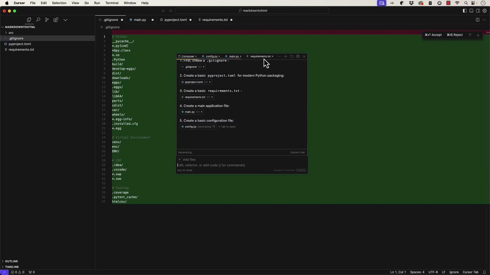
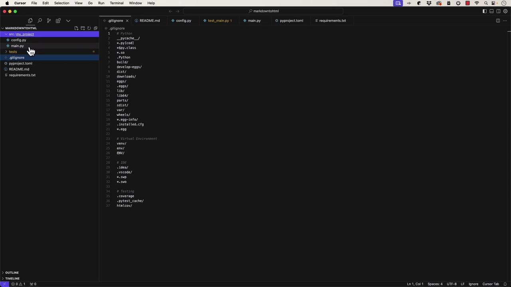

# Example Usage
if connection and connection.is_connected():
    query_database(connection)
```

ChatGPT not only generates useful code but also adapts its output based on the model you're using—for example, free-tier GPT-3.5 versus the more capable GPT-4.0 and its specialized variants.

***

## Exploring Different ChatGPT Models

ChatGPT comes in several model variants, each optimized for specific programming scenarios:

* **GPT-3.5**: Ideal for general programming tasks, especially for users on the free tier.
* **GPT-4.0**: Offers more precise and context-aware responses.
* **GPT-4.0 with Canvas**: Currently in beta, this model provides a dynamic workspace for real-time code and writing collaboration.
* **O1 Preview and O1 Mini**: Known for advanced reasoning and rapid response times, these models excel in debugging and managing large codebases.

For instance, installing the MySQL connector is as simple as running:

```bash theme={null}
pip install mysql-connector-python
```

***

## Using ChatGPT with Canvas

ChatGPT with Canvas offers a dynamic editing environment where you can generate and refine boilerplate code interactively. Suppose you ask it to create a boilerplate HTML page complete with CSS styles and some JavaScript functionality. ChatGPT responds by opening a real-time canvas, generating the corresponding code. An initial output might resemble the following:

```html theme={null}
<!DOCTYPE html>
<html>
<head>
    <style>
        body {
            font-size: 16px;
        }
        button:hover {
            background-color: #45a049;
        }
    </style>
</head>
<body>
    <header>
        <h1>Welcome to the Boilerplate Page</h1>
    </header>
    <main>
        <p>This is a simple HTML boilerplate including CSS styles and some JavaScript functionality.</p>
        <button id="actionButton">Click Me!</button>
        <p id="message"></p>
    </main>
    <script>
        document.getElementById("actionButton").addEventListener("click", function() {
            const messageElement = document.getElementById("message");
            messageElement.textContent = "Button Clicked! Hello, World!";
        });
    </script>
</body>
</html>
```

During your session, you can request modifications—such as adding an alert dialog or converting the JavaScript code to TypeScript. The canvas interface updates in real time, and a refined version might look like this:

```html theme={null}
<!DOCTYPE html>
<html lang="en">
<head>
    <meta charset="UTF-8">
    <meta name="viewport" content="width=device-width, initial-scale=1.0">
    <title>HTML Boilerplate</title>
    <style>
        body {
            padding: 15px;
            text-align: center;
        }
        main {
            padding: 20px;
        }
        button {
            background-color: #4CAF50;
            color: white;
            border: none;
            padding: 10px 20px;
            cursor: pointer;
            font-size: 16px;
        }
        button:hover {
            background-color: #45a049;
        }
        /* Mobile friendly styles */
        @media (max-width: 600px) {
            header {
                font-size: 1.5em;
                padding: 10px;
            }
            main {
                padding: 10px;
            }
            button {
                padding: 8px 16px;
                font-size: 14px;
            }
        }
    </style>
</head>
<body>
    <header>
        <h1>Welcome to the Boilerplate Page</h1>
    </header>
    <main>
        <p>This is a simple HTML boilerplate including CSS styles and some JavaScript functionality.</p>
        <button id="actionButton">Click Me!</button>
        <p id="message"></p>
    </main>
    <script type="module">
        const actionButton = document.getElementById("actionButton") as HTMLButtonElement;
        const messageElement = document.getElementById("message") as HTMLParagraphElement;

        actionButton.addEventListener("click", () => {
            alert("hello!");
            messageElement.textContent = "Button clicked! Hello, World!";
        });
    </script>
</body>
</html>
```

> **lightbulb** ChatGPT’s canvas provides a flexible, interactive environment perfect for experimenting with and refining your code—from converting JavaScript to TypeScript to adapting CSS for mobile responsiveness.

***

## Context Awareness Versus Limited Context

The traditional ChatGPT interface operates purely on the code provided without the broader context of your project. In contrast, IDE-integrated tools like GitHub Copilot analyze your entire codebase and offer tailored suggestions. For example, if you show ChatGPT a boilerplate HTML snippet, it assumes the snippet stands alone:

```css theme={null}
button {
  background-color: #4CAF50;
  color: white;
  border: none;
  padding: 10px 20px;
  cursor: pointer;
  font-size: 16px;
}

button:hover {
  background-color: #45a049;
}

/* Mobile friendly styles */
@media (max-width: 600px) {
  header {
    font-size: 1.5em;
    padding: 10px;
  }
  main {
    padding: 10px;
  }
  button {
    padding: 8px 16px;
    font-size: 14px;
  }
}
```

```html theme={null}
<h1>Welcome to the Boilerplate Page</h1>
<p>This is a simple HTML boilerplate including CSS styles and some JavaScript functionality.</p>
<button id="actionButton">Click Me!</button>
<p id="message"></p>
```

```typescript theme={null}
const actionButton = document.getElementById("actionButton") as HTMLButtonElement;
const messageElement = document.getElementById("message") as HTMLParagraphElement;

actionButton.addEventListener("click", () => {
  alert("hello!");
  messageElement.textContent = "Button clicked! Hello, World!";
});
```

Switching to an IDE tool that understands your entire project context might lead to suggestions tailored specifically for your framework or environment.

***

## Debugging, Code Evaluation, and Custom GPTs

One of ChatGPT’s strong suits is its ability to analyze and explain code. However, beginners should avoid copying and pasting generated code blindly. Instead, review the output to fully understand each component and ensure it fits within your project's ecosystem.

Consider this Python snippet that sends an HTTP request:

```bash theme={null}
pip install requests
```

```python theme={null}
import requests

# Define the URL
url = "https://api.example.com/data"

# Send a GET request
response = requests.get(url)

# Check the response status
if response.status_code == 200:
    print("Success:", response.json())  # Assuming the response is in JSON
else:
    print("Failed with status code:", response.status_code)
```

When you ask ChatGPT to explain the code, it breaks down each step:

* It imports the requests library.
* Defines the URL to access.
* Sends a GET request.
* Processes the response based on the HTTP status code.

For more advanced HTTP operations, ChatGPT can even generate examples that include query parameters, file uploads, and timeout management:

```python theme={null}
# Example: Using timeout, parameters, and file upload
response = requests.get(url, timeout=5)  # Timeout after 5 seconds

params = {'key1': 'value1', 'key2': 'value2'}
response = requests.get(url, params=params)

files = {'file': open('example.txt', 'rb')}
response = requests.post(url, files=files)
```

When testing code generated by ChatGPT, always validate its error handling and logging as needed. For example, a more robust version of a POST request might look like this:

```python theme={null}
import requests
import logging

def send_post_request(url, payload):
    try:
        response = requests.post(url, json=payload, timeout=10)
        response.raise_for_status()  # Raises HTTPError for bad responses (4xx, 5xx)
        if response.status_code == 201:  # 201 Created
            logging.info("Data successfully created.")
            return response.json()
        else:
            logging.warning(f"Unexpected status code: {response.status_code}")
            return None
    except requests.exceptions.RequestException as e:
        logging.error(f"An error occurred: {e}")
        return None

# Example usage
if __name__ == "__main__":
    url = "https://api.example.com/data"
    payload = {
        "key1": "value1",
        "key2": "value2"
    }
    
    response_data = send_post_request(url, payload)
    if response_data:
        logging.info(f"Response data: {response_data}")
    else:
        logging.error("Failed to create data.")
```

> **lightbulb** Always review auto-generated code, ensuring proper understanding and integration into your project. This practice is crucial in maintaining code quality and reliability.

***

## Conclusion

This article explored how ChatGPT functions as an effective programming assistant. Whether generating simple code snippets, converting JavaScript to TypeScript, or integrating with larger frameworks, ChatGPT offers a flexible, interactive environment to enhance your productivity. Remember to review and understand the output, ensuring that any auto-generated code is suitably adapted to meet your project's specific needs.

Happy coding!

- [Watch Video](https://learn.kodekloud.com/user/courses/ai-assisted-development/module/d64636e3-1af6-4ab7-934f-5676c4266ac7/lesson/f1811de9-574a-4cb8-a4b1-ca141663269b)


# A Quick Look Cursor

Source: https://notes.kodekloud.com/docs/AI-Assisted-Development/Introduction-to-AI-Assisted-Development/A-Quick-Look-Cursor/page

This article explores Cursor, a standalone application for immersive coding and chat integration, highlighting its features and Python application setup.

In this article, we explore Cursor—a standalone application built as a fork of [Visual Studio Code](https://code.visualstudio.com). Unlike extensions for Visual Studio Code or [JetBrains products](https://www.jetbrains.com), Cursor offers an immersive environment where both chat and code reside within a single window.

When you launch Cursor and press Ctrl+I, you'll see options such as Add Files, Edit Refactor, and Add Code. The tool also allows you to switch between models like Cloud 3.5 Sonnet, GPT-4, 40 Mini, 01 Mini, 01 Preview, and Cursor Small. For illustration, we scaffold a typical Python application, with Cursor automatically generating the necessary files—much like what [GitHub Copilot](https://github.com/features/copilot) might do.



After accepting the generated files, you can inspect the project structure. The folder includes a source directory (src) with your project files, such as `main.py`.



## The Generated Python Application

The generated `main.py` file contains a standard Python entry point, featuring a `def main` function along with an `if __name__ == '__main__':` check. It also sets up logging automatically:

```python theme={null}
import logging
