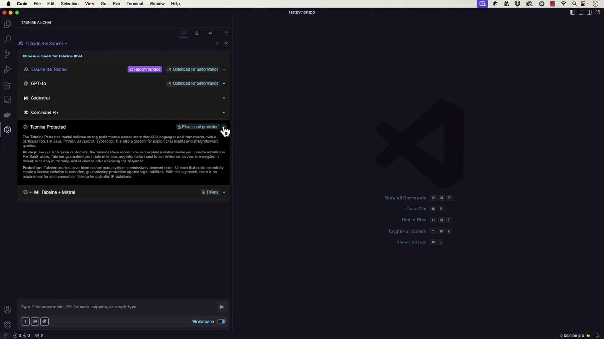
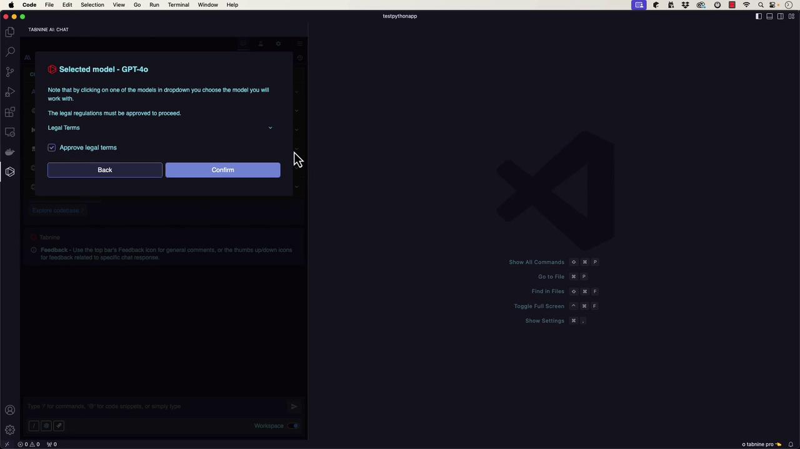

# app.py
def main():
    print("Hello, World!")

if __name__ == "__main__":
    main()
pip install requests
python app.py
```

You can activate Copilot’s inline help by pressing Command+I (or Control+I on Windows/Linux) and entering your prompt. Experimenting in the terminal is highly encouraged!

***

## Creating a Python Virtual Environment and Application File

Open your terminal in Visual Studio Code and create your project directory with a dedicated virtual environment:

```bash theme={null}
mkdir my_python_app
cd my_python_app
python3 -m venv venv
source venv/bin/activate
```

Next, create your main Python file:

```bash theme={null}
touch main.py
```

As you start writing code in `main.py`, GitHub Copilot will offer contextual suggestions and help scaffold the basic structure of your application.

***

## Building the CSV Reader Application

GitHub Copilot might initially scaffold a simple Python application that prints a greeting. For example:

```python theme={null}
import argparse

def main():
    parser = argparse.ArgumentParser(description="Your application description")
    # Add your arguments here
    args = parser.parse_args()

    # TODO: Implement your application logic
    print("Hello, World!")

if __name__ == "__main__":
    main()
```

After confirming that the base application works (by running `python main.py`), you can extend it to read a CSV file.

### Creating a Sample CSV File

Create a CSV file named `data.csv` with the following sample data:

```csv theme={null}
first_name,last_name,ip_address,city,state
John,Doe,192.168.1.1,New York,NY
Jane,Smith,192.168.1.2,Los Angeles,CA
Bob,Johnson,192.168.1.3,Chicago,IL
Alice,Williams,192.168.1.4,Houston,TX
Michael,Brown,192.168.1.5,Phoenix,AZ
```

***

## Reading the CSV File

Enhance your Python application by adding a function to read the CSV file. The following example, suggested by GitHub Copilot, demonstrates how to do this:

```python theme={null}
import argparse

# Function to open a CSV file and read the data
def read_csv(file_path):
    with open(file_path, 'r') as file:
        data = file.readlines()
    return data

def main():
    parser = argparse.ArgumentParser(description="Your application description")
    # Add an argument for the CSV file path
    parser.add_argument('csv_file', type=str, help='Path to the CSV file')
    args = parser.parse_args()
    # Read the CSV file argument
    csv_file = args.csv_file
    print(csv_file)
    
    # Read and print the CSV file content
    data = read_csv(csv_file)
    for line in data:
        print(line.strip())

if __name__ == "__main__":
    main()
```

Execute the application using the command below:

```bash theme={null}
python main.py data.csv
```

This command displays the contents of the CSV file in your terminal.

***

## Processing CSV Data

To improve the output, the application can be modified to display only the first and last names from each record (excluding the header). Update your code as follows:

```python theme={null}
import argparse

# Function to open a CSV file and read the data
def read_csv(file_path):
    with open(file_path, 'r') as file:
        data = file.readlines()
    return data

def main():
    parser = argparse.ArgumentParser(description="Your application description")
    parser.add_argument('csv_file', type=str, help='Path to the CSV file')
    args = parser.parse_args()
    csv_file = args.csv_file
    print(csv_file)

    # Read and print the CSV file content
    data = read_csv(csv_file)
    # Skip the header row and print first and last names
    for line in data[1:]:
        fields = line.strip().split(',')
        print(f"{fields[0]} {fields[1]}")

if __name__ == "__main__":
    main()
```

When you run the code, your terminal output should display:

```bash theme={null}
(venv) $ python main.py data.csv
data.csv
John Doe
Jane Smith
Bob Johnson
Alice Williams
Michael Brown
```

***

## Debugging and Enhancing with Copilot

<Callout icon="lightbulb">
  If you encounter errors such as an undefined attribute (e.g., "AttributeError: 'Namespace' object has no attribute 'csv\_file'"), GitHub Copilot can help diagnose and fix these issues by suggesting the correct argument definitions.
</Callout>

Simply add the missing argument definition, and Copilot will adjust the code accordingly.

***

## Generating Unit Tests

GitHub Copilot can also assist by generating unit tests for your code. The following is an example test file (`test_main.py`) for the `read_csv` function:

```python theme={null}
import os
import unittest
from main import read_csv

class TestReadCSV(unittest.TestCase):
    def setUp(self):
        # Create a temporary CSV file
        self.test_csv_file = 'test.csv'
        with open(self.test_csv_file, 'w') as file:
            file.write('header1,header2\n')
            file.write('row1col1,row1col2\n')
            file.write('row2col1,row2col2\n')

    def tearDown(self):
        # Remove the temporary CSV file
        os.remove(self.test_csv_file)

    def test_read_csv(self):
        """
        Test that the read_csv function correctly reads the CSV file.
        """
        expected_data = [
            'header1,header2\n',
            'row1col1,row1col2\n',
            'row2col1,row2col2\n'
        ]
        actual_data = read_csv(self.test_csv_file)
        self.assertEqual(actual_data, expected_data)

if __name__ == '__main__':
    unittest.main()
```

To run the tests, execute:

```bash theme={null}
python -m pytest
```

A successful test run will confirm that all tests have passed.

***

## Conclusion

In this article, we demonstrated how GitHub Copilot can streamline your development process by helping you:

• Scaffold a new Python application\
• Set up and work within a virtual environment\
• Read and process CSV file data effectively\
• Troubleshoot errors with contextual code suggestions\
• Generate boilerplate unit tests automatically

GitHub Copilot enhances productivity for both beginners and experienced developers by saving time on repetitive code tasks. Next, explore Cursor—a fork of Visual Studio Code offering a uniquely enhanced IDE experience.

Happy coding!

<CardGroup>
  <Card title="Watch Video" icon="video" href="https://learn.kodekloud.com/user/courses/ai-assisted-development/module/d64636e3-1af6-4ab7-934f-5676c4266ac7/lesson/f64f3ba7-b610-4e98-b0e2-9a9315bd9017" />
</CardGroup>


# A Quick Look Tabnine

Source: https://notes.kodekloud.com/docs/AI-Assisted-Development/Introduction-to-AI-Assisted-Development/A-Quick-Look-Tabnine/page

This article explores how Tabnine integrates with Visual Studio Code to enhance coding productivity through various AI models and project scaffolding.

In this article, we explore how Tabnine integrates with Visual Studio Code to boost your coding productivity. Similar to [BlackboxAI](https://www.blackboxai.com) and [GitHub Copilot](https://github.com/features/copilot), Tabnine runs as an extension directly within VS Code—making it a convenient companion for developers who already spend most of their time in this environment.

## Visual Studio Code Integration

Once installed, Tabnine adds its own bar to the interface along with additional options at the bottom. Unlike BlackboxAI, Tabnine allows you to select from various models for its chat interface. For example, you can opt for models such as Claude 3.5 Sonnet (ideal for programming), GPT 4.0, CodeStroll (available on [Hugging Face](https://huggingface.co/) and runnable locally), Command R+, Tabnine Protected, and Tabnine Plus Mistral. Models labeled as "private" or "protected" are designed to run within your private network, ensuring that your proprietary code remains confidential and is not used for training.

<Frame>
  
</Frame>

## Creating a "Hello, World!" Python Application

### Scaffolding with Tabnine

To demonstrate Tabnine's capabilities, we will scaffold a basic "Hello, World!" Python project. Instead of merely creating a script, we'll instruct Tabnine to generate a fully structured project using the term "scaffold" to enforce best practices. When you select a model—for instance, GPT 4.0—a legal terms popup will appear that you must acknowledge before proceeding.

<Frame>
  
</Frame>

After acknowledging, the coding companion interface will open. You can then pose a prompt such as:

"How can I scaffold a hello world application in Python? I want to expand it later and use best practices."

Tabnine responds with a detailed process that not only creates a Python file to print "Hello, World!" but also sets up:

* A project directory
* A virtual environment
* A structured project hierarchy
* A README file
* A .gitignore file
* A LICENSE file

Below is an outline of the suggested process:

```bash theme={null}
