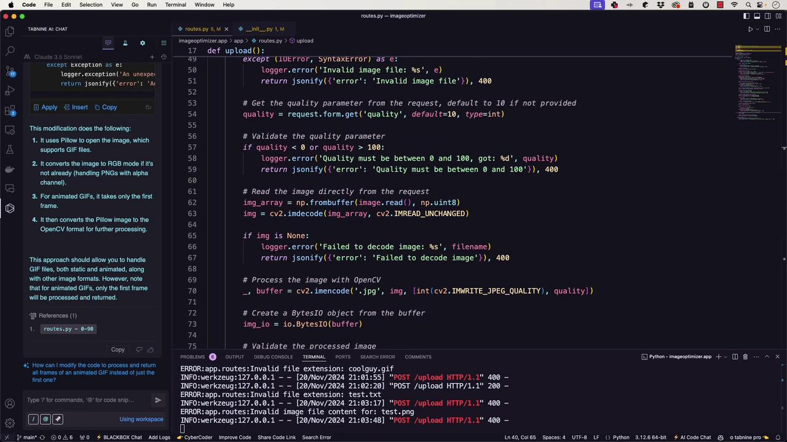
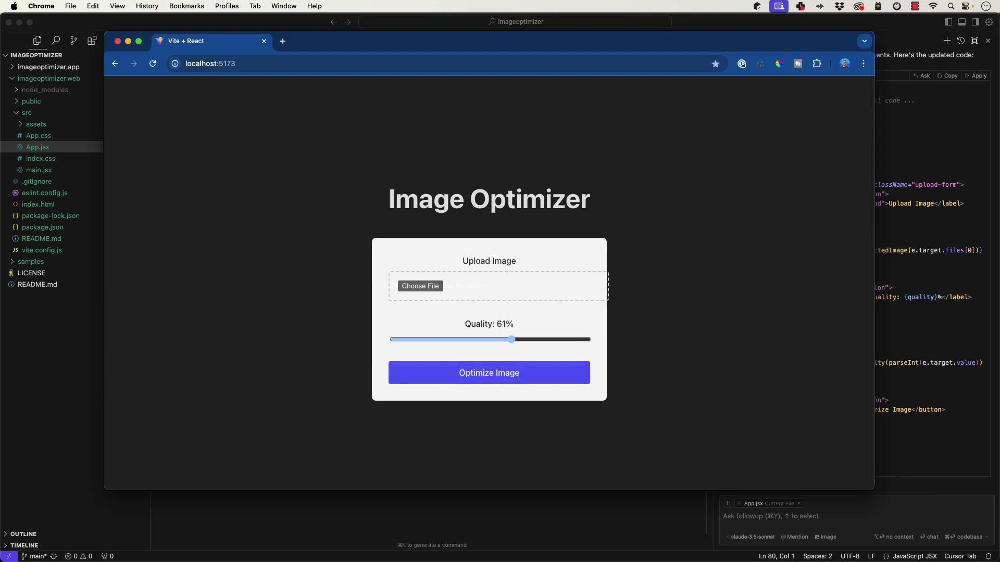
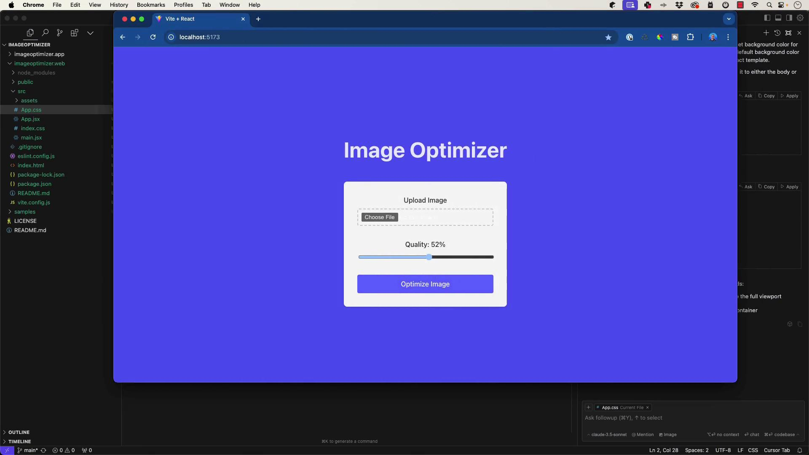

# Additional validation using Pillow
try:
    img = Image.open(io.BytesIO(image_content))
    img.verify()  # Verify that it is, in fact, an image
except (IOError, SyntaxError) as e:
    logger.error('Invalid image file: %s', e)
    return jsonify({'error': 'Invalid image file'})

# Get the quality parameter from the request
quality = request.form.get('quality', default=75)

# Validate the quality parameter
if quality < 0 or quality > 100:
    logger.error('Quality must be between 0 and 100')
    return jsonify({'error': 'Quality must be between 0 and 100'})

# Read the image directly from the request
img_array = np.frombuffer(image.read(), np.uint8)
img = cv2.imdecode(img_array, cv2.IMREAD_UNCHANGED)

if img is None:
    logger.error('Failed to decode image: %s', image.filename)
    return jsonify({'error': 'Failed to decode image'})
```

A sample console output might be:

```plaintext theme={null}
INFO:werkzeug:127.0.0.1 - - [20/Nov/2024 20:57:51] "POST /upload HTTP/1.1" 200 -
INFO:werkzeug:127.0.0.1 - - [20/Nov/2024 20:58:32] "POST /upload HTTP/1.1" 400 -
ERROR:app.routes:Failed to decode image: [<filename>
```

> **lightbulb** Since our application does not support GIF images, you will consistently see error messages for such files. For handling GIFs, consider using Pillow as recommended by BlackboxAI and Tabnine.

## Enhanced Quality Parameter Validation

Below is an updated version of the upload function with improved quality parameter validation. This version ensures that the quality parameter is present and within the allowed range (0–100). If the parameter is omitted or invalid, an error message is returned:

```python theme={null}
# Check if quality parameter is present
if 'quality' not in request.form:
    logger.error('Quality parameter is missing')
    return jsonify({'error': 'Quality parameter is required'}), 400

# Get the quality parameter from the request
quality = request.form.get('quality', type=int)

# Validate the quality parameter
if quality is None or quality < 0 or quality > 100:
    logger.error('Invalid quality value: %s', quality)
    return jsonify({'error': 'Quality must be an integer between 0 and 100'}), 400

# Read the image directly from the request
img_array = np.frombuffer(image.read(), np.uint8)
img = cv2.imdecode(img_array, cv2.IMREAD_UNCHANGED)

if img is None:
    logger.error('Failed to decode image: %s', filename)
    return jsonify({'error': 'Failed to decode image'}), 400

# Process the image with OpenCV
buffer = cv2.imencode('.jpg', img, [int(cv2.IMWRITE_JPEG_QUALITY), quality])[1]

# Create a Bytes object from the buffer
```

After running Flask and testing the endpoint, if the quality parameter is missing you will receive:

```plaintext theme={null}
{
  "error": "Quality parameter is required"
}
```

A successful request with a valid quality value returns the processed image.

## Final Version of the Flask Route

The final structure of our Flask route, incorporating all improvements, is shown below:

```python theme={null}
import logging
from flask import Blueprint, request, jsonify, send_file
import cv2
import numpy as np
import io
import imghdr
from werkzeug.utils import secure_filename
from PIL import Image

# Set up logging
logging.basicConfig(level=logging.INFO)
logger = logging.getLogger(__name__)

bp = Blueprint('main', __name__)

@bp.route('/upload', methods=['POST'])
def upload():
    try:
        if 'image' not in request.files:
            logger.error('No image part in the request')
            return jsonify({'error': 'No image part in the request'}), 400

        image = request.files['image']
        
        if image.filename == '':
            logger.error('No image selected for uploading')
            return jsonify({'error': 'No image selected for uploading'}), 400

        # Secure the filename
        filename = secure_filename(image.filename)

        # Check the file extension
        allowed_extensions = {'png', 'jpg', 'jpeg', 'gif'}
        if not ('.' in filename and filename.rsplit('.', 1)[1].lower() in allowed_extensions):
            logger.error('Invalid file extension: %s', filename)
            return jsonify({'error': 'Invalid file extension'}), 400

        # Check the file content
        image_content = image.read()
        image.seek(0)  # Reset the file pointer to the beginning
        if imghdr.what(None, h=image_content) not in allowed_extensions:
            logger.error('Invalid image file content for: %s', filename)
            return jsonify({'error': 'Invalid image file'}), 400

        # Check if quality parameter is present
        if 'quality' not in request.form:
            logger.error('Quality parameter is missing')
            return jsonify({'error': 'Quality parameter is required'}), 400

        # Get and validate the quality parameter
        quality = request.form.get('quality', type=int)
        if quality is None or quality < 0 or quality > 100:
            logger.error('Invalid quality value: %s', quality)
            return jsonify({'error': 'Quality must be an integer between 0 and 100'}), 400

        # Additional validation using Pillow
        try:
            img = Image.open(io.BytesIO(image_content))
            img.verify()  # Verify that it is an image
        except (IOError, SyntaxError) as e:
            logger.error('Invalid image file: %s', e)
            return jsonify({'error': 'Invalid image file'}), 400

        # Read the image directly from the request
        img_array = np.frombuffer(image.read(), np.uint8)
        img = cv2.imdecode(img_array, cv2.IMREAD_UNCHANGED)

        if img is None:
            logger.error('Failed to decode image: %s', filename)
            return jsonify({'error': 'Failed to decode image'}), 400

        # Process the image with OpenCV
        buffer = cv2.imencode('.jpg', img, [int(cv2.IMWRITE_JPEG_QUALITY), quality])

        # Create a BytesIO object from the buffer
        img_io = io.BytesIO(buffer[1].tobytes())

        # Validate the processed image
        try:
            processed_img = Image.open(img_io)
            processed_img.verify()
        except (IOError, SyntaxError) as e:
            logger.error('Failed to process image: %s', e)
            return jsonify({'error': 'Failed to process image'}), 400

        # Reset the BytesIO pointer to the beginning
        img_io.seek(0)

        # Return the processed image as binary data
        return send_file(img_io, mimetype='image/jpeg')

    except Exception as e:
        logger.exception('An unexpected error occurred: %s', e)
        return jsonify({'error': 'An unexpected error occurred. Please try again later.'}), 500
```

After integrating these enhancements, our Flask API is robust and ready for frontend consumption. Later, we will scaffold the frontend using Cursor alongside tools like Tabnine and GitHub Copilot.



> **lightbulb** When testing, check the API logs to see messages such as:

  * "Quality parameter is missing"
  * "Failed to decode image"
  * HTTP status codes 200 or 400 depending on the test scenario.

Thank you for following along. In the next article, we will build a React application to interact with this robust API. Happy coding!

- [Watch Video](https://learn.kodekloud.com/user/courses/ai-assisted-development/module/0f8882f1-0976-491e-8243-9b522243717f/lesson/4fe1b36b-551a-45df-a2a7-d661a4d910bc)


# Creating a UI

Source: https://notes.kodekloud.com/docs/AI-Assisted-Development/Development-Phase-Frontend/Creating-a-UI/page

This guide explains how to create a user interface for image upload and optimization using React.

In this guide, we'll build a simple user interface that lets users upload an image for optimization. The interface allows users to select an image, adjust the quality slider, and submit the file for processing to an API endpoint. This tutorial uses React for the front-end development.

## Initializing the React Application

Begin by setting up your React application. The code below imports the required modules and renders the root component:

```javascript theme={null}
import { StrictMode } from 'react';
import { createRoot } from 'react-dom/client';
import App from './App.jsx';

createRoot(document.getElementById('root')).render(
  <StrictMode>
    <App />
  </StrictMode>
);
```

After launching the development server, you should observe output similar to the following in your console:

```plaintext theme={null}
VITE v5.4.11  ready in 105 ms

Local:   http://localhost:5173/
Network: use --host to expose
press h  to show help
```

## Setting Up Global Styles

Your application’s base styles are defined in the `index.css` file. These styles provide a foundational design for fonts, links, and backgrounds:

```css theme={null}
/* index.css */
:root {
  font-family: Inter, system-ui, Avenir, Helvetica, Arial, sans-serif;
  line-height: 1.5;
  font-weight: 400;
  color: scheme(light dark);
  background-color: rgba(255, 255, 255, 0.87);
}

a {
  font-synthesis: none;
  color: #646cff;
  text-decoration: inherit;
}

a:hover {
  color: #353bfa;
}

body {
}
```

The development server output might update as seen here:

```plaintext theme={null}
VITE v5.4.11  ready in 185 ms

Local:   http://localhost:5173/
Network: use --host to expose
press h  enter to show help
```

At this point, the basic HTML structure is visible, featuring a heading for the image optimizer and a file input element. The next step is to implement the upload functionality in `App.jsx`.

## Building the Image Optimizer Component

Start by creating a basic component in `App.jsx` that displays a heading and a file input field:

```javascript theme={null}
import React, { useState } from 'react';
import reactLogo from '/assets/react.svg';
import './App.css';

function App() {
  const [count, setCount] = useState(0);

  return (
    <>
      <h1>Image Optimizer</h1>
      <input type="file" />
    </>
  );
}

export default App;
```

After saving your file, you should see a console message similar to:

```plaintext theme={null}
1:41:38 PM [vite] hmr update /src/App.jsx
```

This confirms that `App.jsx` is correctly integrated into your project.

## Handling Image Uploads and Form Submission

Next, enhance the component by adding image upload handling and form submission. This version introduces state management for the selected image and builds a form that submits the image to your API endpoint. A callout alerts users if no image is selected:

```javascript theme={null}
import React, { useState } from 'react';
import reactLogo from './assets/react.svg';
import './App.css';

function App() {
  const [selectedImage, setSelectedImage] = useState(null);

  const handleSubmit = async (e) => {
    e.preventDefault();

    if (!selectedImage) {
      alert('Please select an image first');
      return;
    }

    const formData = new FormData();
    formData.append('image', selectedImage);

    try {
      const response = await fetch('YOUR_API_ENDPOINT', {
        method: 'POST',
        body: formData,
      });

      if (response.ok) {
        const data = await response.json();
        console.log('Upload successful:', data);
      } else {
        console.error('Upload failed');
      }
    } catch (error) {
      console.error('Error uploading image:', error);
    }
  };

  return (
    <div>
      <h1>Image Optimizer</h1>
      <form onSubmit={handleSubmit} className="upload-form">
        <input
          type="file"
          accept="image/*"
          onChange={(e) => setSelectedImage(e.target.files[0])}
        />
        <button type="submit">Upload</button>
      </form>
    </div>
  );
}

export default App;
```

> **lightbulb** Make sure to replace `'YOUR_API_ENDPOINT'` with your actual endpoint before deploying the application.

## Adding a Quality Slider

To further enhance the user experience, add a slider to control the quality parameter for image compression. The slider ranges from 0 to 100. The following code updates the form to include the quality slider and passes the slider value to the API:

```javascript theme={null}
import React, { useState } from 'react';
import reactLogo from './assets/react.svg';
import './App.css';

function App() {
  const [selectedImage, setSelectedImage] = useState(null);
  const [quality, setQuality] = useState(80); // Default quality value

  const handleSubmit = async (e) => {
    e.preventDefault();

    if (!selectedImage) {
      alert('Please select an image first');
      return;
    }

    const formData = new FormData();
    formData.append('image', selectedImage);
    formData.append('quality', quality);

    try {
      const response = await fetch('YOUR_API_ENDPOINT', {
        method: 'POST',
        body: formData,
      });

      if (response.ok) {
        const data = await response.json();
        console.log('Upload successful:', data);
      } else {
        console.error('Upload failed');
      }
    } catch (error) {
      console.error('Error uploading image:', error);
    }
  };

  return (
    <div>
      <h1>Image Optimizer</h1>
      <form onSubmit={handleSubmit} className="upload-form">
        <input
          type="file"
          accept="image/*"
          onChange={(e) => setSelectedImage(e.target.files[0])}
        />
        <div className="quality-control">
          <label htmlFor="quality">Quality:</label>
          <input
            type="range"
            id="quality"
            min="0"
            max="100"
            value={quality}
            onChange={(e) => setQuality(parseInt(e.target.value))}
          />
        </div>
        <button type="submit">Optimize Image</button>
      </form>
    </div>
  );
}

export default App;
```

This update introduces the quality slider just above the submit button and ensures that if no image is selected, a prompt will alert the user accordingly.

## Improving Layout with a Grid System

A clean, responsive layout enhances usability. Use a grid layout to neatly arrange your components. First, update your component structure in `App.jsx`:

```javascript theme={null}
import React, { useState } from 'react';
import reactLogo from './assets/react.svg';
import './App.css';

function App() {
  const [selectedImage, setSelectedImage] = useState(null);
  const [quality, setQuality] = useState(80); // Default quality value

  const handleSubmit = async (e) => {
    e.preventDefault();

    if (!selectedImage) {
      alert('Please select an image first');
      return;
    }

    const formData = new FormData();
    formData.append('image', selectedImage);
    formData.append('quality', quality);

    try {
      const response = await fetch('YOUR_API_ENDPOINT', {
        method: 'POST',
        body: formData,
      });
      if (response.ok) {
        const data = await response.json();
        console.log('Upload successful:', data);
      } else {
        console.error('Upload failed');
      }
    } catch (error) {
      console.error('Error uploading image:', error);
    }
  };

  return (
    <div className="container">
      <header className="header">
        <h1>Image Optimizer</h1>
      </header>
      <main className="main-content">
        <form onSubmit={handleSubmit} className="upload-form">
          <div className="upload-section">
            <label htmlFor="image-upload">Upload Image:</label>
            <input
              id="image-upload"
              type="file"
              accept="image/*"
              onChange={(e) => setSelectedImage(e.target.files[0])}
            />
          </div>

          <div className="quality-section">
            <label htmlFor="quality">Quality: {quality}%</label>
            <input
              type="range"
              id="quality"
              min="0"
              max="100"
              value={quality}
              onChange={(e) => setQuality(parseInt(e.target.value))}
            />
          </div>

          <div className="button-section">
            <button type="submit">Optimize Image</button>
          </div>
        </form>
      </main>
    </div>
  );
}

export default App;
```

Then, update your CSS (in `App.css`) to implement the grid layout:

```css theme={null}
.container {
  max-width: 1200px;
  margin: 0 auto;
  padding: 2rem;
}

.header {
  text-align: center;
  margin-bottom: 3rem;
}

.main-content {
  display: grid;
  place-items: center;
}

.upload-form {
  display: grid;
  gap: 2rem;
  max-width: 600px;
  padding: 2rem;
  background: #f5f5f5;
  border-radius: 8px;
  box-shadow: 0 2px 4px rgba(0, 0, 0, 0.1);
}

.upload-section,
.quality-section,
.button-section {
  display: grid;
  gap: 0.5rem;
  width: 100%;
}

.upload-section input[type="file"] {
  box-sizing: border-box;
  padding: 0.5rem;
  border: 2px dashed #ccc;
  border-radius: 4px;
  width: 100%;
  cursor: pointer;
}

.quality-section input[type="range"] {
  width: 100%;
}

button {
  background: #646cff;
  color: white;
  padding: 0.8rem 1.5rem;
  border: none;
  border-radius: 4px;
}

/* Optional: Ensure a consistent box-sizing across elements */
*, *::before, *::after {
  box-sizing: border-box;
}

@media (prefers-reduced-motion: no-preference) {
  .card {
    padding: 2em;
  }

  .read-the-docs {
    color: #888;
  }
}
```

The CSS above creates a responsive grid layout where the upload section, quality control, and button are evenly spaced and centered.



Notice that the dashed border around the file input has been adjusted using padding and box-sizing properties. The button styling was also refined for better consistency.

## Refining the Page Background

To further improve the overall look, set a background color for the page. The CSS below ensures that both the body and the root container have a clean and consistent background:

```css theme={null}
body {
  background-color: #ffffff; /* Adjust this color as needed */
}

#root {
  background-color: #ffffff;
  max-width: 1280px;
  margin: 0 auto;
  padding: 2rem;
  text-align: center;
}
```

After applying these changes, your final design will feature a responsive layout with a clean background and centered form elements, ensuring a user-friendly experience.



At this stage, the interface includes all required features: selecting a file, adjusting the quality parameter via a slider, and optimizing the image using a neatly arranged grid layout.

> **lightbulb** In the next article, we will cover how to integrate the backend and process the image through the API endpoint.

For more information on related topics, check out these resources:

* [Kubernetes Documentation](https://kubernetes.io/docs/)
* [Docker Hub](https://hub.docker.com/)
* [Terraform Registry](https://registry.terraform.io/)

- [Watch Video](https://learn.kodekloud.com/user/courses/ai-assisted-development/module/3de5744a-0525-41be-b6cf-f2e4881e2790/lesson/7b8e3092-7826-48d3-8ffc-e1970e8e763f)
