# Capabilities and Limitations of Generative AI Applications

Source: https://notes.kodekloud.com/docs/AWS-Certified-AI-Practitioner/Fundamentals-of-Generative-AI/Capabilities-and-Limitations-of-Generative-AI-Applications/page

This article examines the capabilities, applications, and limitations of generative AI and large language models across various industries.

Welcome to our detailed overview of generative AI applications. This article examines the transformative capabilities of generative AI and large language models (LLMs), discusses their impact across numerous industries, and outlines important limitations and challenges. Learn why these cutting-edge technologies matter and how they are revolutionizing sectors such as finance, healthcare, education, and retail.

## The Power of Generative AI

Generative AI and LLMs are versatile, general-purpose technologies that can be adapted to meet highly specific domain requirements. They enable a wide range of applications—from content generation and customer service to data analysis—making them cost-effective and scalable solutions for many organizations.

<Frame>
  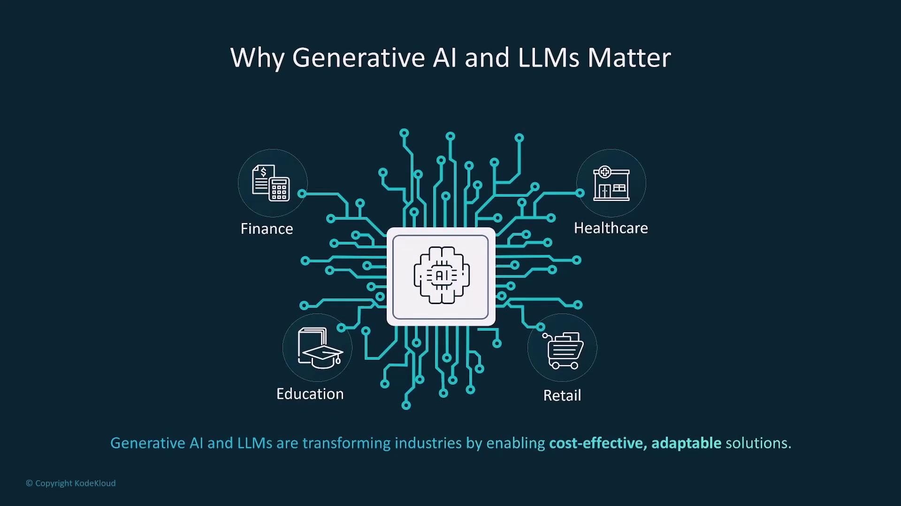
</Frame>

By utilizing pre-trained models, businesses can bypass the need for custom AI development for every use case, thereby reducing costs and increasing accessibility to AI technologies.

<Frame>
  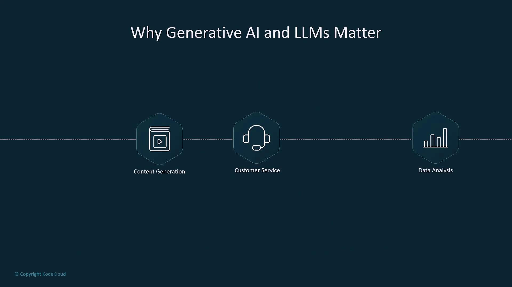
</Frame>

Furthermore, with their inherent adaptability and simplicity, these models perform an array of tasks such as recommending products, detecting fraudulent activities, and addressing customer inquiries—all contributing to improved operational efficiency.

<Frame>
  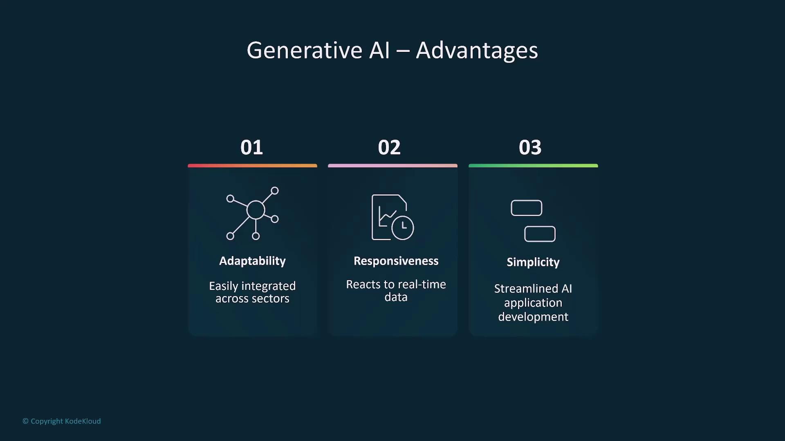
</Frame>

Every day, we encounter AI in various forms—from personalized web search results and fraud detection to customized product recommendations—demonstrating the broad utility of these technologies.

<Frame>
  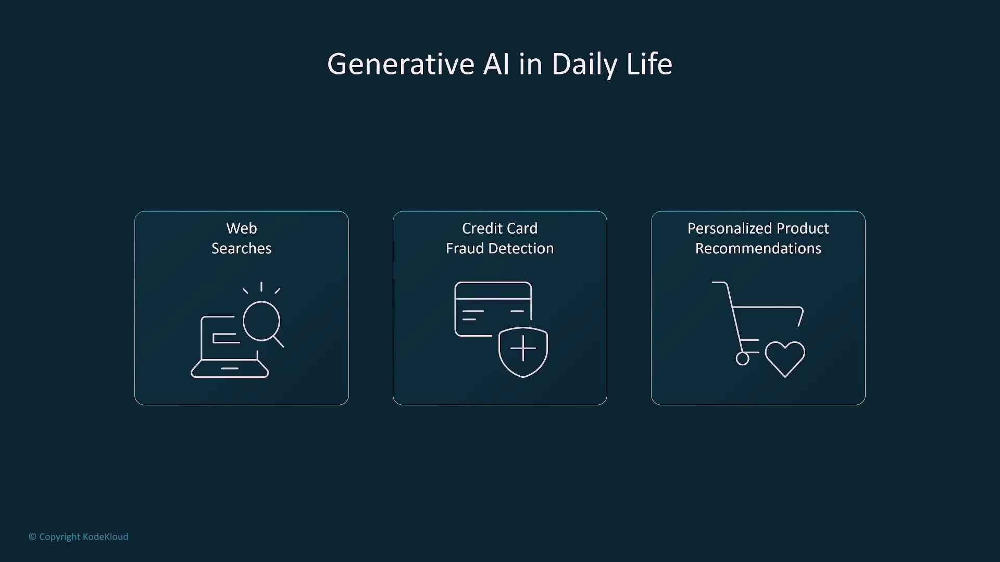
</Frame>

## Lowering Barriers in AI Development

Conventional AI development presents significant challenges, including high costs and complex processes. In contrast, generative AI streamlines the development process, democratizing access to advanced AI solutions and fostering innovation across companies of all sizes.

<Frame>
  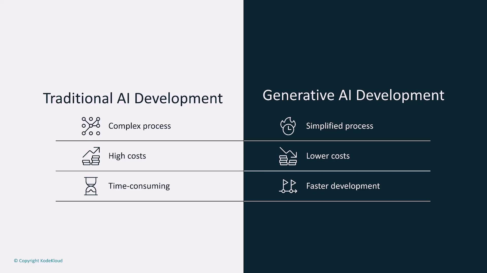
</Frame>

## Recognizing Limitations and Challenges

Despite its many benefits, generative AI has notable limitations. It cannot replace the nuanced expertise of human professionals and lacks intrinsic ethical or contextual understanding.

<Callout icon="lightbulb">
  While AI systems can be precisely trained for specific tasks, ongoing human oversight is essential—especially when dealing with sensitive or ethically complex domains.
</Callout>

<Frame>
  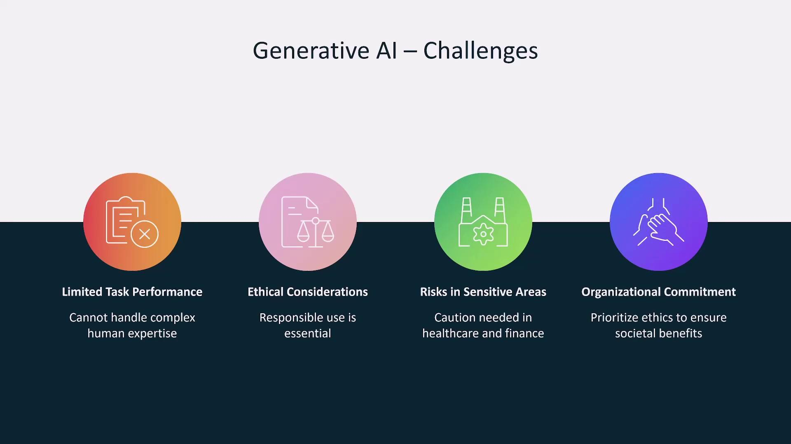
</Frame>

## Effective Prompting and Fine-Tuning

Crafting clear, complete, and context-driven prompts is vital when working with LLMs. For instance, a vague instruction like classifying an email may lead to inaccurate results. Fine-tuning the model with multiple examples and specific contextual details significantly improves performance.

<Frame>
  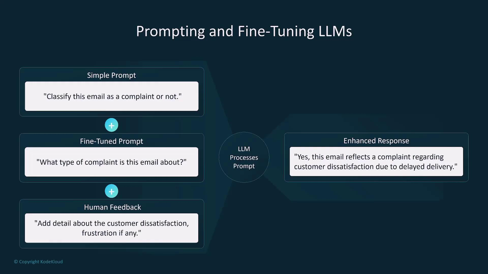
</Frame>

Additionally, while many AI services now support conversational context, standalone models must incorporate mechanisms to retain historical information for accurate, relevant responses. Be aware of recurring issues such as hallucinations—unexpected off-target responses—and occasional toxic language.

<Callout icon="triangle-alert">
  Implement robust safeguards to mitigate issues like hallucinations and toxicity, particularly in sensitive applications such as legal or medical advice.
</Callout>

<Frame>
  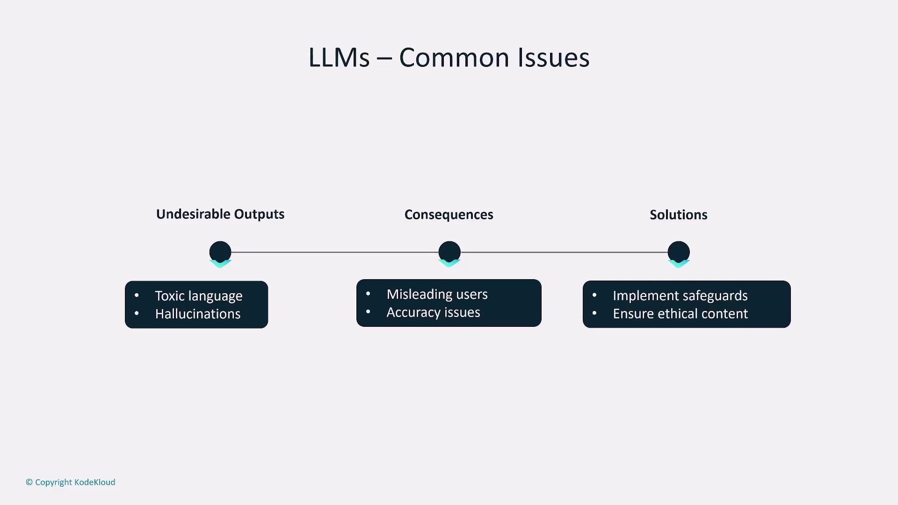
</Frame>

## Evaluating LLM Performance

Performance evaluation of language models depends on the specific task. For summarization, metrics like ROUGE (Recall Oriented Understudy for Gisting Evaluation) are used to verify how effectively a summary conveys the intended content. For translation tasks, the BLEU (Bilingual Evaluation Understudy) score is applied to measure accuracy.

<Frame>
  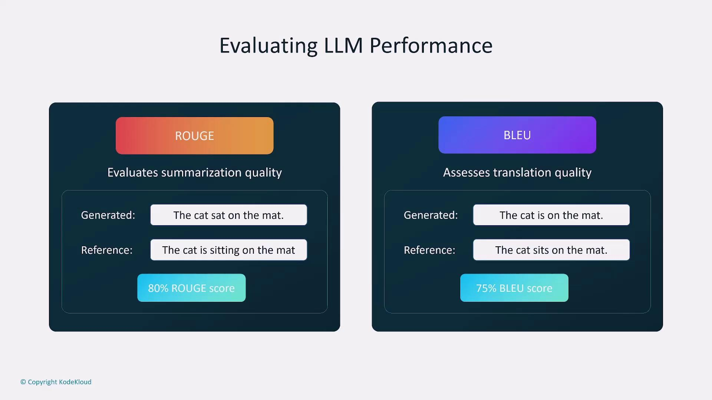
</Frame>

## Choosing the Right Model

Selecting the most suitable model depends on project-specific data requirements and overall objectives. Common model options include:

| Model Type                             | Use Case                                 | Example Application                       |
| -------------------------------------- | ---------------------------------------- | ----------------------------------------- |
| Variational Autoencoders (VAEs)        | Unsupervised learning                    | Data clustering, dimensionality reduction |
| Generative Adversarial Networks (GANs) | Generating high-quality synthetic images | Image synthesis, data augmentation        |
| Autoregressive models                  | Sequential prediction tasks              | Text generation, time-series forecasting  |

Understanding your unique needs ensures that you select and fine-tune the model that delivers the best performance.

<Frame>
  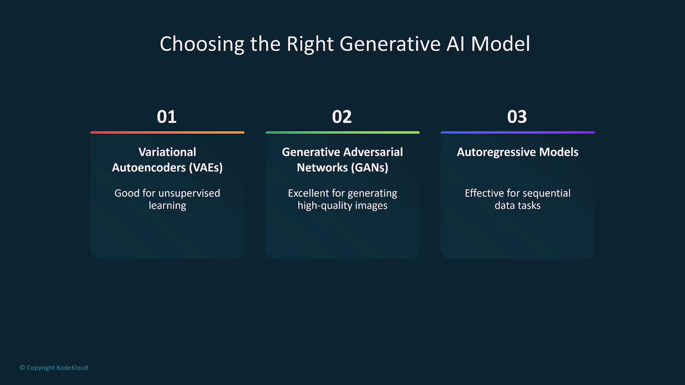
</Frame>

## Foundation Models and Customization

Foundation models like GPT-4 provide a robust starting point that can be customized for specific tasks, such as customer support or product recommendations. Fine-tuning these models with detailed human feedback enhances their performance by addressing issues like toxic language and misalignment with desired outcomes.

<Frame>
  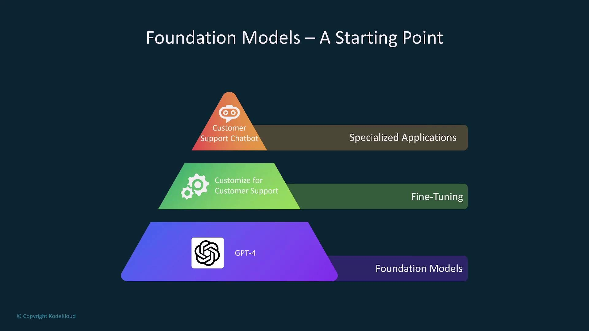
</Frame>

## Business Metrics and Monitoring

Monitoring key business metrics—including accuracy, efficiency, and conversion rate—is essential to evaluate the success of generative AI applications. These metrics ensure that AI outputs consistently align with business objectives, delivering a measurable return on investment.

<Frame>
  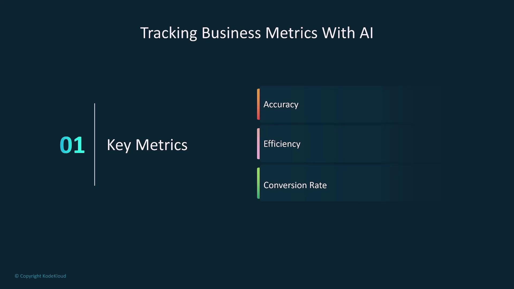
</Frame>

<Frame>
  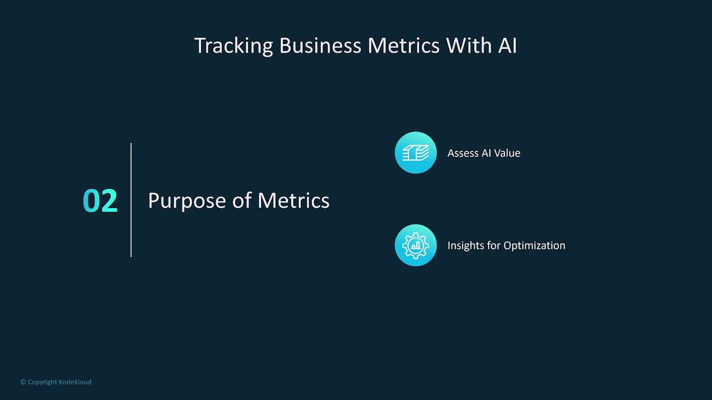
</Frame>

Ensuring output quality is equally important. This involves tracking relevance, coherence, and accuracy—especially for tasks like customer support or content generation.

<Frame>
  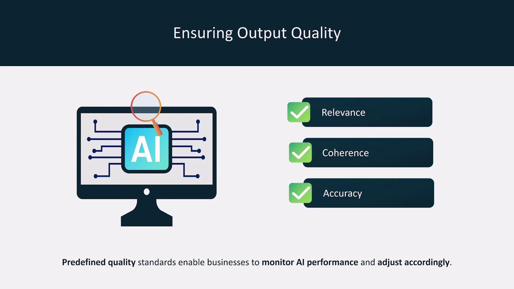
</Frame>

<Frame>
  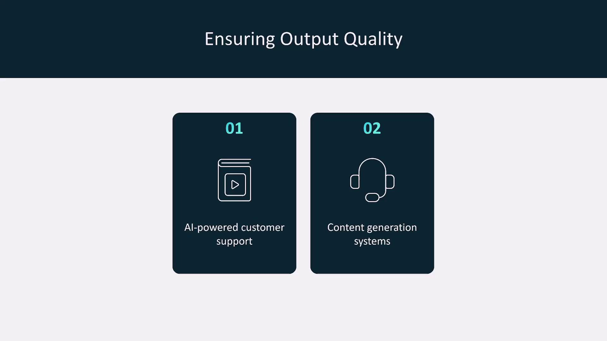
</Frame>

## Scaling AI with Foundation Models

When scaling AI solutions, incorporating multiple agents that work in unison is crucial. Scalable foundation models enable organizations to reduce manual intervention, automate complex tasks, and efficiently serve various user segments through systems like automated customer service and tailored content recommendations.

<Frame>
  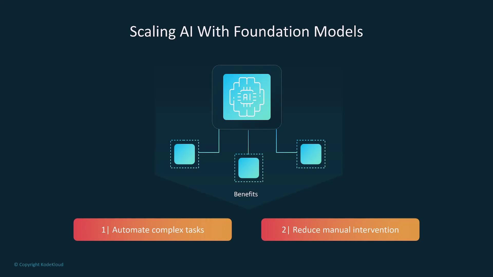
</Frame>

<Frame>
  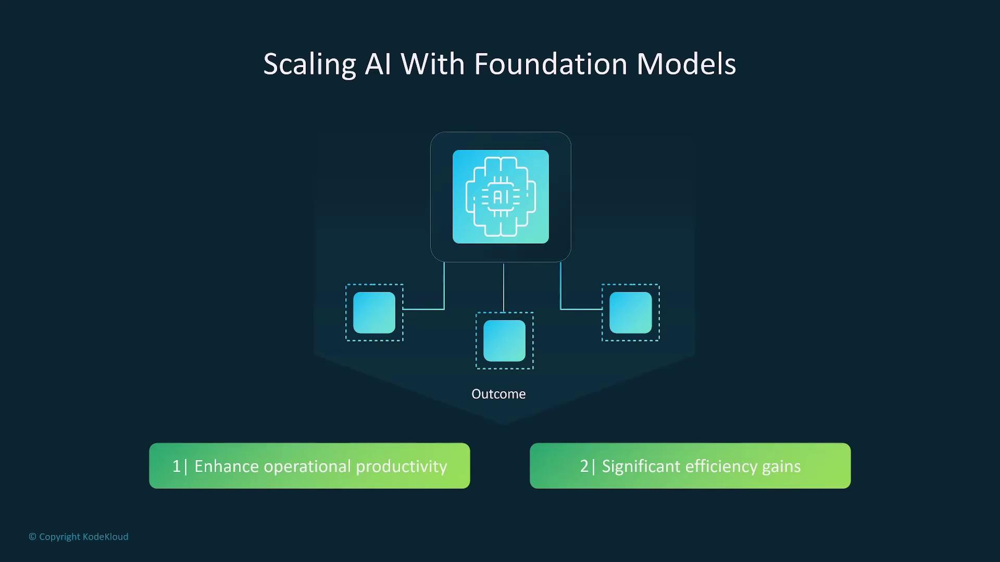
</Frame>

<Frame>
  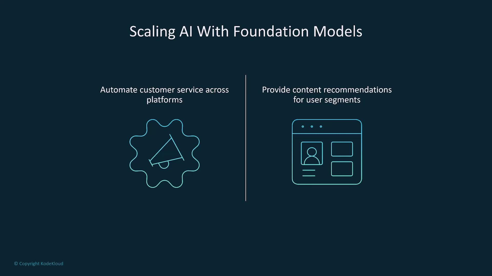
</Frame>

Providing the right prompts and maintaining the necessary context are integral for successfully scaling AI systems.

## Conclusion

In summary, we have explored the transformative capabilities, practical applications, and inherent limitations of generative AI. By understanding the importance of model selection, effective prompting, and ongoing performance monitoring, businesses can harness AI to drive innovation and deliver substantial operational benefits.

Thank you for reading. We hope this comprehensive guide has provided valuable insights into the world of generative AI applications and inspires you to explore further advancements in the field.

<CardGroup>
  <Card title="Watch Video" icon="video" href="https://learn.kodekloud.com/user/courses/aws-certified-ai-practitioner/module/34a4e82e-7538-4fac-a622-dbc6a28ffcbb/lesson/593ad126-9657-4113-b92b-fad5ab5f75f5" />
</CardGroup>
