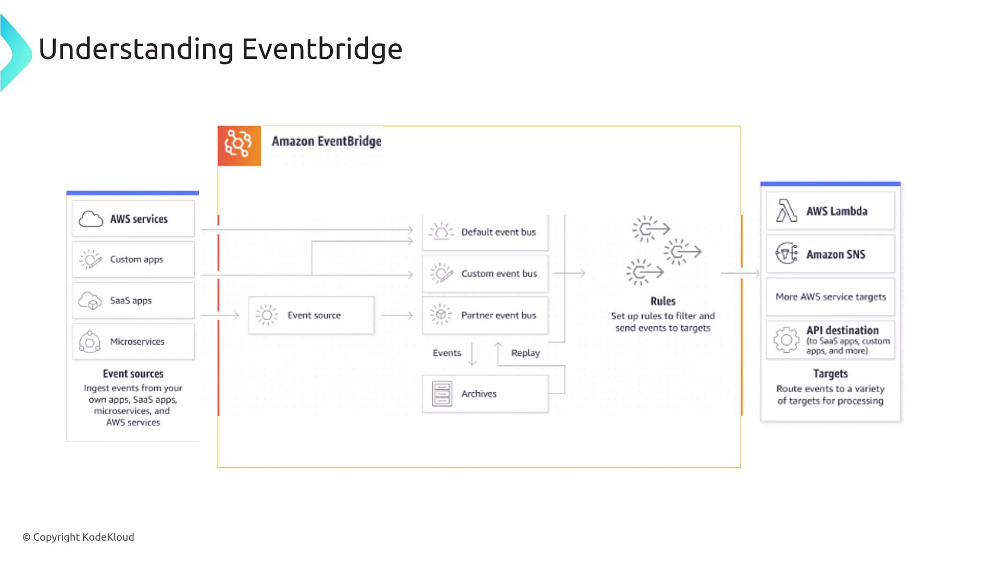
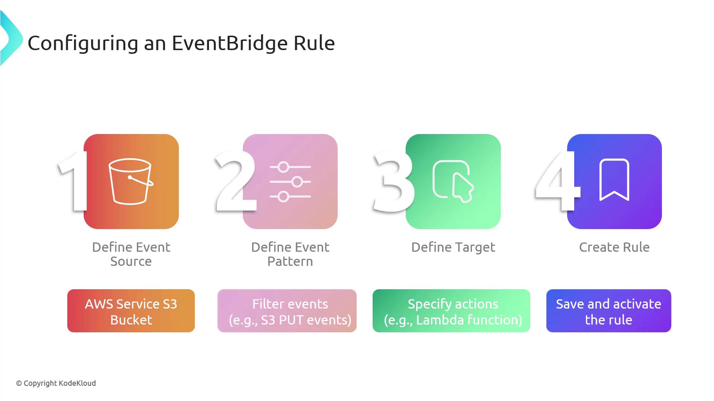
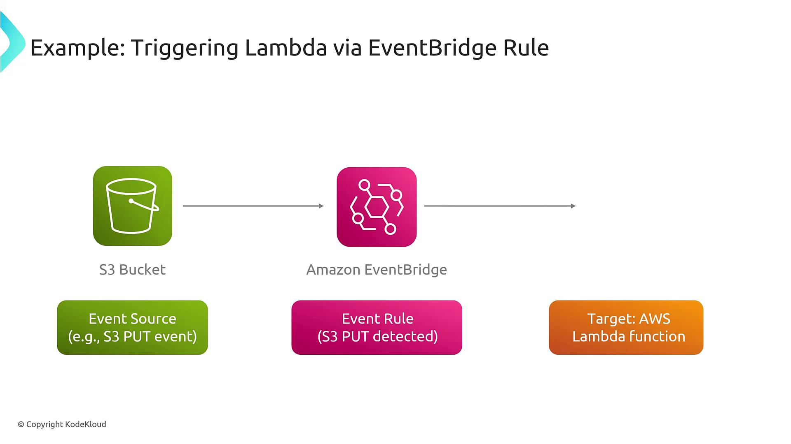

# Configuring EventBridge Rules to Trigger Actions

Source: https://notes.kodekloud.com/docs/AWS-Certified-CloudOps-Engineer-Associate/Domain-1-Monitoring-Logging-and-Remediation/Configuring-EventBridge-Rules-to-Trigger-Actions/page

This article explains how to configure Amazon EventBridge rules to trigger actions in your AWS environment, streamlining event-driven architecture.

This article, part of the AWS SysOps Associate curriculum, explains how to configure Amazon EventBridge rules to trigger actions in your AWS environment. EventBridge rules enable you to route incoming events from an event bus to specific targets based on matching patterns, streamlining your event-driven architecture.

***

## Understanding EventBridge

When events are sent to an event bus, it's essential to determine the appropriate action for each event. EventBridge rules empower you to analyze these events by matching them against defined patterns and then routing them to designated targets.

Below is an overview of the standard EventBridge architecture:

<Frame>
  
</Frame>

In the diagram, events from different sources land on the event bus. The EventBridge rules then evaluate each event, and if an event meets the specified pattern, it is routed to one or more appropriate targets like AWS Lambda functions, APIs, or other AWS services.

***

## Steps to Configure an EventBridge Rule

Configuring an EventBridge rule involves a clear sequence of steps:

1. **Define the event source:** Identify the AWS service or custom application generating events.
2. **Specify the event pattern:** Determine the criteria or pattern that an event must match to trigger the rule.
3. **Select the target:** Choose the destination where the event will be sent if it matches the pattern (e.g., AWS Lambda, API Gateway).
4. **Create and activate the rule:** Save and enable the rule so that it begins monitoring the event bus in real time.

Once activated, the rule continuously listens for incoming events, performs pattern matching, and triggers the necessary actions.

<Frame>
  
</Frame>

<Callout icon="lightbulb">
  For enhanced security and reliability, ensure that all IAM roles associated with your EventBridge rules have the minimum required permissions.
</Callout>

***

## Practical Example: S3 Bucket Trigger

Consider an example where an object is uploaded to an S3 bucket. Here's how the process unfolds:

* An event is generated when the S3 bucket detects a PUT operation (i.e., an object upload).
* The configured EventBridge rule, which is set to monitor this specific event pattern, routes the event to an AWS Lambda function.
* The Lambda function processes the uploaded object—for instance, generating thumbnails for images.

<Frame>
  
</Frame>

<Callout icon="lightbulb">
  Remember, while this example uses Lambda as the target, EventBridge supports over 200 AWS services and third-party integrations, providing significant flexibility to suit your application's requirements.
</Callout>

***

## Conclusion

Amazon EventBridge rules offer a powerful mechanism to automate workflows within your AWS environment. By defining event sources, patterns, and targets, you can seamlessly route events to trigger specific actions, thereby optimizing your cloud operations.

We hope this guide provides a clear understanding of how to configure EventBridge rules to trigger actions in your AWS infrastructure. Happy automating!

For further reading, consider exploring:

* [Kubernetes Basics](https://kubernetes.io/docs/concepts/overview/what-is-kubernetes/)
* [AWS Documentation](https://docs.aws.amazon.com/eventbridge/latest/userguide/what-is-amazon-eventbridge.html)
* [Terraform Registry](https://registry.terraform.io/)

<CardGroup>
  <Card title="Watch Video" icon="video" href="https://learn.kodekloud.com/user/courses/aws-certified-sysops-administrator-associate/module/e7f728df-5d8d-4dbb-80f6-33c15cde3034/lesson/045c0601-fd9b-4640-93a5-95d43b0db3f7" />

  <Card title="Practice Lab" icon="installation" href="https://learn.kodekloud.com/user/courses/aws-certified-sysops-administrator-associate/module/e7f728df-5d8d-4dbb-80f6-33c15cde3034/lesson/41922967-0afa-4b48-b2be-c9b5e1f2dece" />
</CardGroup>
