# IAM Overview

Source: https://notes.kodekloud.com/docs/AWS-Certified-CloudOps-Engineer-Associate/Domain-4-Security-and-Compliance/IAM-Overview/page

This article provides an overview of AWS Identity and Access Management, focusing on user authentication, authorization, and best practices for managing access to AWS resources.

Welcome to this detailed lesson on AWS Identity and Access Management (IAM). IAM is a cornerstone service for managing AWS accounts, particularly crucial for SysOps administrators who need to control permissions across all AWS services.

IAM focuses on two main functions:

* Authenticating a user (verifying identity)
* Authorizing a user (defining access rights)

This concept is illustrated in the diagram below:

<Frame>
  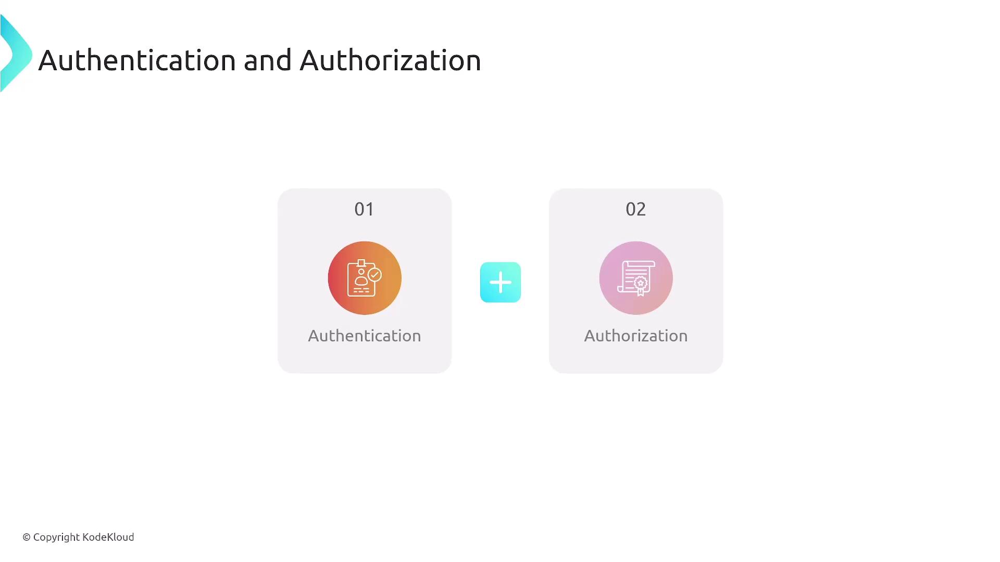
</Frame>

IAM essentially asks, "Who are you?" and "What are you allowed to do?" As the first line of defense, it controls access to your AWS account. When you first set up an AWS account, you create a root user using your email and password. IAM then enables you to manage who can access various AWS services—similar to a security guard checking credentials before granting access to a building.

Consider this additional perspective:

<Frame>
  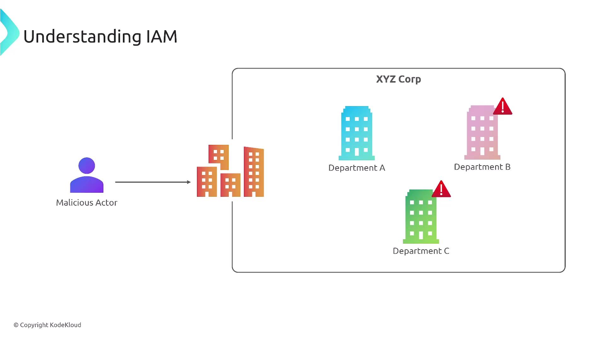
</Frame>

IAM operates similarly to services like Active Directory or the username/password combinations used in applications such as Gmail or Instagram. It serves as a security checkpoint that grants access only to those with proper credentials. The following diagram reinforces how IAM functions:

<Frame>
  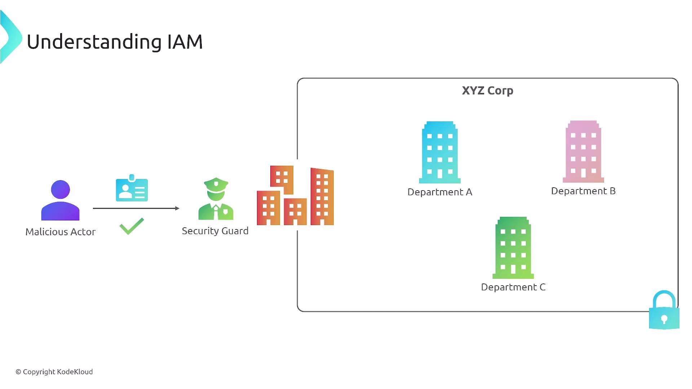
</Frame>

<Callout icon="lightbulb">
  IAM's primary functions include:

  * **Managing User Identities:** Creating and maintaining user accounts.
  * **Authentication:** Verifying user identities during login.
  * **Authorization:** Determining which actions a user is permitted to perform.
  * **Auditing:** Tracking user activities for compliance and security.
</Callout>

While IAM centralizes management within a single AWS account, managing identities for multiple accounts requires AWS Organizations. Regardless of scope, the principle of least privilege—granting only the minimum necessary permissions—is paramount. The diagram below outlines several key features of IAM:

<Frame>
  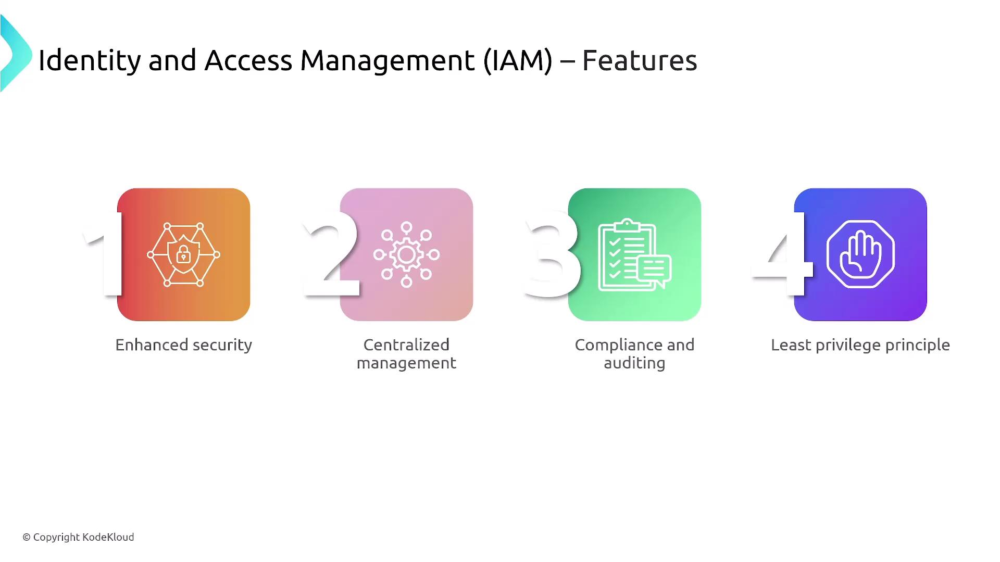
</Frame>

IAM can represent either a human user or an application. For automated tasks and programmatic access, AWS recommends using roles rather than traditional username and password combinations. Roles allow temporary privilege escalation without altering the underlying user identity. The flowchart below clarifies how IAM differentiates between human users and programmatic workloads:

<Frame>
  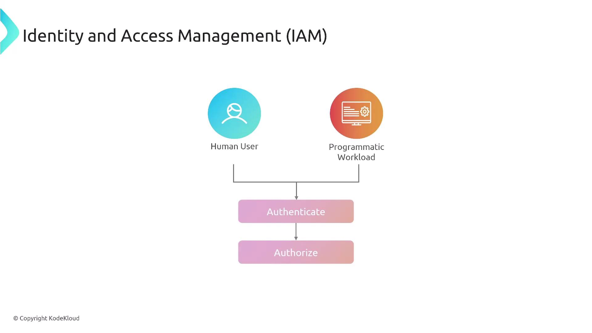
</Frame>

## Primary IAM Identities

IAM utilizes three primary types of identities (principals):

1. **Users** – Individual identities with their own credentials.
2. **Groups** – Collections of users that share common permissions.
3. **Roles** – Identities that can be assumed by users or services, providing temporary access.

*(While a fourth method involving external authentication—such as Active Directory—exists, this lesson focuses on users, groups, and roles.)*

The diagram below illustrates how these identities interact with policies to grant or deny permissions:

<Frame>
  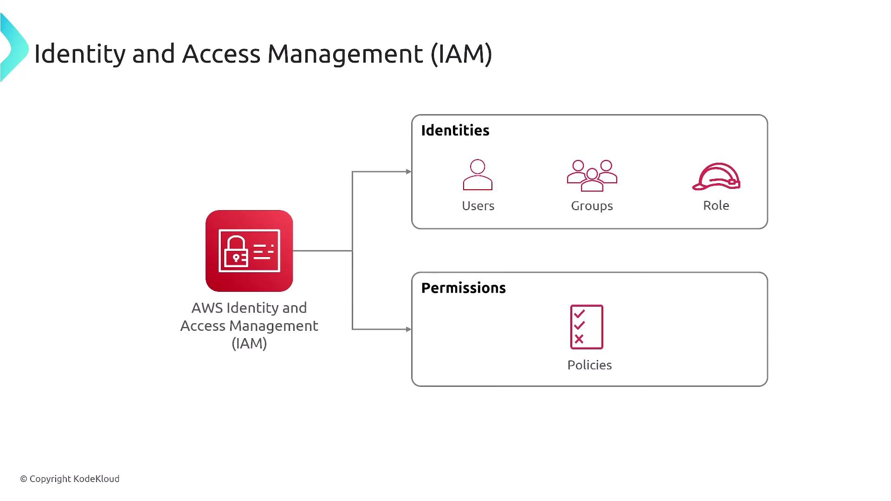
</Frame>

A policy is a set of permission statements that define what actions each principal can perform. For instance, a role might provide temporary administrative privileges—similar to how the "sudo" command works in Linux.

<Callout icon="triangle-alert">
  The root user has full administrative control with no restrictions (unless limited by AWS Organizations). It is best practice to use the root user only to create your first IAM user and not for daily administrative tasks.
</Callout>

The diagram below outlines the root user's responsibilities:

<Frame>
  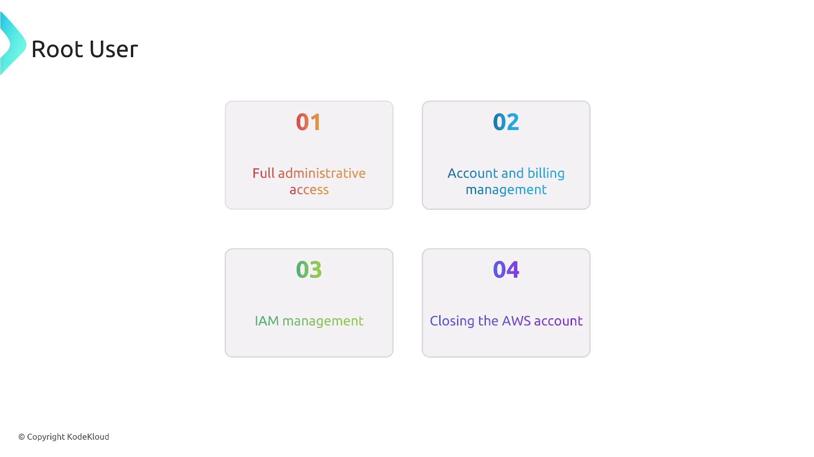
</Frame>

IAM users, which are created within IAM, must have unique identities. They gain permissions either directly or, more commonly, via group memberships. This mechanism allows for flexible and consistent permission management. For example, while individual users like Smith and Clark may have specially tailored policies, they typically inherit a consistent set of permissions as members of a group (e.g., a development or operations group).

## IAM User Credentials

IAM users can have several types of credentials:

* **Console Passwords:** For AWS Management Console access.
* **Access Keys:** For programmatic access via the AWS CLI or SDKs.
* **SSH Keys:** For AWS CodeCommit (though CodeCommit is slated for retirement).
* **Server Certificates:** For specialized access requirements.

The following diagram illustrates various forms of IAM user credentials:

<Frame>
  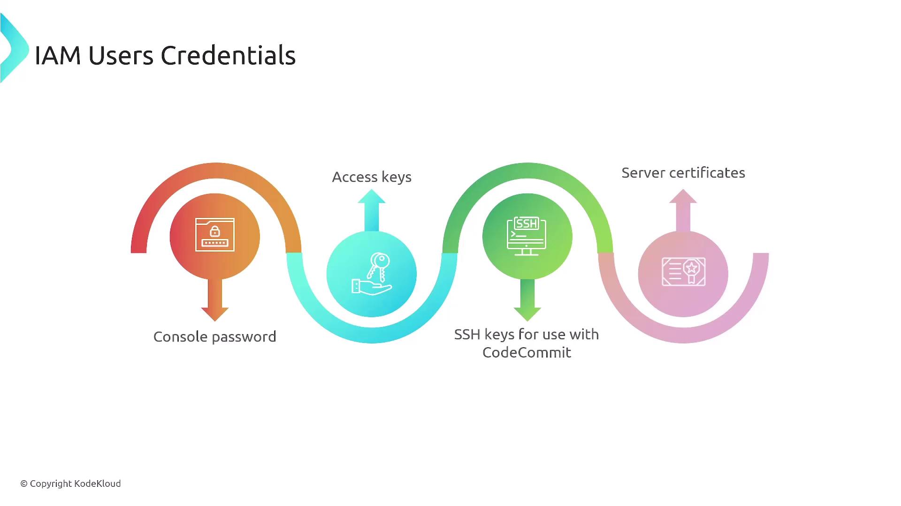
</Frame>

Certain scenarios require user-based access rather than role-based access, such as:

* Emergency access to an AWS account.
* Workloads that cannot use IAM roles (e.g., AWS CodeCommit and Amazon Keyspaces).
* Access by third-party AWS clients.

The diagram below details these scenarios:

<Frame>
  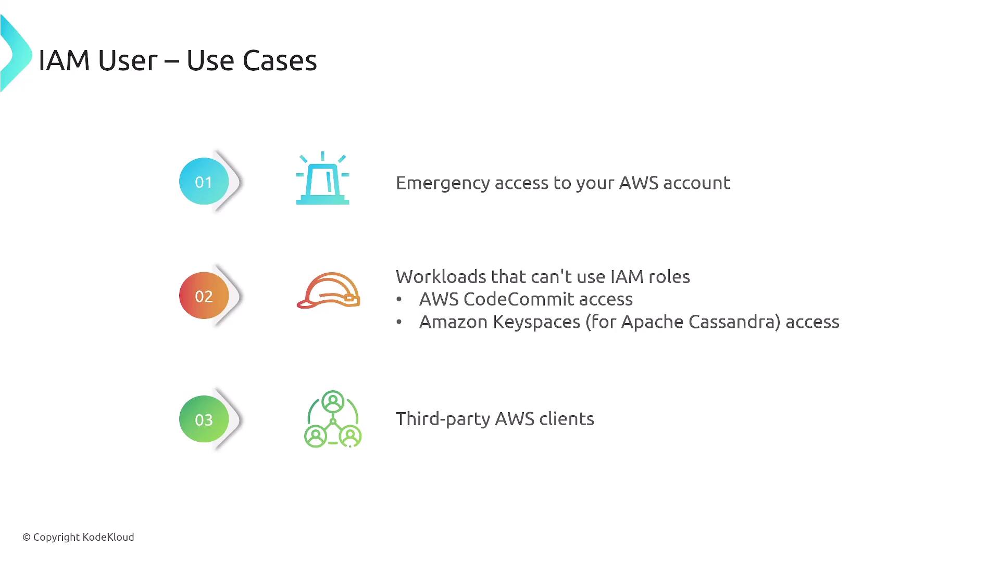
</Frame>

Remember that IAM roles are intended to be assumed by a principal. Without an underlying principal (like an IAM user or a trusted service), a role cannot function, which is especially critical in scenarios involving third-party infrastructures or specific AWS services.

IAM users work well for individual accounts, but they can become challenging to manage at scale across multiple accounts. In these cases, AWS Organizations—augmented by single sign-on via the IAM Identity Center or federated identities (e.g., Active Directory)—provides a more scalable solution. The diagram below highlights some limitations of using IAM users for access management:

<Frame>
  
</Frame>

## IAM Groups

An IAM group is simply a collection of users; note that groups cannot be nested within other groups. This design simplifies access management by ensuring consistent permission application, streamlining onboarding, and reducing human error. The diagram below illustrates group structures:

<Frame>
  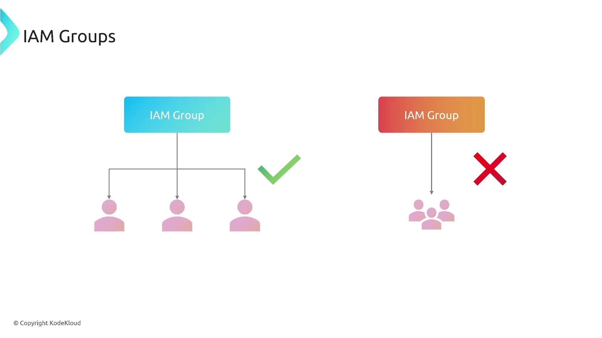
</Frame>

Key features of IAM groups include:

<Frame>
  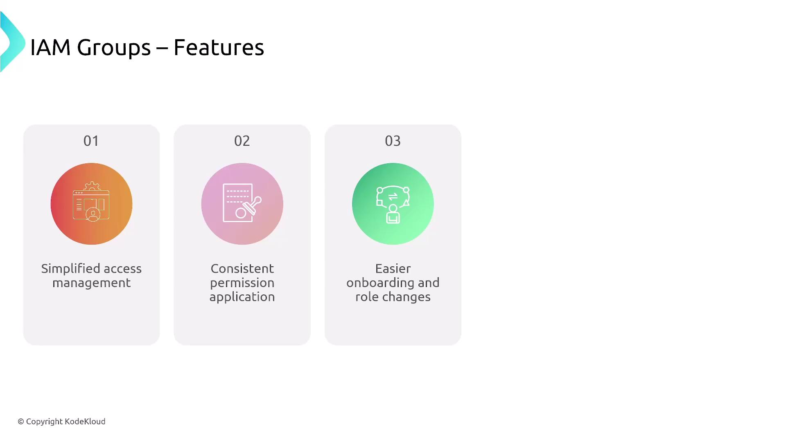
</Frame>

## Principle of Least Privilege

A foundational security best practice embedded throughout IAM is the principle of least privilege. This means granting only the minimum permissions necessary for task completion, regardless of whether the permissions are assigned to users, groups, or roles. The following diagram summarizes this principle:

<Frame>
  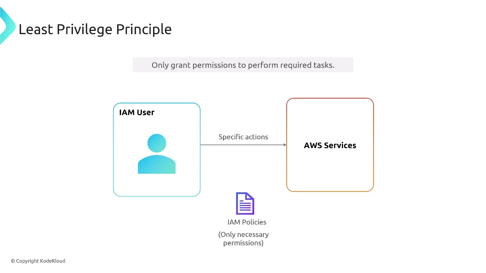
</Frame>

A common strategy is to begin with AWS managed policies, which are pre-configured and maintained by AWS. Keep in mind that these policies cannot be modified. After evaluating them over a trial period, you may choose to implement customer-managed (custom) policies with more tightly controlled permissions. The diagram below outlines the steps involved in establishing least-privilege permissions:

<Frame>
  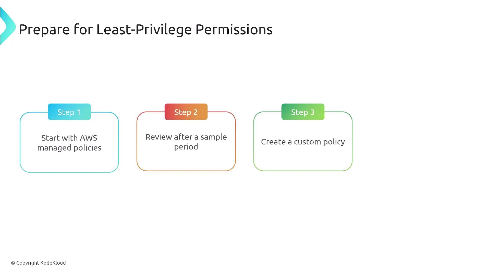
</Frame>

## Summary

In summary, AWS Identity and Access Management (IAM) is a fundamental service that allows you to manage who can access your AWS resources and what they are allowed to do. By adhering to security best practices—especially the principle of least privilege—and effectively utilizing IAM users, groups, and roles, you can significantly enhance the security of your AWS account.

We'll catch you in the next lesson.

<CardGroup>
  <Card title="Watch Video" icon="video" href="https://learn.kodekloud.com/user/courses/aws-certified-sysops-administrator-associate/module/0c9bb9a3-5201-434e-8085-a9f1e9f23f22/lesson/22fcde2b-ba0d-4635-a42d-0ee67845b6fd" />
</CardGroup>
