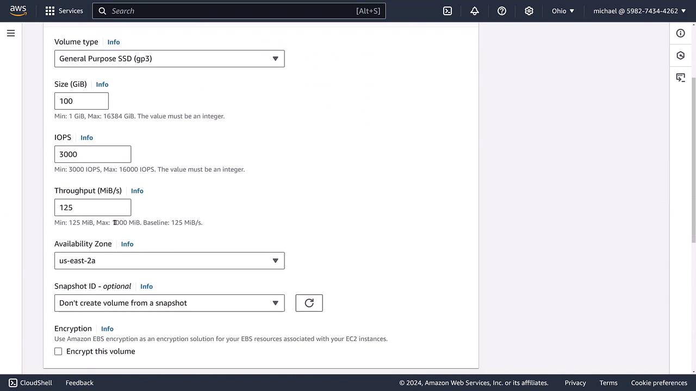
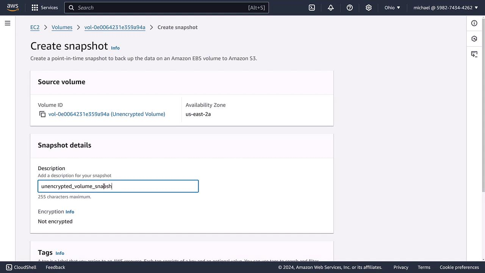
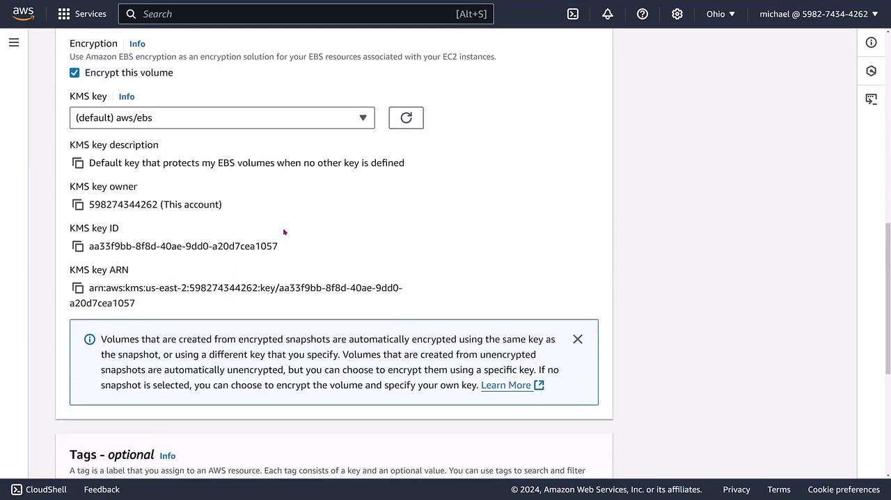
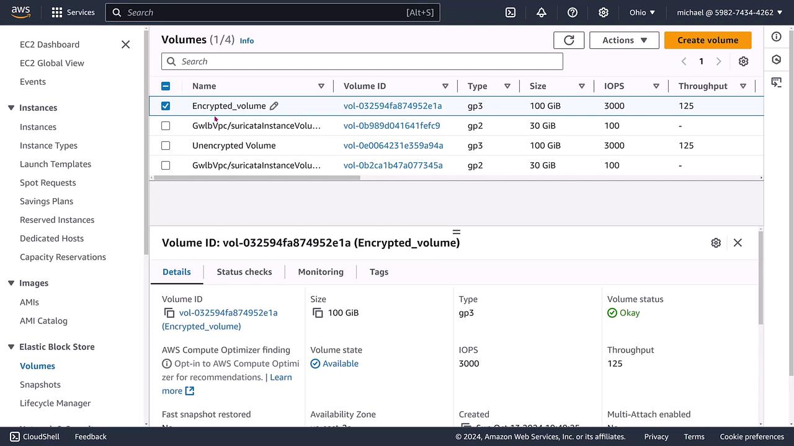
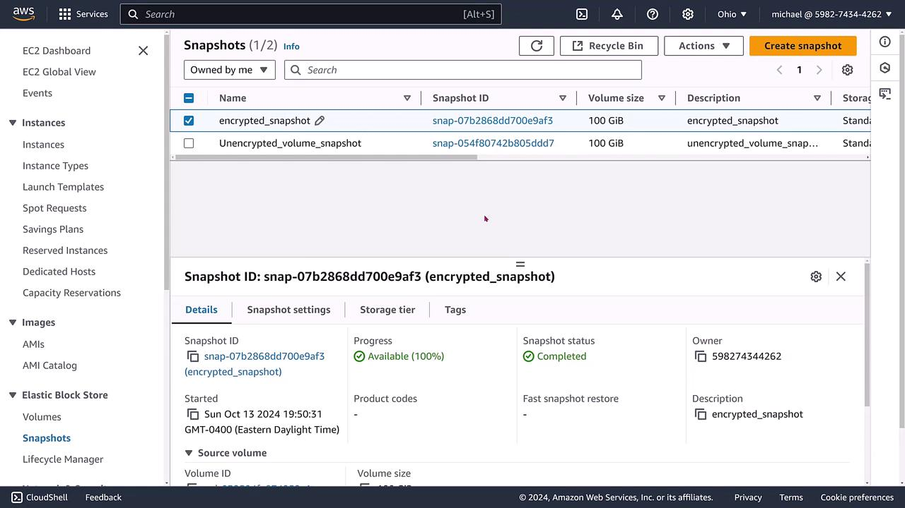

# Demo Migrating an EBS Volumes from Unencrypted to Encrypted

Source: https://notes.kodekloud.com/docs/AWS-Certified-CloudOps-Engineer-Associate/Domain-4-Security-and-Compliance/Demo-Migrating-an-EBS-Volumes-from-Unencrypted-to-Encrypted/page

This article demonstrates the process of migrating an unencrypted AWS EBS volume to an encrypted one while preserving data.

Welcome to this step-by-step demonstration on migrating an unencrypted AWS Elastic Block Store (EBS) volume to an encrypted one. In this guide, you will learn how to:

1. Create an unencrypted EBS volume.
2. Create a snapshot of the unencrypted volume.
3. Create a new volume from this snapshot with encryption enabled.
4. Verify the new encrypted volume.
5. Create an encrypted snapshot from the encrypted volume for future use.

This process preserves your data while ensuring that your volume is secured with encryption.

## Step 1: Creating an Unencrypted EBS Volume

Begin by creating a simple, general-purpose 100 GB EBS volume without encryption. At this stage, no tags are applied, and the volume remains unencrypted. The AWS console below shows the configuration options for this volume:

<Frame>
  
</Frame>

Once the volume is successfully created, verify that its status is set to "okay" (using GP3 with 100 GB and configured IOPS). The key detail to note is that the volume label indicates it is unencrypted.

## Step 2: Creating a Snapshot of the Unencrypted Volume

Since AWS does not provide a direct mechanism for converting an unencrypted volume to an encrypted one, the solution is to create a snapshot from the unencrypted volume. Remember that the snapshot will inherit the encryption state of the original volume, meaning it will also be unencrypted.

<Frame>
  
</Frame>

For clarity and easier management, consider renaming or tagging the snapshot as “unencrypted volume snapshot” after its creation.

## Step 3: Creating a New Encrypted Volume from the Snapshot

Navigate back to the volumes section and choose the option to create a new volume based on the snapshot you just created. Here are the key points during configuration:

* The new volume is created from the unencrypted snapshot.
* Enable the encryption option by selecting the default EBS encryption key (typically, the account default).
* Ensure that other volume settings (e.g., size, IOPS) remain unchanged.

Be sure to correctly specify the snapshot ID before proceeding. Check out the following diagram that illustrates the encryption settings screen during this process:

<Frame>
  
</Frame>

After the new volume is created, refresh the console to ensure that the volume now appears as encrypted, while maintaining the characteristics of the original GP3 configuration.

## Step 4: Verifying the Encrypted Volume

To confirm the successful migration, check the volume details on the EC2 dashboard. The dashboard should display the encrypted volume along with its unique attributes (volume ID, type, size, IOPS, and more).

<Frame>
  
</Frame>

## Step 5: Creating an Encrypted Snapshot for Future Use

With the encrypted volume in place, the next step is to create an encrypted snapshot. This snapshot, by virtue of inheriting the volume's encryption state, will be encrypted. Verify its presence in the snapshots console and, if necessary, update its details for consistency.

<Frame>
  
</Frame>

<Callout icon="lightbulb">
  If you ever need to create a volume from an encrypted snapshot, the resulting volume will automatically be encrypted.
</Callout>

<Callout icon="triangle-alert">
  It is not possible to directly convert an encrypted volume back to an unencrypted volume. To revert to an unencrypted state, a data migration process must be performed.
</Callout>

## Process Summary

The migration process can be summarized in three simple steps:

| Step | Description                                                   | Key Activity                                    |
| ---- | ------------------------------------------------------------- | ----------------------------------------------- |
| 1    | Create an unencrypted EBS volume                              | Initial volume configuration without encryption |
| 2    | Create a snapshot of the unencrypted volume                   | Snapshot inherits unencrypted state             |
| 3    | Create a new volume from the snapshot with encryption enabled | New volume is secured by enabling encryption    |

This demonstration clearly outlines how to transition an existing EBS volume from unencrypted to encrypted while preserving the underlying data. For more detailed information, consider reviewing additional [AWS Documentation](https://aws.amazon.com/documentation/) and [Kubernetes Basics](https://kubernetes.io/docs/concepts/overview/what-is-kubernetes/).

Happy learning and secure your data effectively!

<CardGroup>
  <Card title="Watch Video" icon="video" href="https://learn.kodekloud.com/user/courses/aws-certified-sysops-administrator-associate/module/0c9bb9a3-5201-434e-8085-a9f1e9f23f22/lesson/9affa897-a9bd-4985-8388-3b838d26c147" />

  <Card title="Practice Lab" icon="installation" href="https://learn.kodekloud.com/user/courses/aws-certified-sysops-administrator-associate/module/0c9bb9a3-5201-434e-8085-a9f1e9f23f22/lesson/e4e9296b-605b-4645-ab77-c827b407d66e" />
</CardGroup>
