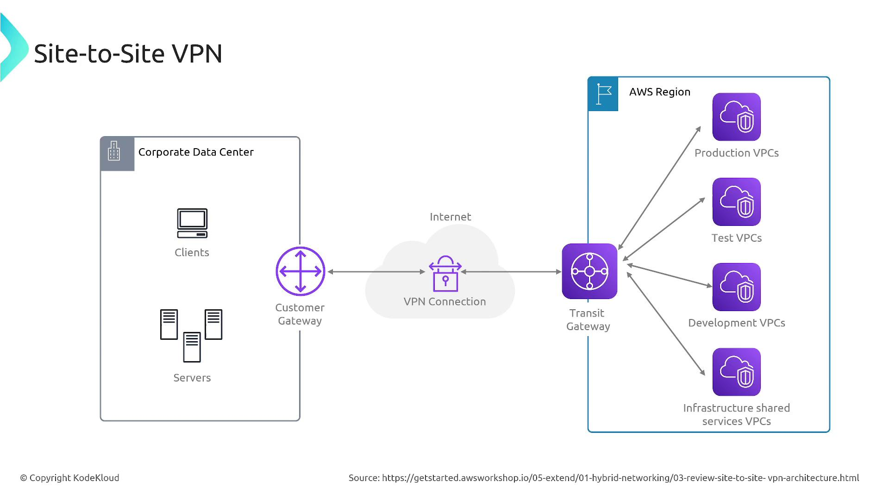
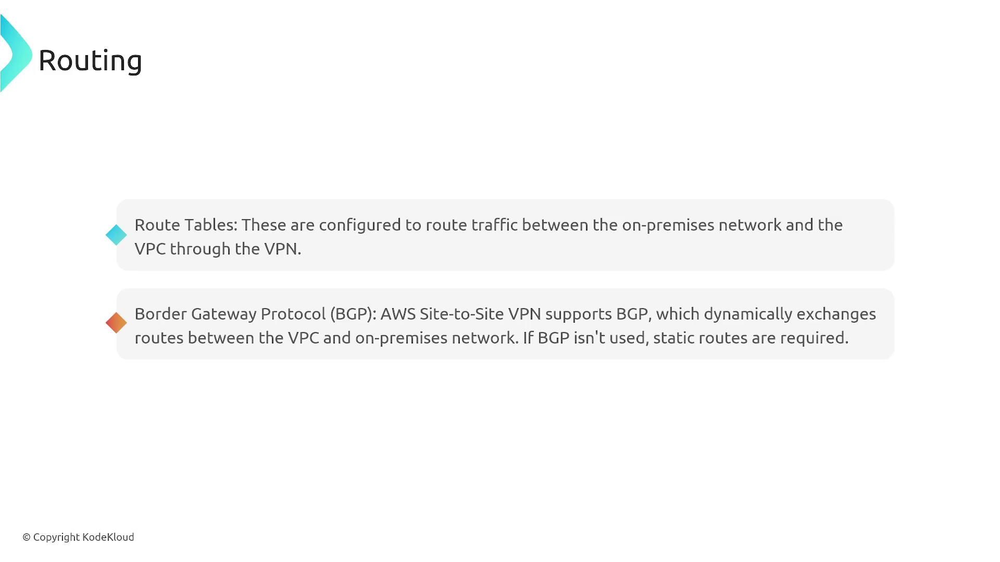
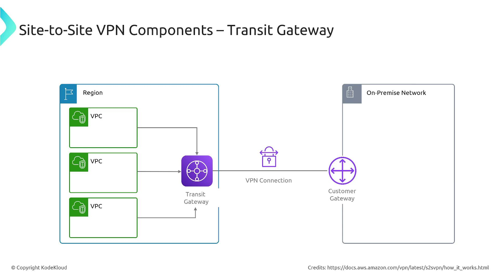
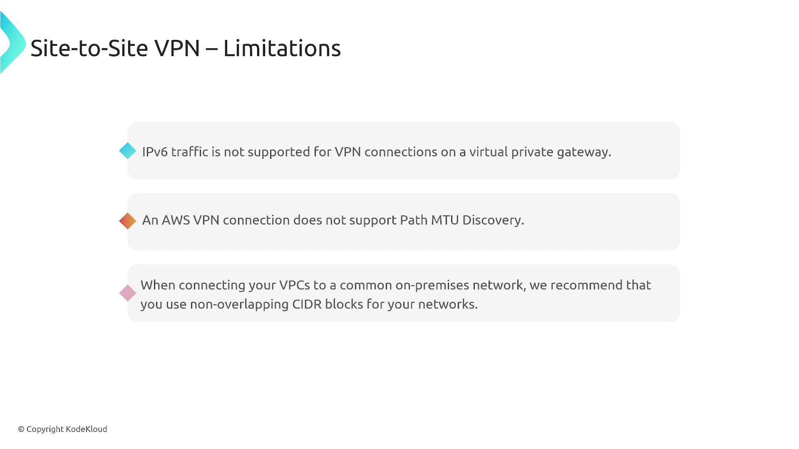
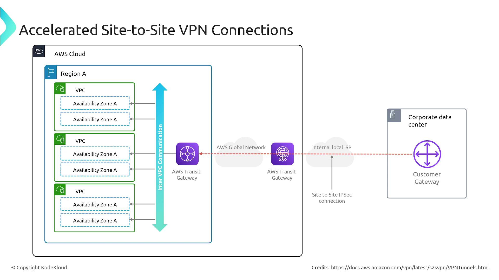
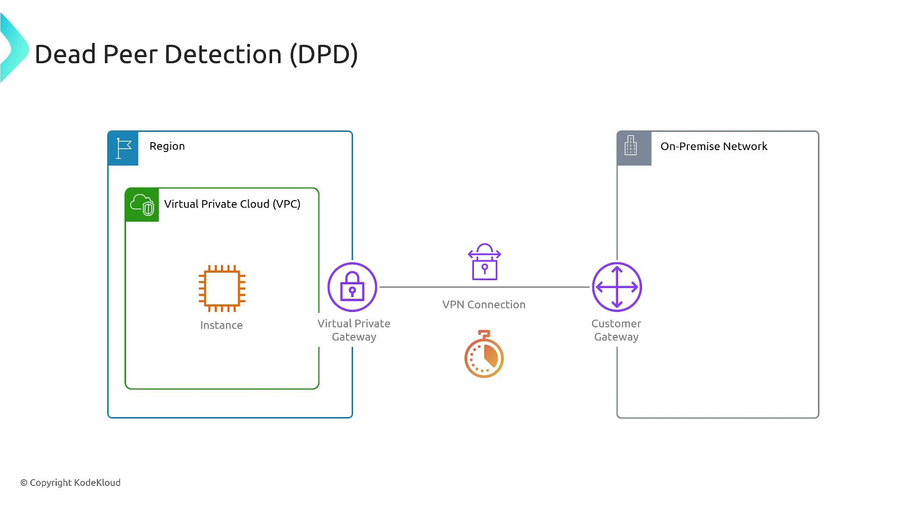
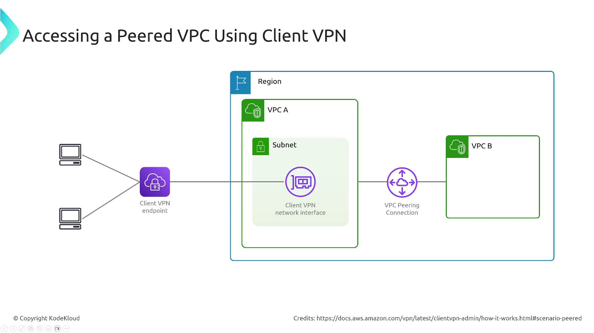
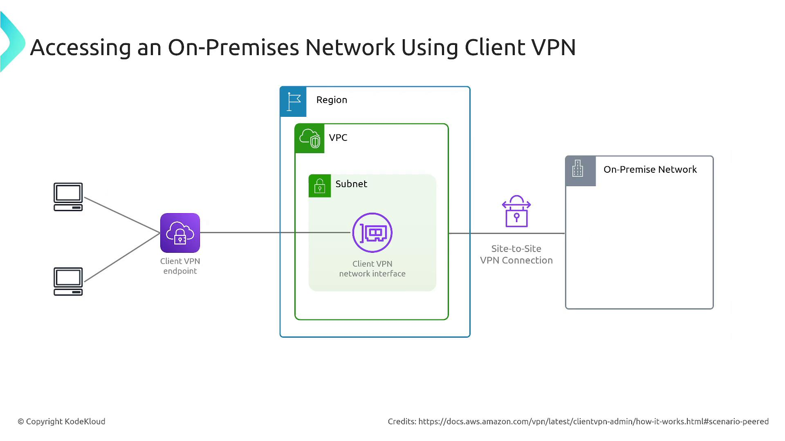
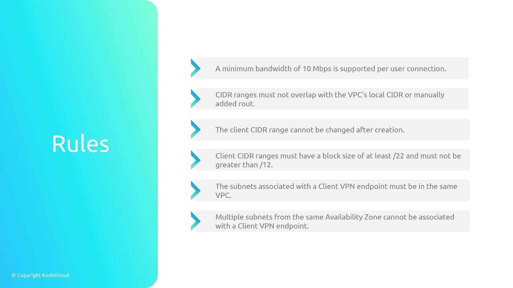

# Client and Site to Site VPN Overview

Source: https://notes.kodekloud.com/docs/AWS-Certified-CloudOps-Engineer-Associate/Domain-5-Networking-and-Content-Delivery/Client-and-Site-to-Site-VPN-Overview/page

This article provides an overview of AWSs Client VPN and Site-to-Site VPN services for secure connections between on-premises networks and AWS.

In this article, we dive into AWS's Client VPN and Site-to-Site VPN services. Whether you are preparing for an AWS certification exam or looking to establish secure connections between your on-premises network and AWS, understanding these two VPN types is crucial.

When you launch instances in an Amazon VPC—especially those in private subnets—they lack direct access to an on-premises network by default. Even instances in public subnets are not automatically connected to on-premises networks unless explicitly exposed to the internet. The challenge is to securely connect your on-premises network with AWS, enabling seamless access to data and compute resources across both environments.

***

## Site-to-Site VPN

Site-to-Site VPN secures the connection between an on-premises network and an AWS VPC over the public internet using an encrypted IPSec tunnel. This configuration is ideal for organizations that need to extend their data centers into the AWS cloud.

### How It Works

* **Virtual Private Gateway (VGW) and Customer Gateway (CGW):**\
  AWS uses a Virtual Private Gateway to establish an encrypted VPN tunnel with your on-premises customer gateway. Both physical and software-based devices can serve as customer gateways.
* **Routing:**\
  Configure your VPC route tables to forward traffic between your on-premises network and AWS via the VPN connection. This routing can be managed dynamically with BGP (Border Gateway Protocol) or through static routing rules.
* **Transit Gateway Integration:**\
  For complex scenarios involving multiple VPCs or endpoints, AWS Transit Gateway centralizes management and routing of VPN connections for efficient network communication.

<Frame>
  
</Frame>

In the diagram above, note that encrypted traffic flows over the public internet between the on-premises customer gateway and the AWS Virtual Private Gateway.

<Callout icon="lightbulb">
  A customer gateway can be a physical device or a software-based application. Ensure it is properly configured to work seamlessly with AWS for a reliable connection.
</Callout>

### Routing Considerations

Proper routing ensures that traffic between the AWS VPC and on-premises network reaches its intended destination. For example, if your VPC uses the CIDR block 10.1.0.0/16 and your on-premises network uses 10.2.0.0/16, you must advertise these routes correctly.

<Frame>
  
</Frame>

Using AWS Transit Gateway can further simplify routing by providing a centralized routing hub for managing multiple VPN and VPC interconnections.

<Frame>
  
</Frame>

### Limitations and Tunnel Redundancy

There are a few key limitations and design considerations with Site-to-Site VPN:

* IPv6 traffic is not supported via the Virtual Private Gateway.
* AWS VPN connections do not support Path MTU Discovery.
* Overlapping IP ranges between your VPC and on-premises network can cause misrouted traffic.

AWS typically employs two VPN tunnels per connection. In the event one tunnel fails, traffic automatically fails over to the secondary tunnel. Each tunnel has a unique IP address and must be separately configured on your customer gateway.

<Frame>
  
</Frame>

Enhanced configurations such as accelerated connections using AWS Global Accelerator are available to optimize performance, particularly during peak congestion periods.

<Frame>
  
</Frame>

<Frame>
  
</Frame>

Additionally, features such as Dead Peer Detection (DPD) help identify unresponsive tunnels and trigger failover or re-establishment of sessions automatically.

***

## Client VPN

AWS Client VPN allows individual users to establish a secure connection from their devices to an AWS VPC or other networks interconnected via Site-to-Site VPN. This solution is ideal for remote access, ensuring that users can securely connect to backend resources.

### How Client VPN Works

In a Client VPN setup, users connect to a managed VPN endpoint that terminates the VPN session. This endpoint is linked to a specific subnet that routes traffic to target resources. The service supports OpenVPN-based clients and leverages AWS-managed infrastructure to provide a scalable and secure connection.

<Frame>
  
</Frame>

### Key Features

* Multiple authentication methods including Active Directory, SAML-based federated authentication, certificate-based authentication, and single sign-on.
* Support for both TCP and UDP protocols on ports 443 (default for SSL/TLS) and 1194.
* Each client receives a unique IP address from a predetermined, non-overlapping client CIDR range.
* Centralized management of sessions with integration into AWS routing mechanisms, using choices like Transit Gateway or VPC peering for complex scenarios.

<Frame>
  
</Frame>

For handling more complex architectures that span multiple VPCs, AWS Transit Gateway is the favored solution. For simpler scenarios with fewer connections, VPC peering can be a suitable alternative.

Client VPN can also extend connectivity to on-premises networks, effectively integrating both site-to-site and client-based connectivity within one comprehensive solution.

<Frame>
  
</Frame>

### Client VPN Configuration Considerations

When configuring a Client VPN endpoint, keep these important rules in mind:

| Configuration Parameter | Requirement / Limitation                                                       |
| ----------------------- | ------------------------------------------------------------------------------ |
| Bandwidth per User      | Minimum 10 Mbps per connection                                                 |
| CIDR Block Overlap      | Client VPN, VPC, and on-premises CIDRs must be non-overlapping                 |
| Client CIDR Block       | Defined during endpoint creation and immutable; ranges from /22 to /12         |
| Subnet Association      | All associated subnets must be in the same VPC; only one per availability zone |

<Frame>
  
</Frame>

Typically, you designate a single client landing subnet. From there, access and routing rules manage connectivity within the VPC and to external on-premises networks via Site-to-Site VPN.

***

## Final Thoughts

Both Site-to-Site and Client VPN solutions in AWS offer secure, encrypted connectivity through AWS-managed gateways and endpoints. Site-to-Site VPN is best suited for connecting entire networks—ensuring continuous and resilient connectivity between on-premises data centers and AWS regions—while Client VPN provides secure, individual user access with customizable authentication options.

These AWS VPN configurations deliver robust security, flexibility, and scalability, making them essential for modern networking needs and a common topic in AWS certification exams for SysOps and DevOps professionals.

Thank you for reading this article. We hope the insights provided here help you understand and implement effective AWS VPN configurations for your organization.

<CardGroup>
  <Card title="Watch Video" icon="video" href="https://learn.kodekloud.com/user/courses/aws-certified-sysops-administrator-associate/module/fd99c412-5efc-46e2-99ce-bb9c581fec27/lesson/e51ab047-644a-48e9-80c5-0b074916e5bf" />
</CardGroup>
