# Example SSH test and ping output:
[ec2-user@ip-10-1-1-82 ~]$ ping 8.8.8.8
64 bytes from 8.8.8.8: icmp_seq=1 ttl=53 time=1.58 ms
64 bytes from 8.8.8.8: icmp_seq=2 ttl=53 time=1.61 ms
64 bytes from 8.8.8.8: icmp_seq=3 ttl=53 time=1.61 ms
64 bytes from 8.8.8.8: icmp_seq=4 ttl=53 time=1.91 ms
64 bytes from 8.8.8.8: icmp_seq=5 ttl=53 time=1.62 ms
64 bytes from 8.8.8.8: icmp_seq=6 ttl=53 time=1.65 ms
64 bytes from 8.8.8.8: icmp_seq=7 ttl=53 time=1.57 ms

--- 8.8.8.8 ping statistics ---
7 packets transmitted, 7 received, 0% packet loss, time 601ms
rtt min/avg/max/mdev = 1.572/1.651/1.909/0.107 ms
```

After exiting the SSH session and reconnecting, the successful test confirms that connectivity is intact.

***

## Modifying NACL Rules to Restrict Traffic

Next, modify the inbound rules for the NACL to allow only SSH traffic. Update rule 100 to permit SSH (port 22) from any IP address and save the changes. With this update, even though the security groups allow all traffic, the NACL now blocks all inbound traffic except for SSH.

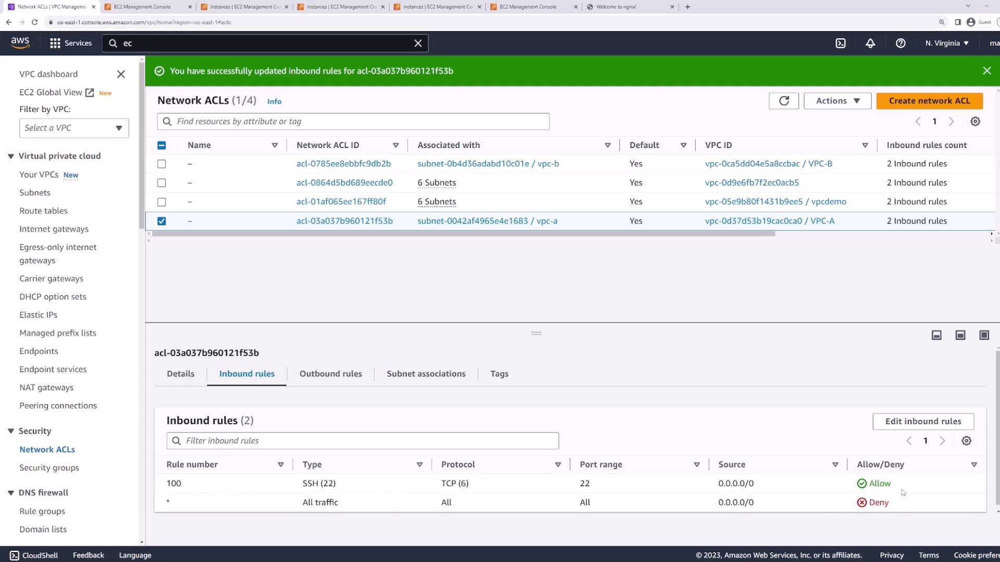

Test this configuration by SSHing into one of the instances. Since both instances are in the same subnet, they adhere to the same rules. Confirm SSH access with Server 2:

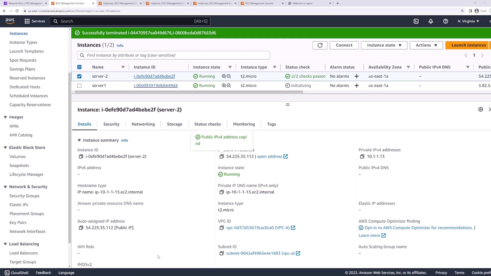

After confirming that SSH remains functional, attempt to access the web service by refreshing your browser. The request should hang because only SSH is allowed. To restore web access, update the NACL by adding:

* A new inbound rule (e.g., rule 110) to allow HTTP (port 80)
* Another inbound rule (e.g., rule 120) to allow HTTPS (port 443)

Save the changes. With these rules in place, both servers can handle SSH, HTTP, and HTTPS traffic. Remember that Server 2 must have NGINX (or another web server) installed to serve HTTP content.

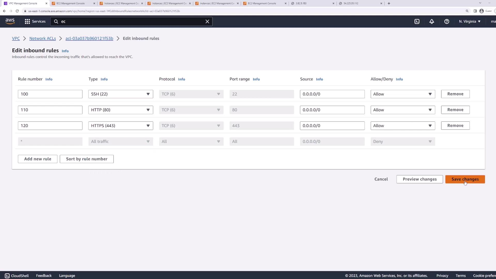

***

## Installing NGINX on Server Two

If NGINX is not already installed on Server Two, you can install it using the following command:

```bash theme={null}
[ec2-user@ip-10-1-1-13 ~]$ sudo yum install nginx -y
```

The terminal output will resemble:

```plaintext theme={null}
Last metadata expiration check: 21:18:14 ago on Fri Aug 25 07:39:09 2023.
Dependencies resolved.

=================================================================================================================================
 Package                            Architecture       Version                                Repository                Size
=================================================================================================================================
Installing:
 nginx                              x86_64           1:1.24.0-1.amzn2023.0.1                amazonlinux               32 k
Installing dependencies:
 generic-logos-httpd                noarch            18.0.0-12.amzn2023.0.3                 amazonlinux               19 k
 gperftools-libs                    x86_64           2.9.1-1.amzn2023.0.2                   amazonlinux              309 k
 libunwind                          x86_64           1.4.0-5.amzn2023.0.2                   amazonlinux               66 k
 nginx-core                         x86_64           1:1.24.0-1.amzn2023.0.1                amazonlinux              586 k
 nginx-filesystem                   noarch            1:1.24.0-1.amzn2023.0.1                amazonlinux                9.0 k
 nginx-mimetypes                    noarch            2.1.49-3.amzn2023.0.3                  amazonlinux               21 k

Transaction Summary
Install  7 Packages

Total download size: 1.0 M
Installed size: 3.4 M
Downloading Packages:
```

> **lightbulb** Because NACLs are stateless, outbound package installation requests are allowed by the security group's outbound rules. However, the corresponding inbound responses must be explicitly permitted by the NACL. If the inbound rules are restricted to only SSH, HTTP, and HTTPS, the package download may fail. To resolve this, temporarily add an inbound rule (e.g., rule 130) that allows all traffic. Once the installation is complete, remove the temporary rule.

After installing NGINX, start the web server:

```bash theme={null}
[ec2-user@ip-10-1-1-13 ~]$ sudo systemctl start nginx
```

Verify that the web server is accessible via your browser.

***

## Advanced NACL Configuration: Allow and Deny

One major advantage of NACLs over security groups is the ability to set both allow and deny rules. This flexibility enables scenarios like allowing SSH from everywhere except a specific IP address range. To configure such a setup:

1. Create a rule (e.g., rule 90) that denies SSH traffic from the unwanted IP range.
2. Create another rule (with a higher rule number) that allows SSH from all other IP addresses.

Remember that NACLs evaluate rules in numeric order from lowest to highest. Ensure that the deny rule comes before the allow rule to enforce the intended restriction.

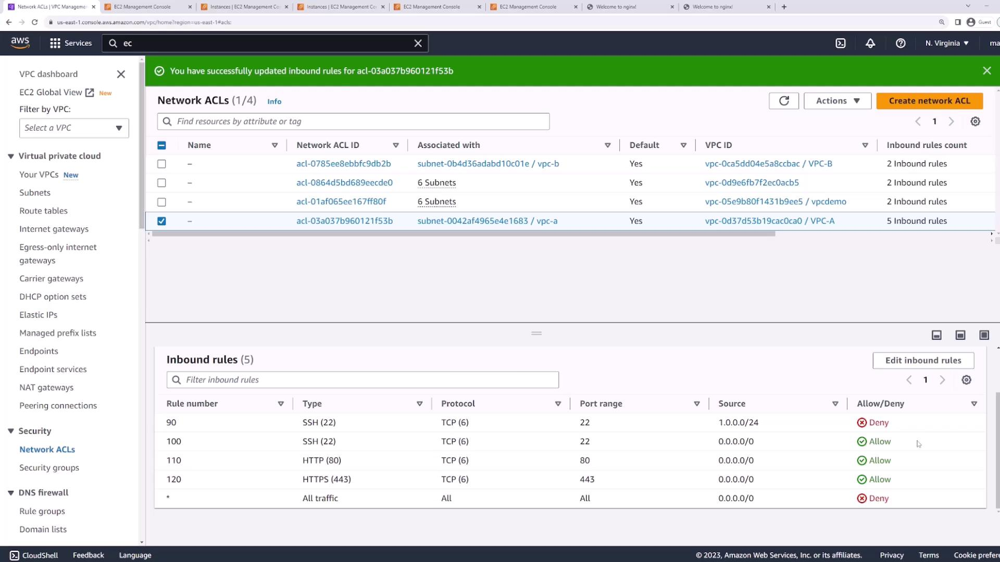

***

## Conclusion

This lesson demonstrated how to work with NACLs and highlighted the key differences compared to security groups. By filtering traffic at the subnet level and configuring both allow and deny rules, NACLs provide granular control over network traffic. A proper understanding of NACL configurations is essential for maintaining secure and efficient network environments in AWS.

Happy learning!

- [Watch Video](https://learn.kodekloud.com/user/courses/aws-certified-developer-associate/module/c8f3ca76-9178-474e-a33b-bf1de4fd948c/lesson/af74b6ba-02f1-498f-8307-2e65256e1f89)

  - [Practice Lab](https://learn.kodekloud.com/user/courses/aws-certified-developer-associate/module/c8f3ca76-9178-474e-a33b-bf1de4fd948c/lesson/e722a422-2f31-4e09-98c5-d6f520f4bc47)


# NAT Gateway Demo

Source: https://notes.kodekloud.com/docs/AWS-Certified-Developer-Associate/Networking-Fundamentals/NAT-Gateway-Demo/page

This tutorial explains how to configure a NAT gateway for secure outbound internet access from an EC2 instance in a VPC.

In this tutorial, we will walk through the steps to configure a NAT gateway so that an EC2 instance within your Virtual Private Cloud (VPC) can access the internet for outbound communications while restricting direct inbound access. This ensures that your EC2 instance can make outbound connections without exposing it to unsolicited inbound traffic.

## Step 1: Create a Dummy VPC

Begin by creating a dummy VPC with the CIDR block 10.0.0.0/16. For this demonstration, IPv6 is not required.

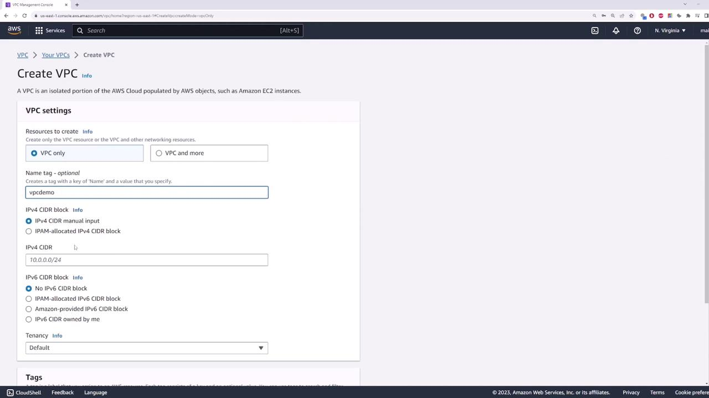

## Step 2: Create a Private Subnet

Next, create a subnet that will serve as your private subnet where the EC2 instance will be deployed. Name the subnet "private subnet" and assign it the CIDR block 10.0.1.0/24.

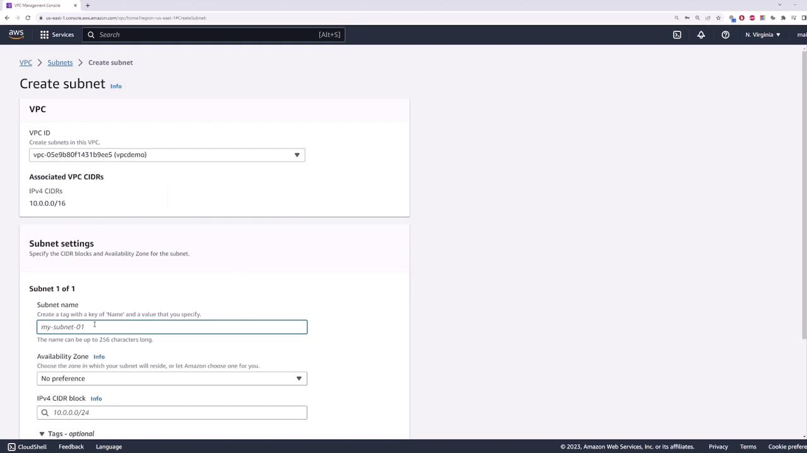

## Step 3: Launch an EC2 Instance

Open the EC2 console and deploy an instance within the private subnet. Follow these guidelines:

* Name the instance "private server".
* Use the default Amazon Linux image.
* Under network settings, select your VPC (e.g., "demo") and choose the private subnet.
* Do not assign a public IP address since the instance will access the internet via the NAT gateway.
* Use the default security group, then launch the instance.

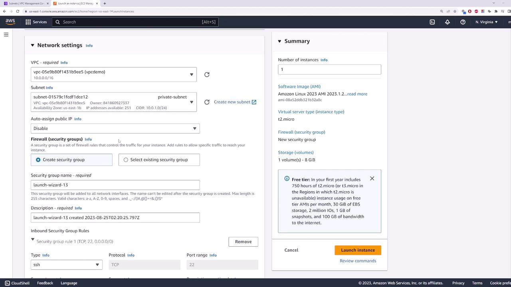

After launching the instance, verify that it does not have a public IP address. This confirmation ensures that the instance remains private and is accessible only within the VPC (for example, via VPN).

## Step 4: Attach an Internet Gateway and Create a Public Subnet

Before deploying the NAT gateway, attach an Internet Gateway (IGW) to your VPC because NAT gateways must reside in a public subnet.

1. **Create and Attach an Internet Gateway**\
   Create an Internet Gateway and attach it to your VPC.

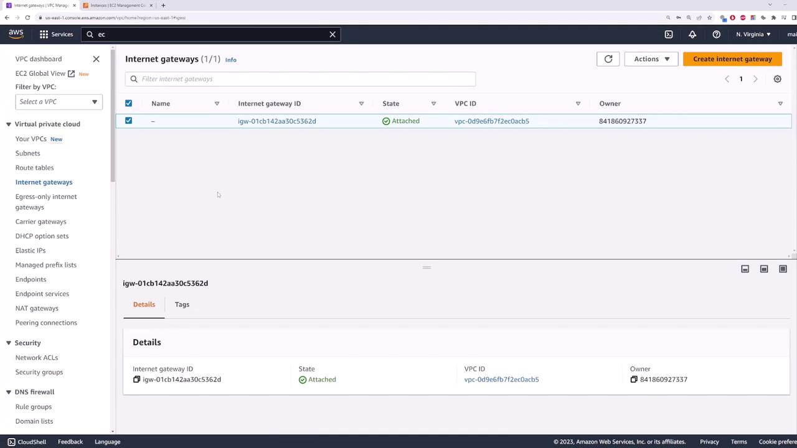

2. **Confirm the Attachment**\
   Confirm that the Internet Gateway is attached to your VPC.

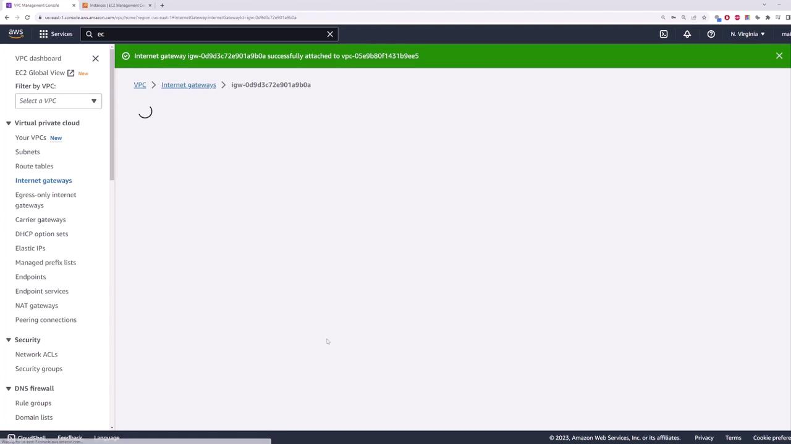

3. **Create a Public Subnet**\
   Create a public subnet named "public-subnet" and assign it the CIDR block 10.0.2.0/24.

## Step 5: Configure Route Tables

Now, you'll set up route tables to direct traffic appropriately.

1. **Create Route Tables**
   * Create a route table named "public route table" associated with your VPC (e.g., "demo").
   * Then, create another route table named "private route table" for the private subnet.

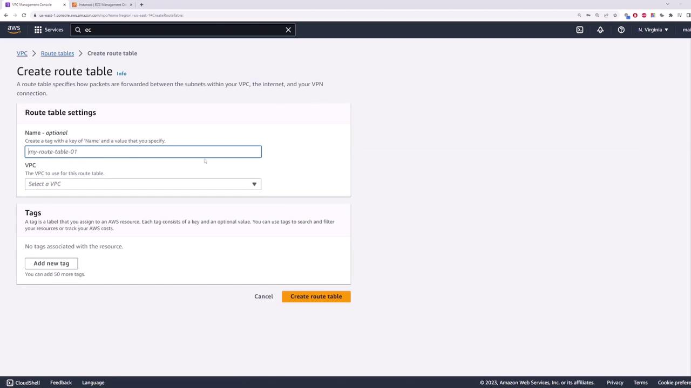

2. **Define Routes and Associations**
   * For the public route table, add a default route that directs traffic to the Internet Gateway. Associate the public subnet with this route table.
   * Associate the private route table with your private subnet. This table will later be updated to route outbound traffic through the NAT gateway.

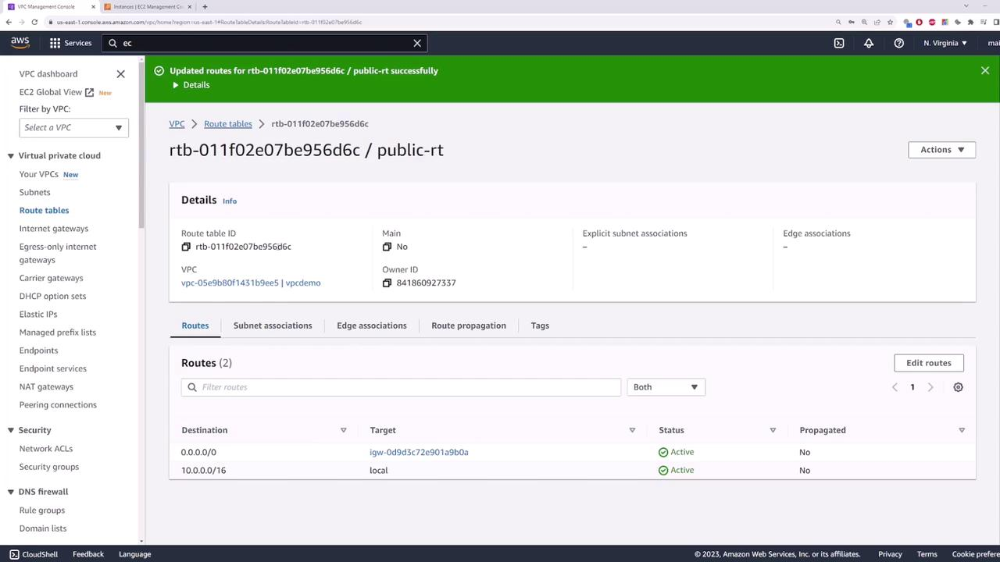

## Step 6: Deploy the NAT Gateway

With the subnets and route tables configured, deploy your NAT gateway as follows:

1. **Create a NAT Gateway**\
   Navigate to the NAT gateways section and create a new NAT gateway. Provide a name, select the public subnet ("public-subnet"), and allocate an Elastic IP address to ensure the gateway maintains a fixed IP address.

2. **Update the Private Route Table**\
   Once the NAT gateway is created, go back to the private route table and add a default route that points to the newly created NAT gateway. Save the changes.

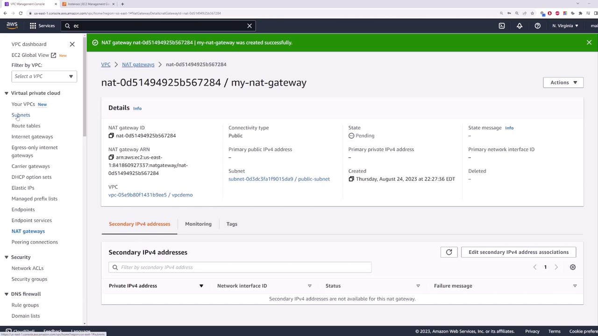

> **lightbulb** NAT gateways may initially appear in a “pending” state as they initialize. In production environments, it is recommended to deploy multiple NAT gateways across different availability zones to ensure high availability. If one availability zone fails, instances in that zone will have uninterrupted access to the internet through a NAT gateway in another zone.

## Final Verification

At this point, your configuration allows the EC2 instance in the private subnet to access the internet through the NAT gateway while remaining inaccessible from external networks. To review the network details and confirm the setup, check the VPC subnet information.

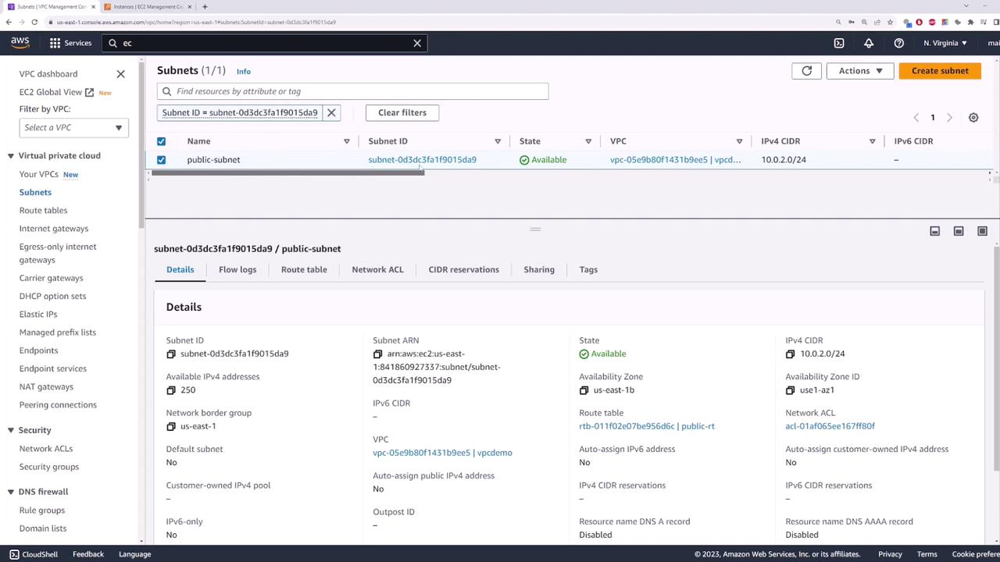

By following these steps, you have successfully set up a secure architecture that enables outbound internet connectivity for your EC2 instance via a NAT gateway, while maintaining strict inbound access controls.

- [Watch Video](https://learn.kodekloud.com/user/courses/aws-certified-developer-associate/module/c8f3ca76-9178-474e-a33b-bf1de4fd948c/lesson/403d5477-f48c-4af1-9a91-79004ca3070e)
