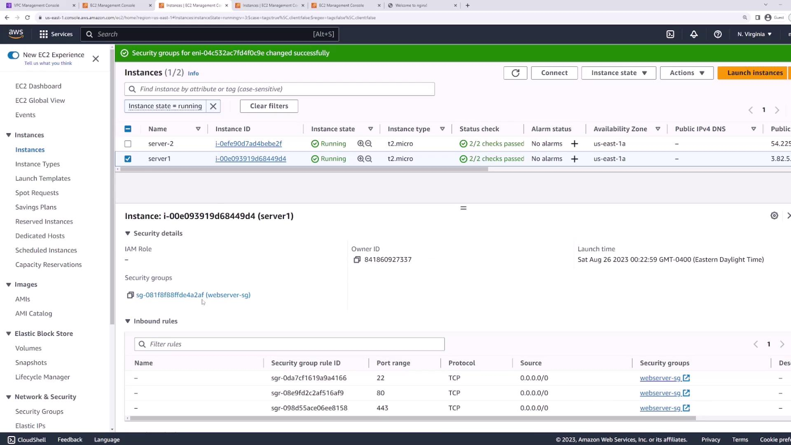
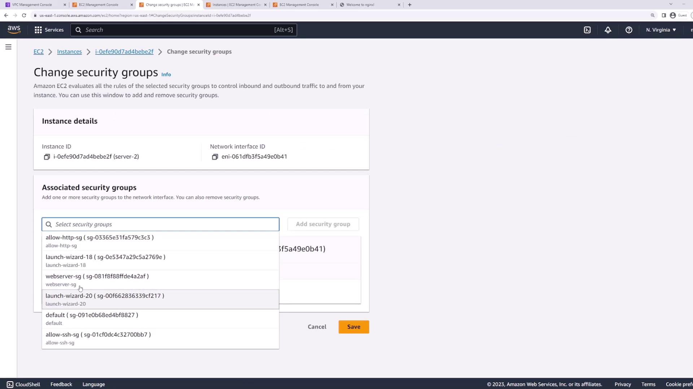
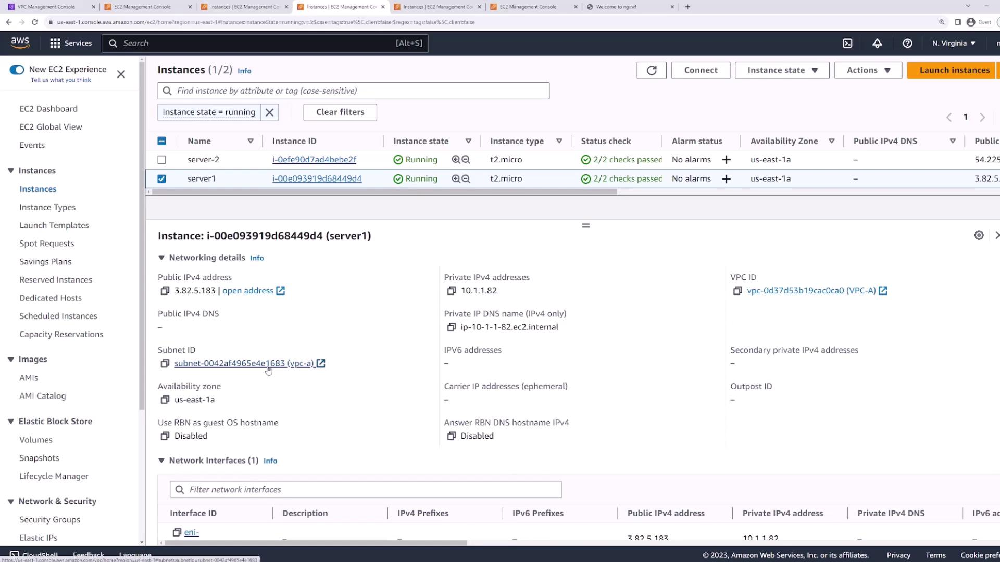
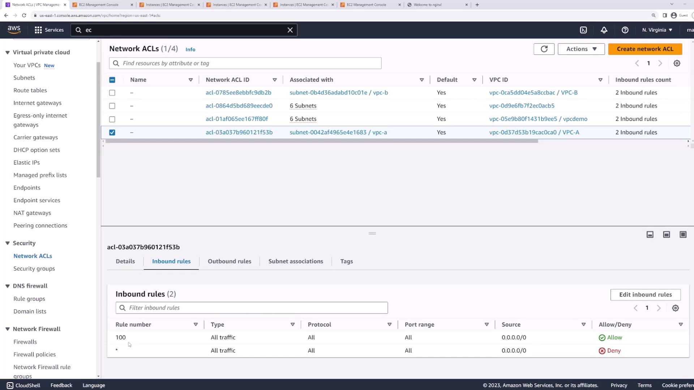

# NACLs Demo

Source: https://notes.kodekloud.com/docs/AWS-Certified-Developer-Associate/Networking-Fundamentals/NACLs-Demo/page

This lesson explores Network Access Control Lists in AWS, their configuration, and differences from security groups for managing subnet-level traffic.

Welcome to this lesson on Network Access Control Lists (NACLs). In this article, we will explore how NACLs operate, how they differ from security groups, and how to configure them in AWS. Unlike stateful security groups that protect individual instances, NACLs are stateless and apply at the subnet level, controlling traffic to and from an entire subnet.

Before diving into NACL configurations, we first ensure that the EC2 instances are not limited by their security groups. This allows us to focus solely on NACL functionality.

***

## Adjusting Security Groups

We begin by reviewing and updating the security group settings for our EC2 instances:

* **Server 1:** This instance is associated with a "web server security group."

<Frame>
  
</Frame>

* **Server 2:** Initially, this instance has no security group assigned. To ensure consistency, we update it by assigning the same web server security group.

For both servers, we modify the security group rules to allow all inbound and outbound traffic. This setup prevents the security group from interfering with our NACL tests.

<Frame>
  
</Frame>

After the updates, the security group now permits all traffic:

<Frame>
  
</Frame>

Next, verify that both EC2 instances reside in the same subnet. For example, by selecting Server 1 and reviewing its networking details, you can see it is on subnet E1683:

<Frame>
  
</Frame>

***

## Reviewing and Configuring NACLs

Switch to the VPC console and navigate to the "Security" section, then click on "Network ACLs." Locate the default ACL for VPC A—the one associated with your EC2 instances—and confirm that subnet E1683 is attached to this ACL.

Examine the inbound rules. Notice that rule 100 allows all traffic on all protocols and ports from any IP address. Because NACL evaluation is top-down, placing any rule below rule 100 would be ineffective. This default configuration guarantees that all traffic reaches the instance until we modify the rules.

<Frame>
  
</Frame>

At this stage, test connectivity by SSHing into your instance:

```bash theme={null}
