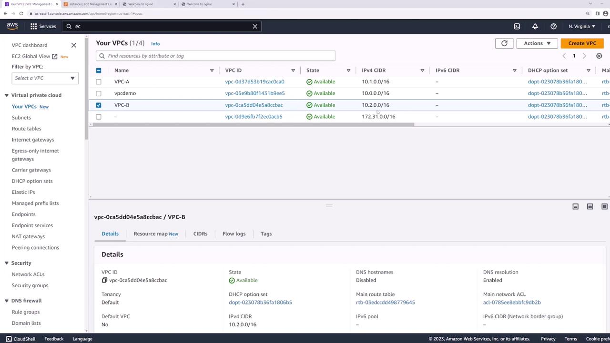
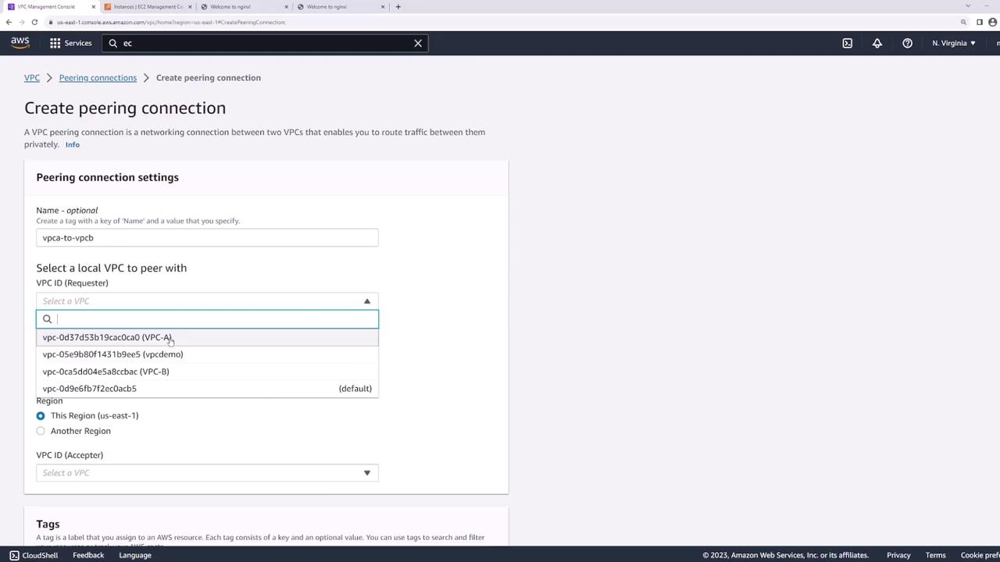
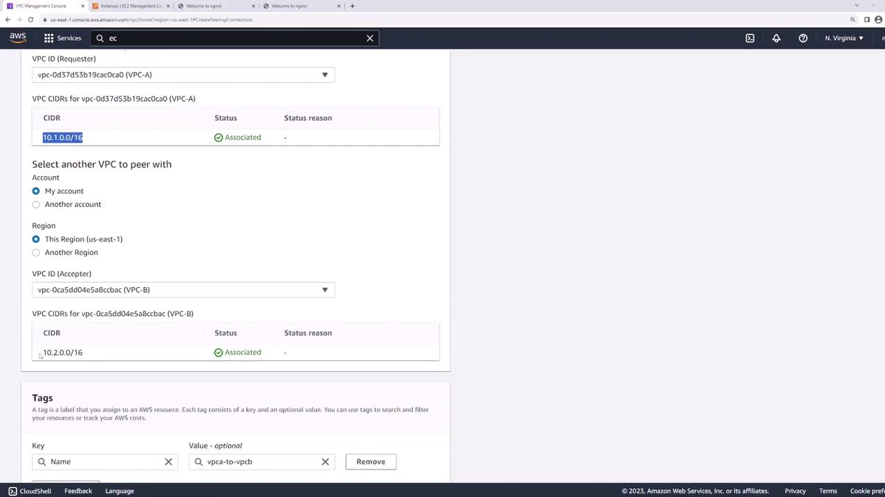
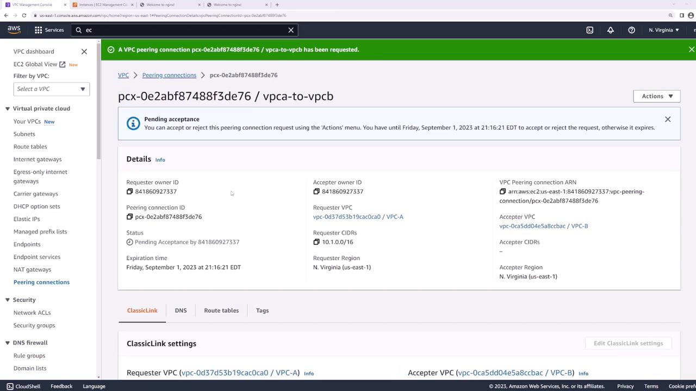
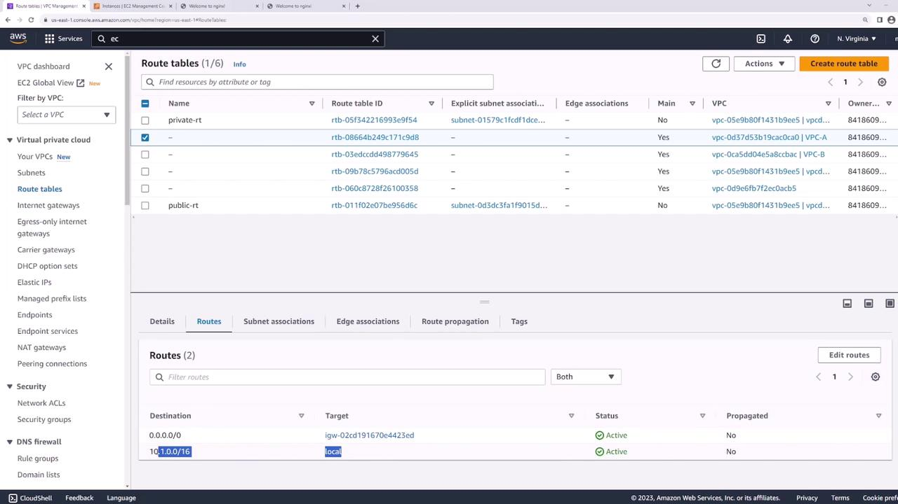
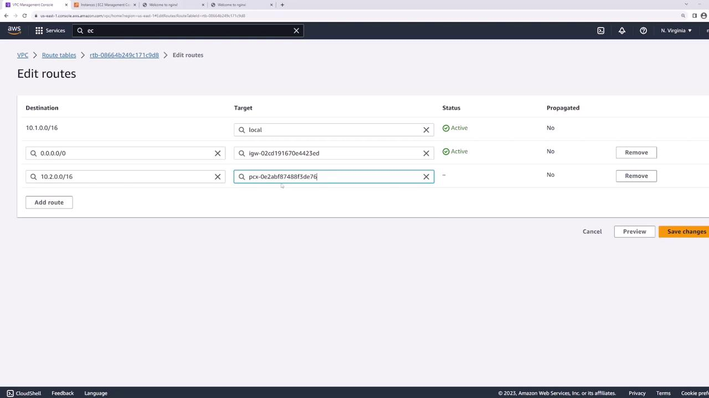

# VPC Peering Demo

Source: https://notes.kodekloud.com/docs/AWS-Certified-Developer-Associate/Networking-Fundamentals/VPC-Peering-Demo/page

This lesson demonstrates configuring VPC peering for communication between resources in two separate VPCs.

This lesson demonstrates how to configure VPC peering to enable communication between resources in two separate VPCs. In our example, we use two pre-configured VPCs:

* **VPC-A**: CIDR block 10.1.0.0/16 (with an EC2 instance named "server one")
* **VPC-B**: CIDR block 10.2.0.0/16 (with an EC2 instance named "server two")

<Frame>
  
</Frame>

At the outset, we try to ping "server two" from "server one". With server one having the private IP address 10.1.1.13 and server two at 10.2.1.139, the ping command fails because VPCs are isolated by default.

```python theme={null}
[ec2-user@ip-10-1-1-13 ~]$ ping 10.2.1.139
PING 10.2.1.139 (10.2.1.139) 56(84) bytes of data.
```

<Callout icon="lightbulb">
  Even though all security groups and NACLs allow all traffic, the failure occurs due to the absence of a VPC peering connection.
</Callout>

## Establishing the VPC Peering Connection

To configure connectivity between the VPCs, follow these steps:

1. **Create the Peering Connection**\
   In the AWS Management Console, navigate to the VPC peering section. Click on **Create Peering Connection** and name the connection "VPC A to VPC B" for clarity.
   * Select **VPC-A** as the requester (local VPC).
   * Choose **VPC-B** as the target VPC.
   * Note that VPC peering connections can be established between different AWS accounts or across regions. In this demo, both VPCs are in the US East 1 region.

<Frame>
  
</Frame>

2. **Reviewing and Sending the Request**\
   After configuring the peering request, review the CIDR blocks. It is critical that the CIDR blocks do not overlap to ensure proper routing. Once confirmed, create the peering connection and navigate to the peering connections page to verify its status.

<Frame>
  
</Frame>

3. **Accepting the Peering Request**\
   Initially, the peering connection remains in a "pending acceptance" state because VPC-B must accept the request. Since both VPCs are in the same account, select the pending connection, use the **Actions** menu, and click **Accept Request**.

<Frame>
  
</Frame>

## Updating Route Tables

Even after the peering connection is active, the connection may not function until the route tables in both VPCs are updated.

Initially, re-run the ping command from server one:

```bash theme={null}
[ec2-user@ip-10-1-1-13 ~]$ ping 10.2.1.139
PING 10.2.1.139 (10.2.1.139) 56(84) bytes of data.
^C
--- 10.2.1.139 ping statistics ---
195 packets transmitted, 0 received, 100% packet loss, time 201780ms
```

Examine the route table associated with VPC-A. You will notice:

* A route for local VPC traffic (10.1.0.0/16)
* A default route through the Internet Gateway

There is no route directing traffic to VPC-B (10.2.0.0/16).

<Frame>
  
</Frame>

To fix this:

* **For VPC-A**: Add a new route with the destination 10.2.0.0/16, and set the target to the newly created peering connection.
* **For VPC-B**: Update the route table by adding a route with destination 10.1.0.0/16 and use the same peering connection as the target.

You can review these routing updates in the AWS Management Console:

<Frame>
  
</Frame>

## Verifying Connectivity

Now that the routing is correctly configured, re-run the ping command from "server one" to "server two":

```bash theme={null}
[ec2-user@ip-10-1-1-13 ~]$ ping 10.2.1.139
PING 10.2.1.139 (10.2.1.139) 56(84) bytes of data.
64 bytes from 10.2.1.139: icmp_seq=1 ttl=127 time=1.88 ms
64 bytes from 10.2.1.139: icmp_seq=2 ttl=127 time=1.43 ms
64 bytes from 10.2.1.139: icmp_seq=3 ttl=127 time=1.38 ms
64 bytes from 10.2.1.139: icmp_seq=4 ttl=127 time=1.58 ms
64 bytes from 10.2.1.139: icmp_seq=5 ttl=127 time=1.51 ms
64 bytes from 10.2.1.139: icmp_seq=6 ttl=127 time=1.38 ms
64 bytes from 10.2.1.139: icmp_seq=7 ttl=127 time=1.47 ms
64 bytes from 10.2.1.139: icmp_seq=8 ttl=127 time=1.43 ms
```

The successful ping confirms that "server one" can now communicate with "server two" over the VPC peering connection. Importantly, all traffic remains within the AWS infrastructure without traversing the public Internet.

## Summary

To set up VPC peering, complete the following steps:

1. **Create a Peering Connection Request:** Initiate the request from one VPC to another.
2. **Accept the Request:** Approve the pending connection in the target VPC.
3. **Update Route Tables:** Add routes in both VPCs to direct traffic via the peering connection.

This completes the VPC peering demonstration.

<CardGroup>
  <Card title="Watch Video" icon="video" href="https://learn.kodekloud.com/user/courses/aws-certified-developer-associate/module/c8f3ca76-9178-474e-a33b-bf1de4fd948c/lesson/d423894b-898c-477d-8ad2-892e3376c2e4" />
</CardGroup>
