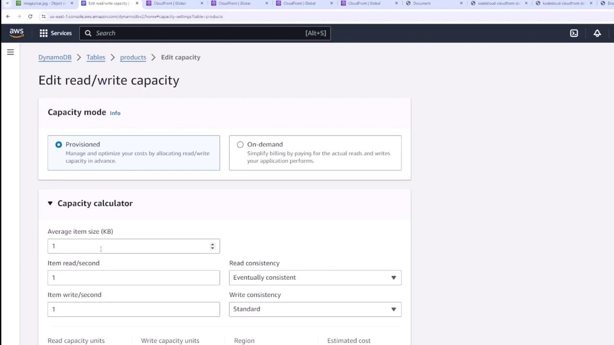
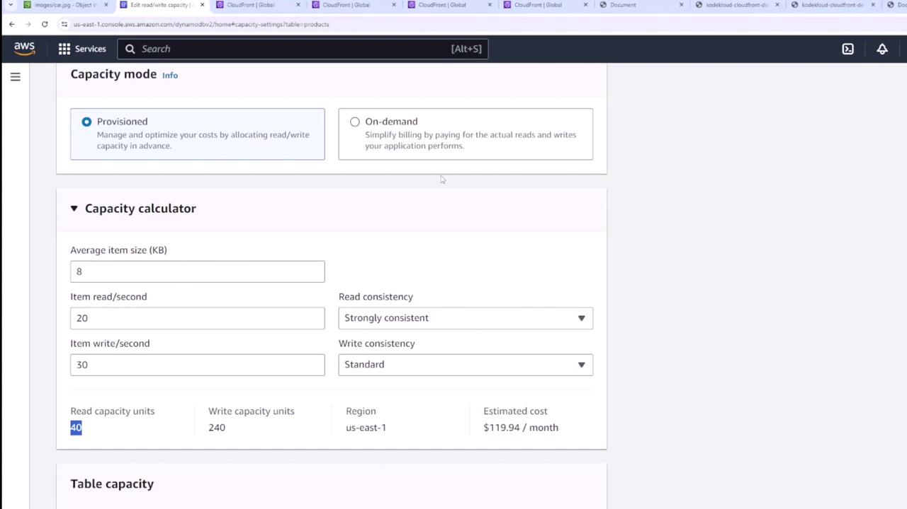
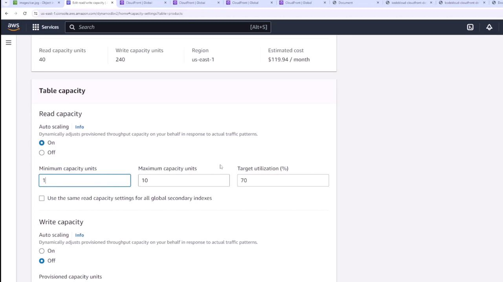
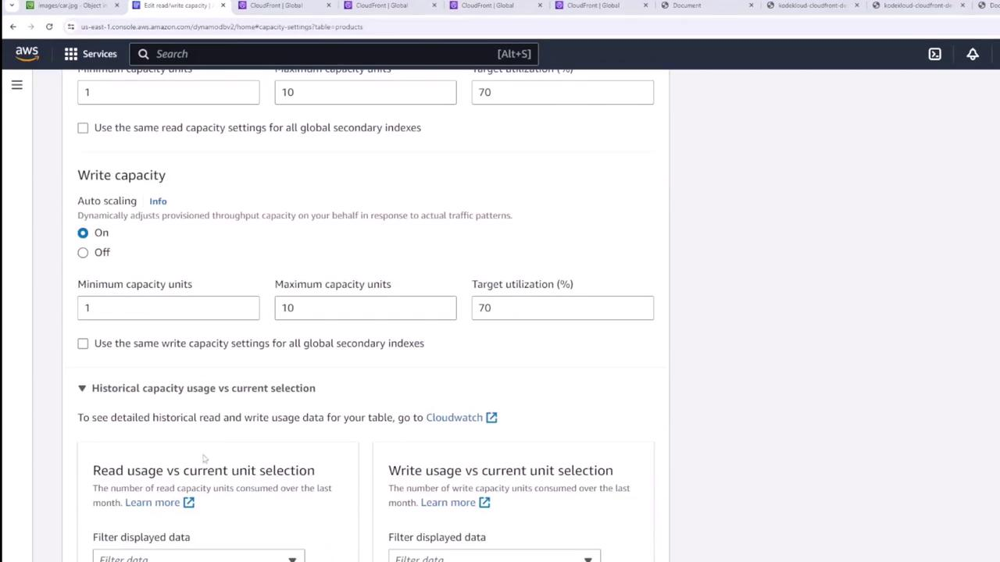

# DynamoDB Pricing Throughput Demo

Source: https://notes.kodekloud.com/docs/AWS-Certified-Developer-Associate/Databases/DynamoDB-Pricing-Throughput-Demo/page

Learn to adjust pricing and throughput configurations for DynamoDB tables during creation and afterward using the additional settings menu.

In this lesson, you'll learn how to adjust the pricing and throughput configurations of your DynamoDB table. You can modify these settings both during table creation and afterward using the additional settings menu.

## Overview of Capacity Modes

When managing a DynamoDB table, you can choose between two capacity modes:

* **On-Demand**: This mode bills you based on actual read and write requests. It is ideal for workloads with unpredictable or fluctuating throughput requirements.

<Callout icon="lightbulb">
  On-demand pricing typically carries a premium cost.
</Callout>

* **Provisioned**: In this mode, you specify the predetermined read and write capacity units. If you have a clear understanding of your throughput requirements, this option can be more cost-effective.

To modify these settings, navigate to your chosen table (for example, the products table), select **Additional Settings**, and then click **Edit**.

## Using the Capacity Calculator

If you are unsure about the appropriate capacity units for your workload, use the capacity calculator available in the DynamoDB console. For example, if your application has the following requirements:

* An average of eight items with a size of eight kilobytes each.
* Approximately 20 strongly consistent reads per second.
* About 30 standard writes per second.

The calculator might recommend a configuration of 40 read capacity units and 240 write capacity units, leading to an estimated cost of \$119.94 per month.

<Frame>
  
</Frame>

<Frame>
  
</Frame>

## Configuring Table Capacity

Access the table capacity settings to define your read and write capacity units. For example, if your current configuration is set to 2 read and 2 write capacity units, update these values to match the calculator's recommendation of 40 read capacity units and 240 write capacity units.

### Auto Scaling

DynamoDB provides an auto scaling feature that dynamically adjusts your provisioned throughput based on actual traffic patterns. Key auto scaling settings include:

* **Minimum Capacity Units**: The lower limit for throughput scaling.
* **Maximum Capacity Units**: The upper limit for scaling based on traffic.
* **Target Utilization**: Typically set around 70%, this percentage helps maintain optimal use of the provisioned capacity.

Enabling auto scaling ensures that your table automatically adjusts to changing workloads, which not only helps prevent unexpected costs but also maintains high performance.

<Frame>
  
</Frame>

Similarly, you can configure the write capacity settings with auto scaling. Historical capacity usage data displayed alongside your current configuration enables you to determine if the provisioned capacities align with your table's actual usage. This historical insight can guide any necessary adjustments for optimal performance and cost-effectiveness.

<Frame>
  
</Frame>

<Callout icon="lightbulb">
  Regularly monitor your table's performance metrics and adjust capacity settings accordingly to optimize both cost and throughput.
</Callout>

<CardGroup>
  <Card title="Watch Video" icon="video" href="https://learn.kodekloud.com/user/courses/aws-certified-developer-associate/module/a1267c00-fc48-4a9b-8d41-fd642fa743ea/lesson/070e7e70-c262-4d28-83c4-030734f3f27e" />

  <Card title="Practice Lab" icon="installation" href="https://learn.kodekloud.com/user/courses/aws-certified-developer-associate/module/a1267c00-fc48-4a9b-8d41-fd642fa743ea/lesson/0424181a-e703-4930-824d-8ba879eecdc5" />
</CardGroup>
