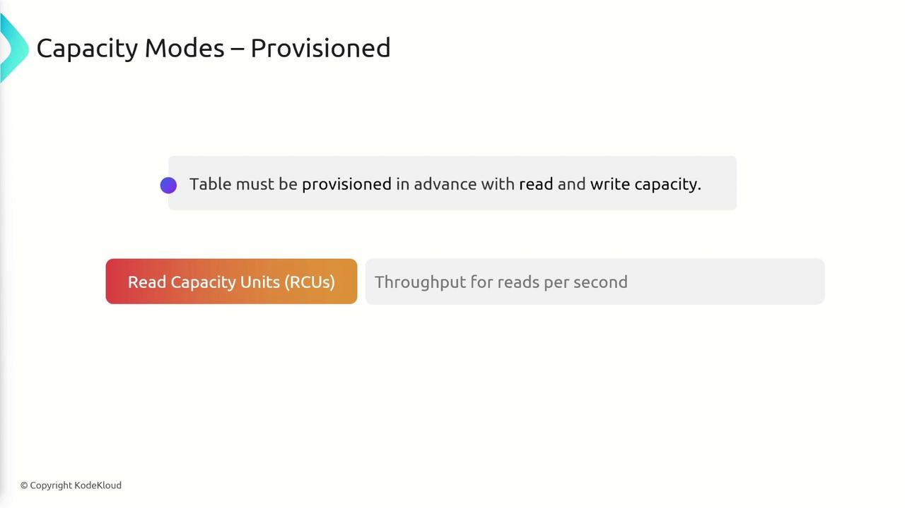
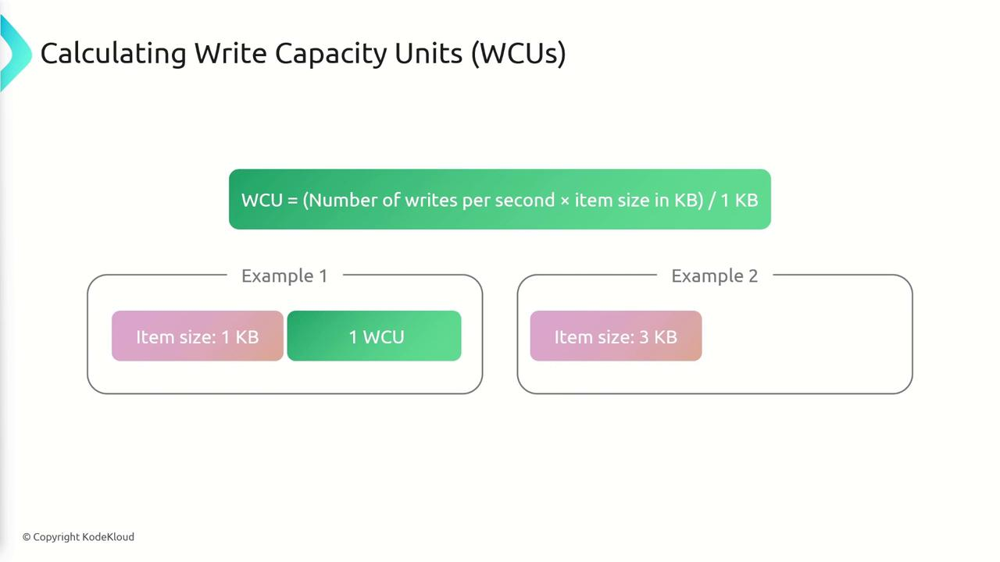

# DynamoDB Pricing Throughput

Source: https://notes.kodekloud.com/docs/AWS-Certified-Developer-Associate/Databases/DynamoDB-Pricing-Throughput/page

This guide explores DynamoDB’s pricing structure and throughput management, focusing on provisioned and on-demand capacity modes for optimizing performance and cost.

In this guide, we'll dive into DynamoDB’s pricing structure and throughput management by exploring its two capacity modes: provisioned and on-demand. Understanding these modes is essential for optimizing performance and cost.

## Capacity Modes Overview

DynamoDB provides two capacity modes, each tailored to different workload patterns:

* **Provisioned Mode:** Best suited for predictable workloads. In this mode, you reserve a predefined number of read (RCUs) and write (WCUs) capacity units. You are billed based on the provisioned throughput, regardless of the actual usage.

* **On-Demand Mode:** Ideal for unpredictable or spiky workloads. Here, throughput capacity scales automatically based on the current demand and you only pay for the actual requests made. Note that on-demand costs are higher per request compared to the provisioned option.

### Provisioned Throughput Details

When using provisioned mode, it is necessary to configure your table with the required read and write capacity units:

* **Read Capacity Units (RCUs):** Measure the throughput for read operations.
* **Write Capacity Units (WCUs):** Measure the throughput for write operations.



Provisioned mode also allows for a temporary burst in capacity. However, if your workload exceeds the provisioned limits, DynamoDB will raise a "ProvisionedThroughputExceededException."

## Understanding RCUs and WCUs

Accurately calculating and provisioning capacity is crucial for maintaining optimal performance. Below, we break down the two core metrics.

### Write Capacity Units (WCUs)

* **Definition:** One WCU corresponds to one write per second for items up to 1 kilobyte in size.
* **Calculation:** Determine the required WCUs by multiplying the number of writes per second by the item size in kilobytes. If the resulting value is fractional, round up to the next whole number.

For instance:

* Writing an item of 1 KB per second requires 1 WCU.
* Writing an item of 3 KB per second requires 3 WCUs.
* For fractional results (e.g., 5.5), round up to 6 WCUs.

Consider this example calculation:



```python theme={null}
