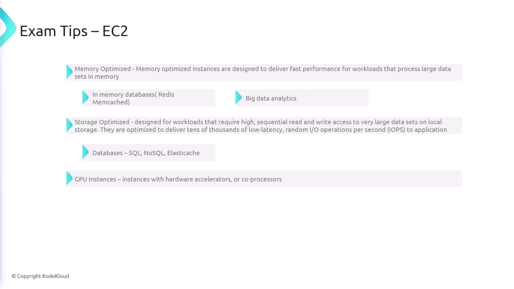
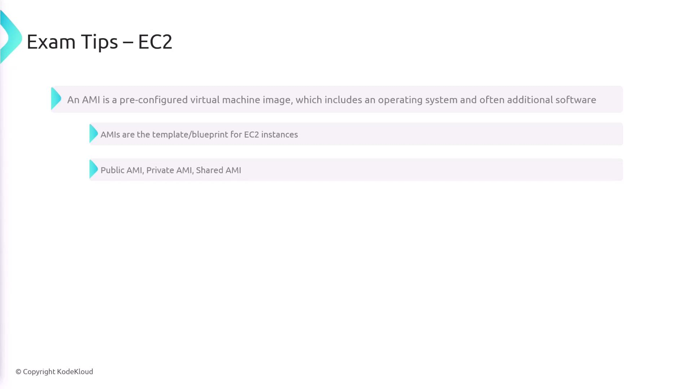
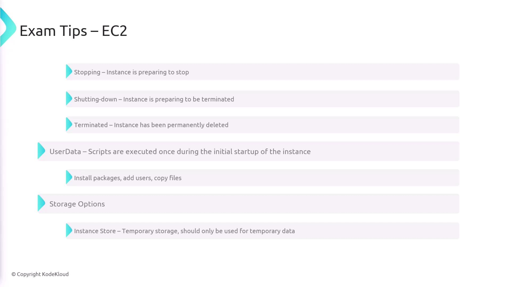
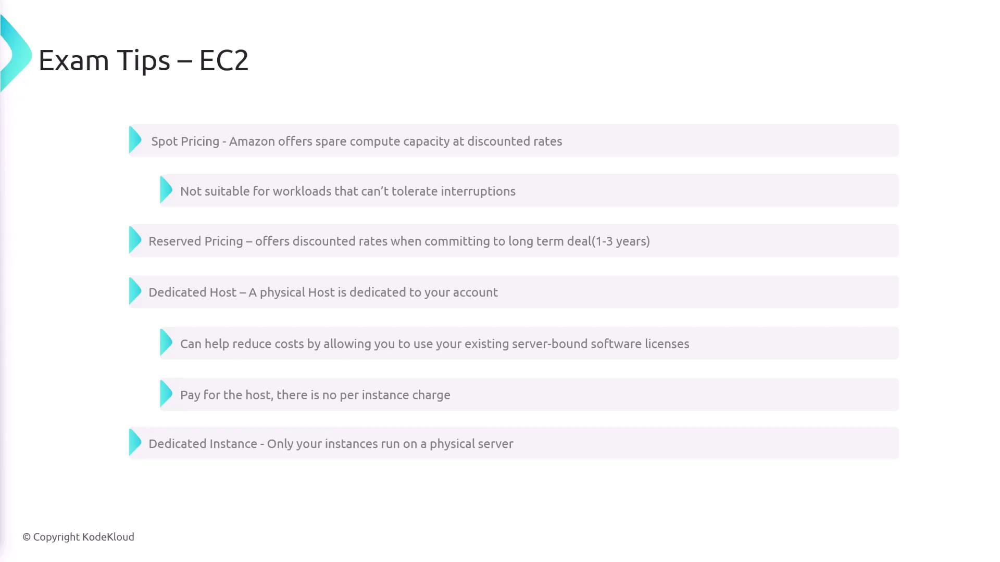

# Exam Tips

Source: https://notes.kodekloud.com/docs/AWS-Certified-Developer-Associate/Elastic-Compute-CloudEC2/Exam-Tips/page

This guide reviews essential tips and key concepts for the AWS Certified Developer Associate Exam focusing on Amazon EC2.

In this guide, we review essential tips and key concepts for working with [Amazon Elastic Compute Cloud (EC2)](https://learn.kodekloud.com/user/courses/amazon-elastic-compute-cloud-ec2). EC2 provides on-demand scalable computing capacity by delivering virtual machines (servers in the cloud) tailored for various workloads.

## EC2 Instance Types

AWS offers a diverse range of instance types to suit different workload requirements:

* **General Purpose:** Delivers a balanced mix of compute, memory, and networking resources, making it ideal for a wide range of applications.
* **Compute Optimized:** Best for compute-bound applications that need high-performance processors. Use these for tasks like media transcoding, high-performance computing, scientific modeling, and gaming.
* **Memory Optimized:** Optimized to handle large in-memory datasets, these instances are great for applications such as Redis, Memcached, and big data analytics.
* **Storage Optimized:** Designed for workloads that require high sequential read/write performance on local storage. These instances support traditional SQL databases, NoSQL stores, and ElastiCache scenarios by delivering tens of thousands of low latency random I/O operations per second.
* **GPU Instances:** Equipped with hardware accelerators, GPU instances are perfect for machine learning, video transcoding, and other GPU-accelerated operations.

<Frame>
  
</Frame>

## Amazon Machine Images (AMIs)

An Amazon Machine Image (AMI) is a pre-configured virtual machine image that includes an operating system and additional software components. AMIs serve as templates for launching EC2 instances and come in three main types:

* **Public AMIs:** Available to all users.
* **Private AMIs:** Custom images created for your specific needs.
* **Shared AMIs:** AMIs that you can share with other AWS accounts.

<Frame>
  
</Frame>

## Instance Access and States

Access to EC2 instances is controlled using private/public key pairs. During their lifecycle, EC2 instances transition through several states:

* **Pending:** The instance is initializing and preparing to run.
* **Running:** The instance is fully active and operational.
* **Stopping:** The instance is in the process of shutting down.
* **Shutting Down:** The instance is wrapping up tasks before termination.
* **Terminated:** The instance has been permanently deleted.

Users can also make use of user data scripts that run during the initial startup. These scripts are useful for installing packages, creating users, or copying necessary files.

<Callout icon="lightbulb">
  Keep in mind that managing instance states effectively can help optimize resource usage and cost.
</Callout>

<Frame>
  
</Frame>

## Storage Options

EC2 offers multiple storage solutions to meet various data persistence and performance needs:

* **Instance Store:** Provides temporary storage that is ideal for non-persistent data.
* **EBS (Elastic Block Store):** Offers durable storage volumes that can be used for booting instances and mounting as block storage.
* **EFS (Elastic File System):** Delivers scalable file storage that can be mounted across multiple instances, though it cannot be used for boot storage.

## EC2 Placement Groups

Placement groups are used to optimize the network performance and reliability of your EC2 instances by controlling how instances are placed on physical hardware:

* **Cluster Placement Groups:** Place instances close together within a single availability zone to reduce network latency and increase throughput.
* **Partition Placement Groups:** Spread instances across logical partitions. This ensures that instances in different partitions do not share the same underlying hardware, which is beneficial for workloads like Hadoop, Cassandra, and Kafka.
* **Spread Placement Groups:** Distribute a small number of instances on distinct hardware to minimize the risk of simultaneous failures. Each instance is placed on separate racks with different network and power sources.

## Pricing Options

AWS provides several pricing models to help you optimize cost based on your usage patterns:

* **On-Demand:** Offers pay-as-you-go pricing with no long-term commitments—you are billed by the hour only for the resources you consume.
* **Spot Pricing:** Offers discounted rates on spare compute capacity, making it ideal for workloads that can handle interruptions.
* **Reserved Instances:** Provides cost savings in exchange for a long-term commitment, offering discounted hourly rates.
* **Dedicated Hosts:** Allows you to lease an entire physical server, which can help reduce costs when using server-bound software licenses by paying for the host instead of per instance.
* **Dedicated Instances:** Guarantees that your instances run on hardware dedicated solely to your account. Note that if an instance is stopped and restarted, it might get relocated to a different physical host.

<Callout icon="triangle-alert">
  Always review and understand the pricing model that best fits your workload to avoid unexpected costs.
</Callout>

<Frame>
  
</Frame>

<CardGroup>
  <Card title="Watch Video" icon="video" href="https://learn.kodekloud.com/user/courses/aws-certified-developer-associate/module/538040df-b323-4fd1-ad80-f5c22725c345/lesson/c8fbfcb1-fd6a-4687-bd5b-20cfae97b41c" />
</CardGroup>
