# Example (not applicable for ECS)
docker run -p 80:3000
```

In ECS, however, the external and internal ports must match (e.g., both being 3000). The advanced container configuration also allows you to set up health checks, environment variables, and volumes through a graphical interface. Click "Update" when the container configuration is complete.

### Defining Your ECS Service

After setting up the container:

* **Service Name:** For instance, "ECS-project1-service".
* **Load Balancer:** Optionally add one—select "none" for now.

The wizard creates a cluster that groups all underlying resources, provisioning a new VPC along with subnets automatically.

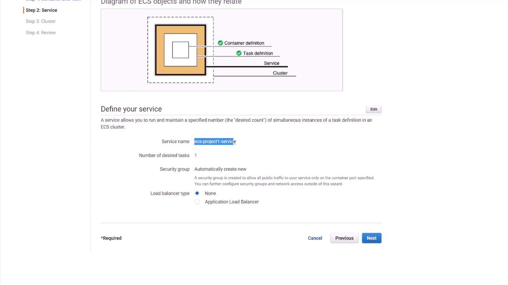

Review the configuration details including container definition, task definition, service details, and cluster settings. Then click "Create." Wait a few minutes for provisioning and click "View Service" when ready.

## Understanding the ECS Task Wizard Components

### 1. Task Definitions

Task definitions store all container configurations, including port mappings, volumes, and environment variables. Revision numbers help track changes, with the latest revision reflecting the current configuration.

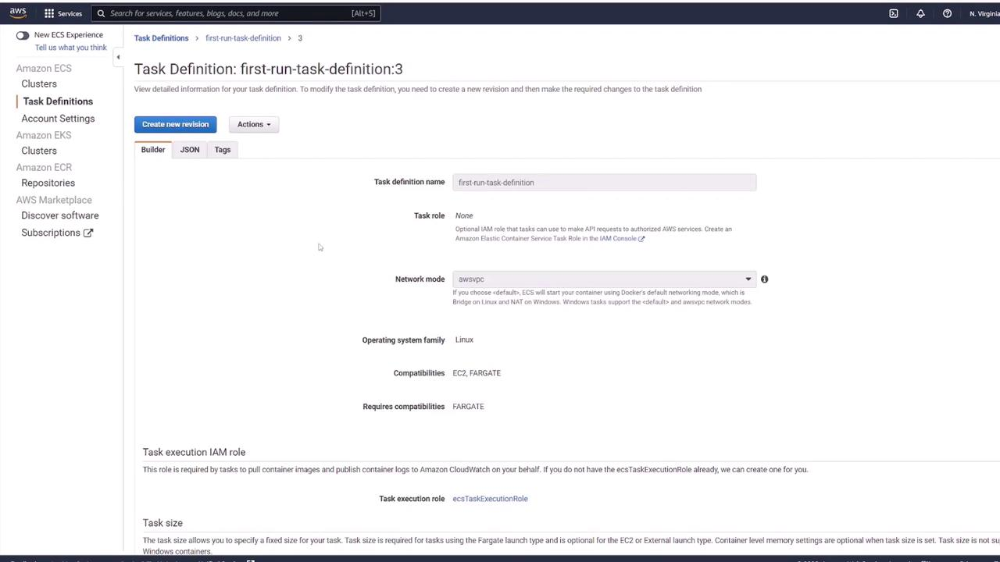

### 2. Cluster

The ECS cluster represents the infrastructure—whether EC2 instances when using the EC2 launch type, or a managed Fargate environment. The default cluster, set up by the wizard, includes a newly created VPC and subnets.

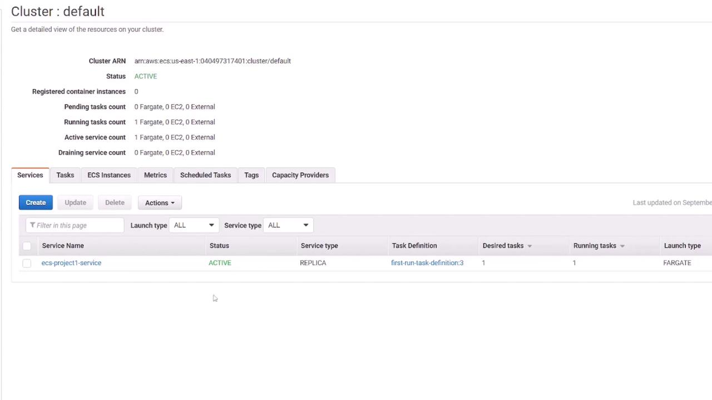

### 3. Service and Tasks

The service, "ECS-project1-service", is created with a desired task count (initially one). You can inspect network settings, including VPC, subnets, and security groups. The running task receives a public IP address which you can use to access the deployed application.

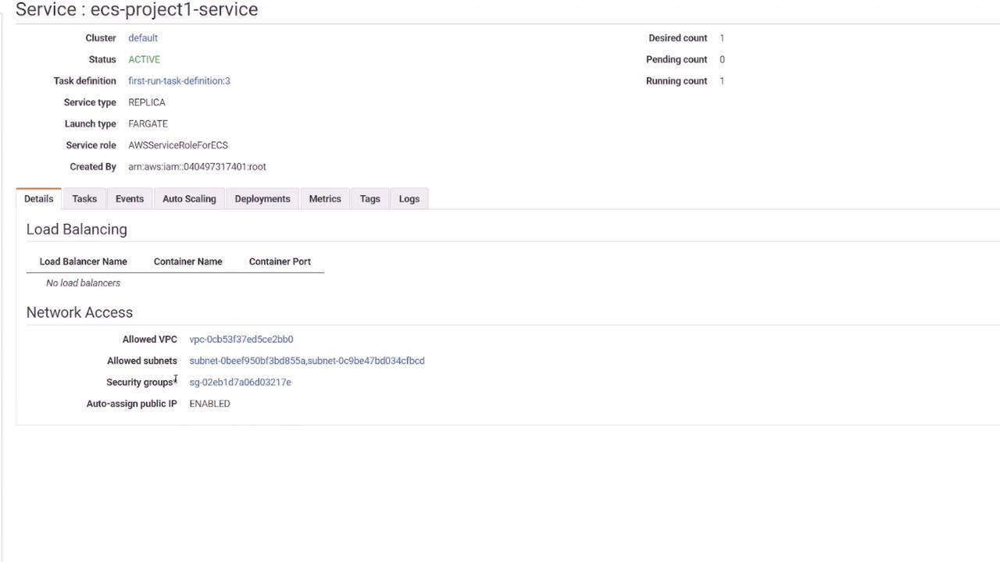

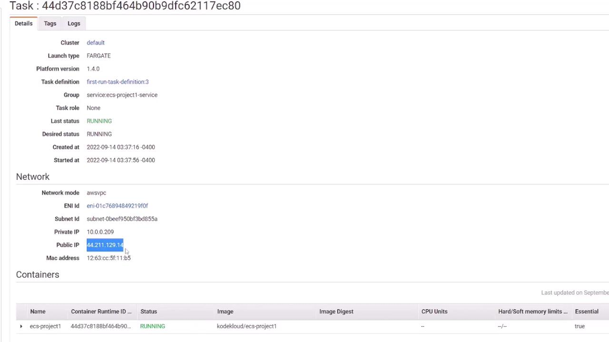

After obtaining the task’s public IP address and accessing it in a browser, you should see the demo HTML page served on port 3000, confirming the application deployment.

### Cleaning Up the Quick Start Environment

After verification, delete the environment created by the quick start wizard in order to redeploy from scratch:

1. In your cluster, select the service and delete it. Confirm with "delete me." Ensure that all tasks are removed.
2. Delete the cluster.

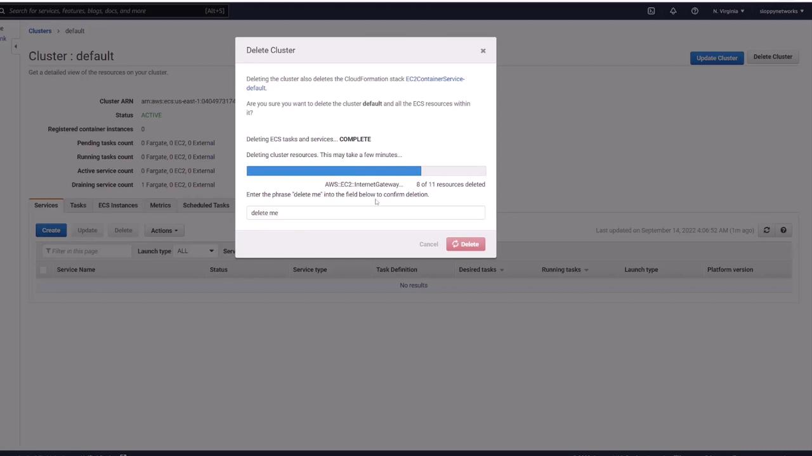

With the ECS environment cleared, you are now ready to deploy the application manually.

## Creating a New ECS Cluster

1. In the ECS Console, click **Create Cluster**.
2. Choose **Networking only** if using Fargate. (For EC2, you can choose between Linux and Windows options.)
3. Name your cluster (for example, "cluster1") and create a new VPC with default CIDR and subnet settings.
4. Click **Create**.

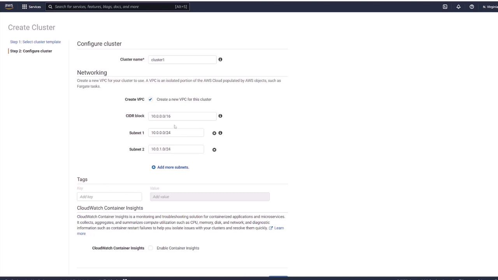

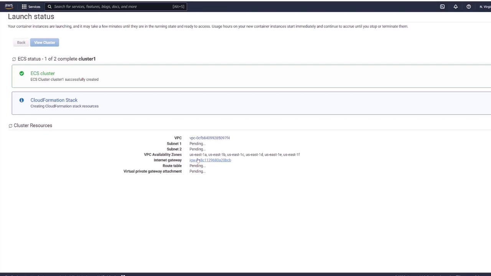

## Creating Task Definitions for Your New Cluster

1. Navigate to **Task Definitions** and click **Create new Task Definition**.
2. Select **Fargate** as the launch type.
3. Name the task definition (e.g., "ECS-Project1") and assign the appropriate task execution role.
4. Choose Linux as the operating system and allocate modest CPU and memory resources for the demo.
5. Add a container:
   * **Container Name:** (e.g., "node app")
   * **Image:** Use "KodeKloud/ECS-Project1"
   * **Port Mapping:** Set to 3000

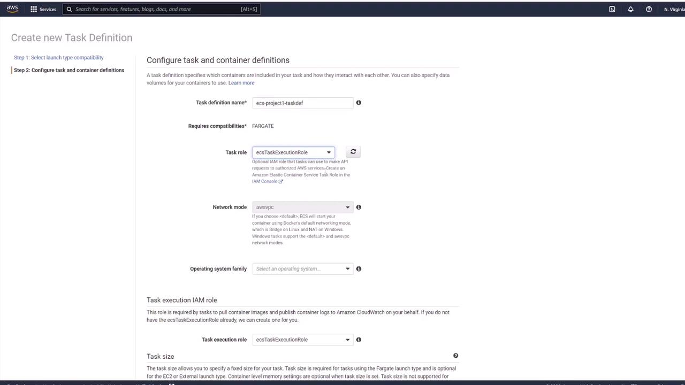

After configuring the task definition, click **Add** and then **Create**.

## Creating the ECS Service

1. In your new cluster ("cluster1"), go to the **Services** tab and click **Create Service**.
2. Configure the following:
   * **Launch Type:** Fargate
   * **Operating System:** Linux
   * **Task Definition:** Select "ECS-Project1" (latest revision)
   * **Service Name:** (e.g., "project1-service")
   * **Number of Tasks:** For demonstration purposes, choose 2 tasks.
3. Set up networking:
   * Select the VPC created earlier.
   * Choose the appropriate subnets.
   * Configure the security group: Change the default setting (typically allowing traffic on port 80) to allow Custom TCP traffic on port 3000 from anywhere.

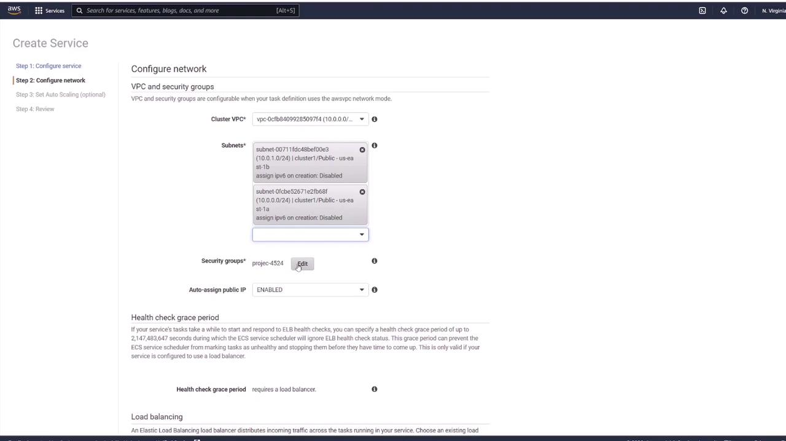

4. Proceed without a load balancer by selecting **No load balancer** (this will be discussed later).
5. Optionally configure auto scaling, then click **Next** to review all configurations.
6. Finally, click **Create Service**.

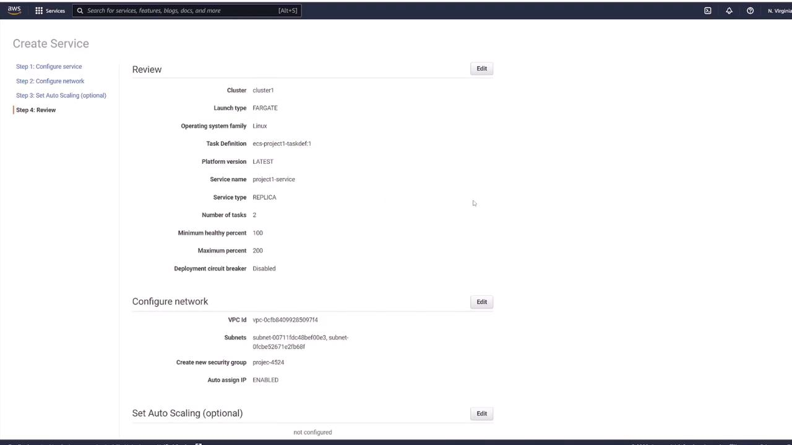

Initially, the console may show no tasks until refreshed; you should then notice two tasks being provisioned. Each task receives its own public IP address which requires tracking if not behind a load balancer. A load balancer is recommended for production environments to provide a consistent endpoint and handle traffic distribution.

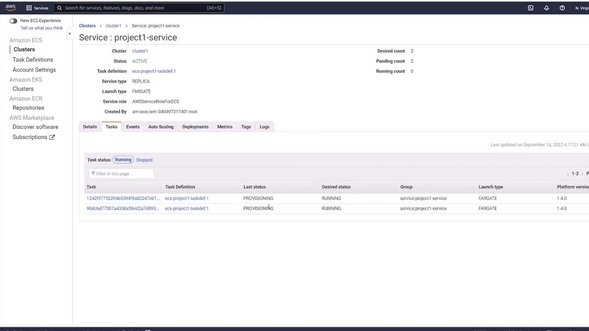

Click on a task to view its details, then copy its public IP address and open it in your browser at port 3000. The expected output is the simple HTML page served by the application. Note that each new deployment generates new public IP addresses, which underscores the importance of using a load balancer in production.

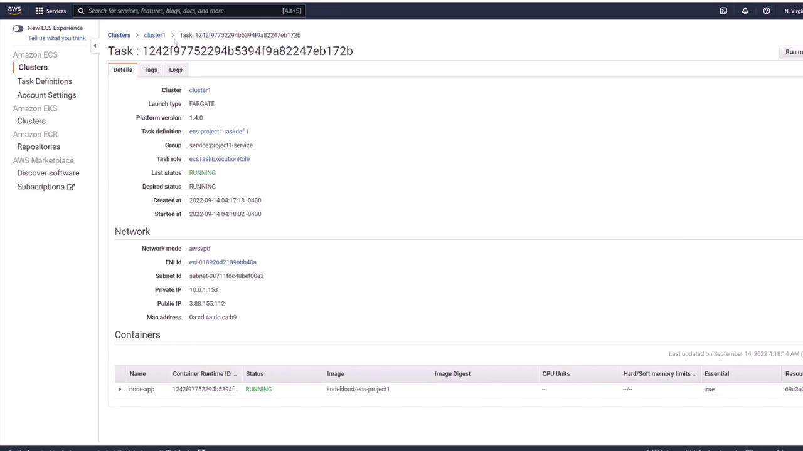

## Updating Your Application

Suppose you modify the HTML file by adding extra exclamation marks to the H1 tag. The updated HTML might look like this:

```html theme={null}
<!DOCTYPE html>
<html lang="en">
<head>
  <meta charset="UTF-8" />
  <meta http-equiv="X-UA-Compatible" content="IE=edge" />
  <meta name="viewport" content="width=device-width, initial-scale=1.0" />
  <link rel="stylesheet" href="css/style.css" />
  <title>Document</title>
</head>
<body>
  <h1>ECS Project 1!!!!</h1>
</body>
</html>
```

To build and push the changed Docker image, use the following commands:

```bash theme={null}
docker build -t KodeKloud/ECS-project1 .
```

```bash theme={null}
docker push KodeKloud/ECS-project1
```

Even after pushing the updated image, the running ECS service continues to use the old image until you force a new deployment. To do this, go to the ECS Console, select your service in the cluster, click **Update**, and then choose **Force new deployment**. This instructs ECS to pull the latest image and deploy updated tasks.

Alternatively, if you update the task definition, create a new revision (e.g., revision 2) and update the service to use it. ECS will then start tasks with the latest configuration, and once health checks pass, the old tasks are terminated.

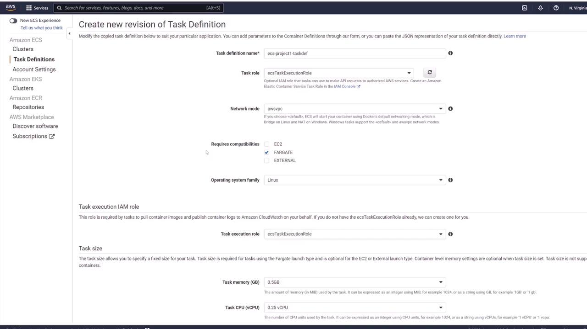

When new tasks are deployed, they will obtain new public IP addresses. While this confirms the update, it also illustrates why a load balancer is essential—it provides a stable endpoint and manages traffic distribution automatically.

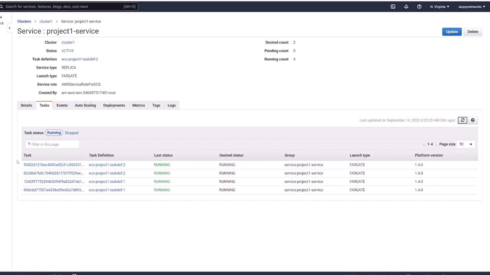

Refresh the ECS console to verify that only the desired number of tasks (in this example, two) are running, and that the deployment process has gracefully terminated the old tasks.

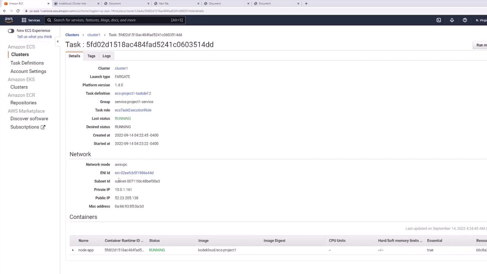

## Final Notes

This demonstration has shown how to deploy and update a basic application on ECS using both the quick start wizard and manual configuration. Although each ECS task gets a unique IP address, a load balancer is recommended for production to provide a single, stable endpoint and to manage IP changes seamlessly.

After completing the demo, remember to delete the entire service before moving to more complex environments that involve databases, volumes, and load balancing.

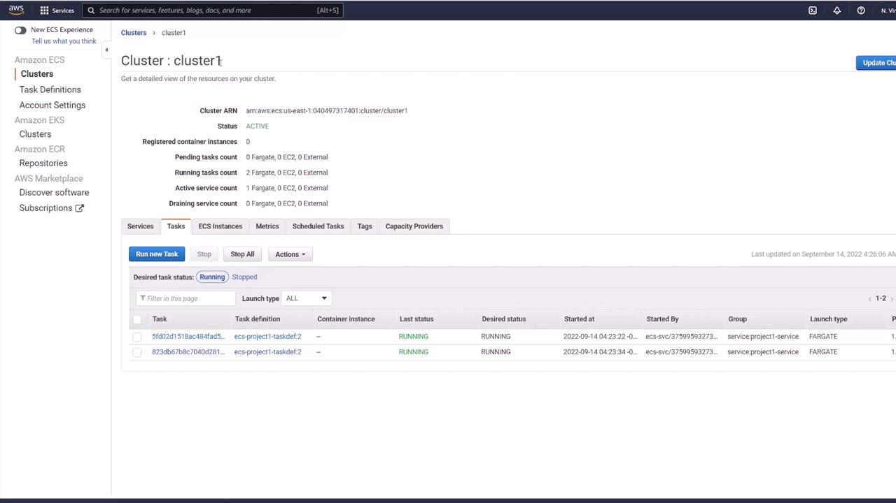

Delete the service and confirm that all tasks are removed. The cluster will remain, allowing you to deploy your next application.

> **lightbulb** This guide detailed the process of setting up, deploying, updating, and cleaning up an ECS-based application. For production-grade deployments, always consider integrating a load balancer to manage traffic effectively.

- [Watch Video](https://learn.kodekloud.com/user/courses/aws-certified-developer-associate/module/c28ddfac-bdff-4566-b056-f6c6391a0d11/lesson/3140dd13-31c2-4c5a-8e18-9a962e7866c7)


# ECS Demo Part 2

Source: https://notes.kodekloud.com/docs/AWS-Certified-Developer-Associate/Containers-on-AWS/ECS-Demo-Part-2/page

This guide explains setting up a multi-container application on Amazon ECS using an Express API and MongoDB.

In this guide, we will walk through setting up a multi-container application on Amazon ECS. The application consists of two containers: an Express API container built with Node.js and a MongoDB container. The following Docker Compose file demonstrates the basic architecture:

```yaml theme={null}
version: "3"
services:
  api:
    build: .
    image: kodekloud/ecs-project2
    environment:
      - MONGO_USER=mongo
      - MONGO_PASSWORD=password
      - MONGO_IP=mongo
      - MONGO_PORT=27017
    ports:
      - "3000:3000"
  mongo:
    image: mongo
    environment:
      - MONGO_INITDB_ROOT_USERNAME=mongo
      - MONGO_INITDB_ROOT_PASSWORD=password
    volumes:
      - db:/data/db
volumes:
  db:
```

The API container hosts a simple CRUD application for managing notes. It connects to MongoDB using environment variables defined in both containers. For example, the API constructs a connection URL similar to:

```javascript theme={null}
const mongoURL = `mongodb://${process.env.MONGO_USER}:${process.env.MONGO_PASSWORD}@${process.env.MONGO_IP}:${process.env.MONGO_PORT}/?authSource=admin`;
```

Key RESTful endpoints include the following:

1. **Retrieve All Notes**\
   A GET request to `/notes`:

   ```javascript theme={null}
   app.get("/notes", async (req, res) => {
     try {
       const notes = await Note.find();
       res.status(200).json({ notes });
     } catch (e) {
       console.log(e);
       res.status(400).json({});
     }
   });
   ```

2. **Retrieve a Specific Note**\
   A GET request to `/notes/:id`:

   ```javascript theme={null}
   app.get("/notes/:id", async (req, res) => {
     try {
       const note = await Note.findById(req.params.id);
       if (!note) {
         return res.status(404).json({ message: "Note not found" });
       }
       res.status(200).json({ note });
     } catch (e) {
       console.log(e);
       res.status(400).json({ status: "fail" });
     }
   });
   ```

3. **Create a New Note**\
   A POST request to `/notes`:

   ```javascript theme={null}
   app.post("/notes", async (req, res) => {
     console.log(req.body);
     try {
       const note = await Note.create(req.body);
       return res.status(201).json({ note });
     } catch (e) {
       console.log(e);
       return res.status(400).json({ status: "fail" });
     }
   });
   ```

4. **Update an Existing Note**\
   A PATCH request to `/notes/:id`:

   ```javascript theme={null}
   app.patch("/notes/:id", async (req, res) => {
     try {
       const note = await Note.findByIdAndUpdate(req.params.id, req.body, {
         new: true,
         runValidators: true,
       });
       if (!note) {
         return res.status(404).json({ message: "Note not found" });
       }
       res.status(200).json({ note });
     } catch (e) {
       console.log(e);
       res.status(400).json({ status: "fail" });
     }
   });
   ```

5. **Delete a Note**\
   A DELETE request to `/notes/:id`:

   ```javascript theme={null}
   app.delete("/notes/:id", async (req, res) => {
     try {
       const note = await Note.findByIdAndDelete(req.params.id);
       if (!note) {
         return res.status(404).json({ message: "Note not found" });
       }
       res.status(200).json({ status: "success" });
     } catch (e) {
       console.log(e);
       res.status(400).json({ status: "fail" });
     }
   });
   ```

The application leverages the Mongoose library to manage MongoDB connections. A simplified example of the setup is shown below:

```javascript theme={null}
const express = require("express");
const mongoose = require("mongoose");
const cors = require("cors");
const Note = require("./models/noteModel");

const app = express();
app.use(cors({}));
app.use(express.json());

const mongoURL = `mongodb://${process.env.MONGO_USER}:${process.env.MONGO_PASSWORD}@${process.env.MONGO_IP}:${process.env.MONGO_PORT}/?authSource=admin`;

// Alternative for local development:
// const mongoURL = 'mongodb://localhost:27017/?authSource=admin';

app.get("/notes", async (req, res) => {
  try {
    const notes = await Note.find();
    res.status(200).json({ notes });
  } catch (error) {
    res.status(500).json({ message: error.message });
  }
});
```

***

Before deploying the containerized app on ECS, several AWS components must be configured.

## Creating a Security Group

Begin by creating a security group for your ECS application. In the EC2 console, navigate to "Security Groups" and create a new group named "ECS SG" with a description like "ECS security group." For testing purposes, add a rule to allow all traffic from any IP (note that this is not recommended for production). Ensure that the security group is associated with the correct VPC.

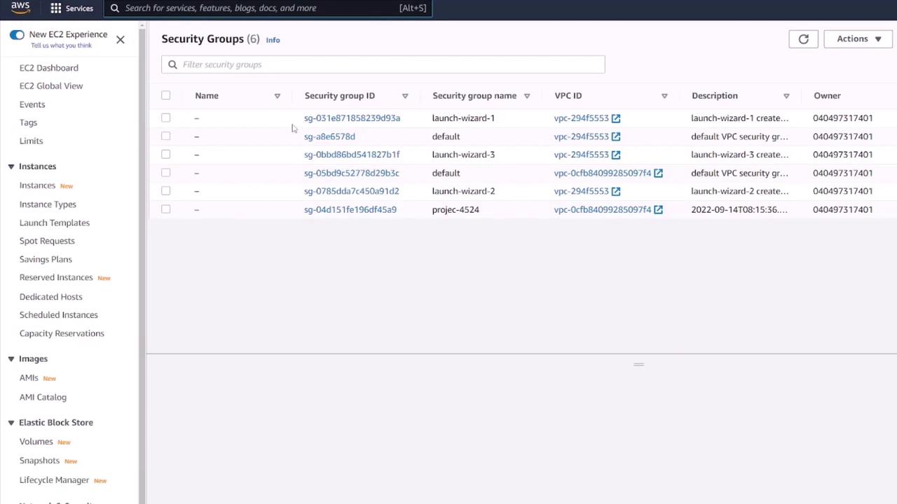

After configuring the security group, proceed to create your ECS task definition.

***

## Creating an ECS Task Definition

In the ECS console under "Task Definitions," create a new Fargate task definition (for example, "ECS-project-one"). Configure the following settings:

* **Task Role:** Use the ECS task execution role.
* **Memory:** Choose minimal memory options for testing.
* **Containers:** Add both containers to the task definition.

### Configuring the MongoDB Container

For the MongoDB container, use the following configuration:

* **Name:** Mongo
* **Image:** Use the default Mongo image from Docker Hub.
* **Port Mapping:** Map port 27017.
* **Environment Variables:** Set up the MongoDB root username and password (e.g., mongo/password).
* **Volume:** Mount a persistent volume.

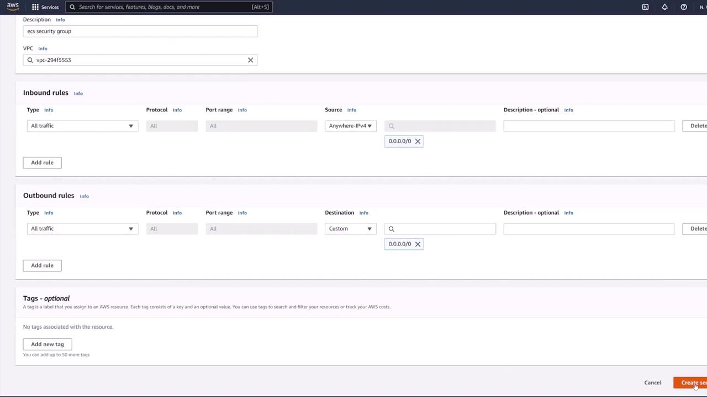

Add the following environment variables to mirror the Docker Compose file:

```yaml theme={null}
environment:
  - MONGO_USER=mongo
  - MONGO_PASSWORD=password
  - MONGO_IP=mongo
  - MONGO_PORT=27017
```

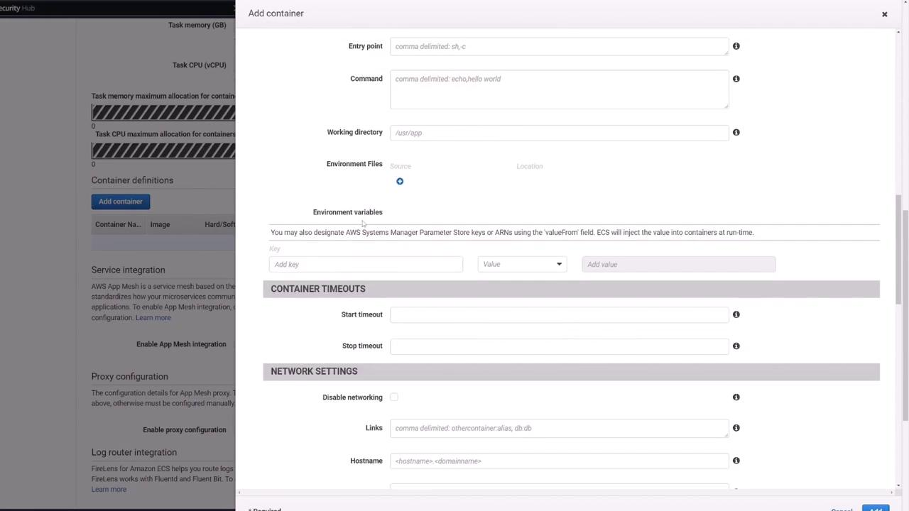

### Configuring the Express API Container

For the API container:

* **Name:** Web API (or similar)
* **Image:** Use your pre-built image from Docker Hub (e.g., kodekloud/ecs-project2).
* **Port Mapping:** Map container port 3000.
* **Environment Variables:** Supply the four variables required for MongoDB connectivity.

Because ECS does not offer DNS-based inter-container resolution like Docker Compose, the API must use localhost to reach the Mongo container within the same task. With Mongo listening on port 27017, ensure your connection string matches that configuration.

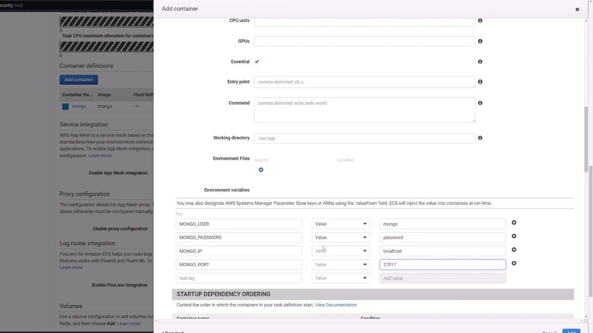

### Defining Volumes

Next, add a volume (e.g., "Mongo-DB") using AWS Elastic File System (EFS) to persist MongoDB data. In the ECS task definition, navigate to the "Volumes" section and create a new volume. You must first create an EFS from the AWS console.

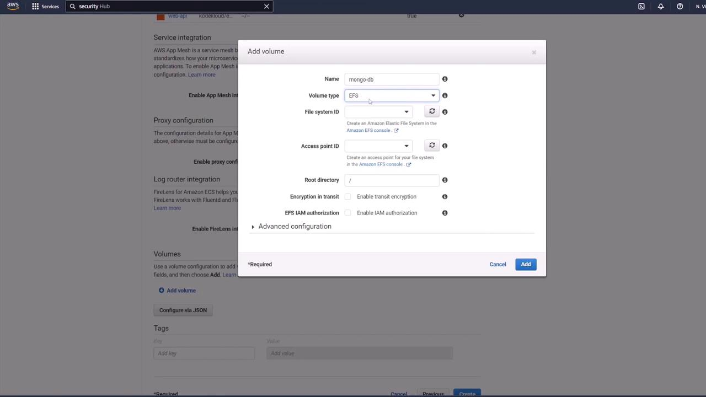

Follow these steps for setting up EFS:

1. Create a new file system in the EFS console. Provide a name (e.g., MongoDB) and ensure it is within the same VPC as your ECS cluster.
2. Customize mount targets by choosing appropriate subnets and update the default security group to one that allows NFS (typically port 2049). For enhanced security, create a dedicated security group for EFS that permits inbound NFS traffic only from the ECS security group.

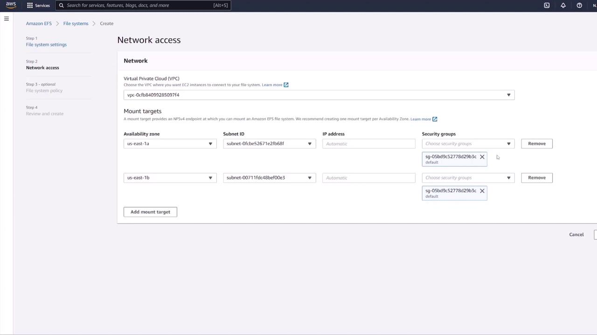

Once your EFS is created and secured, update the Mongo container’s storage settings:

* Under "Mount Points," set the source to the created volume (e.g., MongoDB) and mount it to `/data/db` as required by MongoDB.

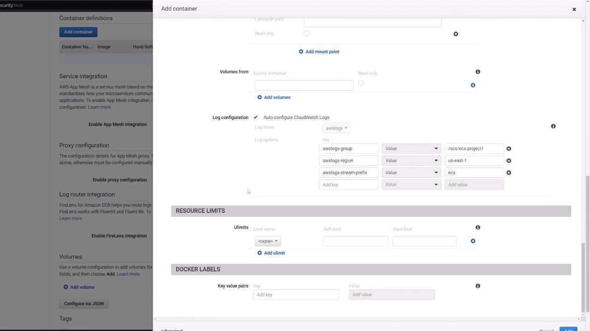

After configuring the volumes, create or update the task definition and verify that both containers (API and Mongo) display the correct settings.

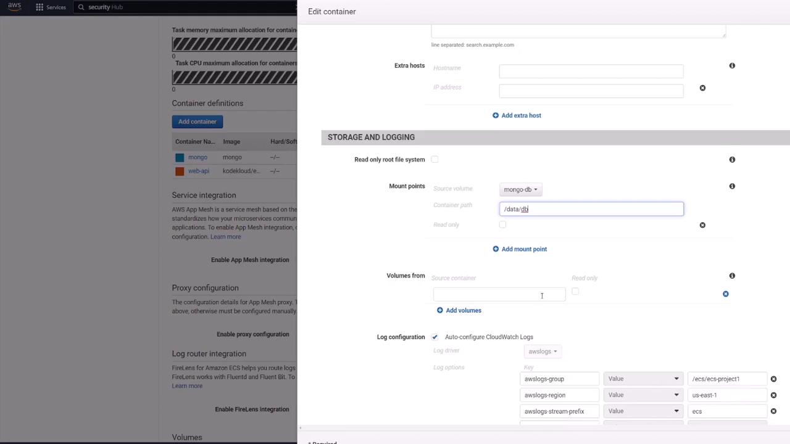

***

## Creating the ECS Service and Load Balancer

After finalizing your task definition, create an ECS service with the following steps:

1. Navigate to your ECS Cluster (e.g., Cluster One) and create a new Fargate service.
2. Select the newly created task definition (e.g., ECS-project-two) and specify a service name (e.g., "notes app service"). Set the desired number of tasks (typically one for testing).
3. Ensure you select the proper VPC and subnets, and attach the previously created "ECS SG" security group.

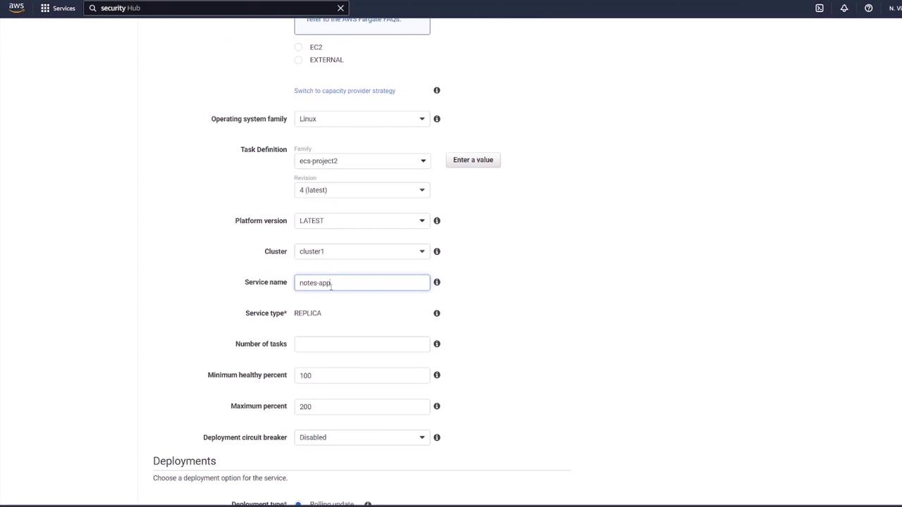

### Configuring the Application Load Balancer

To distribute traffic and provide a static endpoint for the application:

1. Choose an Application Load Balancer and open its configuration in a new tab.
2. Provide a name (e.g., "notes lb"), set it as internet-facing, and select the IPv4 address type. Ensure that it is associated with the same VPC.
3. Create a dedicated security group for the load balancer (e.g., "lb-SG"). Although opening port 3000 might be an initial thought, it is preferable to have the load balancer listen on the default HTTP port (80) and forward traffic to the container’s port (3000). Configure the rule to allow HTTP traffic from any source.


4. Next, create a target group (e.g., "notes-targetgroup1"). For ECS tasks, select the target type as IP. Configure the health check settings—by default, the health check is set to `/`, but since application endpoints reside under `/notes`, update the health check path to `/notes` (or set up a dedicated health check endpoint).

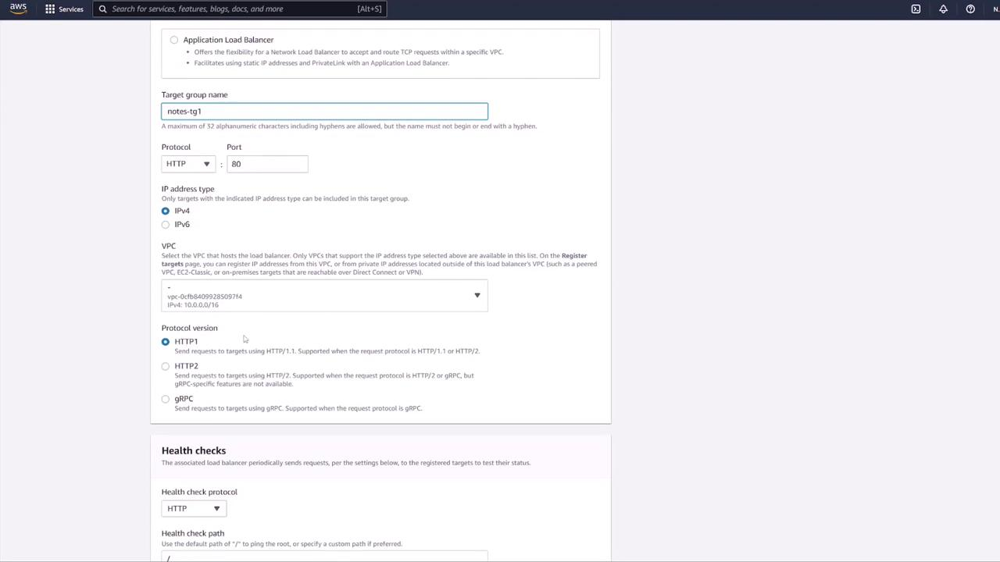

5. In the ECS service configuration, link the load balancer by selecting the Application Load Balancer and mapping it to the API container (listening on port 3000). The load balancer will listen on port 80 and forward traffic to the target group.

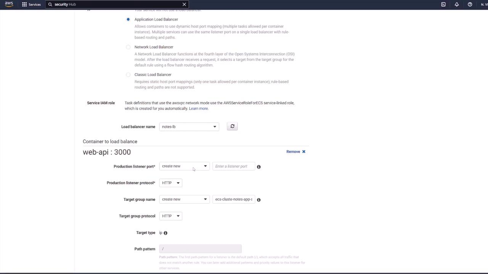

Review all settings and create the service. Initially, the ECS console will show tasks in a provisioning state until they run.

***

## Verifying the Deployment

Once the tasks are running, test the setup by either accessing the container’s public IP or, preferably, using the load balancer’s DNS name. For example, sending a GET request to:

http\://\<load-balancer-dns>/notes

should return the list of notes. Tools like Postman can be used to verify the RESTful API endpoints.

A sample POST request body to create a new note:

```json theme={null}
{
  "title": "second note",
  "body": "remember to do dishes!!!!"
}
```

A successful GET request may return a response similar to:

```json theme={null}
{
  "notes": [
    {
      "_id": "6321a3c034fd55dce212834",
      "title": "second note",
      "body": "remember to do dishes!!!!",
      "__v": 0
    }
  ]
}
```

Once the deployment is verified, update your ECS security group ("ECS SG") to restrict inbound traffic. Instead of allowing all traffic, configure a custom TCP rule for port 3000 that permits traffic only from the load balancer’s security group. This ensures that only load-balanced traffic reaches the API container.

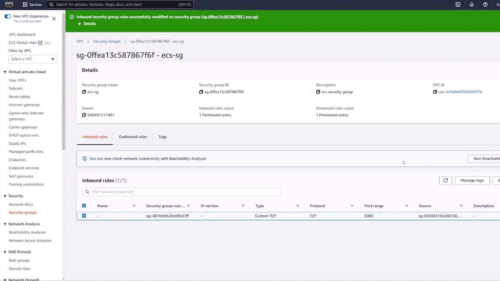

> **lightbulb** After confirming that your application is functioning as expected, consider tightening your security group rules and reviewing best practices for production deployments.

***

This article demonstrated how to deploy a multi-container application on ECS using Docker Compose as a reference. We covered the configuration of ECS task definitions, setting up persistent storage with EFS, and configuring an Application Load Balancer to securely distribute traffic among containers.

For additional resources and detailed AWS documentation, please refer to:

* [AWS ECS Documentation](https://docs.aws.amazon.com/ecs/)
* [Docker Hub](https://hub.docker.com/)
* [Amazon EFS Documentation](https://docs.aws.amazon.com/efs/)

Happy deploying!

- [Watch Video](https://learn.kodekloud.com/user/courses/aws-certified-developer-associate/module/c28ddfac-bdff-4566-b056-f6c6391a0d11/lesson/019d9960-feaf-4517-acd1-6f280498618f)
