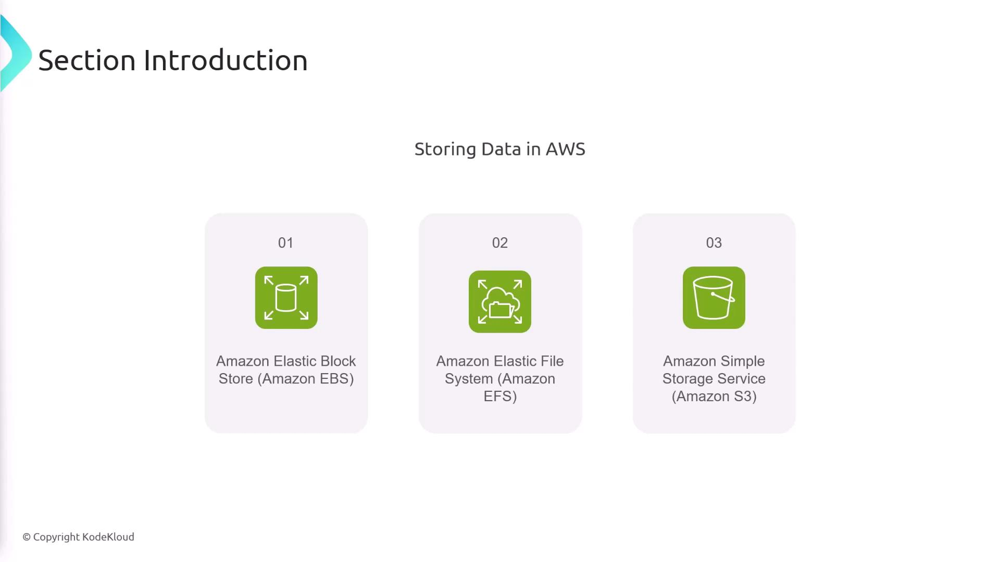

# Section Introduction

Source: https://notes.kodekloud.com/docs/AWS-Certified-Developer-Associate/Storage/Section-Introduction/page

This lesson explores efficient data storage using AWS services like EBS, EFS, and S3, highlighting their features and use cases.

In this lesson, we explore how to efficiently store data using a variety of AWS services. We will take an in-depth look at Amazon Elastic Block Store (EBS), Amazon Elastic File System (EFS), and Amazon Simple Storage Service (S3). Each of these services comes with unique features and benefits designed to meet different storage requirements. As you progress through this lesson, you'll learn how these services operate and when to use each one based on your specific use case.

<Frame>
  
</Frame>

Transcribed by [https://otter.ai](https://otter.ai)

<CardGroup>
  <Card title="Watch Video" icon="video" href="https://learn.kodekloud.com/user/courses/aws-certified-developer-associate/module/e8ae2293-e16b-42d3-b32b-5c260a1f1e5d/lesson/f06ff0c3-8a57-4c54-a292-cb23aacb21c2" />
</CardGroup>
