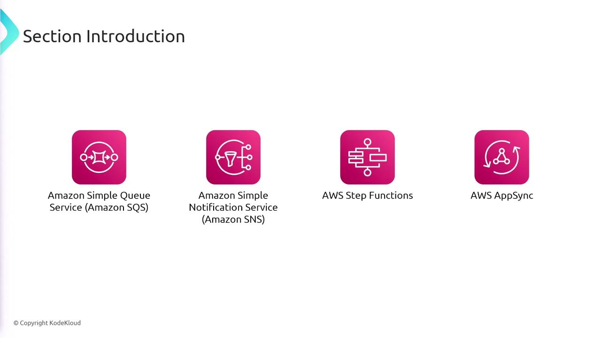

# Section Introduction

Source: https://notes.kodekloud.com/docs/AWS-Certified-Developer-Associate/Application-Integrations/Section-Introduction/page

This article explores application integration on AWS, highlighting services that facilitate communication between decoupled components in various application architectures.

In this section, we explore the concept of application integration on AWS—a suite of services designed to facilitate communication between decoupled components in microservices, distributed systems, and serverless applications. These services help ensure seamless, reliable interactions across your application architecture.

> **lightbulb** This lesson focuses on the following AWS services:

  * Amazon SQS (Simple Queue Service)
  * Amazon SNS (Simple Notification Service)
  * AWS Step Functions
  * AWS AppSync

Each of these services plays a critical role in ensuring effective, scalable communication within your AWS-powered applications.

- [Watch Video](https://learn.kodekloud.com/user/courses/aws-certified-developer-associate/module/60c267ab-da8b-4408-97f4-b53aad3f4479/lesson/208cabf7-1e86-4495-a196-14feeeebbf0a)
