# CodePipeline Demo

Source: https://notes.kodekloud.com/docs/AWS-Certified-Developer-Associate/AWS-CICD-Developer-Tools/CodePipeline-Demo/page

This guide explains setting up a CodePipeline to automatically deploy an application to AWS Elastic Beanstalk from a CodeCommit repository.

This guide explains how to set up your first pipeline in [CodePipeline](https://learn.kodekloud.com/user/courses/aws-codepipeline-ci-cd-pipeline), which automatically deploys an application to AWS Elastic Beanstalk when changes are pushed to a CodeCommit repository.

Below you will find detailed steps, technical diagrams, and code snippets to help you through the process.

***

## Deploying Your Application to Elastic Beanstalk

Begin by downloading a simple demo application (e.g., the nodejs.zip file) from the AWS Elastic Beanstalk documentation page under tutorials and samples.

Follow these steps once you have the demo application:

1. **Create an Application**\
   Log in to the AWS Elastic Beanstalk console and create a new application, naming it **web app**.

2. **Create Environments**\
   Set up two environments: one for development and one for production.

   * **Development Environment**\
     Click on "Create environment" and select the web server environment type. Name this environment `webapp-dev`. Upload your application code by selecting the nodejs.zip file, then choose Node.js as the platform. For cost efficiency, configure the environment with a single instance.

<Frame>
  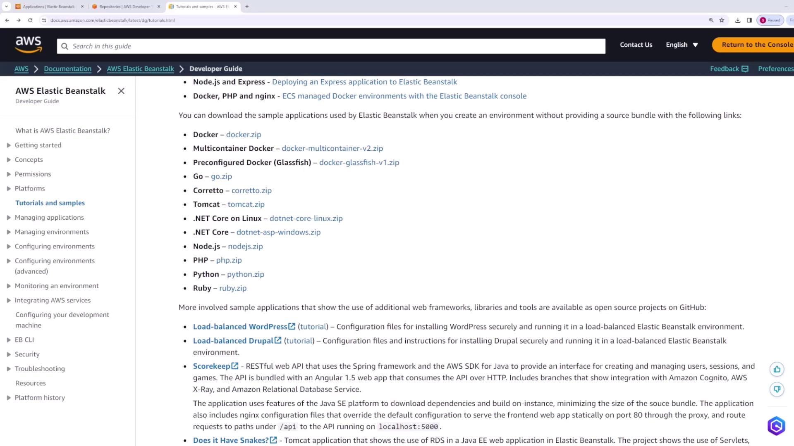
</Frame>

<Frame>
  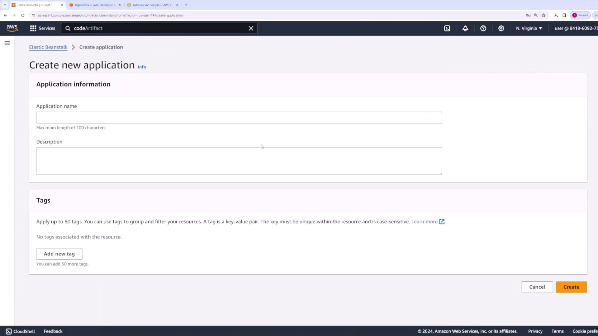
</Frame>

<Frame>
  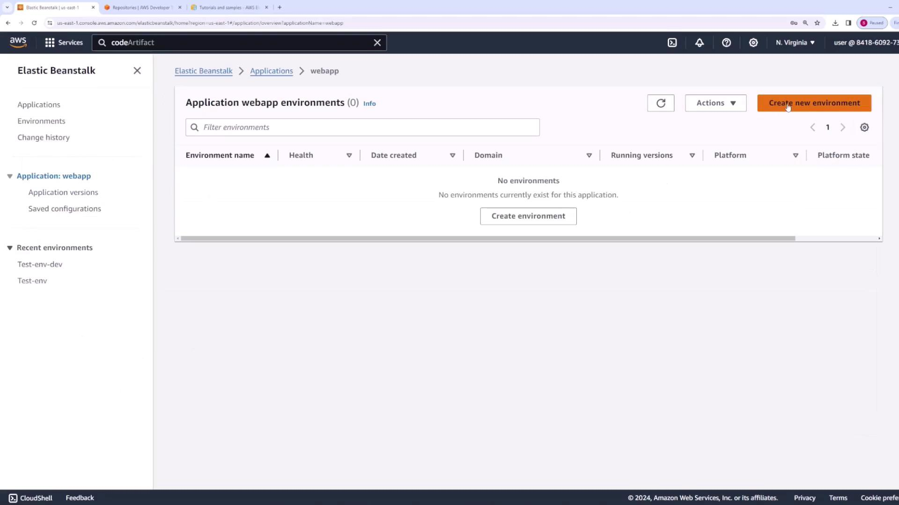
</Frame>

<Frame>
  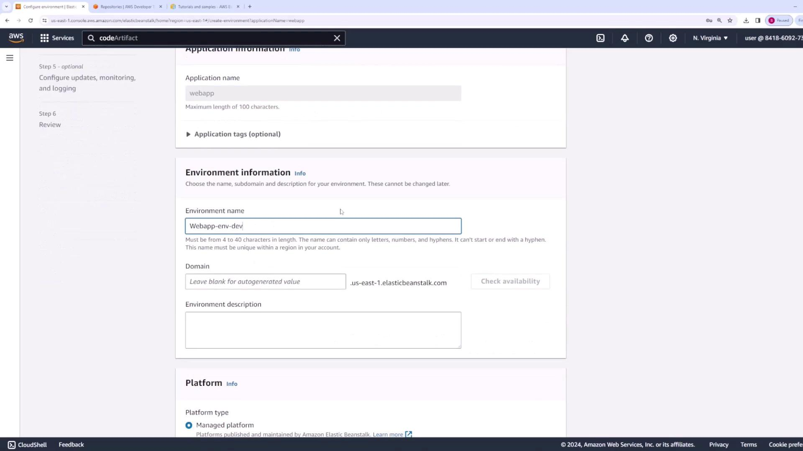
</Frame>

* **Production Environment**\
  Create another environment called `webapp-env-prod`. Choose Node.js as the platform and specify the existing application version (v1) instead of uploading a new file. Ensure the correct EC2 role and key pair are selected.

<Frame>
  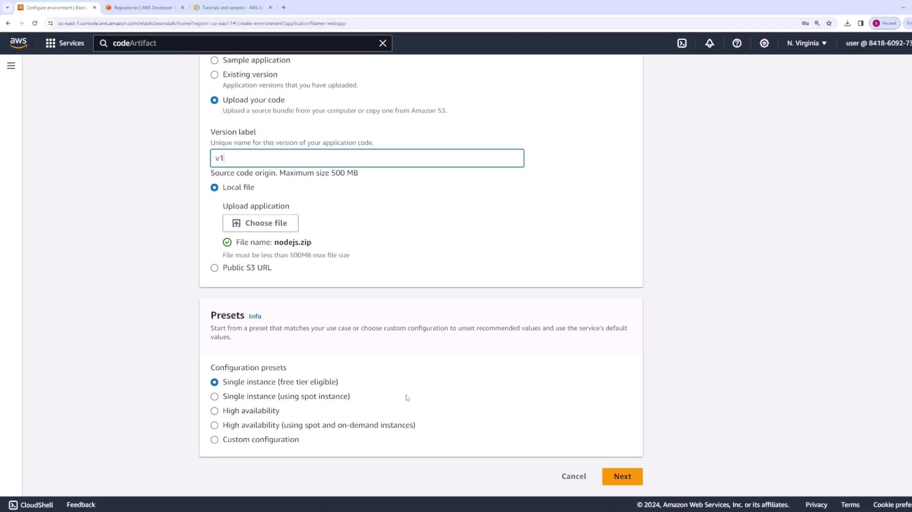
</Frame>

<Frame>
  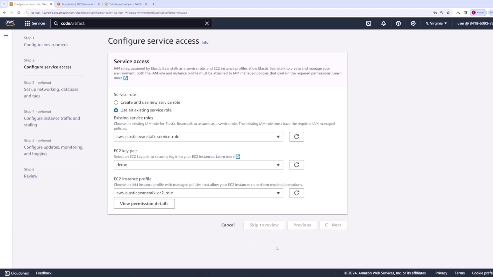
</Frame>

<Frame>
  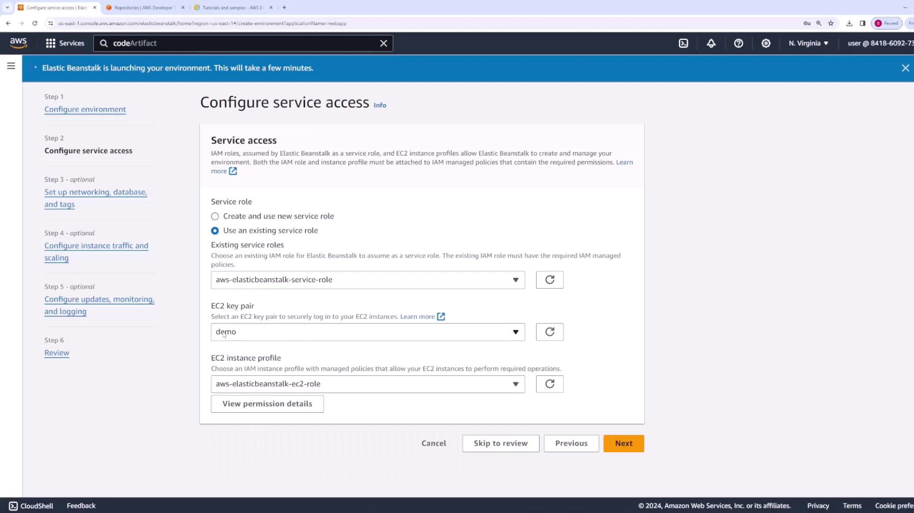
</Frame>

3. **Verify Deployment**\
   After a few minutes, confirm that both environments are successfully deployed by checking the URLs provided in the Elastic Beanstalk dashboards.

   * **Production Environment Dashboard**

<Frame>
  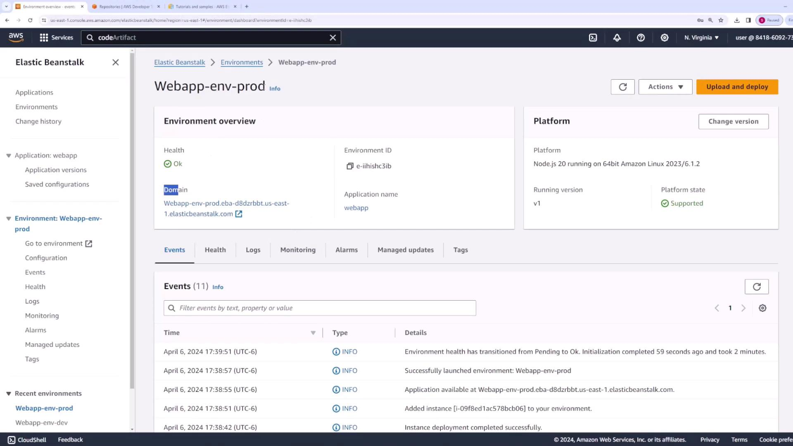
</Frame>

* **Development Environment Dashboard**

<Frame>
  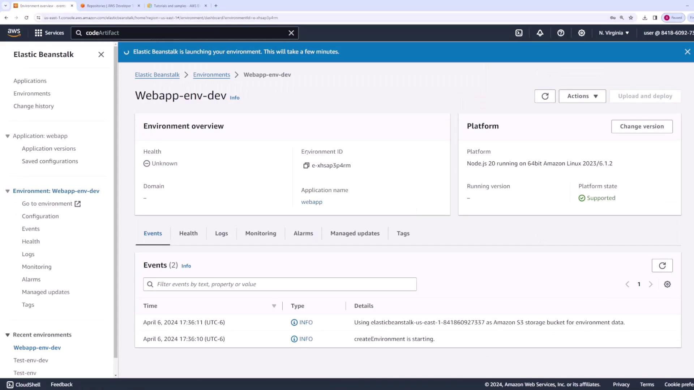
</Frame>

***

## Setting Up the CodeCommit Repository

Next, set up a CodeCommit repository to store your application code, which will be tied into [CodePipeline](https://learn.kodekloud.com/user/courses/aws-codepipeline-ci-cd-pipeline).

1. **Create the Repository**\
   Navigate to the CodeCommit service and create a repository named **webapp**.

2. **Push the Code**\
   Initialize your local Git repository, add your source files, commit your changes, and push to the remote repository. Replace the remote URL as needed.

<Callout icon="lightbulb">
  You might see warnings about line endings (LF vs. CRLF); these warnings can be safely ignored.
</Callout>

```bash theme={null}
echo "# webapp2" >> README.md
git init
git add README.md
git commit -m "first commit"
git branch -M main
git remote add origin https://github.com/Sanjeev-Thiyagarajan/webapp2.git
git push -u origin main
```

Refresh the CodeCommit page after pushing to verify that all files are present.

***

## Configuring [CodePipeline](https://learn.kodekloud.com/user/courses/aws-codepipeline-ci-cd-pipeline)

Now that your application and repository are set up, configure [CodePipeline](https://learn.kodekloud.com/user/courses/aws-codepipeline-ci-cd-pipeline) to automate your deployment process.

1. **Create a New Pipeline**\
   Open the CodePipeline service page and create a new pipeline named **web app pipeline**. Select the latest pipeline version to take advantage of advanced execution features, including supersede and queued modes.

   * **Service Role & Artifact Store**\
     Create a new service role for the pipeline and use the default S3 artifact store settings unless you need custom configurations.

<Frame>
  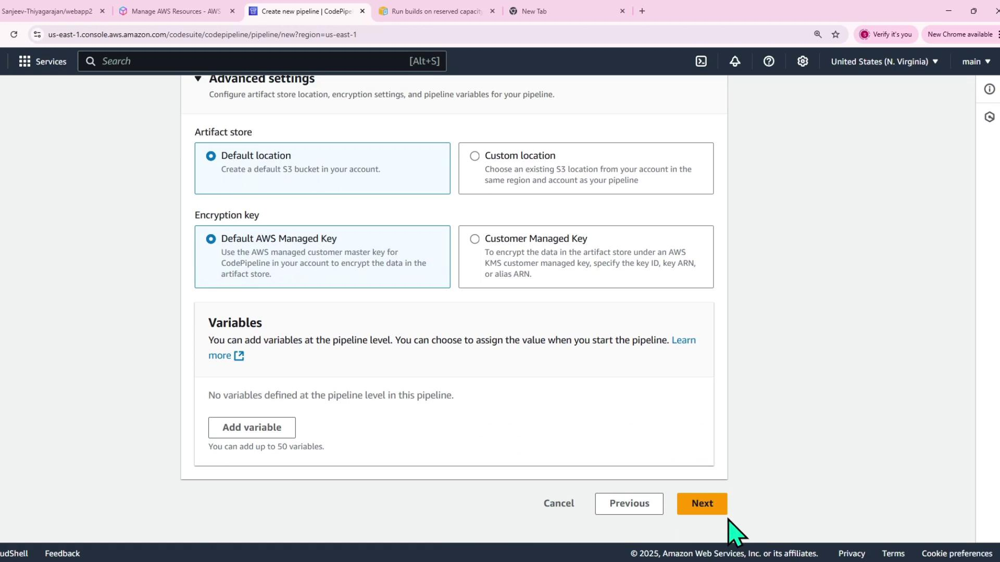
</Frame>

2. **Configure the Source Stage**\
   Select CodeCommit as the source provider, choose the **webapp** repository, and select the `main` branch. For change detection, use CloudWatch events or periodic checks as recommended.

<Frame>
  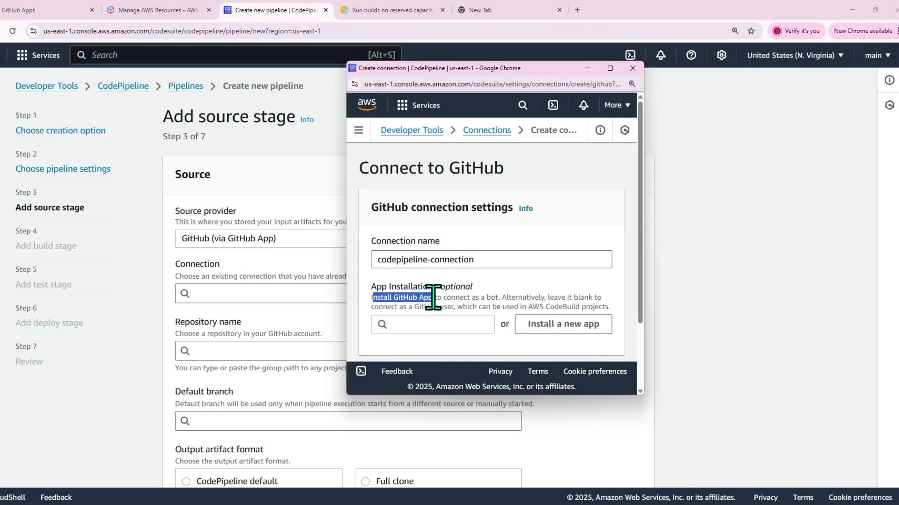
</Frame>

3. **Skip the Build Stage**\
   Since this demo focuses on deploying to Elastic Beanstalk using CodeDeploy, skip the build stage. (Future demos may include integration with CodeBuild or [Jenkins](https://learn.kodekloud.com/user/courses/jenkins).)

<Frame>
  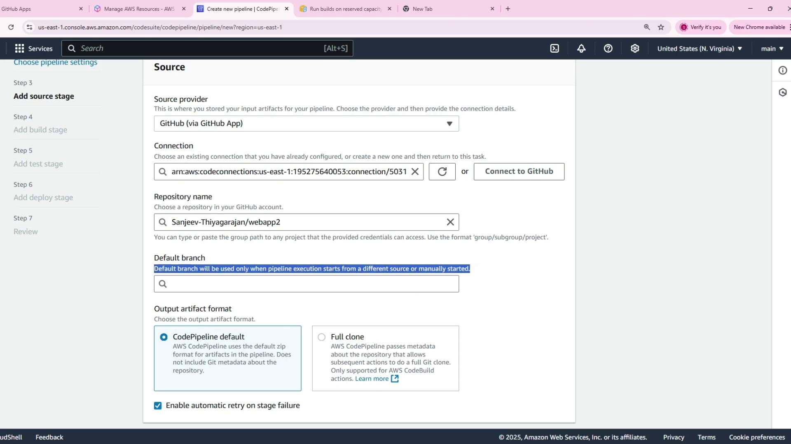
</Frame>

4. **Configure the Deploy Stage**\
   Set up the deployment action to deploy your application to Elastic Beanstalk:
   * Choose Elastic Beanstalk as the deployment provider.
   * Select the application **web app** and the development environment `webapp-dev`.

<Frame>
  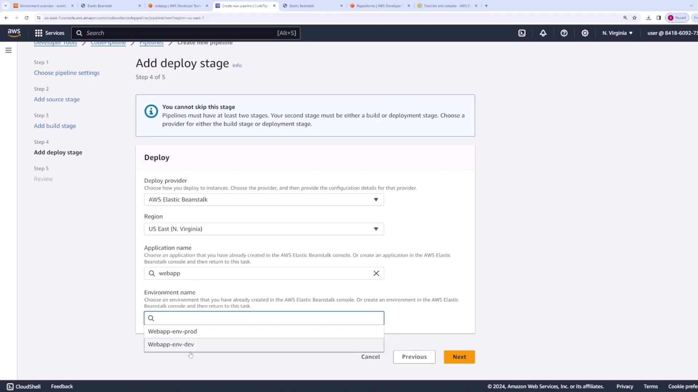
</Frame>

5. **Review and Create the Pipeline**\
   Review your configuration settings and create the pipeline. It will automatically:
   * Pull code from CodeCommit in the source stage.
   * Deploy the code to Elastic Beanstalk in the deploy stage.

<Frame>
  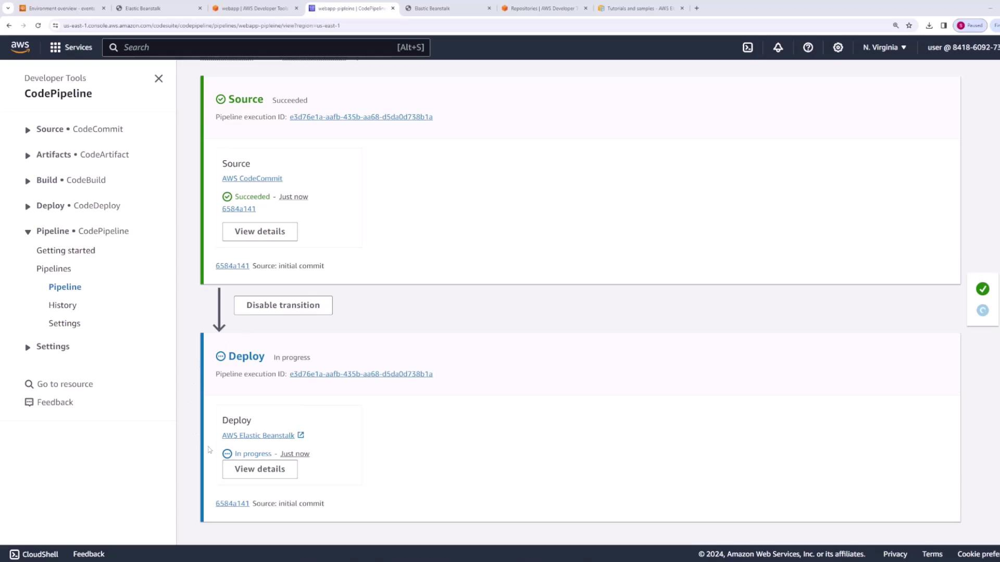
</Frame>

6. **Examine Pipeline Details**\
   In the CodePipeline interface, you can view:

   * Source commit IDs
   * Input and output artifacts
   * Deployment details

   Your S3 artifact store contains the zipped artifacts.

<Frame>
  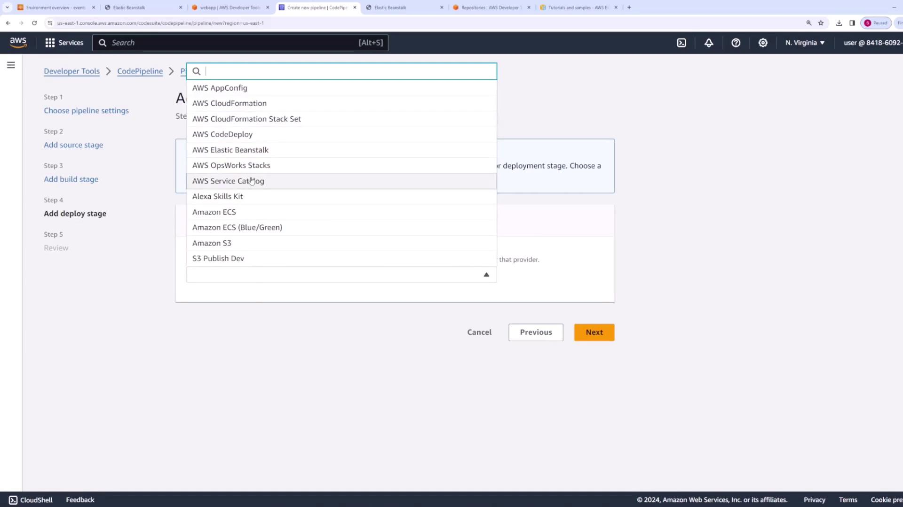
</Frame>

<Frame>
  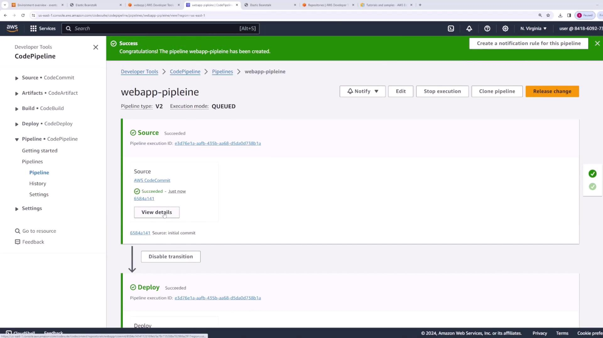
</Frame>

***

## Triggering Pipeline Executions with Code Changes

Demonstrate how pipeline automation works by modifying your application code in CodeCommit and reviewing the updated deployment process.

1. **Make a Code Change**\
   Edit the `index.html` file in CodeCommit (for example, change the text from “congratulations” to “this is version two”) and commit your changes.

<Frame>
  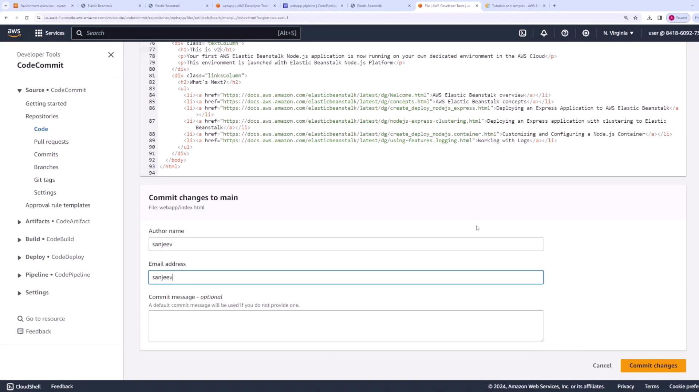
</Frame>

2. **Observe the Pipeline Execution**\
   After committing, open the CodePipeline console to see the new execution:
   * The source stage will detect the new commit.
   * The deploy stage will update the development environment with the modified application.

<Frame>
  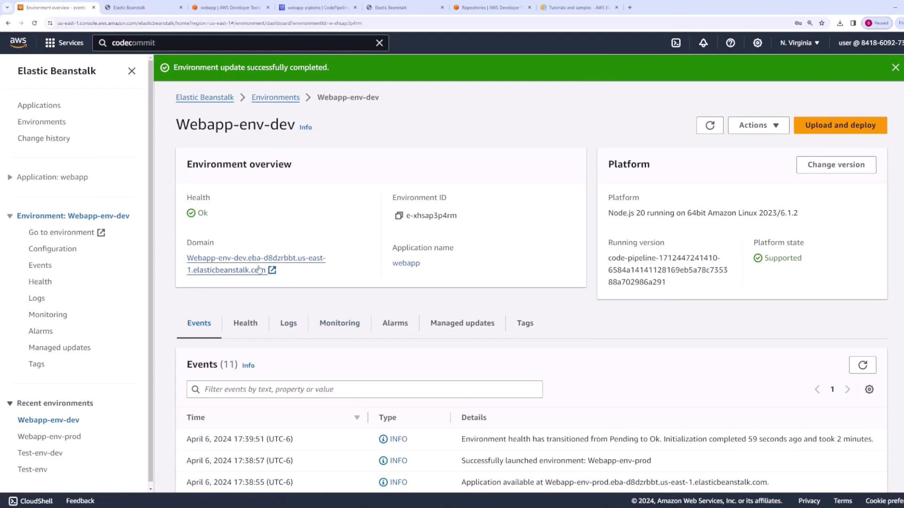
</Frame>

<Frame>
  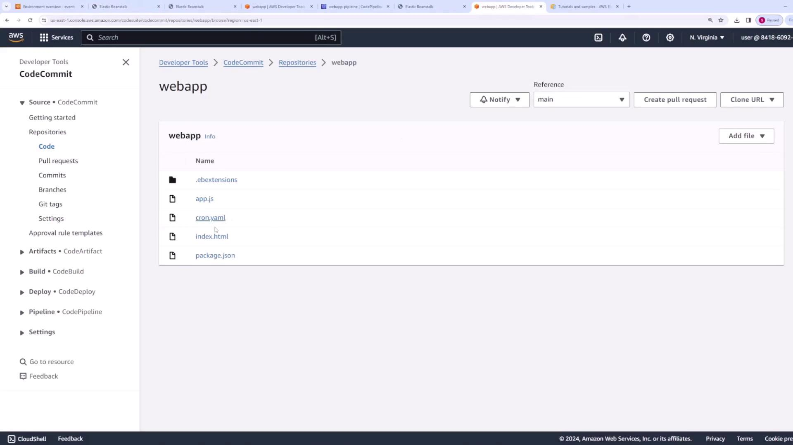
</Frame>

<Frame>
  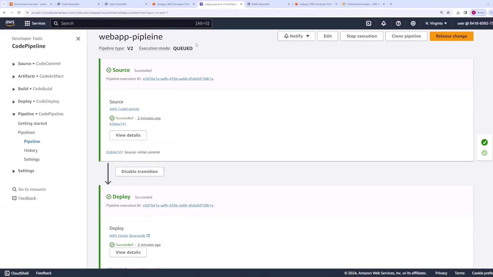
</Frame>

3. **Verify the Change on Elastic Beanstalk**\
   Refresh the development environment URL to ensure that the application now displays version two.

***

## Enhancing the Pipeline with a Production Deployment Stage

Improve your deployment process by adding a production stage that includes a manual approval step for enhanced security.

1. **Modify the Pipeline**\
   In the CodePipeline console, add a new stage called `deploy prod`.

2. **Add a Manual Approval Action**\
   Within the `deploy prod` stage, insert an action group for manual approval. For example, label this action **leadership approval**. This step requires team lead or management approval before proceeding with production deployment.

<Frame>
  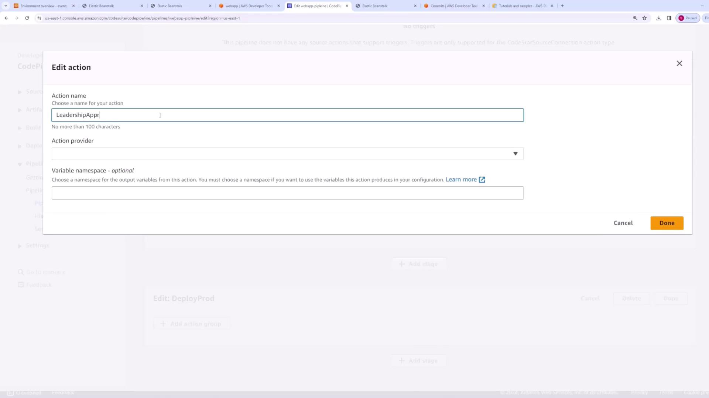
</Frame>

3. **Deploy to Production**\
   Following the manual approval, add an action to deploy the code to the production environment using Elastic Beanstalk. Configure the action with:
   * Input artifact: the same artifact from the previous stage.
   * Environment: production (`prod`).

4. **Test the Pipeline Flow**\
   To test, modify the `index.html` file in CodeCommit (for example, update the text to “this is version three”) and commit the changes. The pipeline will then:

   * Update the development environment automatically.
   * Pause at the production stage for manual approval.

   Once approved, the pipeline will deploy the updated code to the production environment.

<Frame>
  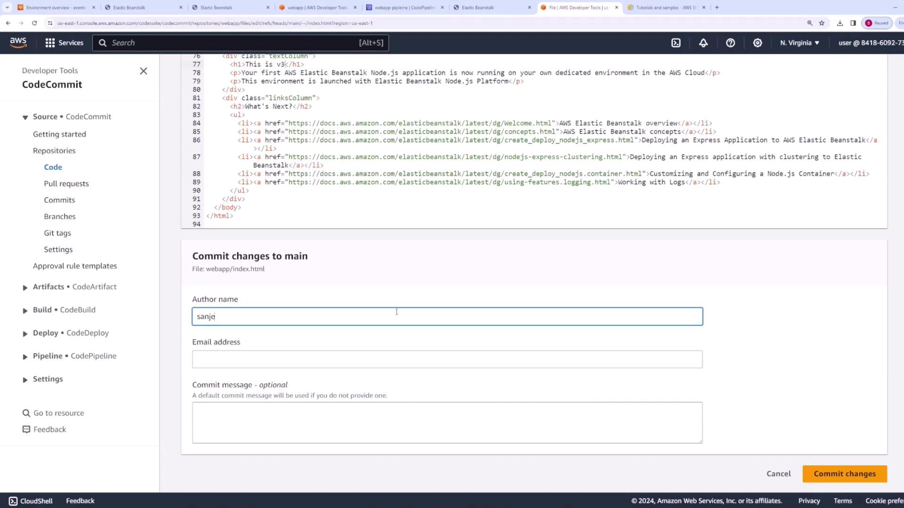
</Frame>

<Frame>
  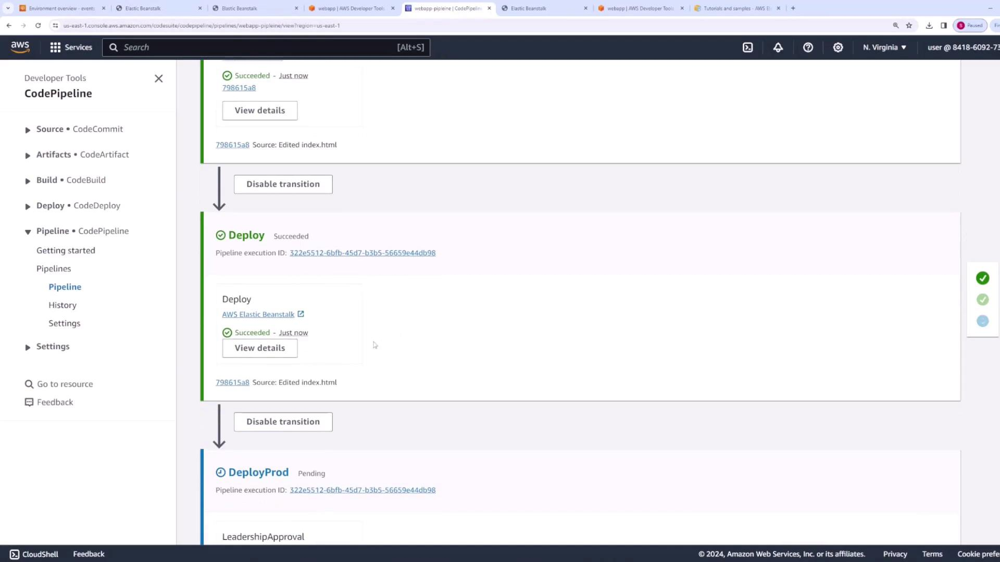
</Frame>

5. **Final Verification**\
   After manual approval and deployment, verify in Elastic Beanstalk that the production environment is running version three of the application.

<Frame>
  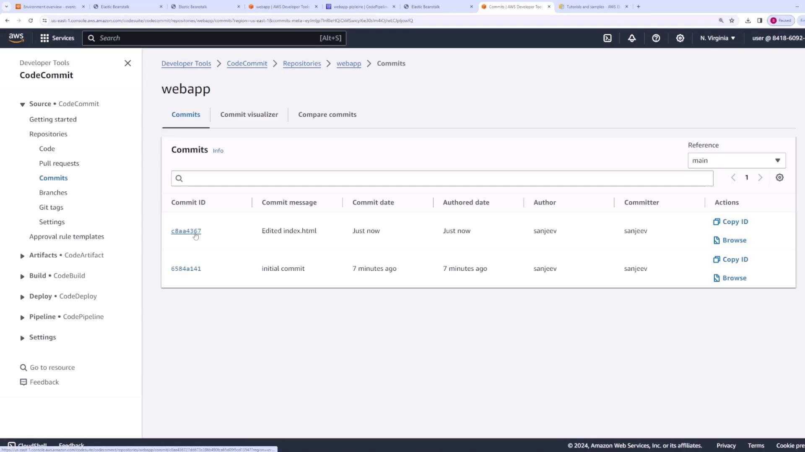
</Frame>

You can inspect the deployed HTML code:

```html theme={null}
<!DOCTYPE html>
<html>
  <head>
    <title>Elastic Beanstalk</title>
    <style>
      body {
        color: #ffffff;
        font-family: Arial, sans-serif;
        font-size: 14px;
        -moz-transition-property: text-shadow;
        -moz-transition-duration: 4s;
        -webkit-transition-property: text-shadow;
        -webkit-transition-duration: 4s;
        text-shadow: none;
      }
      body.blurry {
        text-shadow: #fff 0px 0px 25px;
      }
      .linkColumn, .linksColumn {
        padding: 2em;
      }
      .textColumn {
        position: absolute;
      }
    </style>
  </head>
</html>
```

Once the production deployment is confirmed, the pipeline execution is complete.

***

## Conclusion

This tutorial demonstrated how to configure a [CodePipeline](https://learn.kodekloud.com/user/courses/aws-codepipeline-ci-cd-pipeline) that triggers on changes in a CodeCommit repository and automatically deploys your application to AWS Elastic Beanstalk. With the added manual approval for production, you gain enhanced control over your deployments while automating routine tasks.

Happy deploying!

<CardGroup>
  <Card title="Watch Video" icon="video" href="https://learn.kodekloud.com/user/courses/aws-certified-developer-associate/module/184641b0-93ba-48d1-a9d7-1bc2b57db724/lesson/1c91fe0a-895b-4a5d-b710-711eaacbcd8f" />

  <Card title="Practice Lab" icon="installation" href="https://learn.kodekloud.com/user/courses/aws-certified-developer-associate/module/184641b0-93ba-48d1-a9d7-1bc2b57db724/lesson/4361cc34-f8ad-4ee3-9600-104271e58021" />
</CardGroup>
