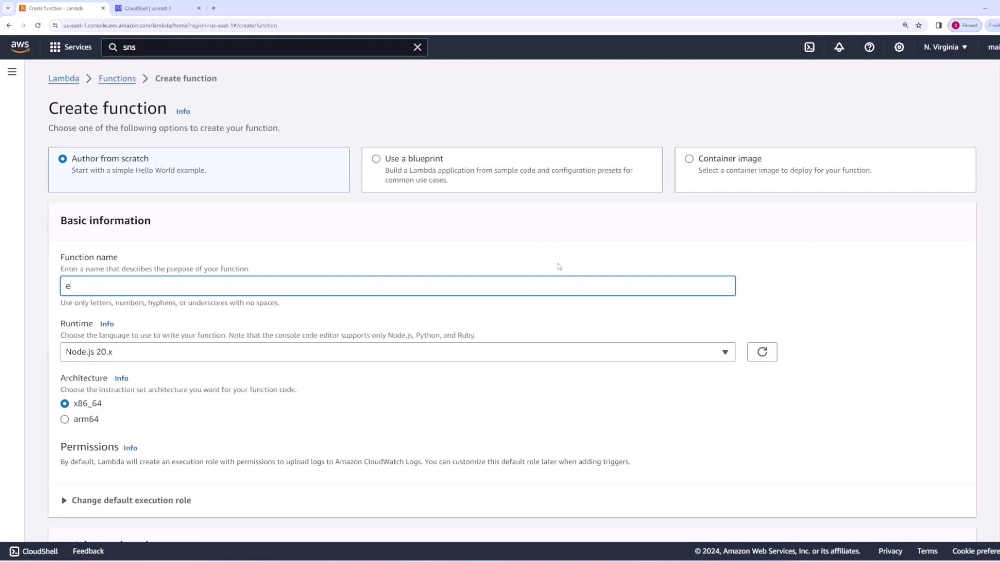
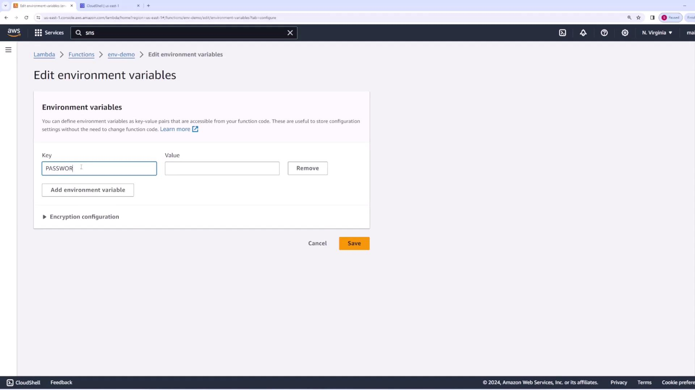

# Environment Variables Demo

Source: https://notes.kodekloud.com/docs/AWS-Certified-Developer-Associate/Serverless/Environment-Variables-Demo/page

This article demonstrates how to configure and access environment variables in an AWS Lambda function.

In this article, we demonstrate how to configure environment variables for an [AWS Lambda](https://learn.kodekloud.com/user/courses/aws-lambda) function. Environment variables are typically used to store configuration details—such as database credentials—that may vary between environments.

## Creating the AWS Lambda Function

Begin by creating a new [AWS Lambda](https://learn.kodekloud.com/user/courses/aws-lambda) function named "env demo". During the setup process, you will configure essential settings including the function name, runtime, and permissions.

<Frame>
  
</Frame>

## Accessing Environment Variables in Code

Within your Node.js [AWS Lambda](https://learn.kodekloud.com/user/courses/aws-lambda) function, you can access environment variables using `process.env`. In the example below, the code retrieves an environment variable named `PASSWORD` and returns its value as part of the response.

```javascript theme={null}
export const handler = async (event) => {
    const password = process.env.PASSWORD;
    const response = {
        statusCode: 200,
        body: JSON.stringify("Password is: " + password),
    };
    return response;
};
```

When the function is first invoked without the environment variable set, the output will confirm that the variable is `undefined`:

```json theme={null}
{
  "statusCode": 200,
  "body": "\"Password is:undefined\""
}
```

## Configuring Environment Variables

To configure the environment variable, follow these steps in the [AWS Lambda](https://learn.kodekloud.com/user/courses/aws-lambda) console:

1. Navigate to the "Environment variables" tab.
2. Click the Edit button.
3. Add a new environment variable with the key `PASSWORD` and the value `password123`.

<Frame>
  
</Frame>

After saving and deploying the changes, invoke the function again. The updated configuration will now provide the set password as part of the function's output.

The revised invocation returns:

```json theme={null}
{
  "statusCode": 200,
  "body": "\"Password is: password123\""
}
```

<Callout icon="lightbulb">
  Make sure to update and deploy your function after changing environment variables to ensure the new configuration is applied.
</Callout>

## Sample Function Logs

Below are sample logs generated from a successful function invocation, confirming that the environment variable is being correctly utilized:

```plaintext theme={null}
Function Logs
START RequestId: c305e2f7-f5c5-423a-a6c6-d862563c454f Version: $LATEST
END RequestId: c305e2f7-f5c5-423a-a6c6-d862563c454f
REPORT RequestId: c305e2f7-f5c5-423a-a6c6-d862563c454f Duration: 12.69 ms Billed Duration: 13 ms Memory Size: 128 MB Max Memory Used: 64 MB Init Duration: 150.02 ms
```

This confirms that your [AWS Lambda](https://learn.kodekloud.com/user/courses/aws-lambda) function is successfully retrieving and utilizing the environment variable.

## Additional Resources

For further details on AWS Lambda and environment variable configuration, refer to the following resources:

* [AWS Lambda Documentation](https://docs.aws.amazon.com/lambda/)
* [AWS Environment Variables Guide](https://docs.aws.amazon.com/lambda/latest/dg/configuration-envvars.html)

<CardGroup>
  <Card title="Watch Video" icon="video" href="https://learn.kodekloud.com/user/courses/aws-certified-developer-associate/module/3c842ffc-5841-456d-9fad-7bb3af5fdbfc/lesson/dea0235e-efa5-4b23-96a6-89d032a1b554" />
</CardGroup>
