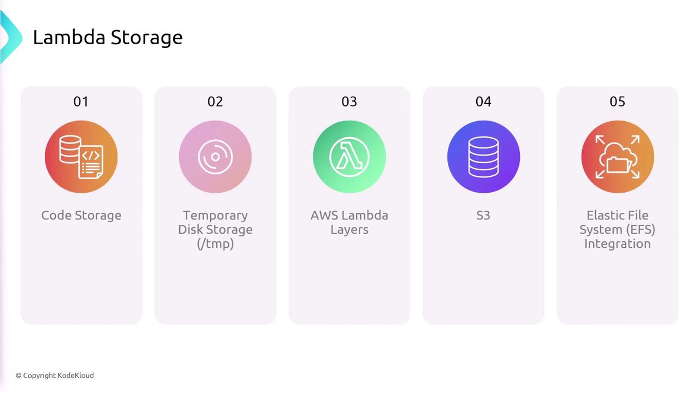
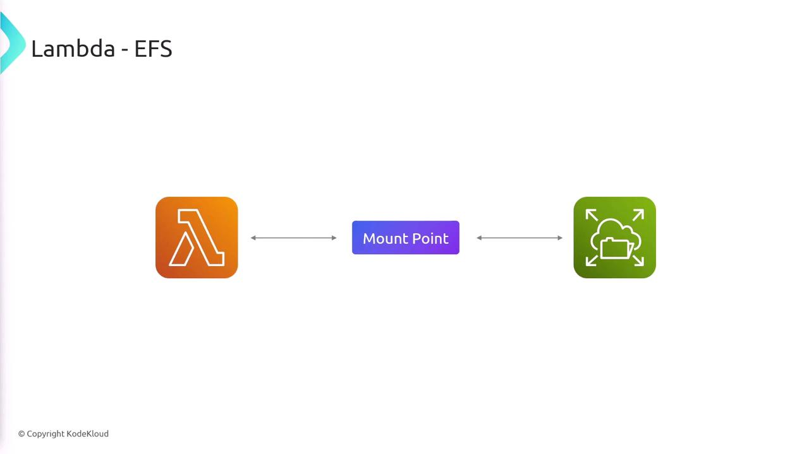
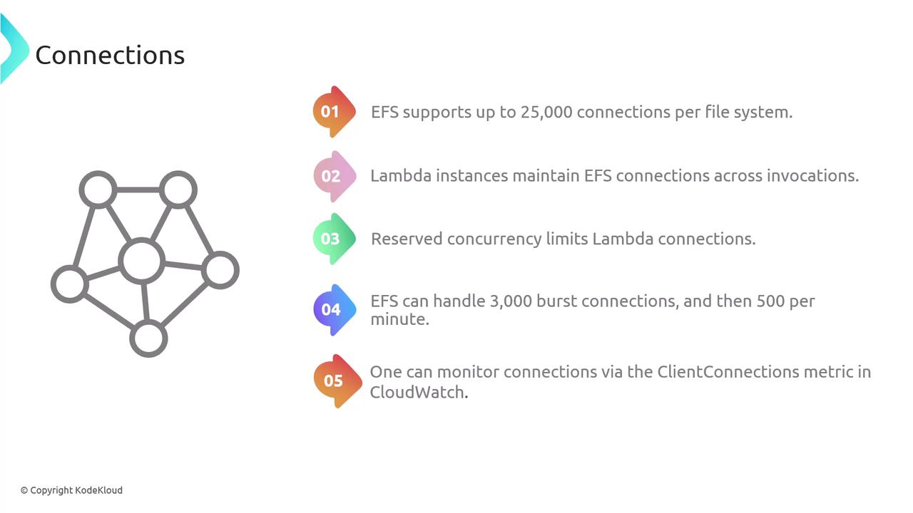
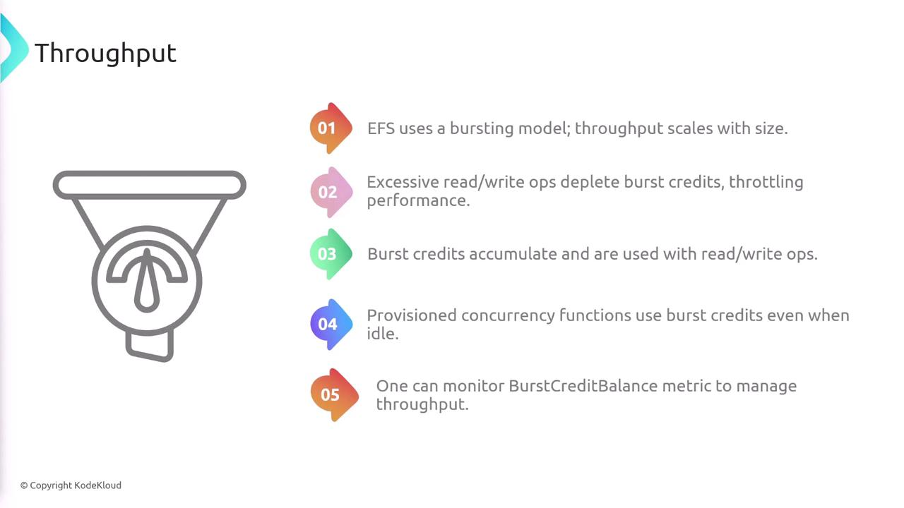
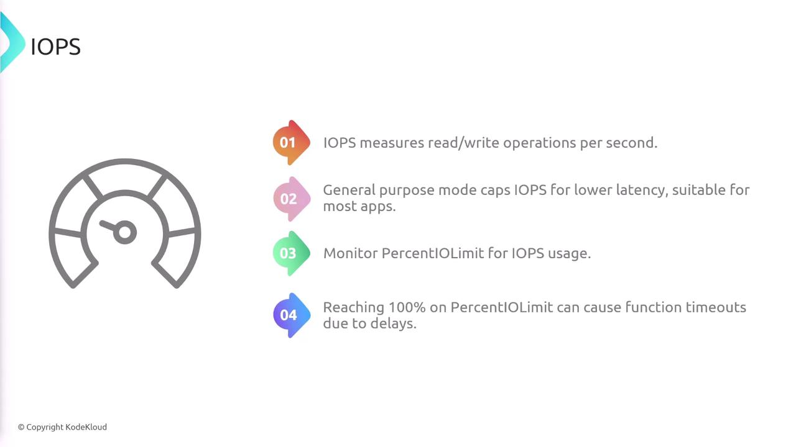
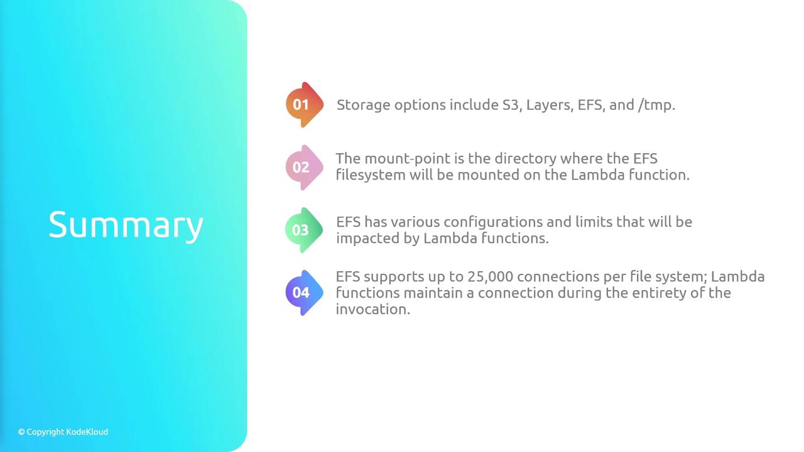

# Lambda Storage

Source: https://notes.kodekloud.com/docs/AWS-Certified-Developer-Associate/Serverless/Lambda-Storage/page

This lesson explores various storage options for AWS Lambda functions, including Code Storage, Temporary Disk Storage, Lambda Layers, Amazon S3, and Amazon EFS.

In this lesson, we explore the various storage options available for AWS Lambda functions. These options determine where your function code resides and where your function can read and write data during execution. The primary storage types include Code Storage, Temporary Disk Storage (/tmp), Lambda Layers, Amazon S3, and Amazon Elastic File System (EFS).

## Code Storage

When you upload your Lambda function code, it is stored in an Amazon S3 bucket and encrypted at rest. Although this storage option is not used during function execution for read/write operations, it serves as the permanent location for your function’s code.

## Temporary Disk Storage (/tmp)

Each Lambda function execution environment includes a non-persistent `/tmp` directory. This temporary storage space is ideal for quick computations or transient data needs. Keep in mind that any data stored in `/tmp` is lost when the execution context is terminated, so it should only be used for data that does not need to persist beyond the current invocation.

## Lambda Layers

Lambda Layers enable you to share code and resources across multiple Lambda functions. They are commonly used to distribute libraries, custom runtimes, and other dependencies, thereby ensuring consistency and easier maintenance of your functions.

## Amazon S3

Amazon S3 is a robust storage option for files and data that your Lambda functions need to access. With S3, you can easily retrieve, insert, or update data stored in buckets. This storage option remains consistent whether accessed from within or outside a Lambda function.

## Amazon Elastic File System (EFS)

For scenarios requiring persistent, shared storage across multiple invocations, Amazon EFS is the recommended option. EFS requires you to specify a mount point within your Lambda function’s file system. Once mounted, your function can read from and write to the EFS file system just like a local directory while the data remains persistent.

<Frame>
  
</Frame>

### Special Considerations for EFS

When using EFS with Lambda, there are several performance-related factors to consider.

#### Connections

* **Connection Limits:**\
  EFS supports up to 25,000 connections per file system. Since Lambda instances maintain an active connection to EFS during the entire invocation, ensure your function’s reserved concurrency stays within this limit. EFS also handles up to 3,000 burst connections, with an additional rate of 500 connections per minute.

* **Monitoring:**\
  It is important to monitor the client connections metric in CloudWatch to avoid hitting connection limits.

<Callout icon="lightbulb">
  If your Lambda functions use provisioned concurrency, be aware that each instance maintains an active connection to EFS throughout its invocation, impacting the overall number of available connections.
</Callout>

<Frame>
  
</Frame>

<Frame>
  
</Frame>

#### Throughput

* **Bursting Model:**\
  EFS uses a bursting model where throughput scales with the file system size. Excessive read/write operations can deplete burst credits and throttle performance.

* **Provisioned Concurrency Impact:**\
  Even when idle, provisioned concurrency functions can consume burst credits.

* **Monitoring Throughput:**\
  Monitoring the BurstCreditBalance metric is essential for managing overall throughput.

<Frame>
  
</Frame>

#### IOPS (Input/Output Operations Per Second)

* **Understanding IOPS:**\
  IOPS measures the number of read/write operations per second. Exceeding IOPS limits can result in function timeouts.

* **Performance Management:**\
  Monitoring the percent IO limit helps ensure that your function operates within optimal performance boundaries.

<Frame>
  
</Frame>

## Storage Options Overview

To summarize, AWS Lambda offers several storage options suited for different use cases:

| Storage Option        | Purpose                                                       | Key Consideration                                                  |
| --------------------- | ------------------------------------------------------------- | ------------------------------------------------------------------ |
| Code Storage          | Permanent storage of your Lambda function code                | Stored in S3 and encrypted at rest                                 |
| Temporary Disk (/tmp) | Temporary storage for transient data                          | Non-persistent; cleared when execution context is terminated       |
| Lambda Layers         | Sharing libraries, runtimes, and dependencies among functions | Promotes code reusability and consistency                          |
| Amazon S3             | Scalable object storage for files and data                    | Accessible both within and outside Lambda functions                |
| Amazon EFS            | Persistent, shared file storage                               | Requires a mount point and has specific performance considerations |

## Summary

AWS Lambda provides flexible storage options to meet the needs of various use cases:

* **Code Storage:** Houses your function code in S3.
* **Temporary Disk (/tmp):** Offers ephemeral storage for processing data during a Lambda invocation.
* **Lambda Layers:** Facilitates sharing of common libraries and dependencies.
* **Amazon S3:** Delivers scalable storage for any data type.
* **Amazon EFS:** Provides persistent, shared storage with necessary performance monitoring (connection limits, throughput, and IOPS).

<Callout icon="triangle-alert">
  When using Amazon EFS with Lambda, always be mindful of its connection, throughput, and IOPS limitations. Monitoring these metrics via CloudWatch is essential to maintain optimal function performance.
</Callout>

<Frame>
  
</Frame>

<CardGroup>
  <Card title="Watch Video" icon="video" href="https://learn.kodekloud.com/user/courses/aws-certified-developer-associate/module/3c842ffc-5841-456d-9fad-7bb3af5fdbfc/lesson/6178a2ee-a2ae-4d14-bb21-3f1ae5a502a6" />
</CardGroup>
