# AWS Storage S3 Demo

Source: https://notes.kodekloud.com/docs/AWS-Cloud-Practitioner-CLF-C02/Technology-Part-One/AWS-Storage-S3-Demo/page

Learn to create, manage, and organize your first Amazon S3 bucket on AWS with step-by-step guidance.

In this lesson, you'll learn how to create, manage, and organize your first Amazon S3 bucket on AWS. Follow along step-by-step to familiarize yourself with the S3 interface and its key features.

## Accessing the S3 Service

Start by logging into the AWS Management Console and searching for the S3 service. This action will direct you to a page similar to the one below:

<Frame>
  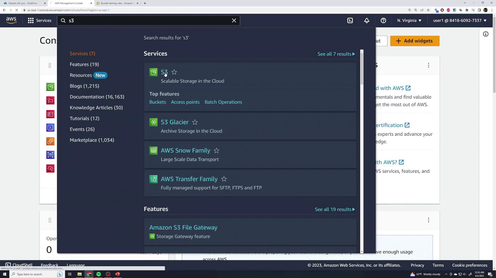
</Frame>

If you haven't created any S3 buckets yet, you'll see an option for creating a new bucket. Otherwise, you'll be presented with a list of your existing buckets:

<Frame>
  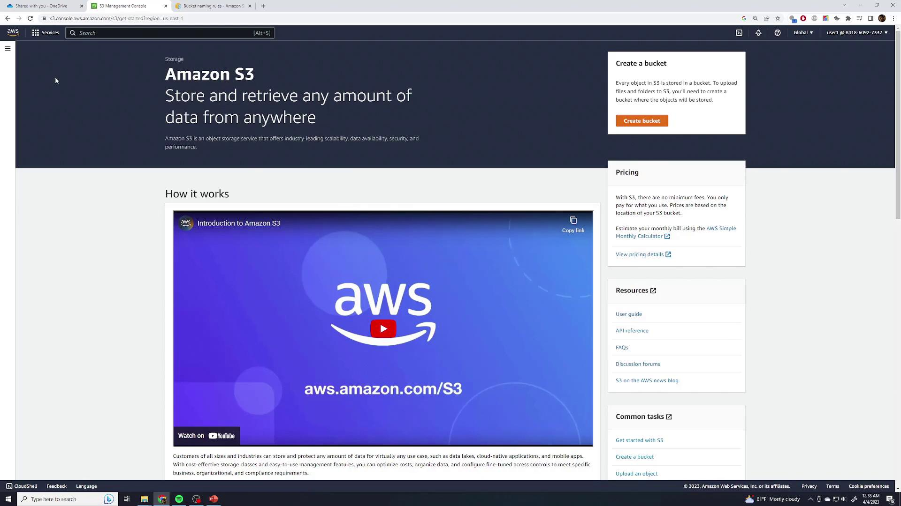
</Frame>

<Callout icon="lightbulb">
  Before moving forward, take note of the "global" indicator at the top of the page. Amazon S3 operates within a global namespace, meaning that while the bucket list shows buckets across all regions, you will specify a region when creating a new bucket.
</Callout>

<Frame>
  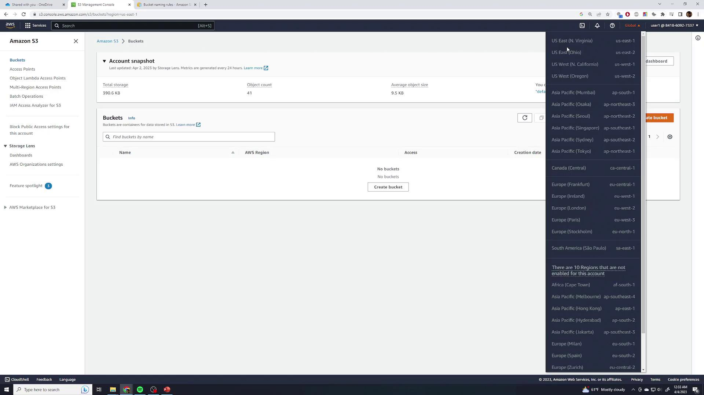
</Frame>

## Creating Your First Bucket

To create your first bucket, click the **Create Bucket** button. You'll need to choose a globally unique bucket name. Avoid common names like "Demo" because they may conflict with existing buckets. For example, a unique name such as "KodeKloud-Demo-123" is recommended.

<Frame>
  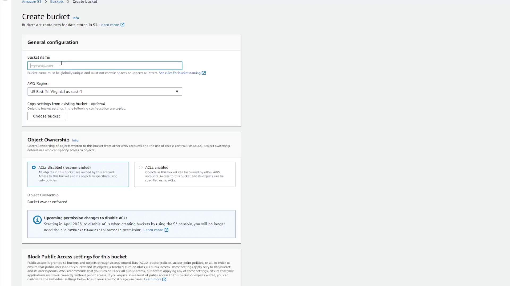
</Frame>

If the chosen name is already in use, AWS will display an error message. Ensure you meet the bucket naming requirements by referring to the documentation:

<Frame>
  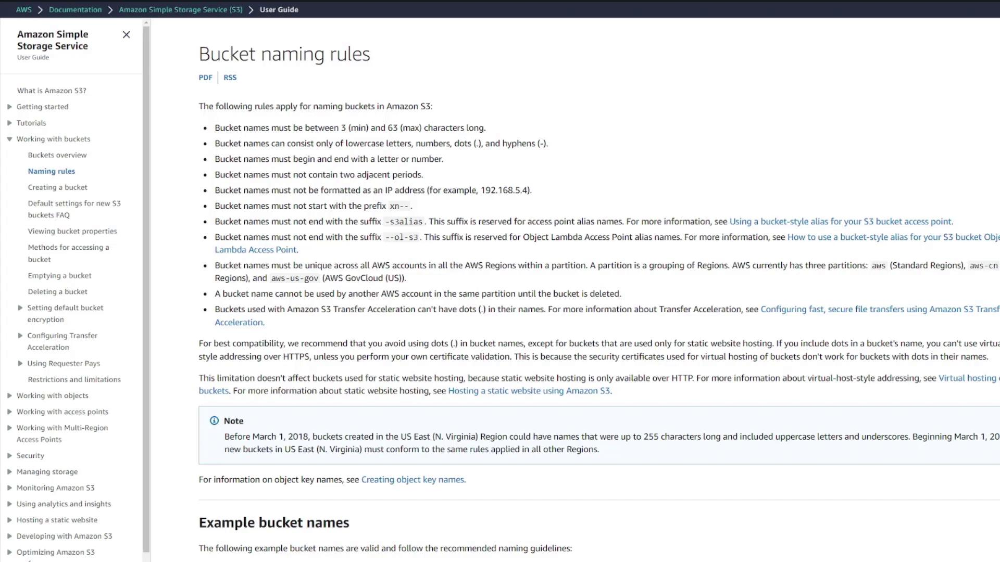
</Frame>

Next, select your desired region (e.g., US East 1). While there are several additional configuration options—including settings for object ownership, public access, versioning, encryption, and object lock for advanced use cases—for this introductory lesson, the default settings will suffice. Click **Create Bucket** to finish the process. Your new bucket, such as "KodeKloud-demo-123", will now appear, complete with details like region and creation date. Click the bucket to view its details.

<Frame>
  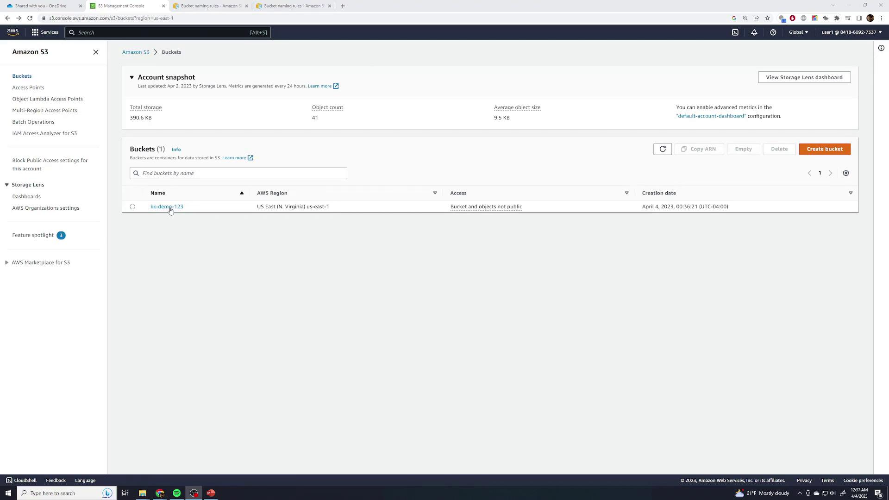
</Frame>

On the bucket page, you'll see all the uploaded files. As a new bucket starts empty, switch to the **Properties** tab to explore essential configuration details such as region, ARN, versioning status, tags, encryption settings, server access logging, and CloudTrail data events.

<Frame>
  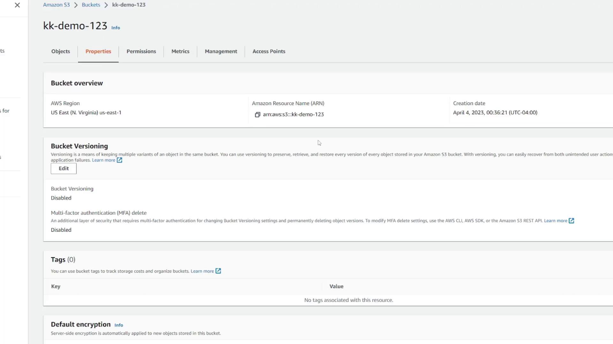
</Frame>

## Managing Permissions, Metrics, and Advanced Options

On the **Permissions** tab, manage access rules for your bucket and its contents. By default, only account owners have access, ensuring your data remains private.

<Frame>
  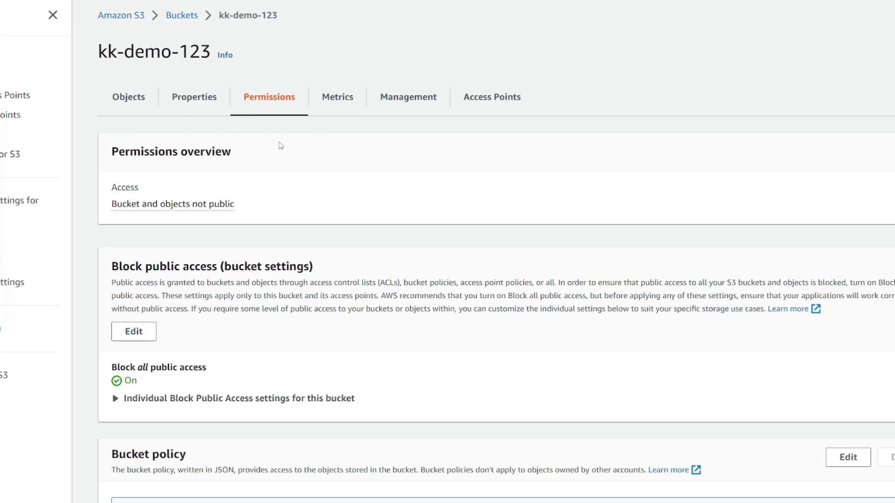
</Frame>

The **Metrics** tab displays CloudWatch metrics such as storage usage and the total number of uploaded objects. In the **Management** tab, set up lifecycle policies, replication rules, inventory configurations, and access points. These advanced topics are covered in further documentation.

<Frame>
  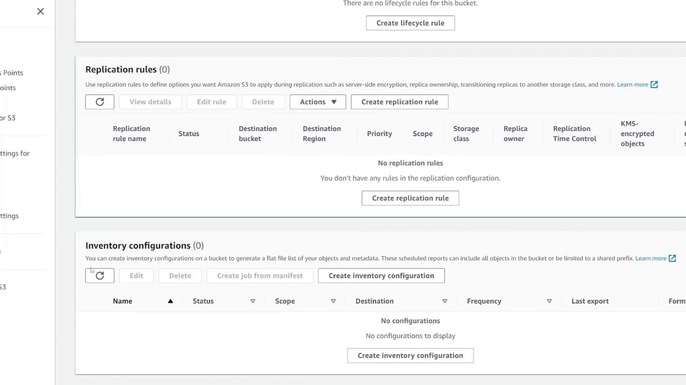
</Frame>

## Uploading Files to Your Bucket

To upload files, return to the **Objects** page and click **Upload**. You can select a file, folder, or simply drag and drop items into the upload area. For example, try dragging a JPEG image to the interface, which will show details such as file size (e.g., 2.7 MB) and file type.

<Frame>
  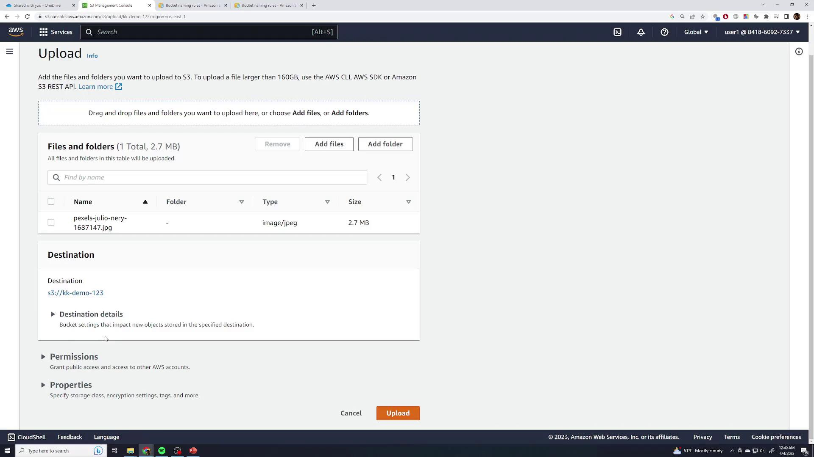
</Frame>

Once the file is added, you can adjust its details or enable extra settings such as versioning (to be covered later). With the default permissions and the standard storage class already in place, click **Upload** to continue.

<Frame>
  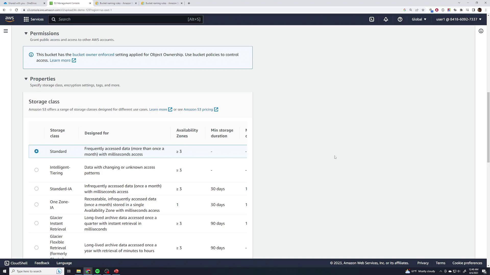
</Frame>

After a successful upload, indicated by a green checkmark, the file will appear in your bucket's Objects list. Click the file to review its properties, including region, size, last modified timestamp, unique URI, ARN, entity tag, and the direct object URL.

<Frame>
  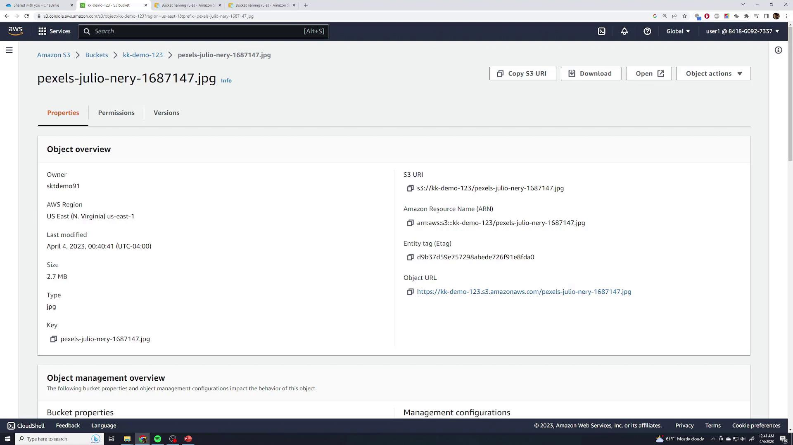
</Frame>

<Callout icon="lightbulb">
  Clicking the object URL as an unauthenticated public user may display an "Access Denied" message. To view the file properly, select the **Open** button, which authenticates your request.
</Callout>

By default, S3 buckets and files remain private unless you adjust their access settings—this is vital if you plan to host media for a public web application.

## Organizing Content with Folders

Although Amazon S3 uses a flat file system, you can simulate folders using prefixes. To organize your content, click **Create Folder** and name it (e.g., "Food").

<Frame>
  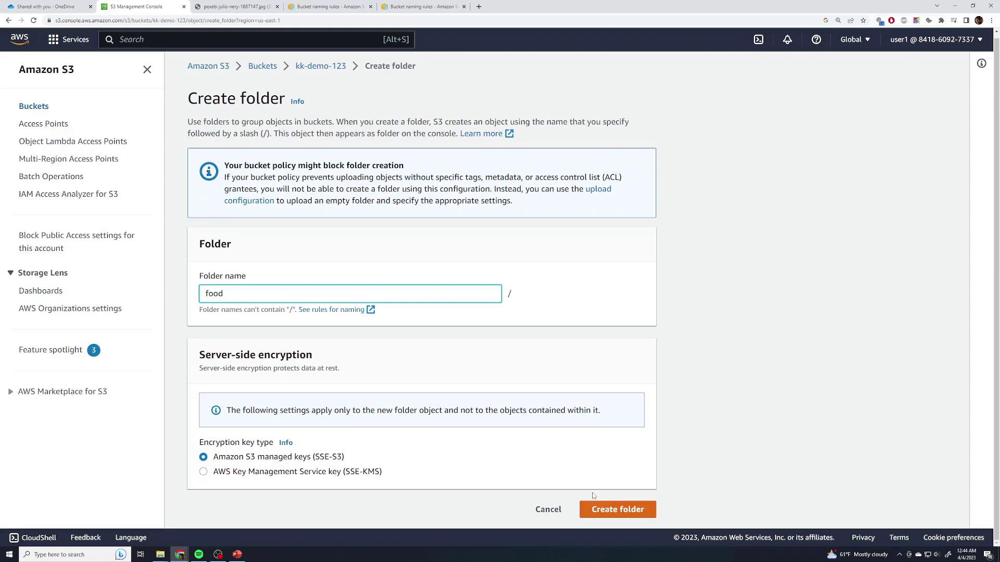
</Frame>

After the folder is created, open it and upload several food-related photos using the same uploading process. Expect a brief delay if the images are high-resolution.

<Frame>
  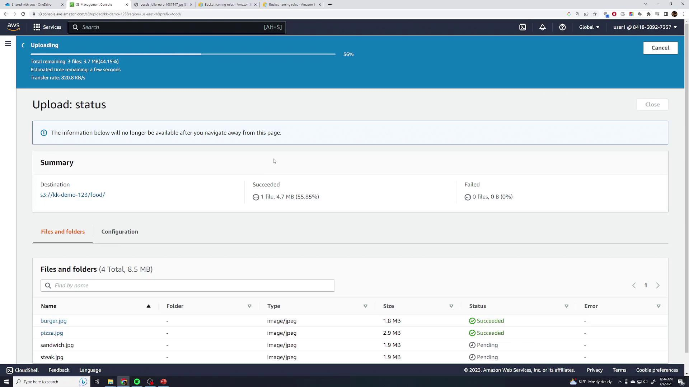
</Frame>

Once the upload is complete, the "Food" folder icon will appear in your bucket. Although the interface visually represents a folder, each file's full key is prefixed with "food/," simulating the folder structure within a flat namespace. Click on a file (for example, burger.jpg) to preview it. If accessed publicly, the file might return an "Access Denied" error; be sure to click **Open** for authenticated access.

## Deleting Files and Moving Objects

To remove a file, select it and click **Delete**. AWS will require you to type "permanently delete" to confirm the action. Note that without versioning enabled, the file is permanently removed after deletion.

If you need to move a file to another folder, such as a newly created folder named "Test", select the file and navigate to **Actions** → **Move**. Provide the full destination path, which effectively changes the object's key. For example, moving a file into the "Test" folder under the root may result in a new key like "food/test". You can type in the destination manually or use the **Browse** option.

<Frame>
  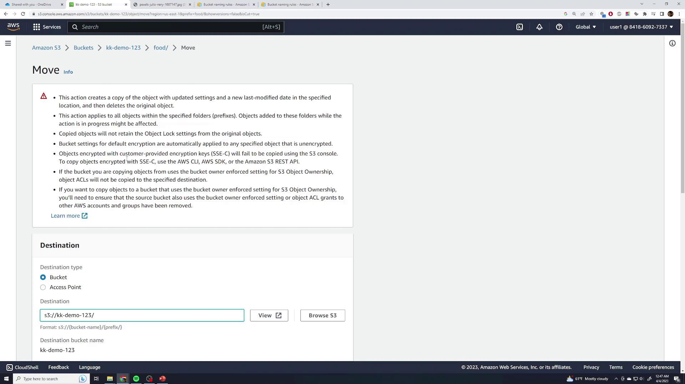
</Frame>

After moving the file, verify that it appears in the correct location.

## Deleting a Bucket

To delete an entire bucket, go back to the Buckets view, select the bucket you wish to remove, and click **Delete**. If the bucket isn't empty, AWS will show an error message indicating that only empty buckets can be deleted.

<Frame>
  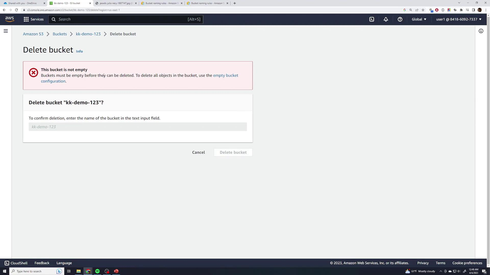
</Frame>

<Callout icon="triangle-alert">
  Empty the bucket first by clicking the provided button and typing "permanently delete" to confirm removal of all contents. Once the bucket is empty, you can proceed to delete it by typing the bucket's name and confirming the deletion.
</Callout>

<Frame>
  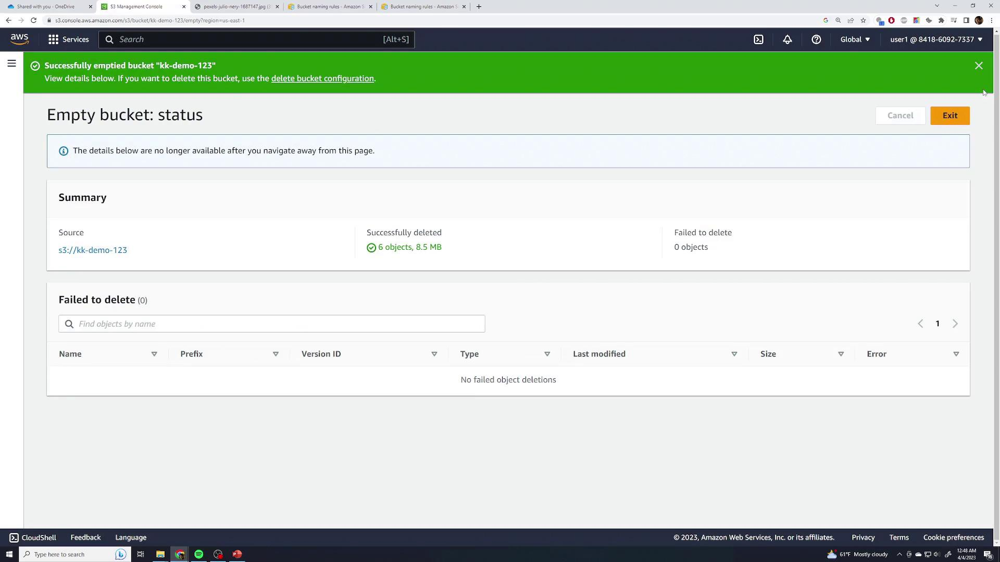
</Frame>

This concludes the introductory lesson on using Amazon S3. Continue exploring the AWS documentation for more advanced configurations and use cases.

***

## Additional Resources

* [Amazon S3 Documentation](https://docs.aws.amazon.com/s3/index.html)
* [AWS Management Console](https://aws.amazon.com/console/)
* [AWS Storage Gateway](https://aws.amazon.com/storagegateway/)
* [AWS Cloud Practitioner Essentials](https://aws.amazon.com/training/path-cloudpractitioner/)

Happy cloud computing!

<CardGroup>
  <Card title="Watch Video" icon="video" href="https://learn.kodekloud.com/user/courses/aws-cloud-practitioner-clf-c02/module/dcba3ea8-580a-4aac-ad89-48969e6876ee/lesson/8381a992-e905-4bec-9bcb-4225adaa3c65" />
</CardGroup>
