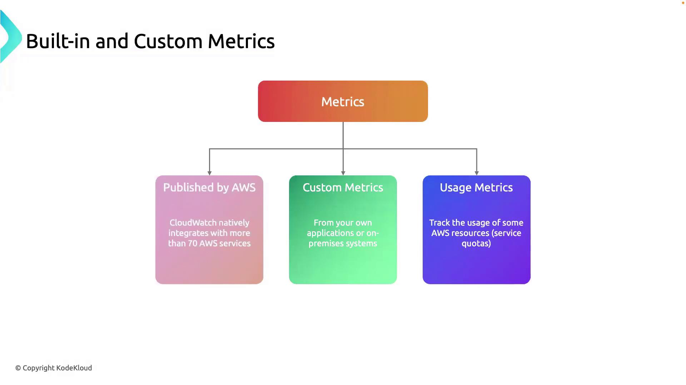
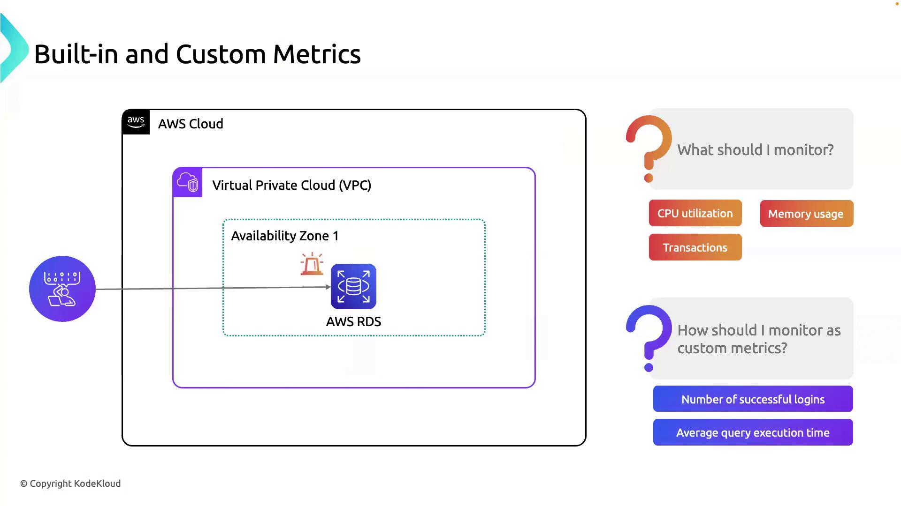

# Built in and Custom Metrics

Source: https://notes.kodekloud.com/docs/AWS-CloudWatch/Anatomy-of-Alarms/Built-in-and-Custom-Metrics/page

This guide explores AWS CloudWatchs built-in, custom, and usage metrics for monitoring RDS instances in a VPC.

In this guide, we’ll explore the three primary metric types in AWS CloudWatch—**built-in metrics**, **custom metrics**, and **usage metrics**—and demonstrate how to apply them when monitoring an RDS instance in a VPC. By the end, you’ll understand how to gain a comprehensive view of your resource health, application performance, and usage quotas.

## 1. Metric Types Overview

CloudWatch collects and organizes data into different metric categories. Leveraging all three types helps you:

* Track core resource performance
* Gather application-specific insights
* Monitor service consumption against quotas

| Metric Type | Source                                  | Use Case                                                |
| ----------- | --------------------------------------- | ------------------------------------------------------- |
| Built-in    | AWS-managed (70+ services)              | CPU, disk I/O, network throughput, memory usage         |
| Custom      | User-defined via API or SDK             | Transaction counts, cache hit rates, API response times |
| Usage       | AWS service quotas and usage statistics | Track service limits, forecast capacity, avoid overruns |

<Frame>
  
</Frame>

### 1.1 Built-in Metrics

CloudWatch automatically publishes metrics for over 70 AWS services. Examples include:

* CPUUtilization
* NetworkIn / NetworkOut
* DiskReadBytes / DiskWriteBytes

<Callout icon="lightbulb">
  Built-in metrics have a default 1-minute resolution. To enable 1-second (high-resolution) metrics for supported services, see the [CloudWatch detailed monitoring documentation](https://docs.aws.amazon.com/AmazonCloudWatch/latest/monitoring/WhatIsCloudWatch.html).
</Callout>

### 1.2 Custom Metrics

When default metrics aren’t enough, you can push any numeric data via the *PutMetricData* API. Common examples:

* Order processing rate
* Cache hit ratio
* Endpoint response time

<Callout icon="triangle-alert">
  Custom metrics incur additional charges. Review the [CloudWatch pricing page](https://aws.amazon.com/cloudwatch/pricing/) before publishing high-cardinality or high-frequency data.
</Callout>

### 1.3 Usage Metrics

Usage metrics track how close you are to AWS service quotas (limits). These are crucial for:

* Monitoring API call volumes
* Ensuring you don’t exceed resource limits
* Forecasting future capacity needs

## 2. Practical Example: Monitoring RDS in a VPC

Let’s apply these metric types to an Amazon RDS instance running in a Virtual Private Cloud.

<Frame>
  
</Frame>

### 2.1 Built-in RDS Metrics

AWS RDS publishes dozens of metrics by default. Key ones include:

| Metric Name          | Description                        | Unit        |
| -------------------- | ---------------------------------- | ----------- |
| CPUUtilization       | Percentage of CPU in use           | Percent (%) |
| FreeableMemory       | Available RAM in the instance      | Bytes       |
| ReadIOPS / WriteIOPS | Disk read/write operations per sec | Count/sec   |
| DatabaseConnections  | Active connections to the DB       | Count       |

### 2.2 Custom RDS Metrics

Enhance observability with application-specific data:

| Metric Name           | Description                                 | Collection Interval |
| --------------------- | ------------------------------------------- | ------------------- |
| LoginsPerMinute       | Number of successful user logins            | 1 minute            |
| AvgQueryExecutionTime | Average time to execute SQL queries         | 1 minute            |
| CacheHitRatio         | Percentage of cache hits vs. total requests | 1 minute            |

<Callout icon="lightbulb">
  Use the AWS SDK or CLI command `aws cloudwatch put-metric-data` to publish custom metrics from your application or monitoring scripts.
</Callout>

## 3. Next Steps

With metrics in place, you can now:

* Set up **CloudWatch Alarms** to get notified on thresholds
* Build **CloudWatch Dashboards** for real-time visualization
* Integrate with [AWS CloudWatch Logs](https://docs.aws.amazon.com/AmazonCloudWatch/latest/logs/WhatIsCloudWatchLogs.html) for log monitoring

***

## Links and References

* [AWS CloudWatch Metrics and Dimensions](https://docs.aws.amazon.com/AmazonCloudWatch/latest/monitoring/CW_Support_For_AWS.html)
* [Amazon RDS Monitoring](https://docs.aws.amazon.com/AmazonRDS/latest/UserGuide/MonitoringOverview.html)
* [CloudWatch Pricing](https://aws.amazon.com/cloudwatch/pricing/)
* [AWS SDK for Go CloudWatch Guide](https://docs.aws.amazon.com/sdk-for-go/api/service/cloudwatch/)

<CardGroup>
  <Card title="Watch Video" icon="video" href="https://learn.kodekloud.com/user/courses/aws-cloudwatch/module/41c3204a-bf91-4e6f-8175-02ef9b9f6b82/lesson/0b720e9d-6c37-4ee2-a099-220aeb5c0f0b" />
</CardGroup>
