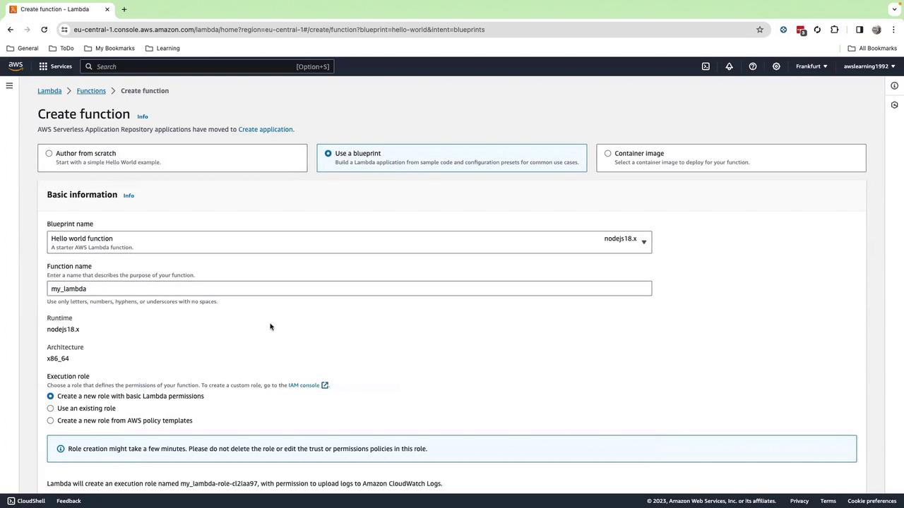
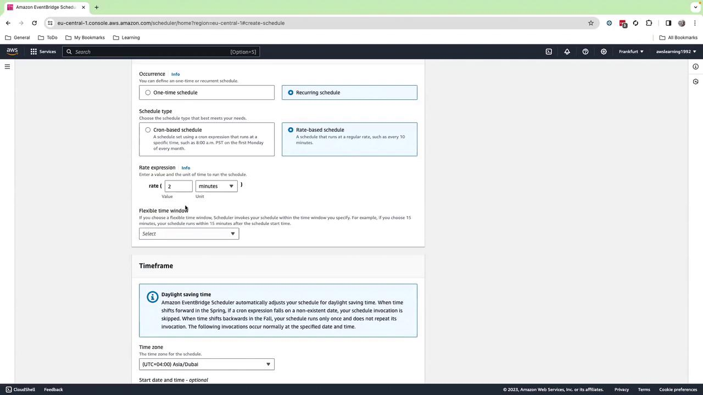
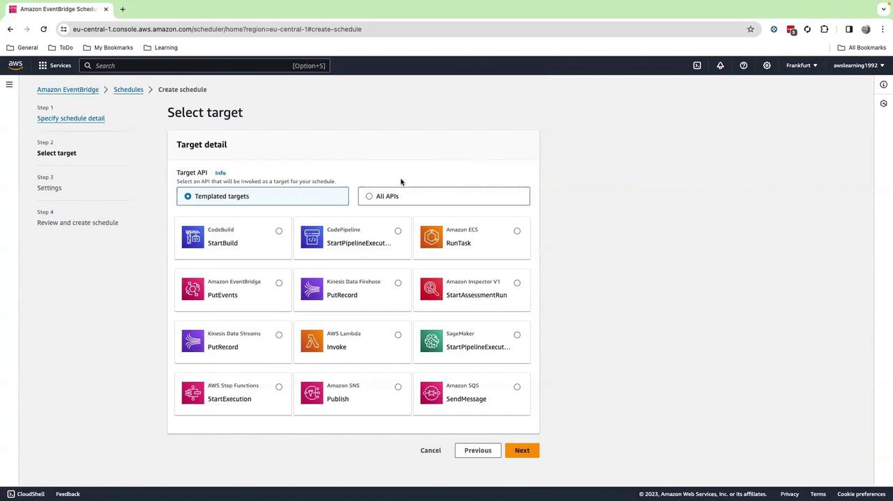
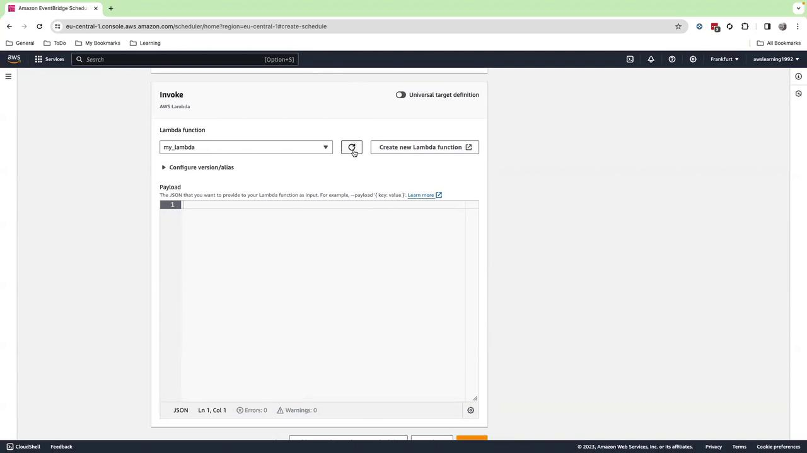
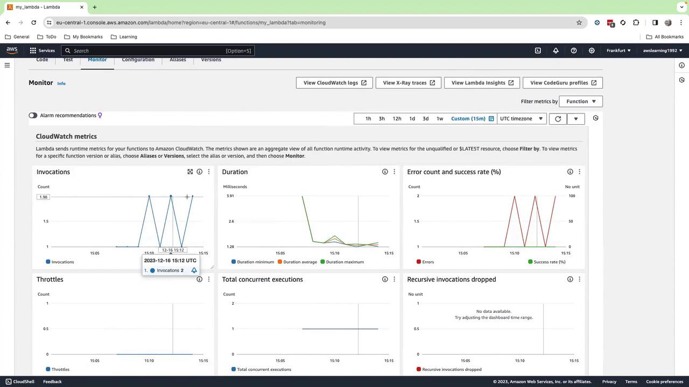
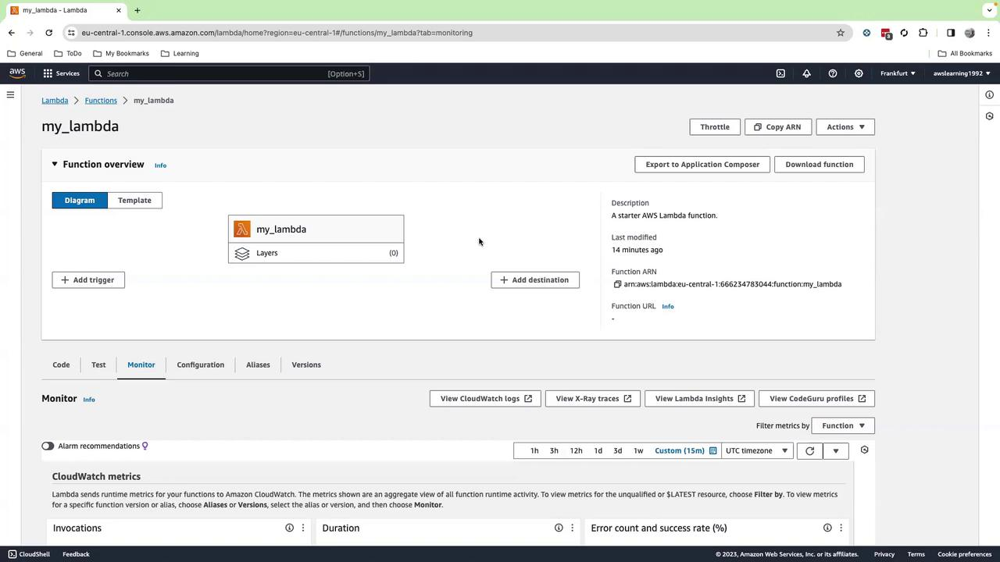
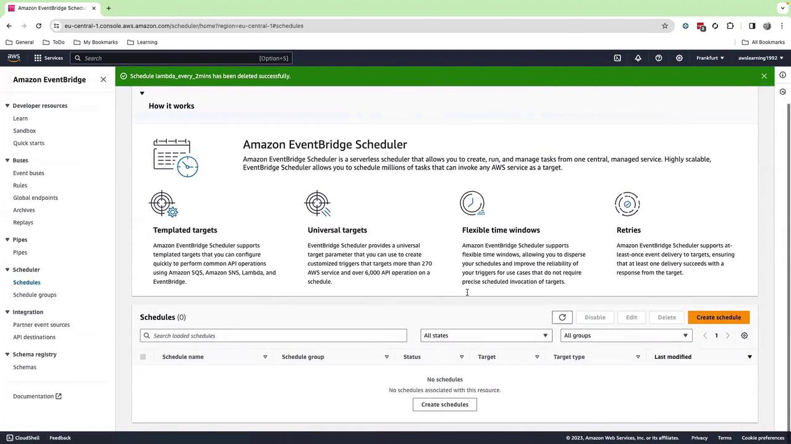

# Create the rule
aws events put-rule \
  --name PaymentSucceededRule \
  --event-bus-name custom-order-bus \
  --event-pattern '{
    "detail-type": ["PaymentSucceeded"],
    "source": ["com.myapp.orders"]
  }'

# Attach the Lambda target
aws events put-targets \
  --rule PaymentSucceededRule \
  --event-bus-name custom-order-bus \
  --targets "Id"="1","Arn"="arn:aws:lambda:us-east-1:123456789012:function:NotifyWarehouse"
```

## Next Steps

1. Define additional event patterns for order cancellations, returns, or promotions.
2. Explore the EventBridge schema registry to generate strongly typed client code in Java, Python, or TypeScript.
3. Integrate third-party SaaS partners (e.g., Stripe, Zendesk) for richer cross-system workflows.

## Links and References

* [Amazon EventBridge Developer Guide](https://docs.aws.amazon.com/eventbridge/latest/userguide/)
* [Working with Event Buses](https://docs.aws.amazon.com/eventbridge/latest/userguide/eb-using-event-buses.html)
* [AWS Lambda Integration](https://docs.aws.amazon.com/eventbridge/latest/userguide/eb-service-lambda.html)
* [EventBridge Schema Registry](https://docs.aws.amazon.com/eventbridge/latest/userguide/eb-schema.html)

<CardGroup>
  <Card title="Watch Video" icon="video" href="https://learn.kodekloud.com/user/courses/aws-cloudwatch/module/943dddff-037a-4401-a679-e39be4809f10/lesson/ba848d79-d0a2-4b66-a026-38616974e61e" />
</CardGroup>


# Demo Hands on with AWS Eventbridge schedulers

Source: https://notes.kodekloud.com/docs/AWS-CloudWatch/CloudWatch-Events-EventBridge-Event-Buses/Demo-Hands-on-with-AWS-Eventbridge-schedulers/page

Learn to use AWS EventBridge for scheduling AWS Lambda function invocations with practical examples and monitoring techniques.

In this guide, you’ll learn how to use **AWS EventBridge** to schedule **AWS Lambda** function invocations. We’ll walk through creating a simple “Hello World” Lambda, setting up a recurring schedule in EventBridge, monitoring invocations, and exploring real-world scenarios.

<Callout icon="lightbulb">
  Scheduling functions with EventBridge may incur additional charges. Check the [EventBridge pricing](https://aws.amazon.com/eventbridge/pricing/) before you begin.
</Callout>

## Prerequisites

* An AWS account with permissions for Lambda and EventBridge
* Basic familiarity with the AWS Management Console

***

## Step 1: Create a Lambda Function

1. Sign in to the **AWS Management Console**.
2. Navigate to **AWS Lambda** > **Functions** > **Create function**.
3. Choose **Blueprint**, search for “Hello World,” and select it.
4. Enter a name, e.g., `my_lambda`.
5. Select **Node.js 18.x** (or **Python 3.x** if you prefer).
6. Keep all other settings as default and click **Create function**.

<Frame>
  
</Frame>

***

## Step 2: Add the Function Code

1. In the inline editor, replace the default handler with the following Python code:

```python theme={null}
import json

def lambda_handler(event, context):
    print("loading function")
    return json.dumps(event, indent=2)
```

2. Click **Deploy**.

By default, there is no trigger attached. Next, we’ll configure EventBridge.

***

## Step 3: Create an EventBridge Schedule

1. Open the **Amazon EventBridge** console.
2. In the left pane, choose **Schedules** > **Create schedule**.
3. Enter a name (e.g., `every-2-minutes`) and select **Recurring schedule**.
4. Under **Schedule type**, pick **Rate-based** and set it to **Every 2 minutes**.
   * You can also use a cron expression under **Cron-based** if needed.
5. Click **Next**, disable **Enabled**, and click **Next** again.

<Frame>
  
</Frame>

***

## Step 4: Configure the Schedule Target

1. For **Target**, choose **AWS service** > **Lambda function**.
2. Select your `my_lambda` function from the dropdown (hit the refresh icon if it doesn’t appear).
3. (Optional) Add a custom JSON payload in the **Input** section.
4. Click **Next**, then **Create schedule**.
5. Finally, enable the schedule to start invoking your function every 2 minutes.

<Frame>
  
</Frame>

<Frame>
  
</Frame>

***

## Step 5: Monitor Invocations

1. Go back to the **Lambda** console and open your `my_lambda` function.
2. Select the **Monitor** tab.
3. Adjust the time range to **Last 30 minutes** (or **15 minutes**).
4. You should see invocations every 2 minutes along with logs and metrics.

<Frame>
  
</Frame>

Scroll down to view individual invocation timestamps and durations.

***

## Common Use Cases

| Use Case                | Description                                     | Example                                                    |
| ----------------------- | ----------------------------------------------- | ---------------------------------------------------------- |
| Periodic Health Checks  | Run database or API checks at regular intervals | Lambda polls an RDS instance, logs health status           |
| Scheduled Notifications | Send reminders or alerts via SNS                | Lambda composes a message and publishes to an SNS topic    |
| Automated Reports       | Generate and distribute reports to stakeholders | Lambda fetches data from S3, formats a PDF, emails via SNS |

For instance, you could have EventBridge trigger a Lambda that loads a PDF of DevOps headlines from S3 and pushes it to an SNS topic for subscriber email delivery.

<Frame>
  
</Frame>

***

## Cleanup

To avoid ongoing charges:

1. Delete the `my_lambda` function in **AWS Lambda**.
2. Remove your schedule under **EventBridge** > **Schedules**.

<Callout icon="triangle-alert">
  Be sure to clean up both Lambda functions and EventBridge schedules to prevent unexpected costs.
</Callout>

<Frame>
  
</Frame>

***

## Links and References

* [AWS Lambda Documentation](https://docs.aws.amazon.com/lambda/latest/dg/welcome.html)
* [Amazon EventBridge Scheduler](https://docs.aws.amazon.com/eventbridge/latest/userguide/scheduler.html)
* [AWS Pricing Calculator](https://calculator.aws/#/)

<CardGroup>
  <Card title="Watch Video" icon="video" href="https://learn.kodekloud.com/user/courses/aws-cloudwatch/module/943dddff-037a-4401-a679-e39be4809f10/lesson/b7c98f61-b683-4306-afef-fcdda9e85ade" />
</CardGroup>
