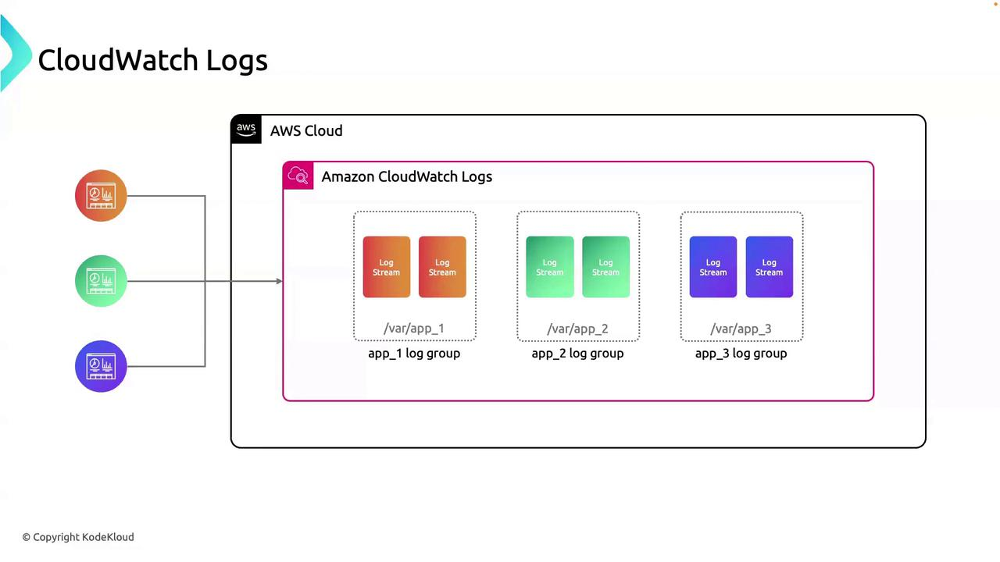
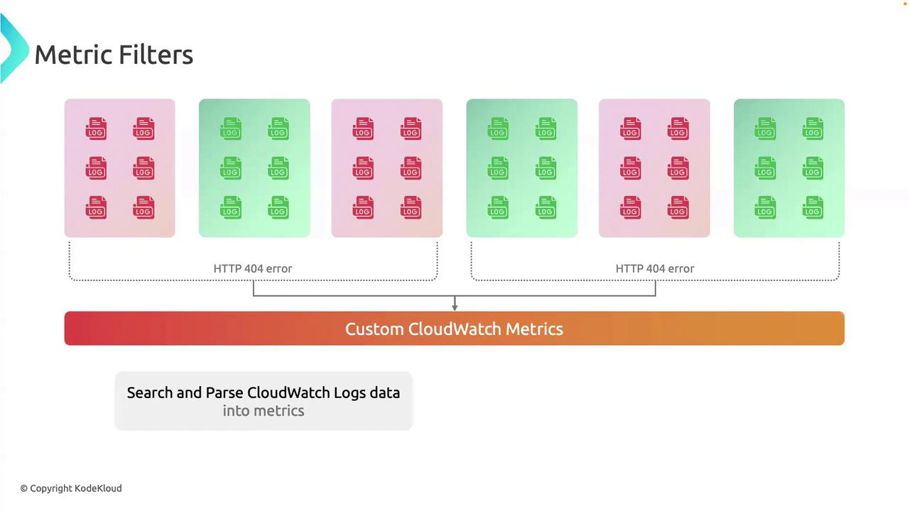

# 1. Install the agent (Amazon Linux example)
sudo yum install -y amazon-cloudwatch-agent

# 2. Generate a JSON configuration
sudo /opt/aws/amazon-cloudwatch-agent/bin/amazon-cloudwatch-agent-config-wizard

# 3. Start the agent service
sudo systemctl start amazon-cloudwatch-agent
```

After installation, update the JSON config to specify:

* **Log files** to monitor
* **Metrics** to collect
* **Destination** (CloudWatch Logs or CloudWatch Metrics)

> **lightbulb** You can also store your agent configuration in SSM Parameter Store and reference it in the `start` command:\
  `sudo /opt/aws/amazon-cloudwatch-agent/bin/amazon-cloudwatch-agent-ctl -a fetch-config -m ec2 -c ssm:YourParameterName -s`

## Core Concepts: Log Groups vs. Log Streams

CloudWatch Logs structures data using two primary concepts:

| Concept    | Definition                                                  | AWS CLI Example                                                                          |
| ---------- | ----------------------------------------------------------- | ---------------------------------------------------------------------------------------- |
| Log Group  | A container for log streams with shared retention and ACLs. | `aws logs create-log-group --log-group-name app_01`                                      |
| Log Stream | An ordered sequence of log events from a single source.     | `aws logs create-log-stream --log-group-name app_01 --log-stream-name stream_2024-06-01` |

* **Log Group**: Use to separate environments (dev, prod) or applications.
* **Log Stream**: Each instance or component can have its own stream.

Here’s how your applications integrate:



## Use Case: Debugging with CloudWatch Logs

When troubleshooting `app_01`:

1. Go to the **app\_01** log group.
2. Select the relevant log stream for your instance or task.
3. Use real-time filtering (e.g., `ERROR`, `WARN`) to pinpoint exceptions.
4. If needed, create a **metric filter** to track error rates over time.

This structured approach avoids sifting through unrelated logs and accelerates root-cause analysis.

## Links and References

* [AWS CloudWatch Logs Documentation](https://docs.aws.amazon.com/cloudwatch/latest/logs/)
* [Installing the CloudWatch Agent](https://docs.aws.amazon.com/AmazonCloudWatch/latest/monitoring/install-CloudWatch-Agent.html)
* [AWS CLI Command Reference](https://docs.aws.amazon.com/cli/latest/reference/)

- [Watch Video](https://learn.kodekloud.com/user/courses/aws-cloudwatch/module/9fa50074-5184-4ea1-a0fb-233788bf9666/lesson/728ab572-bd2a-4811-8ba8-76896729d7ee)


# Metric Filters

Source: https://notes.kodekloud.com/docs/AWS-CloudWatch/CloudWatch-Logs/Metric-Filters/page

Learn to convert log events into actionable metrics using Amazon CloudWatch metric filters for real-time visibility and monitoring.

In this guide, you’ll learn how to convert key log events into actionable metrics using Amazon CloudWatch **metric filters**. After your applications push log events to CloudWatch Logs, metric filters let you scan for patterns and generate custom metrics. You can then graph these metrics, set alarms, and include them in dashboards for real‐time visibility.

## What Is a Metric Filter?

A **metric filter** inspects each log event in a CloudWatch Logs group against a *filter pattern*. Whenever an event matches, CloudWatch Logs emits a metric datum—either incrementing a counter or setting a value. Once published, you can:

* Trigger CloudWatch Alarms
* Plot the data on CloudWatch Dashboards
* Automate responses with EventBridge or Lambda

> **lightbulb** Metric filters operate in near real‐time and can be applied to both text and JSON‐formatted logs.

## How It Works

1. Define a **filter pattern** (e.g., `"ERROR"`, `"[timestamp, requestId, ...]"`).
2. Attach the filter to a **log group** in CloudWatch Logs.
3. Configure the filter to **publish metric data**—choose a namespace, metric name, and value.
4. Use CloudWatch Metrics to **visualize** data or **set alarms** on thresholds.



## Example: Tracking HTTP 404 Errors

Monitor spikes in “HTTP 404” errors by turning each occurrence into a custom metric.

### 1. Define the Filter Pattern

```json theme={null}
{
  "filterName": "HTTP404Filter",
  "filterPattern": "HTTP 404",
  "metricTransformations": [
    {
      "metricName": "MyApp-404Errors",
      "metricNamespace": "MyApp/Metrics",
      "metricValue": "1"
    }
  ]
}
```

### 2. Associate with Your Log Group

```bash theme={null}
aws logs put-metric-filter \
  --log-group-name "/aws/lambda/my-function" \
  --filter-name HTTP404Filter \
  --filter-pattern "HTTP 404" \
  --metric-transformations \
      metricName=MyApp-404Errors,metricNamespace=MyApp/Metrics,metricValue=1
```

### 3. Publish Metric Data

Each time a log line contains `HTTP 404`, CloudWatch Logs will emit a `MyApp-404Errors` metric with a value of `1`.

### 4. Create an Alarm

```bash theme={null}
aws cloudwatch put-metric-alarm \
  --alarm-name "High-404-Rate" \
  --metric-name MyApp-404Errors \
  --namespace "MyApp/Metrics" \
  --statistic Sum \
  --period 300 \
  --threshold 50 \
  --comparison-operator GreaterThanOrEqualToThreshold \
  --evaluation-periods 1 \
  --alarm-actions arn:aws:sns:us-east-1:123456789012:alerts-topic
```

> **triangle-alert** Overly broad filter patterns can lead to high metric‐filter charges. Always scope patterns tightly and test with sample logs.

## Real-World Use Cases

| Use Case         | Filter Pattern             | Metric Name           |
| ---------------- | -------------------------- | --------------------- |
| API Latency      | `{ $.latency = * }`        | MyApp/APIResponseTime |
| Login Failures   | `"Authentication failure"` | MyApp/LoginFailures   |
| Disk Utilization | `{ $.diskUsage > 80 }`     | MyApp/DiskUtilization |
| Database Errors  | `"SQL ERROR"`              | MyApp/DatabaseErrors  |

By converting logs into metrics, you gain precise, real-time insight into system behavior—enabling faster troubleshooting and proactive alerting.

## Links and References

* [CloudWatch Logs Metric Filters](https://docs.aws.amazon.com/AmazonCloudWatch/latest/logs/MonitoringLogData.html)
* [AWS CLI put-metric-filter](https://docs.aws.amazon.com/cli/latest/reference/logs/put-metric-filter.html)
* [Creating AWS CloudWatch Alarms](https://docs.aws.amazon.com/AmazonCloudWatch/latest/monitoring/AlarmThatSendsEmail.html)

- [Watch Video](https://learn.kodekloud.com/user/courses/aws-cloudwatch/module/9fa50074-5184-4ea1-a0fb-233788bf9666/lesson/95e88558-1264-4bc9-9fc0-560f4fe81b34)
