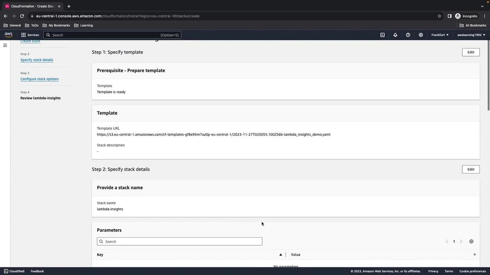
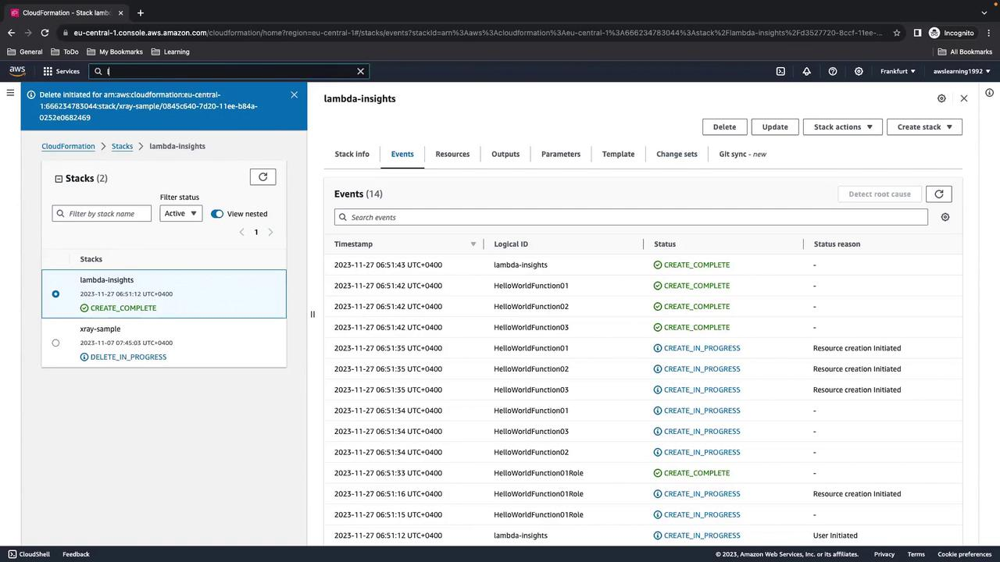
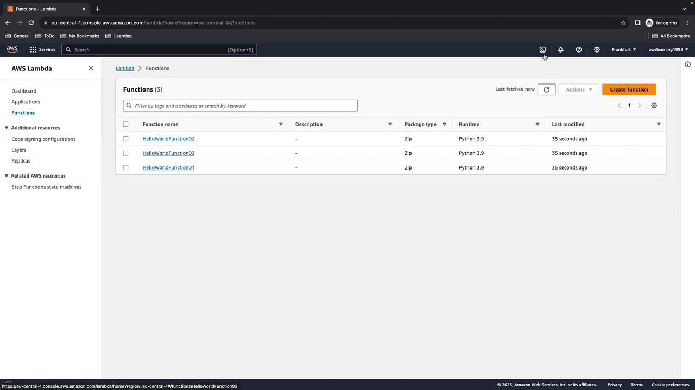
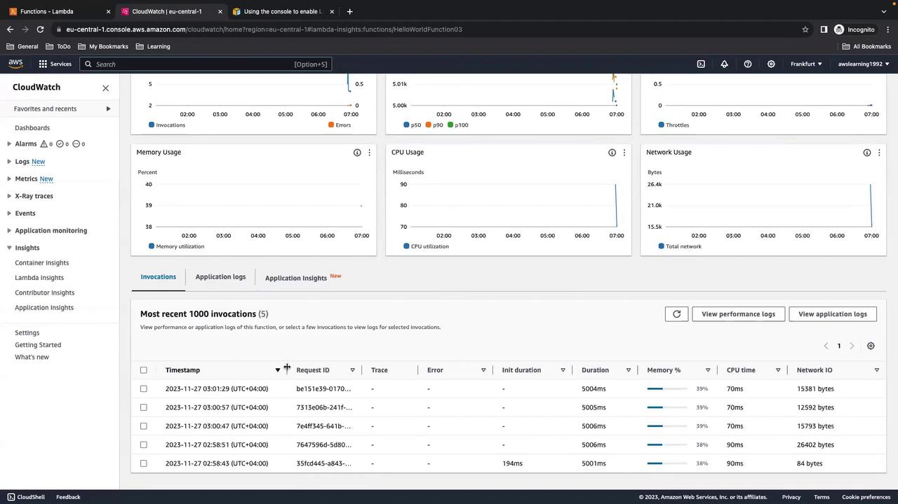
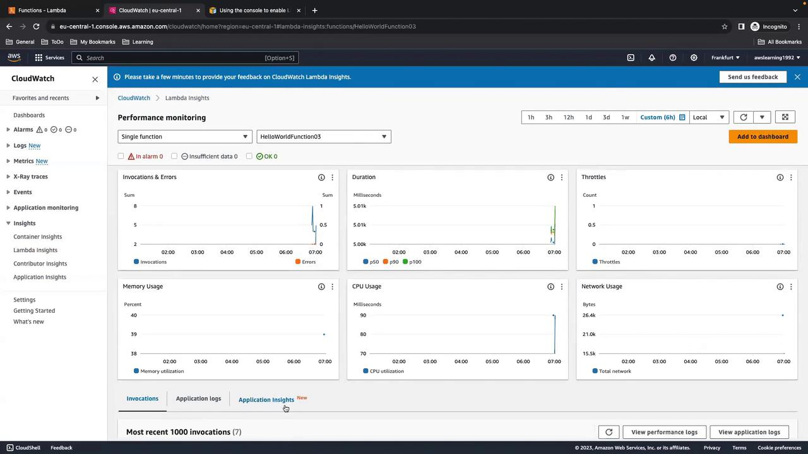
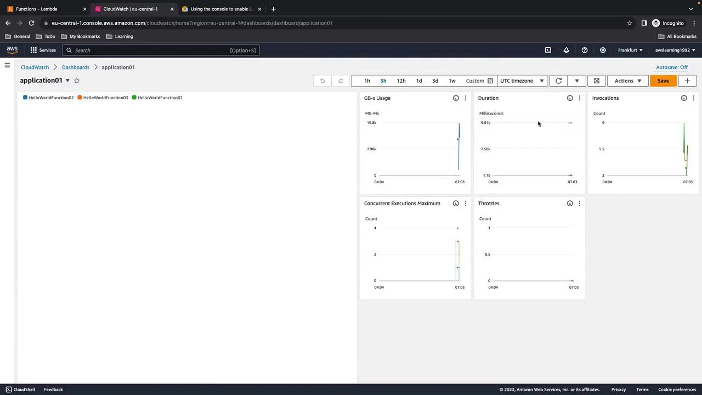

# Demo Lambda Insights

Source: https://notes.kodekloud.com/docs/AWS-CloudWatch/Cloudwatch-Insights-X-Ray-and-Service-Map/Demo-Lambda-Insights/page

This guide teaches provisioning AWS Lambda functions with CloudFormation, generating metrics, and exploring them in CloudWatch using Lambda Insights.

In this guide, you’ll learn how to provision multiple AWS Lambda functions with CloudFormation, invoke them to generate metrics, and explore those metrics in CloudWatch using Lambda Insights.

## 1. CloudFormation Template

<Callout icon="lightbulb">
  Ensure that an IAM role named `HelloWorldFunctionRole` exists with permissions for Lambda execution and CloudWatch logging. You can define it in this template or create it beforehand.
</Callout>

Below is a CloudFormation YAML template that defines three Lambda functions:

```yaml theme={null}
Resources:
  HelloWorldFunction01:
    Type: AWS::Lambda::Function
    Properties:
      FunctionName: HelloWorldFunction01
      Runtime: python3.9
      Handler: index.handler
      Role: !GetAtt HelloWorldFunctionRole.Arn
      Timeout: 15
      Code:
        ZipFile: |
          import json
          def handler(event, context):
              print("HelloWorld from function 01")
              return {
                  'statusCode': 200,
                  'body': json.dumps('Hello from Lambda!')
              }

  HelloWorldFunction02:
    Type: AWS::Lambda::Function
    Properties:
      FunctionName: HelloWorldFunction02
      Runtime: python3.9
      Handler: index.handler
      Role: !GetAtt HelloWorldFunctionRole.Arn
      Timeout: 15
      Code:
        ZipFile: |
          import json
          def handler(event, context):
              print("HelloWorld from function 02")
              return {
                  'statusCode': 200,
                  'body': json.dumps('Hello from Lambda!')
              }

  HelloWorldFunction03:
    Type: AWS::Lambda::Function
    Properties:
      FunctionName: HelloWorldFunction03
      Runtime: python3.9
      Handler: index.handler
      Role: !GetAtt HelloWorldFunctionRole.Arn
      Timeout: 15
      Code:
        ZipFile: |
          import json
          import time
          def handler(event, context):
              print("HelloWorld from function 03")
              time.sleep(5)
              return {
                  'statusCode': 200,
                  'body': json.dumps('Hello from Lambda!')
              }
```

### Function Summary

| Function Name        | Description                           | Timeout |
| -------------------- | ------------------------------------- | ------- |
| HelloWorldFunction01 | Prints a greeting message             | 15 sec  |
| HelloWorldFunction02 | Prints a greeting message             | 15 sec  |
| HelloWorldFunction03 | Prints a greeting after a 5-sec delay | 15 sec  |

## 2. Invocation Script

Generate consistent metrics by invoking each function 50 times. Save the following as `lambda_call.sh` and make it executable.

```bash theme={null}
#!/usr/bin/env bash

for i in {1..50}; do
  aws lambda invoke --function-name HelloWorldFunction01 --payload '{}' output01.txt
  aws lambda.invoke --function-name HelloWorldFunction02 --payload '{}' output02.txt
  aws lambda.invoke --function-name HelloWorldFunction03 --payload '{}' output03.txt
done
```

```bash theme={null}
chmod +x lambda_call.sh
```

## 3. Deploying the Stack

1. Open the **AWS Management Console** and navigate to **CloudFormation**.
2. Choose **Create stack > With new resources (standard)**.
3. Upload the YAML template and click **Next**.
4. Enter a stack name (e.g., `lambda-insights-demo`), acknowledge IAM capabilities, then click **Next** and **Create stack**.

<Frame>
  
</Frame>

Wait until the status reads `CREATE_COMPLETE`.

<Frame>
  
</Frame>

## 4. Verify Lambda Functions

In the Lambda console, confirm that all three functions (`HelloWorldFunction01`, `HelloWorldFunction02`, `HelloWorldFunction03`) are present and using Python 3.9.

<Frame>
  
</Frame>

## 5. Generate Load Using AWS CloudShell

1. Open **AWS CloudShell** from the console toolbar.
2. Upload or paste the `lambda_call.sh` script into your home directory.
3. Execute:

   ```bash theme={null}
   ./lambda_call.sh
   ```

You’ll see output similar to:

```json theme={null}
{
  "StatusCode": 200,
  "ExecutedVersion": "$LATEST"
}
...
```

Notice that invocations for **Function 03** take \~5 seconds due to the sleep.

## 6. Enabling Lambda Insights

By default, Lambda Insights is off. To enable it:

1. In the Lambda console, select each function and go to **Configuration > Monitoring and operations**.
2. Click **Edit**, enable **Enhanced monitoring (Lambda Insights)**, and save.

<Callout icon="triangle-alert">
  Enabling Lambda Insights produces extra logs and metrics, which may incur additional charges.
</Callout>

Wait a few minutes for data to appear in CloudWatch.

## 7. Exploring Metrics in CloudWatch

Navigate to **CloudWatch > Insights > Lambda Insights** to view consolidated metrics across all functions.

<Frame>
  
</Frame>

To focus on a single function (e.g., `HelloWorldFunction03`), select it from the list:

<Frame>
  
</Frame>

## 8. Creating a Custom Dashboard

If you manage many functions, a dedicated CloudWatch dashboard helps.

1. In CloudWatch, go to **Dashboards** and click **Create dashboard**.
2. Add Lambda Insights widgets and select your functions.
3. Customize widgets for GB-s usage, duration, invocations, concurrent executions, and throttles.

<Frame>
  
</Frame>

Here’s an example with multiple functions:

<Frame>
  
</Frame>

> Remember to disable Lambda Insights when not troubleshooting to avoid unnecessary costs.

## 9. Cleanup

1. In CloudShell, choose **Actions > Restart CloudShell** to stop any running processes.
2. In CloudFormation, select `lambda-insights-demo` and click **Delete**.
3. Confirm that the Lambda functions, logs, and IAM roles have been removed.

That completes this AWS Lambda Insights walkthrough. Happy monitoring!

## References

* [AWS Lambda Documentation](https://docs.aws.amazon.com/lambda/latest/dg/welcome.html)
* [AWS CloudFormation User Guide](https://docs.aws.amazon.com/AWSCloudFormation/latest/UserGuide/Welcome.html)
* [Amazon CloudWatch Documentation](https://docs.aws.amazon.com/cloudwatch/index.html)

<CardGroup>
  <Card title="Watch Video" icon="video" href="https://learn.kodekloud.com/user/courses/aws-cloudwatch/module/d95c04dd-f122-4f6b-93dc-d0b2fe015b29/lesson/4e10e0ba-1b3e-41dc-869c-049a6b6a1f92" />
</CardGroup>
