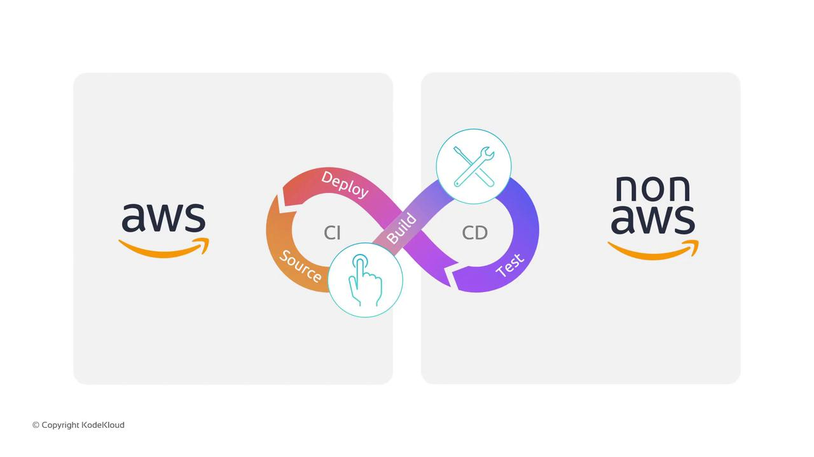
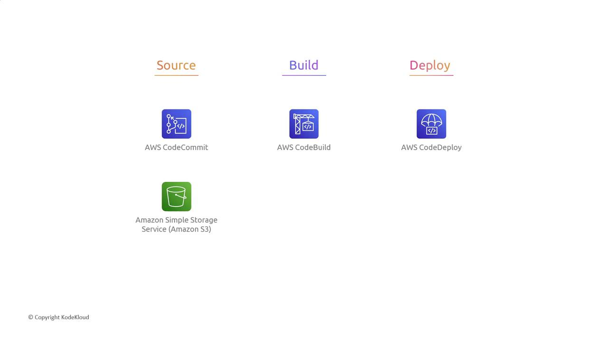
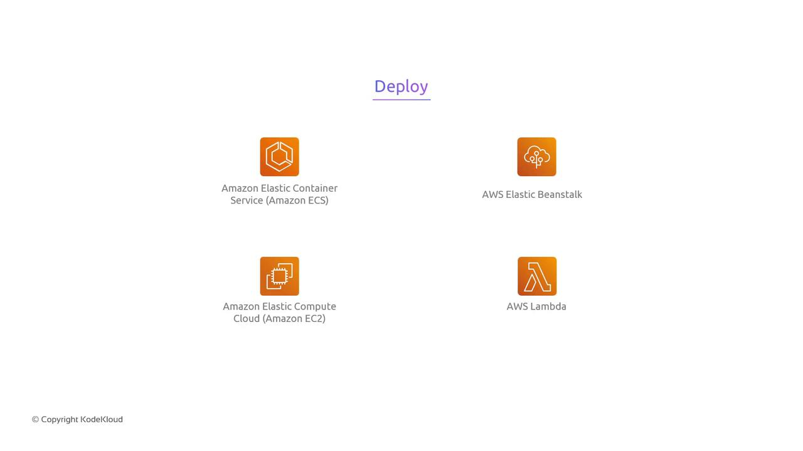

# Use cases of AWS CodePipeline

Source: https://notes.kodekloud.com/docs/AWS-CodePipeline-CICD-Pipeline/Basics-of-AWS-CodePipeline/Use-cases-of-AWS-CodePipeline/page

This article discusses AWS CodePipeline, a CI/CD service that automates release pipelines for application and infrastructure updates.

AWS CodePipeline is a fully managed continuous integration and continuous delivery (CI/CD) service that automates your release pipelines for fast and reliable application and infrastructure updates. Its deep integration with AWS services—and flexibility to include third-party tools—makes it ideal for a variety of deployment strategies.

<Frame>
  
</Frame>

## 1. All-AWS Pipeline

When you want an end-to-end AWS-only solution, CodePipeline orchestrates native AWS services at each stage:

<Frame>
  
</Frame>

| Stage  | AWS Service                   | Description                                                            |
| ------ | ----------------------------- | ---------------------------------------------------------------------- |
| Source | CodeCommit / S3               | Manage application code or store build artifacts                       |
| Build  | CodeBuild (with CodeArtifact) | Compile, test, and package. Integrate \[CodeArtifact] for dependencies |
| Deploy | CodeDeploy                    | Automate deployments to EC2, on-premises, or Lambda                    |

<Callout icon="lightbulb">
  Amazon S3 can serve as both a source and an artifact store. You can version objects or set lifecycle rules to manage storage costs.
</Callout>

## 2. Hybrid Pipeline with Third-Party Tools

Already invested in tools like GitHub or Jenkins? No problem—CodePipeline integrates them seamlessly:

| Stage    | CodePipeline Integration | Example Third-Party Tool |
| -------- | ------------------------ | ------------------------ |
| Source   | Webhooks / GitHub Action | GitHub, Bitbucket        |
| Build    | Custom action / Plugin   | Jenkins, CircleCI        |
| Test     | Parallel actions         | Selenium, JMeter         |
| Approval | Manual approval step     | —                        |

<Callout icon="triangle-alert">
  When connecting Jenkins agents, ensure your IAM roles and security groups allow CodePipeline to trigger Jenkins builds.
</Callout>

## 3. Flexible Deployment Targets

Choose the runtime that matches your workload. CodePipeline deploys across containers, servers, PaaS, and serverless:

<Frame>
  
</Frame>

| Deployment Type | AWS Service           | Use Case                            |
| --------------- | --------------------- | ----------------------------------- |
| Containers      | Amazon ECS / EKS      | Microservices, Dockerized workloads |
| Virtual Servers | Amazon EC2            | Legacy or custom AMI-based apps     |
| PaaS            | AWS Elastic Beanstalk | Simplified platform management      |
| Serverless      | AWS Lambda            | Event-driven functions              |

<Callout icon="lightbulb">
  Lambda deployments can use [Serverless Application Model (SAM)](https://docs.aws.amazon.com/serverless-application-model/latest/developerguide/what-is-sam.html) or custom CloudFormation actions in CodePipeline.
</Callout>

## Summary

AWS CodePipeline enables you to:

* Build a fully AWS-managed CI/CD pipeline
* Integrate your favorite third-party DevOps tools
* Deploy to multiple runtime environments

Whether you’re migrating to AWS or enhancing an existing DevOps workflow, CodePipeline’s extensibility and deep service integrations help you ship faster and more reliably.

## Links and References

* [AWS CodePipeline Documentation](https://docs.aws.amazon.com/codepipeline/latest/userguide/welcome.html)
* [AWS CodeBuild User Guide](https://docs.aws.amazon.com/codebuild/latest/userguide/welcome.html)
* [AWS CodeDeploy Developer Guide](https://docs.aws.amazon.com/codedeploy/latest/userguide/welcome.html)
* [AWS CodeArtifact User Guide](https://docs.aws.amazon.com/codeartifact/latest/ug/what-is-codeartifact.html)
* [AWS Developer Tools Blog](https://aws.amazon.com/blogs/devops/)

<CardGroup>
  <Card title="Watch Video" icon="video" href="https://learn.kodekloud.com/user/courses/aws-codepipeline-ci-cd-pipeline/module/d9d0a786-1e14-426c-a9c6-7fe75f543824/lesson/acbb34a1-78ec-41b5-a242-cf9045b48085" />
</CardGroup>
