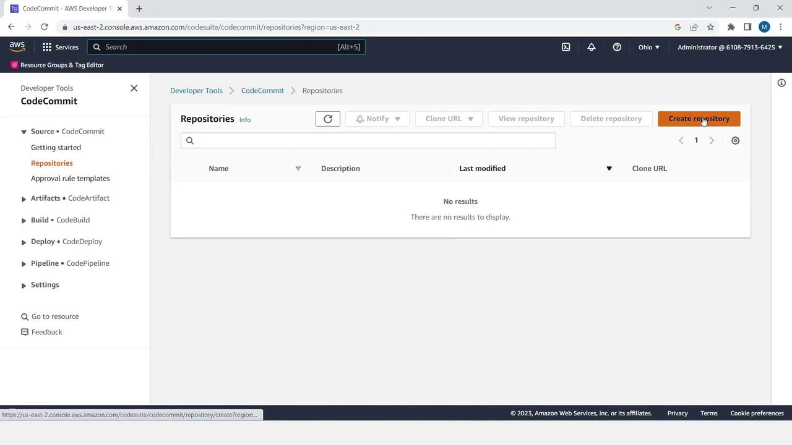
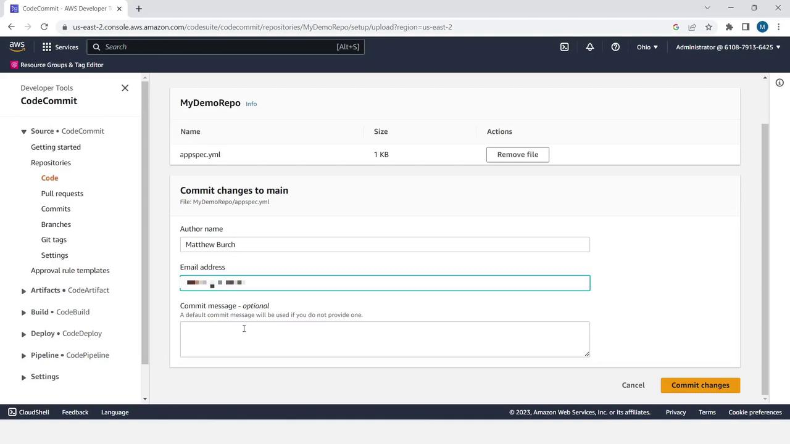
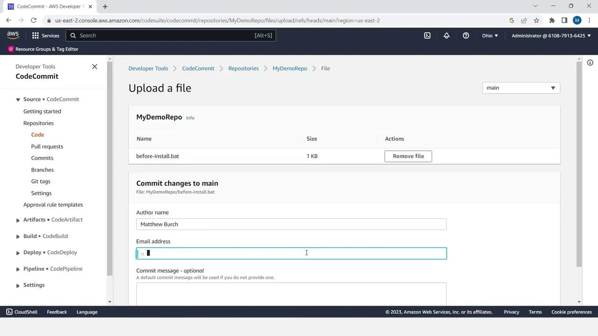
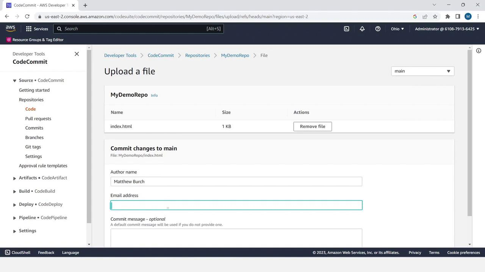
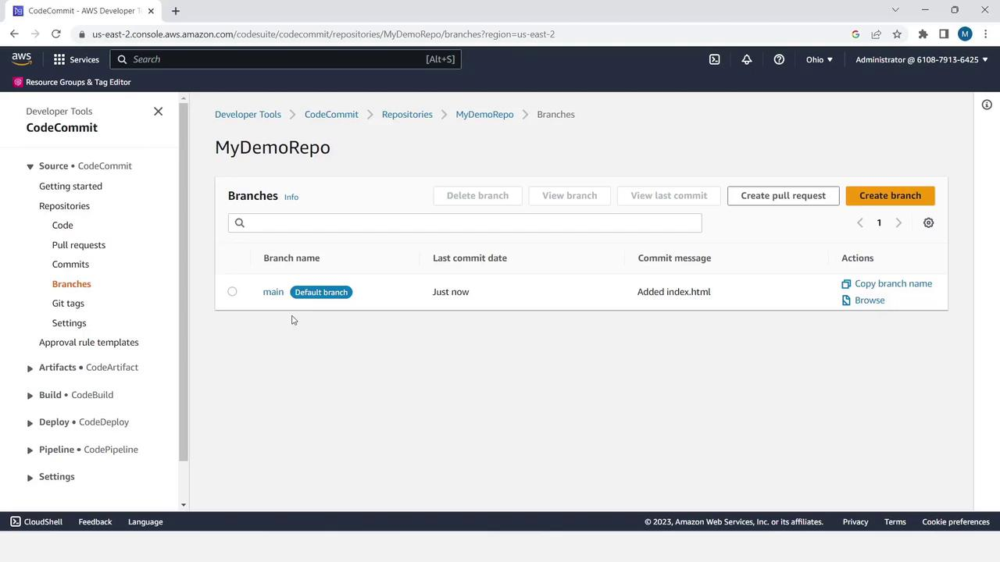
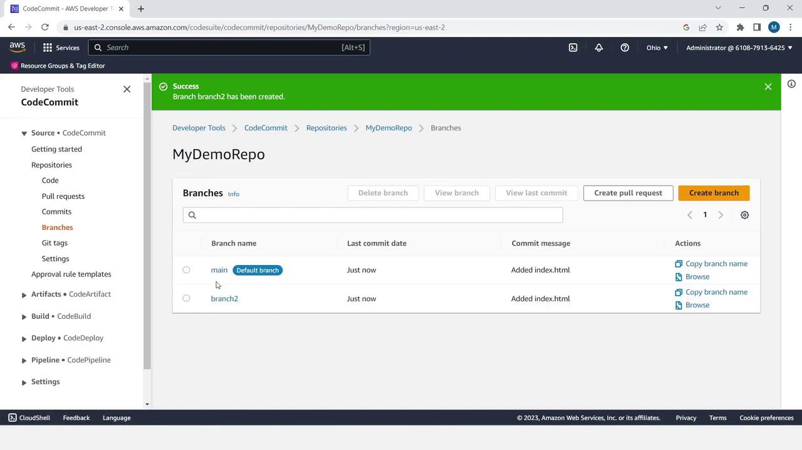
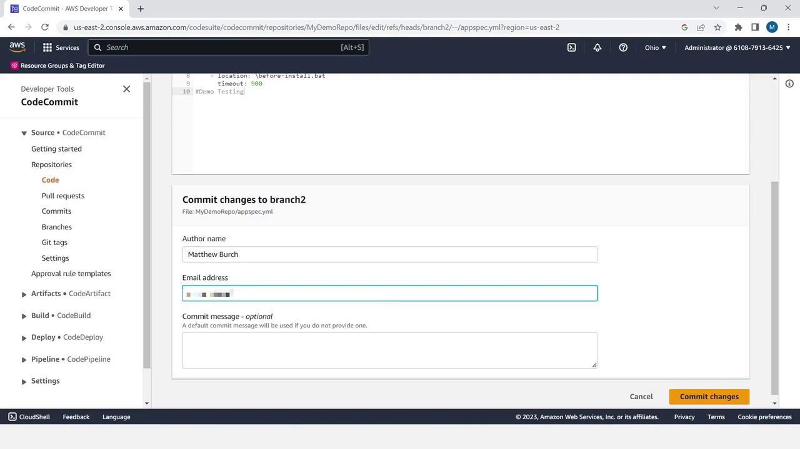

# CodeCommit Demo

Source: https://notes.kodekloud.com/docs/AWS-CodePipeline-CICD-Pipeline/CICD-Pipeline-with-CodeCommit-CodeBuild-and-CodeDeploy/CodeCommit-Demo/page

This tutorial guides users through using AWS CodeCommit in a CI/CD pipeline, covering repository creation, file management, branch handling, and pull request workflows.

Welcome to this comprehensive tutorial on using **AWS CodeCommit** as your source stage in a CI/CD pipeline. You’ll learn how to:

* Create a CodeCommit repository
* Upload and manage files
* Work with branches
* Open and merge a pull request

Feel free to follow along in your own AWS account!

> **lightbulb** AWS CodeCommit seamlessly integrates with other AWS Developer Tools. You can also connect it to your local Git client for advanced workflows.

***

## Table of Contents

1. [Create a Repository](#create-a-repository)
2. [Upload Files](#upload-files)
   * appspec.yml
   * before-install.bat
   * index.html
3. [Branch Management](#branch-management)
4. [Pull Request Workflow](#pull-request-workflow)
5. [Merge and Verify](#merge-and-verify)
6. [Conclusion & References](#conclusion--references)

***

## Create a Repository

1. Sign in to the AWS Management Console and open **CodeCommit**.
2. Click **Create repository**.
3. Provide a name (e.g., `MyDemoRepo`) and an optional description.
4. Click **Create**.



***

## Upload Files

Start by adding the deployment configuration and application assets.

| File               | Description                                |
| ------------------ | ------------------------------------------ |
| appspec.yml        | Defines deployment hooks and file mappings |
| before-install.bat | Installs IIS on Windows target             |
| index.html         | Sample HTML page for testing deployment    |

### 1. Upload `appspec.yml`

1. In the repository, click **Add file** > **Upload file**.
2. Select your local `appspec.yml`.
3. Enter author name, email, commit message (optional), and click **Commit changes**.



```yaml theme={null}
version: 0.0
os: windows
files:
  - source: \index.html
    destination: C:\inetpub\wwwroot
hooks:
  BeforeInstall:
    location: \before-install.bat
    timeout: 900
```

### 2. Upload `before-install.bat`

1. Click **Add file** > **Upload file**.
2. Choose `before-install.bat` from your machine.
3. Fill in author details and click **Commit changes**.



```bat theme={null}
REM Install Internet Information Server (IIS).
c:\Windows\Sysnative\WindowsPowerShell\v1.0\powershell.exe -Command Import-Module -Name ServerManager
c:\Windows\Sysnative\WindowsPowerShell\v1.0\powershell.exe -Command Install-WindowsFeature Web-Server
```

### 3. Upload `index.html`

1. Click **Add file** > **Upload file**.
2. Select `index.html`.
3. Add author info and commit.



```html theme={null}
<!DOCTYPE html>
<html>
<head>
  <meta charset="utf-8">
  <title>Sample Deployment</title>
  <style>
    body {
      color: #ffffff;
      background-color: #0073f3;
      font-family: Arial, sans-serif;
      font-size: 14px;
    }
    h1 { font-size: 500%; margin-bottom: 0; }
    h2 { font-size: 200%; margin-bottom: 0; }
  </style>
</head>
<body>
  <h1>Deployment Successful</h1>
  <h2>Welcome to AWS CodeCommit</h2>
</body>
</html>
```

***

## Branch Management

1. Select **Branches** in the sidebar. You’ll see the default branch named `main`.
2. Click **Create branch**, enter `branch2` as the new branch name, and choose `main` as the source.
3. Click **Create**.





> **lightbulb** Use descriptive branch names that reflect the feature or fix you’re working on.

### Edit a File in `branch2`

1. Switch to `branch2`.
2. Open `appspec.yml` and click **Edit**.
3. Add a comment line at the end, then commit your changes.



```yaml theme={null}
version: 0.0
os: windows
files:
  - source: \index.html
    destination: C:\inetpub\wwwroot
hooks:
  BeforeInstall:
    location: \before-install.bat
    timeout: 900
