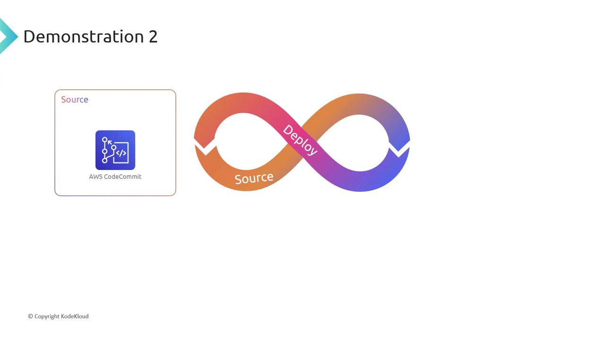
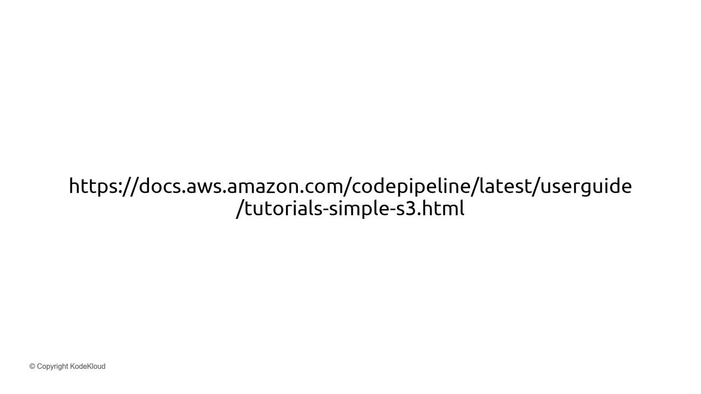
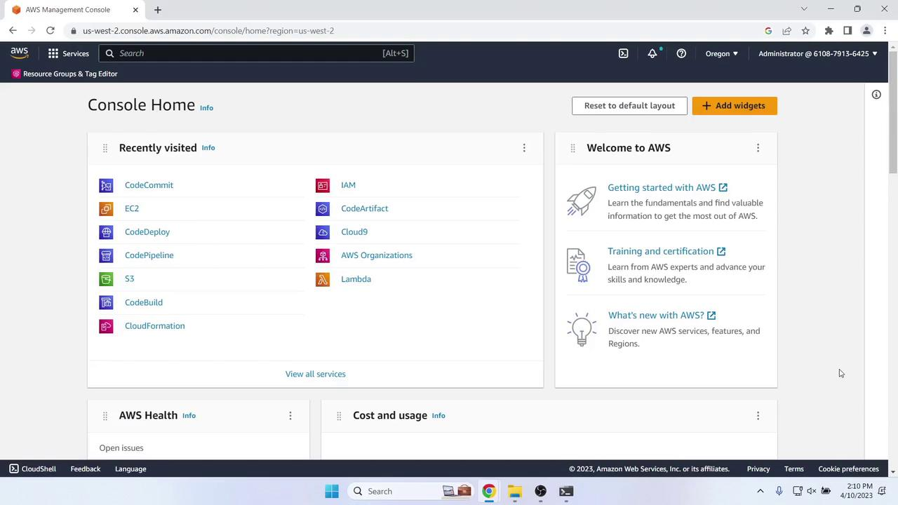
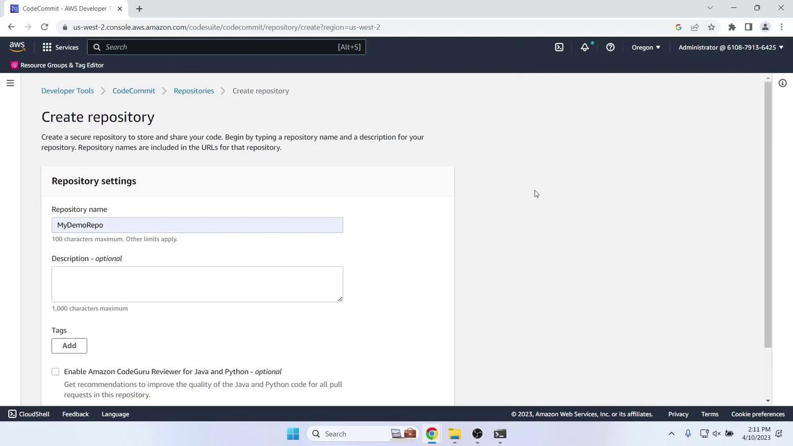
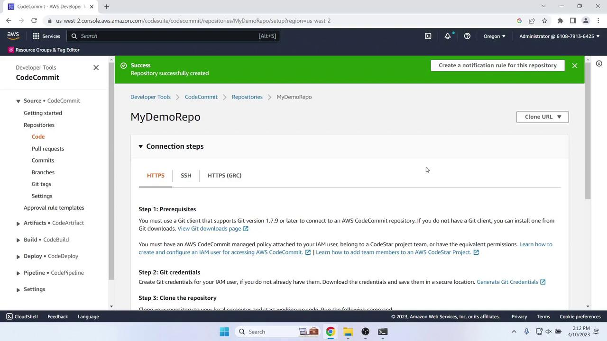

# Demonstration 2 Create 2 Stage Pipeline

Source: https://notes.kodekloud.com/docs/AWS-CodePipeline-CICD-Pipeline/Creating-a-CICD-pipeline-with-AWS-CodePipeline/Demonstration-2-Create-2-Stage-Pipeline/page

Set up a two-stage CI/CD pipeline on AWS using CodeCommit for source control and CodeDeploy for deployment of a sample web application.

In this guide, you’ll set up a simple two-stage CI/CD pipeline on AWS using CodeCommit for source control and CodeDeploy for deployment. We’ll deploy a sample web application to an EC2 instance following the [AWS CodePipeline simple tutorial](https://docs.aws.amazon.com/codepipeline/latest/userguide/tutorials-simple-codepipeline.html).





***

## 1. Create a CodeCommit Repository

1. Sign in to the AWS Management Console and open **CodeCommit**.
2. Ensure your region is set (we’re using **us-west-2**).

> **lightbulb** Always match the region across CodeCommit, CodeDeploy, and EC2 to avoid cross-region issues.

3. Click **Create repository**, name it **MyDemoRepo**, and confirm.





Once the repo is ready, note the clone instructions:



***

## 2. Clone the Repository Locally

On your laptop or workstation:

```bash theme={null}
