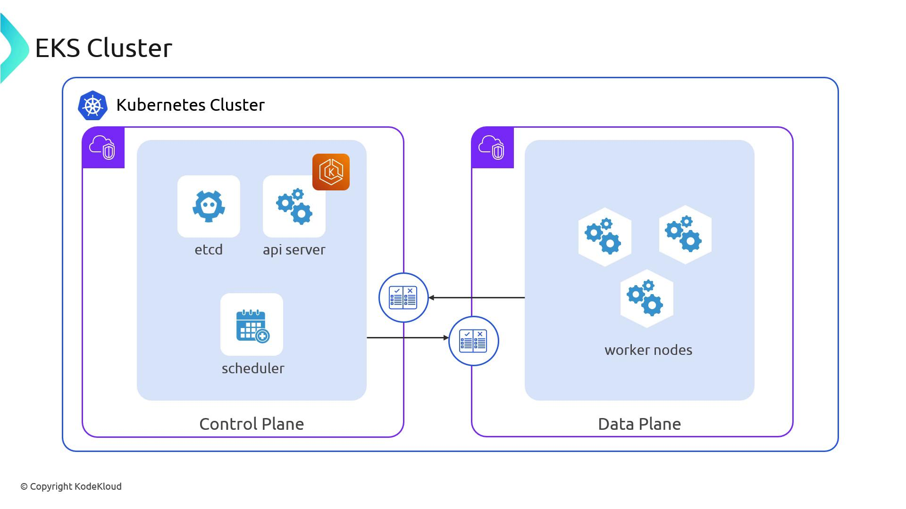
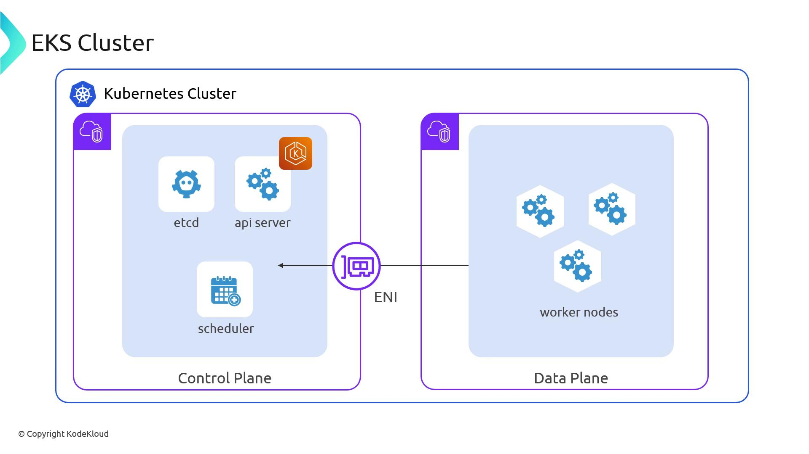

# macOS via Homebrew
brew tap weaveworks/tap && brew install weaveworks/tap/eksctl

# Linux via curl
curl --silent --location "https://github.com/weaveworks/eksctl/releases/latest/download/eksctl_$(uname -s)_amd64.tar.gz" \
  | tar xz -C /usr/local/bin
```

> **lightbulb** Ensure your `eksctl` version matches your EKS control plane version. Check compatibility in the [eksctl release notes][eksctl-docs].

### Quick Start

```bash theme={null}
# Create a new EKS cluster with default settings
eksctl create cluster
```

You can refine your cluster by:

* **Command-line flags**\
  Specify region, node type, AMI, or cluster name directly.
* **YAML config file**\
  Define multiple node groups, custom VPC settings, CIDR blocks, tags, and more.

```yaml theme={null}
# example-cluster-config.yaml
apiVersion: eksctl.io/v1alpha5
kind: ClusterConfig
metadata:
  name: my-eks-cluster
  region: us-west-2
nodeGroups:
  - name: ng-small
    instanceType: t3.medium
    desiredCapacity: 2
```

```bash theme={null}
eksctl create cluster -f example-cluster-config.yaml
```

## eksdemo: Automate Post-Creation Workloads

`eksdemo` builds on `eksctl` to not only manage your EKS cluster but also deploy sample applications, Helm charts, and recommended add-ons with a single command.

* Deploys demos like NGINX, MySQL, or observability stacks
* Installs add-ons: Karpenter, Metrics Server, Cluster Autoscaler
* Applies best-practice labels and annotations

```bash theme={null}
# List available demos
eksdemo list

# Deploy the Metrics Server demo
eksdemo install metrics-server
```

> **lightbulb** Leverage `eksdemo` to validate your cluster setup and speed up learning with preconfigured demos and add-ons.

## AWS IAM Authenticator for Kubernetes

To securely interact with your EKS cluster’s Kubernetes API, install the AWS IAM Authenticator plugin for `kubectl`. It transparently signs API requests using your IAM user or role credentials.

### Installation

```bash theme={null}
# macOS via Homebrew
brew install aws-iam-authenticator

# Linux via curl
curl -o aws-iam-authenticator https://amazon-eks.s3.us-west-2.amazonaws.com/latest/2023-03-11/bin/linux/amd64/aws-iam-authenticator
chmod +x aws-iam-authenticator
mv aws-iam-authenticator /usr/local/bin/
```

### How It Works

1. You run a `kubectl` command against your EKS cluster.
2. The authenticator plugin signs the request with AWS IAM and STS.
3. The EKS API server validates your IAM identity and applies RBAC controls.

```bash theme={null}
kubectl get nodes
```

> **triangle-alert** Without the IAM Authenticator plugin, `kubectl` cannot authenticate to your managed EKS cluster.

***

Now that you have the key tools installed, you’re ready to explore Amazon EKS architecture: Node Groups, auto scaling, VPC networking, and more.

## References

* eksctl on GitHub: [Weaveworks/eksctl][eksctl-docs]
* eksdemo on GitHub: [aws-samples/eksdemo][eksdemo-docs]
* AWS IAM Authenticator: [amazon-eks/aws-iam-authenticator][iam-authenticator-docs]
* Kubernetes Basics: [Kubernetes Documentation][k8s-docs]

[k8s-docs]: https://kubernetes.io/docs/concepts/overview/what-is-kubernetes/

[eksctl-docs]: https://github.com/weaveworks/eksctl

[eksdemo-docs]: https://github.com/aws-samples/eksdemo

[iam-authenticator-docs]: https://github.com/kubernetes-sigs/aws-iam-authenticator

- [Watch Video](https://learn.kodekloud.com/user/courses/aws-eks/module/b84e1a30-d946-4325-96d8-f457dd1817f8/lesson/d95af4b0-d7b1-4998-a9a7-91f0a1ca8030)


# What is EKS

Source: https://notes.kodekloud.com/docs/AWS-EKS/EKS-Fundamentals/What-is-EKS/page

Amazon Elastic Kubernetes Service (EKS) is AWS’s managed Kubernetes offering that simplifies deploying and operating containerized workloads by managing the control plane.

Amazon Elastic Kubernetes Service (EKS) is AWS’s managed Kubernetes offering. By handling the control plane—API servers, etcd, schedulers, controllers—EKS lets you focus on deploying and operating your containerized workloads. Unlike a self-managed Kubernetes cluster, Amazon EKS splits responsibilities: AWS manages the control plane, while you maintain the data plane in your own AWS account.

## Kubernetes Cluster Architecture

A standard Kubernetes cluster consists of two main layers:

1. **Control Plane**
   * etcd (the key/value store)
   * API Server
   * Scheduler
   * Controller Manager

2. **Data Plane**
   * Worker nodes (EC2 instances or AWS Fargate)
   * Pods and containers



For more on Kubernetes components, see the [Kubernetes Documentation](https://kubernetes.io/docs/concepts/overview/components/).

## EKS Shared Responsibility Model

With Amazon EKS, AWS takes care of the highly available, secure control plane, while you manage your worker nodes and application workloads.

| AWS Manages (Control Plane)          | You Manage (Data Plane)                       |
| ------------------------------------ | --------------------------------------------- |
| etcd, API Server, Scheduler          | Worker Nodes (EC2 instances or Fargate)       |
| Controller Manager                   | Operating System patches & node upgrades      |
| Control Plane VPC networking & HA    | Kubernetes workloads, Namespaces, RBAC, CRDs  |
| Automatic backups, updates & scaling | Pod configuration, Security Groups, IAM roles |

> **lightbulb** AWS provisions a dedicated VPC for the control plane and connects it to your VPC using cross-account Elastic Network Interfaces (ENIs).



## Control Plane ↔ Data Plane Communication

Under the hood, your worker nodes in one VPC communicate with the managed control plane in another VPC. AWS uses cross-account ENIs to bridge the two, similar to connecting two physical network switches with a cable:

* **Your Network**: Worker nodes plugged into your VPC.
* **AWS’s Network**: Control plane components housed in AWS’s VPC.

This link ensures secure, low-latency API calls and etcd reads/writes from your pods to the managed control plane.

> **triangle-alert** Make sure your VPC subnets, route tables, and security groups allow traffic between your nodes and the control plane ENIs. Misconfigured rules can cause API connectivity failures.

## Learn More

* [Amazon EKS Documentation](https://docs.aws.amazon.com/eks/latest/userguide/what-is-eks.html)
* [Kubernetes Cluster Architecture](https://kubernetes.io/docs/concepts/overview/components/)
* [AWS VPC Networking](https://docs.aws.amazon.com/vpc/latest/userguide/what-is-amazon-vpc.html)
* [AWS Fargate for EKS](https://docs.aws.amazon.com/eks/latest/userguide/fargate.html)

- [Watch Video](https://learn.kodekloud.com/user/courses/aws-eks/module/b84e1a30-d946-4325-96d8-f457dd1817f8/lesson/e5ba24e8-6d4d-46d7-b1c9-a2388e9f13e4)
