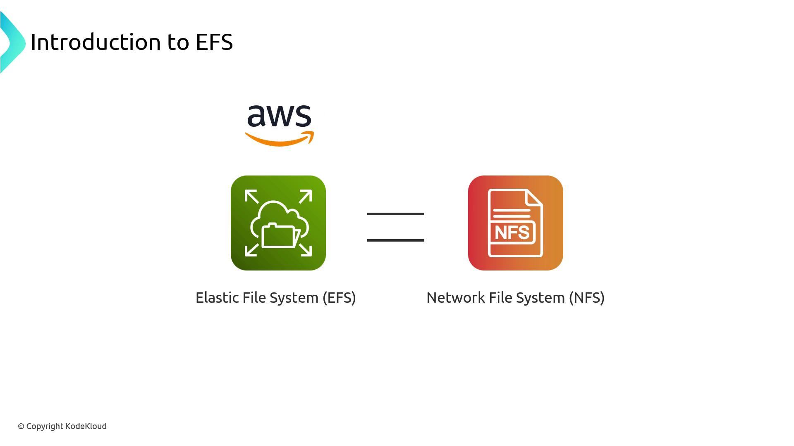
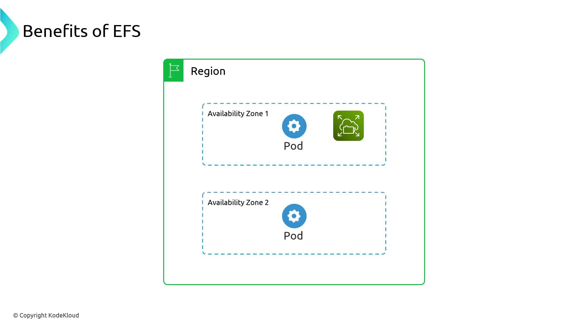
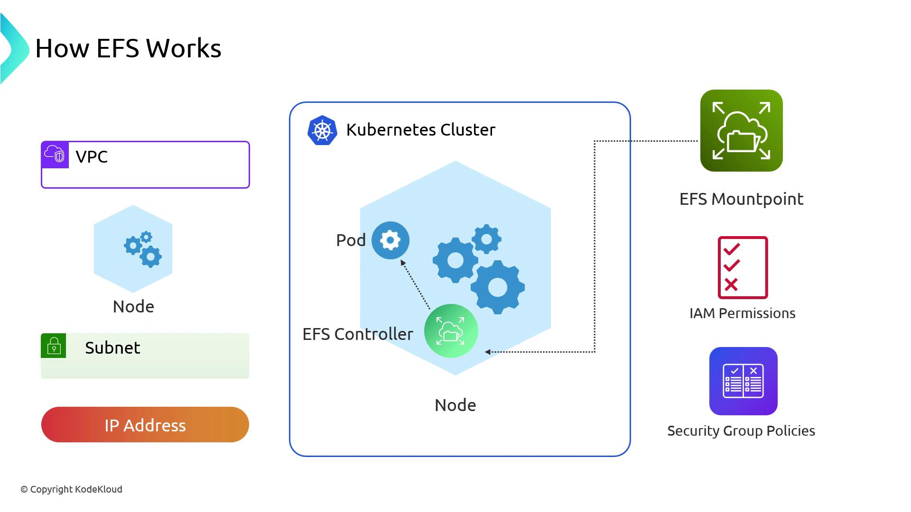
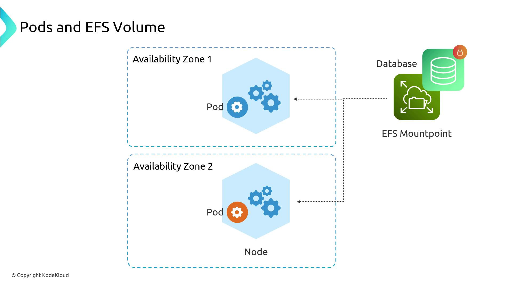
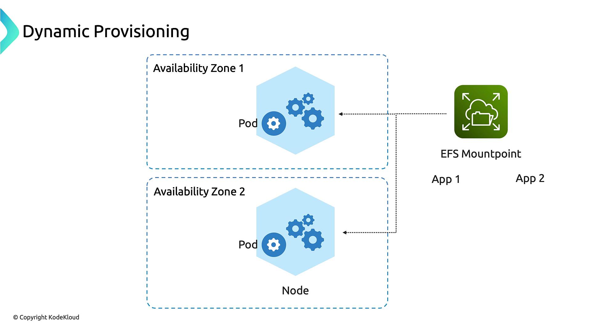
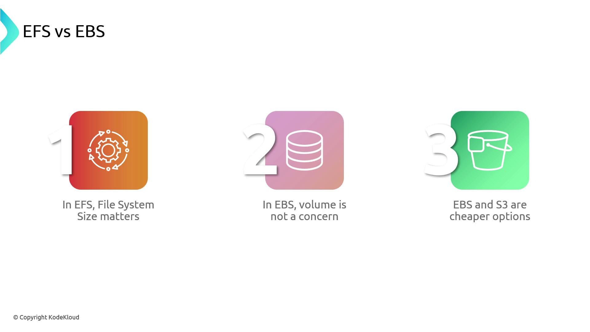

# Inside the container
touch /data/hello
ls /data
# On the host
kubectl delete pod alpine-0
kubectl exec -it alpine-0 -- /bin/sh -c "ls /data"
```

```plain theme={null}
hello  lost+found
```

## Conclusion

By leveraging AWS EBS with the Kubernetes CSI driver, you gain reliable, low-latency, AZ-aware block storage for stateful applications on EKS. Understanding volume types, AZ constraints, and StorageClass configurations ensures robust data persistence for databases, message queues, and other critical workloads.

## Links and References

* [AWS EBS Documentation](https://docs.aws.amazon.com/ebs/)
* [Amazon EKS Documentation](https://docs.aws.amazon.com/eks/)
* [Kubernetes CSI Documentation](https://kubernetes-csi.github.io/docs/)
* [Kubernetes Storage Classes](https://kubernetes.io/docs/concepts/storage/storage-classes/)

<CardGroup>
  <Card title="Watch Video" icon="video" href="https://learn.kodekloud.com/user/courses/aws-eks/module/805f2baf-19cd-465a-84c1-e2650ad43f1f/lesson/b7e4452d-83fa-4f06-b247-43e4ba37597f" />

  <Card title="Practice Lab" icon="installation" href="https://learn.kodekloud.com/user/courses/aws-eks/module/805f2baf-19cd-465a-84c1-e2650ad43f1f/lesson/af11c9fa-eec7-43b5-b2ff-65eda20d7ef2" />
</CardGroup>


# EKS EFSElastic File System

Source: https://notes.kodekloud.com/docs/AWS-EKS/EKS-Storage/EKS-EFSElastic-File-System/page

This guide explores AWS EFS integration with Amazon EKS for shared, scalable file storage in Kubernetes environments.

Elastic File System (EFS) is AWS’s managed NFS service, seamlessly integrating with Amazon EKS to provide shared, scalable file storage for containers. In this guide, we’ll explore EFS essentials, Kubernetes integration, performance considerations, dynamic provisioning, and a cost–capacity comparison with EBS and S3.

<Frame>
  
</Frame>

## What Is Amazon EFS?

EFS delivers a fully managed, elastic NFS file system that automatically scales storage up and down as you add or remove files. It abstracts away capacity planning and low-level configuration, letting developers focus on applications.

<Callout icon="lightbulb">
  EFS provides NFSv4.1/4.2-compatible mounts with POSIX semantics, making it ideal for workloads requiring shared file access across pods and AZs.
</Callout>

## Key Benefits of EFS

| Feature             | Benefit                                                             |
| ------------------- | ------------------------------------------------------------------- |
| Regional Service    | Mount the same file system in multiple Availability Zones (AZs).    |
| Multi-Writer Access | Support many-to-many mounts—pods in different AZs share one volume. |
| Automatic Scaling   | Grow or shrink storage capacity on demand, up to petabyte scale.    |
| Fully Managed NFS   | AWS handles back-end storage, patches, and availability.            |

<Frame>
  
</Frame>

## EFS Integration with Kubernetes

To use EFS in EKS, you perform infrastructure setup outside the cluster, then leverage the EFS CSI driver for mounting:

1. **Provision EFS**
   * Create an EFS file system and mount targets in each subnet.
   * Configure security groups to allow NFS traffic (port 2049) from EKS node subnets.
   * Assign IAM roles or policies permitting `elasticfilesystem:ClientMount` and related actions.

2. **Install the EFS CSI Driver**
   ```bash theme={null}
   helm repo add aws-efs-csi-driver https://kubernetes-sigs.github.io/aws-efs-csi-driver/
   helm install aws-efs-csi-driver aws-efs-csi-driver/aws-efs-csi-driver \
     --namespace kube-system
   ```

3. **Define PV & PVC**
   ```yaml theme={null}
   apiVersion: v1
   kind: PersistentVolume
   metadata:
     name: efs-pv
   spec:
     capacity:
       storage: 5Gi
     volumeMode: Filesystem
     accessModes:
       - ReadWriteMany
     persistentVolumeReclaimPolicy: Retain
     csi:
       driver: efs.csi.aws.com
       volumeHandle: fs-12345678
   ---
   apiVersion: v1
   kind: PersistentVolumeClaim
   metadata:
     name: efs-pvc
   spec:
     accessModes:
       - ReadWriteMany
     resources:
       requests:
         storage: 5Gi
     storageClassName: ""
     volumeName: efs-pv
   ```

4. **Mount in a Pod**
   ```yaml theme={null}
   apiVersion: v1
   kind: Pod
   metadata:
     name: efs-app
   spec:
     containers:
       - name: app
         image: nginx
         volumeMounts:
           - name: efs-vol
             mountPath: /usr/share/nginx/html
     volumes:
       - name: efs-vol
         persistentVolumeClaim:
           claimName: efs-pvc
   ```

<Frame>
  
</Frame>

With the CSI driver, pods in any AZ can mount the same file system concurrently:

<Frame>
  
</Frame>

## Performance and Workload Considerations

EFS offers shared read/write access but inherits NFS characteristics:

* **File locking** may block concurrent writes on the same file.
* **Latency** can be higher than block storage for small-file operations.
* **Throughput** scales with burst credits and Provisioned Throughput modes.

<Callout icon="triangle-alert">
  Running high-concurrency databases on EFS can cause I/O contention due to file locks. Evaluate workload patterns and test performance before production use.
</Callout>

## Dynamic Provisioning

The EFS CSI driver supports creating subdirectories under one mount target for isolated PVCs. This simplifies management compared to a generic NFS provisioner:

```yaml theme={null}
apiVersion: storage.k8s.io/v1
kind: StorageClass
metadata:
  name: efs-sc
provisioner: efs.csi.aws.com
parameters:
  provisioningMode: efs-ap
  fileSystemId: fs-12345678
  directoryPerms: "750"
reclaimPolicy: Delete
volumeBindingMode: Immediate
```

When you create a PVC using this storage class, the driver auto-creates a subpath:

```yaml theme={null}
kind: PersistentVolumeClaim
apiVersion: v1
metadata:
  name: app1-pvc
spec:
  storageClassName: efs-sc
  accessModes:
    - ReadWriteMany
  resources:
    requests:
      storage: 1Gi
```

<Frame>
  
</Frame>

## EFS vs. EBS vs. S3: Cost and Capacity Trade-offs

| Storage Type | Access Pattern       | AZ Scope  | Cost Tier | Ideal Use Case                        |
| ------------ | -------------------- | --------- | --------- | ------------------------------------- |
| EFS          | NFS, multi-writer    | Regional  | \$\$      | Shared file storage, web assets       |
| EBS          | Block, single-writer | Single AZ | \$        | High IOPS databases, low-latency apps |
| S3           | Object               | Regional  | \$        | Backups, archives, static hosting     |

<Frame>
  
</Frame>

Choose EFS for cross-AZ, multi-writer scenarios with POSIX semantics. Opt for EBS when you need high-performance block storage. Use S3 for inexpensive, scalable object storage.

***

## Further Reading

* [Amazon EFS Documentation](https://docs.aws.amazon.com/efs/latest/ug/what-is-efs.html)
* [AWS EFS CSI Driver](https://github.com/kubernetes-sigs/aws-efs-csi-driver)
* [Kubernetes Persistent Volumes](https://kubernetes.io/docs/concepts/storage/persistent-volumes/)

<CardGroup>
  <Card title="Watch Video" icon="video" href="https://learn.kodekloud.com/user/courses/aws-eks/module/805f2baf-19cd-465a-84c1-e2650ad43f1f/lesson/46e94d31-dbcd-4045-8c04-9723974e7f45" />
</CardGroup>
