# e.g. http://10.0.1.15:35611
```

```yaml theme={null}
apiVersion: v1
kind: Service
metadata:
  name: myapp-nodeport
spec:
  type: NodePort
  ports:
    - port: 80
      nodePort: 30080
  selector:
    app: myapp
```

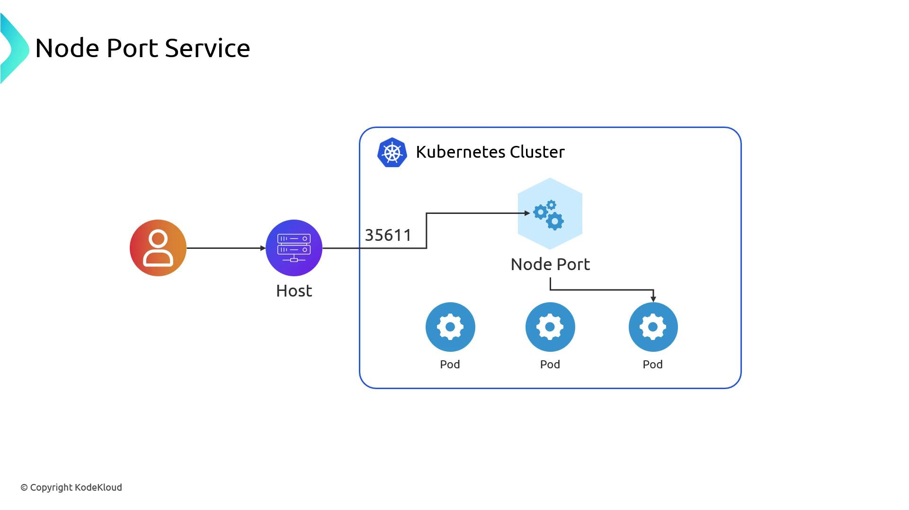

### LoadBalancer Service

Setting `type: LoadBalancer` still opens the NodePort, but also provisions an external load balancer that fronts all nodes and handles health checks, distributing traffic automatically:

```yaml theme={null}
apiVersion: v1
kind: Service
metadata:
  name: myapp-loadbalancer
spec:
  type: LoadBalancer
  ports:
    - port: 80
  selector:
    app: myapp
```

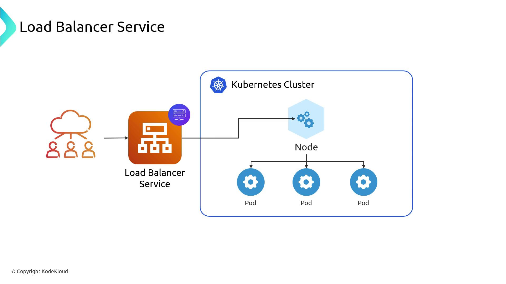

### Health Checks and kube-proxy

By default, the cloud load balancer health-checks every node, even those without Pods for this Service. When traffic lands on an empty node, `kube-proxy` reroutes it to a healthy node, possibly incurring cross-AZ hops.

> **lightbulb** Set `externalTrafficPolicy: Local` on your Service to ensure only nodes with active Pods are in the load balancer’s target group. This reduces extra hops and cross-zone charges.

```yaml theme={null}
spec:
  type: LoadBalancer
  externalTrafficPolicy: Local
  selector:
    app: myapp
```

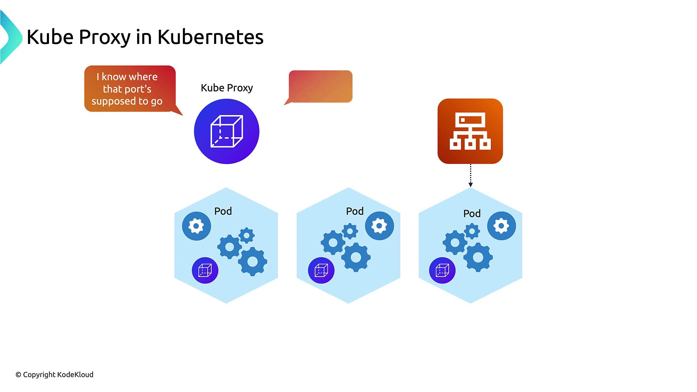

## AWS Load Balancer Controller

The AWS Load Balancer Controller observes Services (and Ingresses) annotated for a load balancer. It then:

* Provisions ALBs, NLBs, or Classic ELBs
* Configures security groups, listener rules, and target groups
* Keeps resources in sync with Kubernetes objects

Annotations for an ALB might look like:

```yaml theme={null}
metadata:
  annotations:
    service.beta.kubernetes.io/aws-load-balancer-type: alb
    service.beta.kubernetes.io/aws-load-balancer-target-type: ip
```

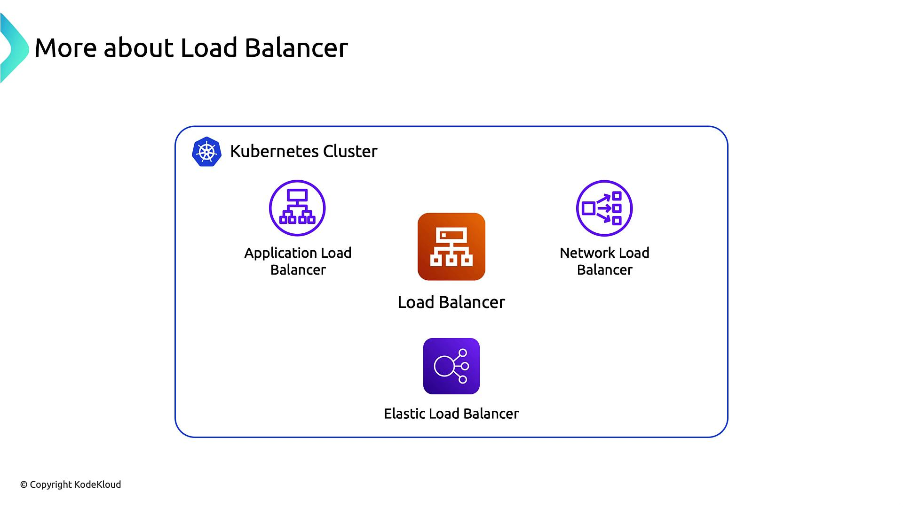

## Integrating External DNS

To automate DNS entries in Route 53 (or other providers), run [External DNS](https://github.com/kubernetes-sigs/external-dns/) alongside the Load Balancer Controller. External DNS watches Services and Ingresses and creates DNS records pointing to your ALB/NLB.

For example, a Service named `myapp.fun` can automatically generate a `myapp.fun` A record in Route 53 that resolves to your load balancer.

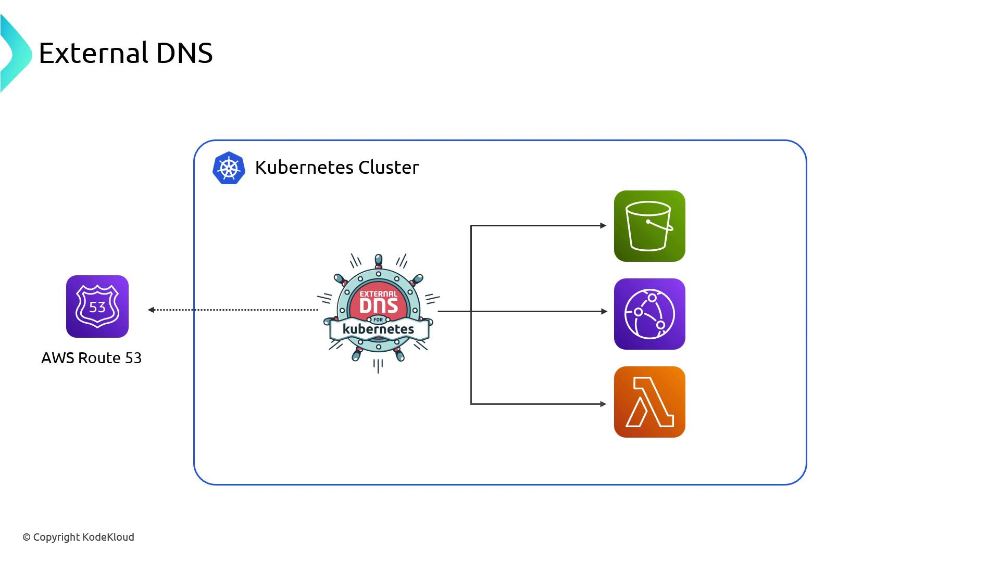

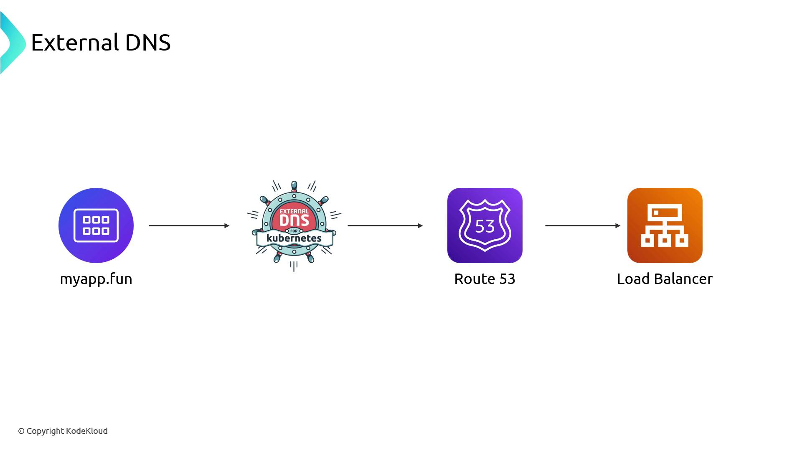

## Global Load Balancer

AWS offers a Global Load Balancer for routing traffic across regions. You point a Route 53 alias to it and distribute traffic to regional ALBs/NLBs with failover or weighted policies. Currently, the AWS Load Balancer Controller manages only regional resources, but global support may arrive in future releases.

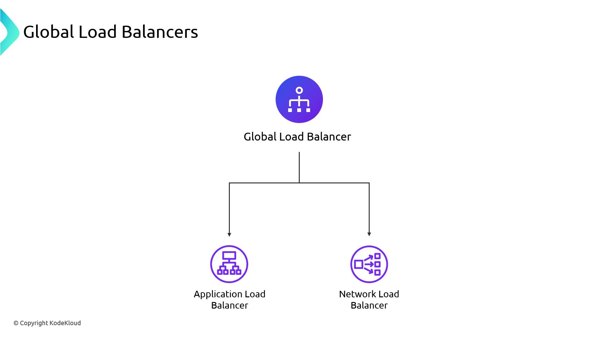

## Summary

* Kubernetes Services (`NodePort` and `LoadBalancer`) expose Pods to external traffic
* `kube-proxy` handles traffic forwarding when nodes are healthy
* AWS Load Balancer Controller automates ALB, NLB, and ELB provisioning
* External DNS with Route 53 automates DNS record management
* AWS Global Load Balancer enables multi-region routing and failover

Ingress resources can also be integrated with the AWS Load Balancer Controller for advanced HTTP routing.

## Links and References

* [Kubernetes Services](https://kubernetes.io/docs/concepts/services-networking/service/)
* [AWS Load Balancer Controller GitHub](https://github.com/kubernetes-sigs/aws-load-balancer-controller)
* [External DNS](https://github.com/kubernetes-sigs/external-dns/)
* [Route 53 Documentation](https://docs.aws.amazon.com/route53/)
* [Amazon EKS Load Balancer Guide](https://docs.aws.amazon.com/eks/latest/userguide/load-balancing.html)

- [Watch Video](https://learn.kodekloud.com/user/courses/aws-eks/module/3242702b-09b2-43c8-9bbe-283c1d64c685/lesson/a432f1ea-d443-4067-b602-501fcb296f9b)


# VPC Lattice

Source: https://notes.kodekloud.com/docs/AWS-EKS/Load-Balancers/VPC-Lattice/page

This article explores the Kubernetes Gateway API and its implementation on AWS through VPC Lattice, covering traffic flow, advanced features, and service networking.

In this article, we’ll dive into the Kubernetes Gateway API—the next-generation v2 of Ingress—and see how AWS implements it via VPC Lattice. You’ll learn:

* Traffic flow into Kubernetes clusters
* Advanced features of the Gateway API
* How VPC Lattice extends service networking across VPCs, accounts, and regions

***

## Kubernetes Gateway API Overview

Ingress controllers route Layer 7 traffic based on hosts or URL paths. The Gateway API extends this by supporting multiple protocols (HTTP, TCP, UDP, gRPC, TLS) and offering more granular control.

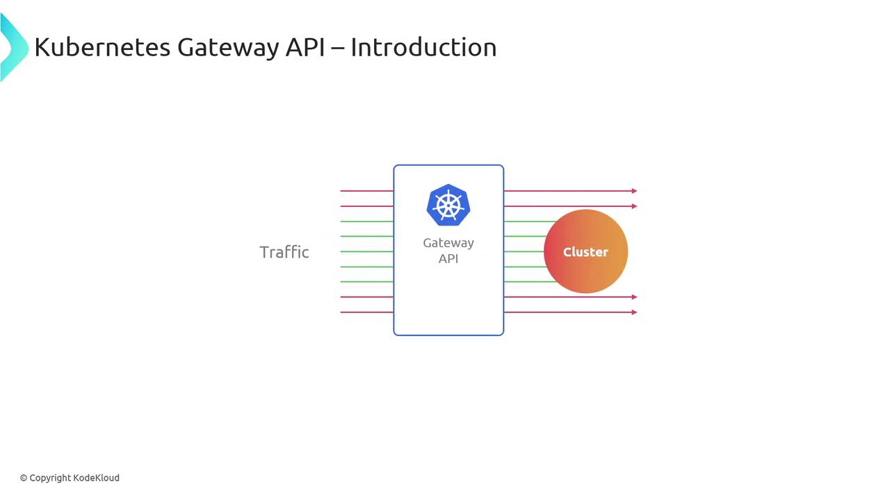

In AWS EKS, the **Lattice Controller** serves as a specialized Gateway Controller, managing Gateway API resources for you.

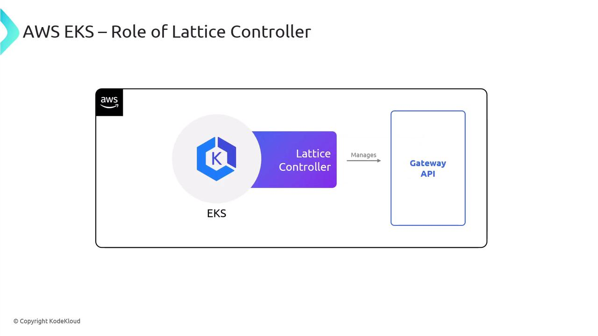

***

## Traditional Ingress vs. Gateway API

With a traditional Ingress setup, you deploy an Ingress Controller behind an external Load Balancer. The controller inspects HTTP requests and forwards them to Services by host or path.

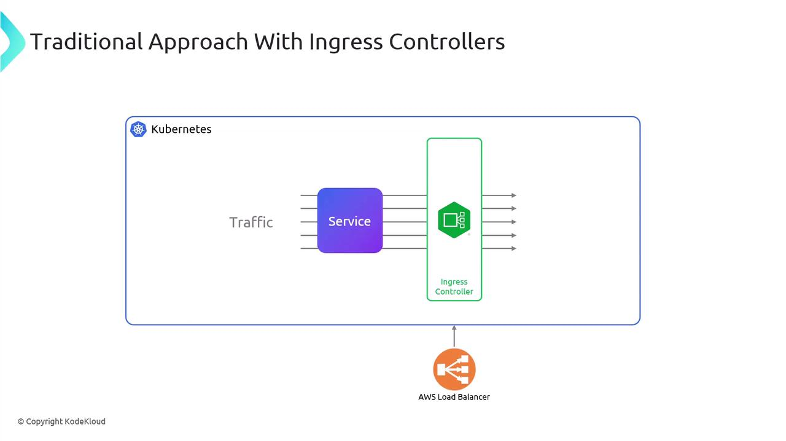

The Gateway API preserves this topology—external Load Balancer plus in-cluster controller—but introduces three core resources:

| Resource     | Purpose                                                               | Example Use Case                    |
| ------------ | --------------------------------------------------------------------- | ----------------------------------- |
| GatewayClass | Selects the controller implementation (e.g., Lattice, Istio)          | `gateway.networking.k8s.io/v1beta1` |
| Gateway      | Binds external listeners (ports/protocols) to Routes                  | Expose HTTP on port 80              |
| Route Types  | Split by protocol: HTTPRoute, TLSRoute, TCPRoute, UDPRoute, GRPCRoute | Fine-grained traffic matching rules |

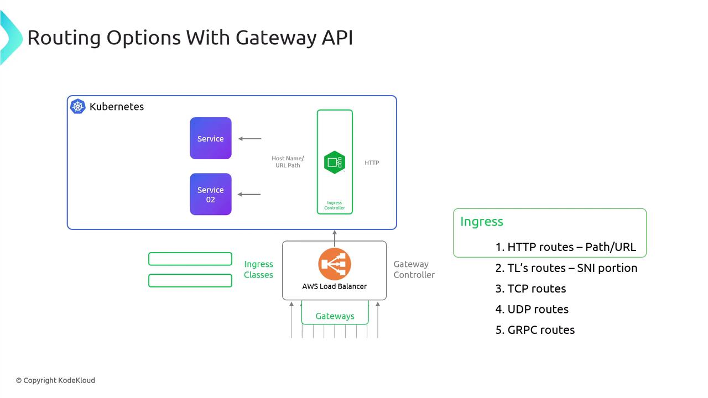

***

## AWS VPC Lattice Service Networks

AWS VPC Lattice offers a service-mesh–style abstraction for your VPCs without the complexity of peering or Transit Gateways. Central to this model is the **Service Network**, which uses AWS Cloud Map to register endpoints and perform service discovery.

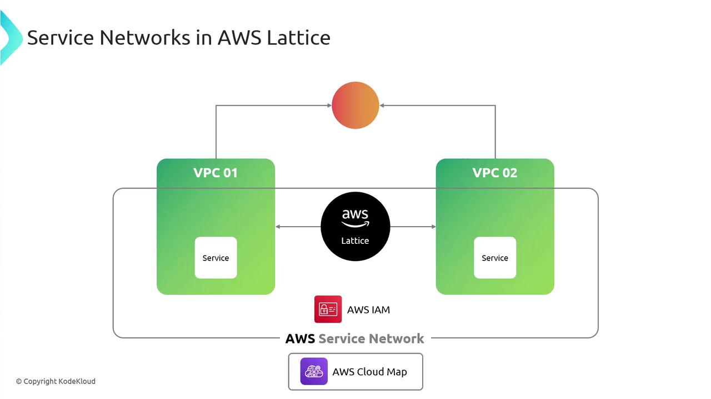

When Kubernetes workloads join a Lattice Service Network, pod IPs are flattened across clusters just as a CNI flattens IPs inside a cluster.

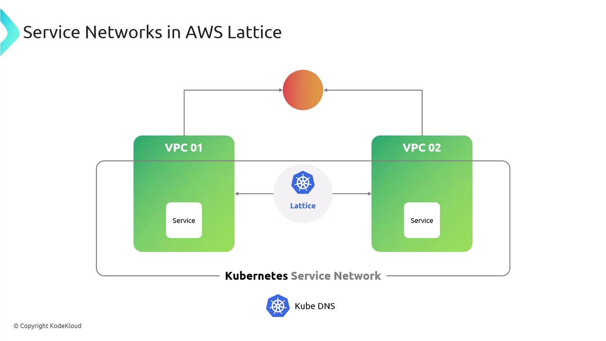

***

## Integrating Kubernetes with VPC Lattice

Here’s how traffic flows when a pod communicates across the Service Network:

1. Pod sends a request to a Service Network DNS name.
2. The Lattice Gateway Controller creates and updates service endpoints in Cloud Map.
3. The request traverses the Service Network to reach the target endpoint (pod, EC2, or Lambda).
4. A gateway at the target side injects traffic into its local CNI or compute runtime.

> **lightbulb** AWS Lattice supports hybrid environments—traffic can route to other EKS clusters, EC2 instances, AWS Lambda, or external services registered in Cloud Map.

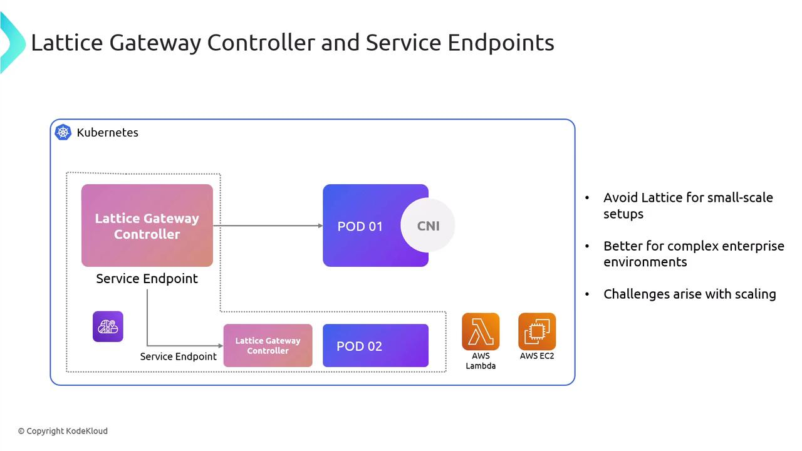

***

## Considerations and Challenges

While VPC Lattice streamlines cross-VPC communication, there are trade-offs:

| Challenge            | Impact                                                                    |
| -------------------- | ------------------------------------------------------------------------- |
| IAM Dependency       | Every service call relies on IAM policies—complex rules for pods/services |
| Provisioning Latency | Service Network and Cloud Map updates can take 5–10 minutes to complete   |

> **triangle-alert** Frequent Gateway API or Service Network changes may incur delays. Plan your deployment workflows to batch updates when possible.


AWS VPC Lattice is ideal for **enterprise-scale** environments requiring strict isolation and multi-account routing. For smaller clusters or simpler cross-cluster needs, consider lighter-weight solutions like native Kubernetes Service or Ingress.

***

## Links and References

* [Kubernetes Gateway API](https://gateway-api.sigs.k8s.io/)
* [AWS VPC Lattice Documentation](https://docs.aws.amazon.com/vpc-lattice/latest/ug/)
* [AWS Cloud Map](https://docs.aws.amazon.com/cloud-map/latest/dg/what-is-cloud-map.html)
* [Kubernetes Ingress vs. Gateway API Comparison](https://kubernetes.io/docs/concepts/services-networking/gateway/)

- [Watch Video](https://learn.kodekloud.com/user/courses/aws-eks/module/3242702b-09b2-43c8-9bbe-283c1d64c685/lesson/d2dc823c-f06a-4421-a9ab-091b8d897c77)

  - [Practice Lab](https://learn.kodekloud.com/user/courses/aws-eks/module/3242702b-09b2-43c8-9bbe-283c1d64c685/lesson/b6cf3976-afb2-4a72-b259-4ffdfe026646)
