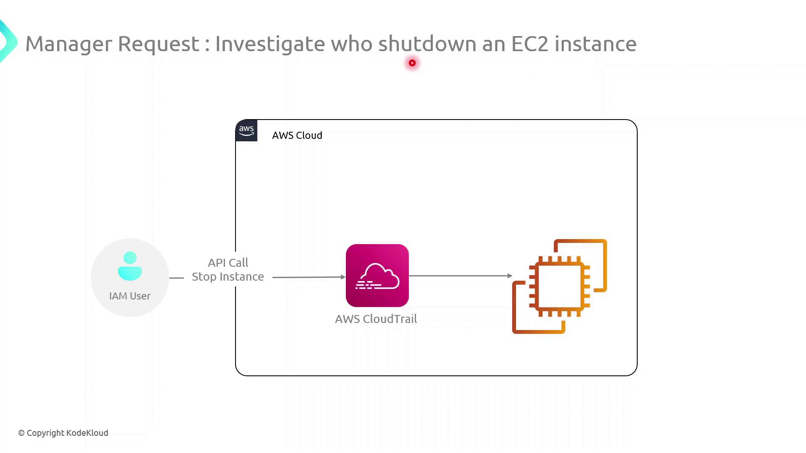
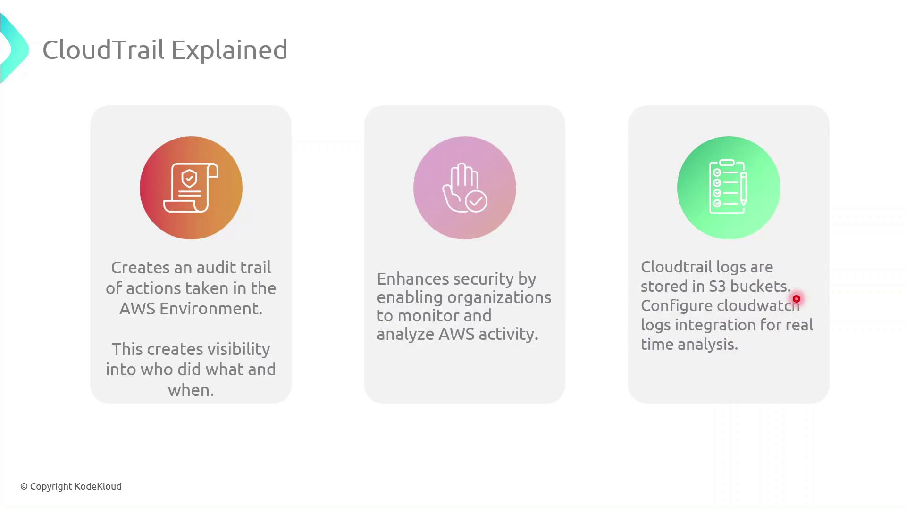

# Create a new trail that delivers logs to S3
aws cloudtrail create-trail \
  --name MyCloudTrail \
  --s3-bucket-name my-cloudtrail-bucket \
  --is-multi-region-trail

# Start logging events for the trail
aws cloudtrail start-logging \
  --name MyCloudTrail
```

<Callout icon="lightbulb">
  Enable CloudTrail Insights to detect unusual API activities, such as spikes in resource provisioning or configurations changes.
</Callout>

## Amazon CloudWatch

Amazon CloudWatch collects logs and metrics from AWS services and your applications, allowing you to build dashboards, set alarms, and route log data to various targets.

1. Create a CloudWatch Log Group:

   ```bash theme={null}
   aws logs create-log-group --log-group-name /my-application/logs
   ```

2. Install and configure the CloudWatch Agent on your EC2 instances:

   ```bash theme={null}
   # On Amazon Linux 2
   sudo yum install -y amazon-cloudwatch-agent
   sudo /opt/aws/amazon-cloudwatch-agent/bin/amazon-cloudwatch-agent-config-wizard
   sudo systemctl start amazon-cloudwatch-agent
   ```

3. Define alarms based on metrics:

   ```bash theme={null}
   aws cloudwatch put-metric-alarm \
     --alarm-name HighCPUUtilization \
     --metric-name CPUUtilization \
     --namespace AWS/EC2 \
     --statistic Average \
     --period 300 \
     --threshold 80 \
     --comparison-operator GreaterThanOrEqualToThreshold \
     --dimensions Name=InstanceId,Value=i-0123456789abcdef0 \
     --evaluation-periods 2 \
     --alarm-actions arn:aws:sns:us-east-1:123456789012:NotifyMe
   ```

## AWS Config

AWS Config continuously evaluates resource configurations against desired settings. It records configuration changes and can trigger automated remediation.

```bash theme={null}
# Create an S3 bucket and SNS topic for AWS Config delivery
aws s3 mb s3://my-config-bucket
aws sns create-topic --name config-topic

# Set up the configuration recorder
aws configservice put-configuration-recorder \
  --configuration-recorder name=default,roleARN=arn:aws:iam::123456789012:role/AWSConfigRole

# Specify where to deliver configuration snapshots
aws configservice put-delivery-channel \
  --delivery-channel name=default \
  --s3-bucket-name my-config-bucket \
  --sns-topic-arn arn:aws:sns:us-east-1:123456789012:config-topic

# Start recording
aws configservice start-configuration-recorder --configuration-recorder-name default
```

<Callout icon="triangle-alert">
  AWS Config is enabled per region. Be sure to deploy your recorder and delivery channel in each region where you have resources.
</Callout>

## Next Steps

* Consolidate logs from AWS CloudTrail, CloudWatch, and AWS Config into a centralized SIEM or log analytics platform.
* Define custom CloudWatch dashboards to monitor key metrics in real time.
* Use AWS Config Conformance Packs for pre-built compliance frameworks.

## Links and References

* [AWS CloudTrail Documentation](https://docs.aws.amazon.com/cloudtrail/)
* [Amazon CloudWatch Documentation](https://docs.aws.amazon.com/cloudwatch/)
* [AWS Config Documentation](https://docs.aws.amazon.com/config/)

<CardGroup>
  <Card title="Watch Video" icon="video" href="https://learn.kodekloud.com/user/courses/aws-iam/module/586f5114-fd4d-45e3-88ba-6a691fde129c/lesson/048799c5-bf74-40c3-8607-89445f79440b" />
</CardGroup>


# CloudTrail

Source: https://notes.kodekloud.com/docs/AWS-IAM/Configure-AWS-IAM-at-Scale/CloudTrail/page

This guide explains how to use AWS CloudTrail to audit and trace EC2 instance shutdowns by identifying the IAM user responsible for the action.

CloudTrail provides a comprehensive audit trail of all API calls in your AWS account. In this guide, you’ll learn how to trace which IAM user issued the `StopInstances` command to shut down an EC2 instance.

## Table of Contents

* [Use Case: Investigating EC2 Shutdown](#use-case-investigating-ec2-shutdown)
* [How CloudTrail Works](#how-cloudtrail-works)
* [Key Features](#key-features)
* [Demo: Finding the StopInstances Event](#demo-finding-the-stopinstances-event)
* [Best Practices](#best-practices)
* [References](#references)

***

## Use Case: Investigating EC2 Shutdown

When an unexpected EC2 instance stops, you need to know who performed that action. CloudTrail captures every API call, making it straightforward to identify the culprit.

<Frame>
  
</Frame>

## How CloudTrail Works

1. An IAM user or role issues an API request (e.g., `StopInstances`).
2. CloudTrail records the request details: caller identity, API action, resource ARNs, and timestamp.
3. Logs are delivered to an S3 bucket (or optionally to CloudWatch Logs) for storage and analysis.

<Callout icon="lightbulb">
  Make sure you have at least one active trail in the region where your EC2 instances run.\
  Configure multi-region logging for global coverage.
</Callout>

## Key Features

| Feature                 | Description                                                       |
| ----------------------- | ----------------------------------------------------------------- |
| Audit Trail             | Complete history of all API calls for compliance and forensic use |
| Visibility & Security   | Detect unusual behavior by monitoring account activity            |
| Centralized Log Storage | Store logs in Amazon S3 for long-term retention                   |
| Real-time Monitoring    | Integrate with CloudWatch Logs to trigger alerts instantly        |

<Frame>
  
</Frame>

## Demo: Finding the StopInstances Event

Follow these steps in the AWS Management Console or use the AWS CLI to locate the `StopInstances` event.

### AWS Management Console

1. Open the **CloudTrail** service.
2. Click **Event history**.
3. In the filter bar, select **Event name** and enter `StopInstances`.
4. Review each entry’s:
   * **Event time**
   * **Username** (IAM user or role)
   * **Resources** (affected EC2 instance ARNs)

### AWS CLI

```bash theme={null}
aws cloudtrail lookup-events \
  --lookup-attributes AttributeKey=EventName,AttributeValue=StopInstances \
  --max-results 10
```

This returns a JSON list of matching events. Inspect the `Username`, `EventTime`, and `Resources` fields to pinpoint who stopped the instance.

<Callout icon="triangle-alert">
  If your trail isn’t configured to deliver logs to CloudWatch Logs, you won’t get real-time alerts.\
  Enable CloudWatch integration in the trail settings to receive immediate notifications.
</Callout>

## Best Practices

* Enable **multi-region trails** to capture global AWS API activity.
* Encrypt log files with SSE-KMS for data protection.
* Implement **log file validation** to ensure integrity.
* Configure **lifecycle policies** in S3 to archive or delete old logs.

## References

* [AWS CloudTrail User Guide](https://docs.aws.amazon.com/cloudtrail/latest/userguide/)
* [AWS CloudTrail API Reference](https://docs.aws.amazon.com/cloudtrail/latest/APIReference/)
* [Monitoring CloudTrail with CloudWatch](https://docs.aws.amazon.com/AmazonCloudWatch/latest/logs/WhatIsCloudWatchLogs.html)
* [Managing S3 Lifecycle Policies](https://docs.aws.amazon.com/AmazonS3/latest/userguide/lifecycle-configuration-examples.html)

<CardGroup>
  <Card title="Watch Video" icon="video" href="https://learn.kodekloud.com/user/courses/aws-iam/module/586f5114-fd4d-45e3-88ba-6a691fde129c/lesson/3f50db97-eef8-43a7-957a-8b1bf3e8fbb0" />
</CardGroup>
