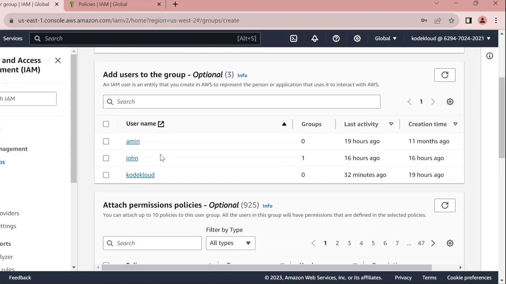
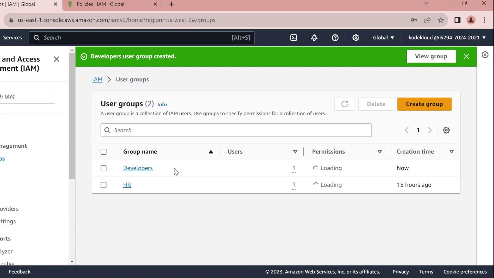
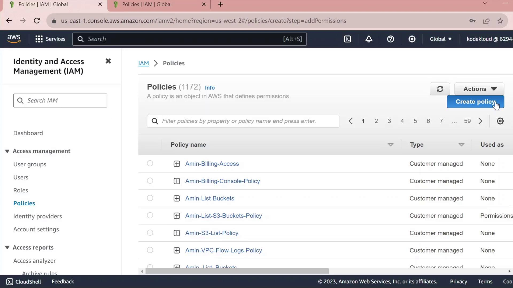
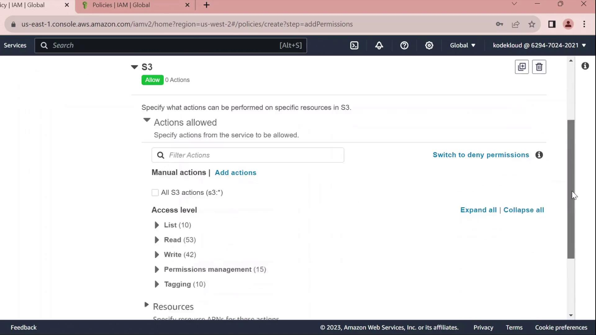
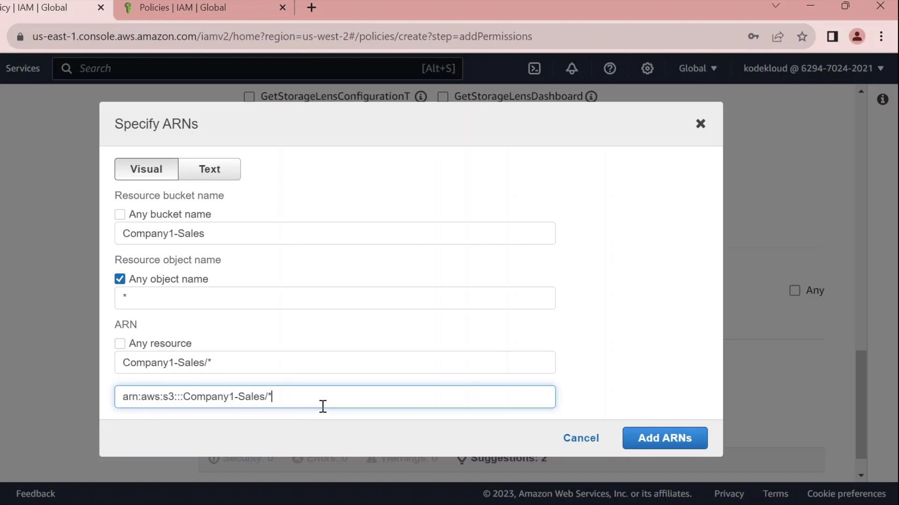
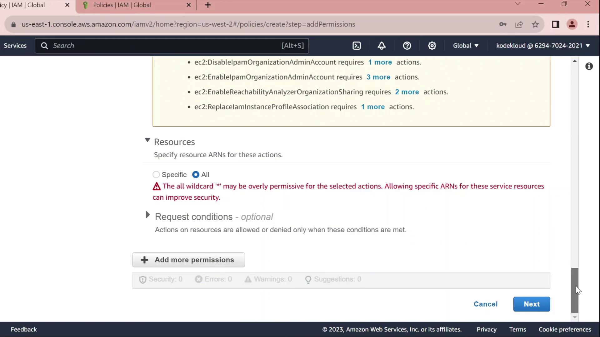
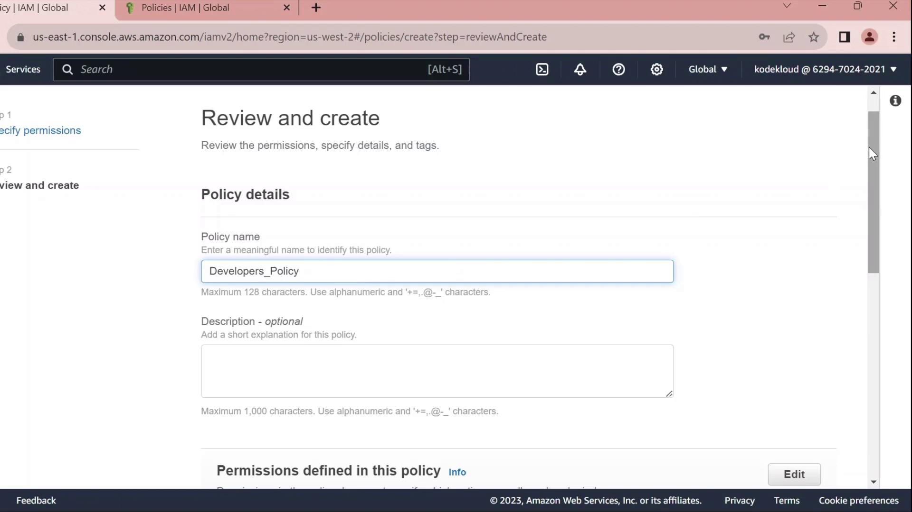
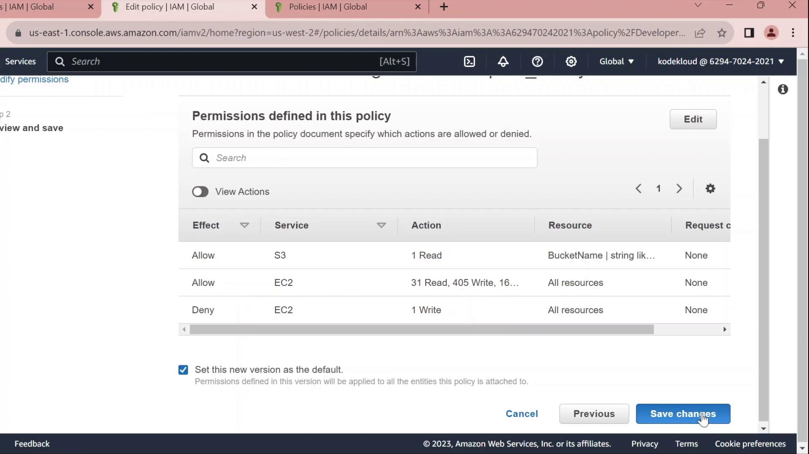

# Demo Identity Policy

Source: https://notes.kodekloud.com/docs/AWS-IAM/Introduction-to-AWS-Identity-and-Access-Management/Demo-Identity-Policy/page

This tutorial teaches how to create a custom IAM identity policy in AWS and manage permissions for a user group.

In this tutorial, you’ll learn how to create a custom IAM identity policy in AWS, attach it to a user group, and then refine its permissions using both the Visual editor and the JSON editor. By the end, you’ll have a policy that grants S3 read access, full EC2 permissions, and explicitly denies the ability to stop EC2 instances.

***

## 1. Create a Developers Group

1. In the AWS Management Console, navigate to **IAM** → **User groups**.
2. Click **Create group**, name it **Developers**, and add the user **John** to the group.
3. Skip attaching any policies for now and finish the wizard.

<Frame>
  
</Frame>

Once created, you’ll see **Developers** listed without any permissions:

<Frame>
  
</Frame>

***

## 2. Create a Custom Policy

1. In the IAM sidebar, select **Policies**.
2. Click **Create policy**.

<Frame>
  
</Frame>

### 2.1 Grant S3 Read Access

* Under **Service**, choose **S3**.
* In **Actions**, expand **Read** and check **GetObject**.
* Under **Resources** → **Add ARN**, enter:
  * Bucket: `company1-sales`
  * Object: `*`\
    The console will build the ARN for you.

<Frame>
  
</Frame>

<Frame>
  
</Frame>

### 2.2 Grant EC2 Full Access

* Click **Add permissions** → **EC2**.
* Select **All EC2 actions** under **Actions**.
* Leave the resource set to `*` for all instances.

<Callout icon="triangle-alert">
  Using `*` for resources grants full access to all EC2 instances. In production, scope this down by specifying ARNs for specific instances or regions.
</Callout>

<Frame>
  
</Frame>

<Frame>
  
</Frame>

### 2.3 Review, Name, and Create

1. Click **Next** until you reach **Review policy**.
2. Set **Name** to `Developers_Policy` and add an optional description.
3. Click **Create policy**.

<Frame>
  
</Frame>

***

## 3. Attach Policy to the Developers Group

1. Return to **IAM** → **User groups**.
2. Select **Developers**.
3. Under the **Permissions** tab, click **Attach policies**.
4. Search for and select **Developers\_Policy**, then click **Attach policy**.

Once attached, you can click the **JSON** icon to inspect the policy:

```json theme={null}
{
  "Version": "2012-10-17",
  "Statement": [
    {
      "Sid": "VisualEditor0",
      "Effect": "Allow",
      "Action": "ec2:*",
      "Resource": "*"
    },
    {
      "Sid": "VisualEditor1",
      "Effect": "Allow",
      "Action": "s3:GetObject",
      "Resource": "arn:aws:s3:::company1-sales/*"
    }
  ]
}
```

***

## 4. Edit the Policy

Click **Edit policy** on the **Permissions** tab to open the policy editor. You can switch between the Visual editor and the JSON tab.

### 4.1 Rename Statement IDs

Replace autogenerated `Sid` values with clear identifiers:

```json theme={null}
{
  "Version": "2012-10-17",
  "Statement": [
    {
      "Sid": "AllowAllEC2Actions",
      "Effect": "Allow",
      "Action": "ec2:*",
      "Resource": "*"
    },
    {
      "Sid": "AllowS3GetObject",
      "Effect": "Allow",
      "Action": "s3:GetObject",
      "Resource": "arn:aws:s3:::company1-sales/*"
    }
  ]
}
```

### 4.2 Deny Stopping EC2 Instances

Add a statement to prevent developers from stopping instances:

```json theme={null}
{
  "Sid": "DenyStopInstances",
  "Effect": "Deny",
  "Action": "ec2:StopInstances",
  "Resource": "*"
}
```

### 4.3 Final Policy JSON

Combine all statements into your final policy:

```json theme={null}
{
  "Version": "2012-10-17",
  "Statement": [
    {
      "Sid": "AllowAllEC2Actions",
      "Effect": "Allow",
      "Action": "ec2:*",
      "Resource": "*"
    },
    {
      "Sid": "AllowS3GetObject",
      "Effect": "Allow",
      "Action": "s3:GetObject",
      "Resource": "arn:aws:s3:::company1-sales/*"
    },
    {
      "Sid": "DenyStopInstances",
      "Effect": "Deny",
      "Action": "ec2:StopInstances",
      "Resource": "*"
    }
  ]
}
```

| Sid                | Effect | Action            | Resource                       |
| ------------------ | ------ | ----------------- | ------------------------------ |
| AllowAllEC2Actions | Allow  | ec2:\*            | \*                             |
| AllowS3GetObject   | Allow  | s3:GetObject      | arn:aws:s3:::company1-sales/\* |
| DenyStopInstances  | Deny   | ec2:StopInstances | \*                             |

Click **Save changes** to apply the updated policy.

<Frame>
  
</Frame>

***

## References

* [AWS IAM User Guide – Policies and Permissions](https://docs.aws.amazon.com/IAM/latest/UserGuide/access_policies.html)
* [IAM JSON Policy Elements: Statement](https://docs.aws.amazon.com/IAM/latest/UserGuide/reference_policies_elements_statement.html)

<CardGroup>
  <Card title="Watch Video" icon="video" href="https://learn.kodekloud.com/user/courses/aws-iam/module/84a65700-7455-4ad8-aeb5-27dfaf07b8cc/lesson/287c0f06-455e-46df-aa49-ce1158c1e1e0" />
</CardGroup>
