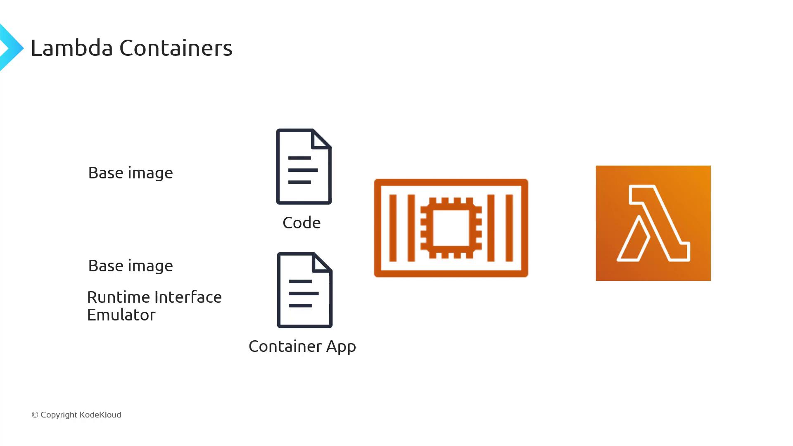
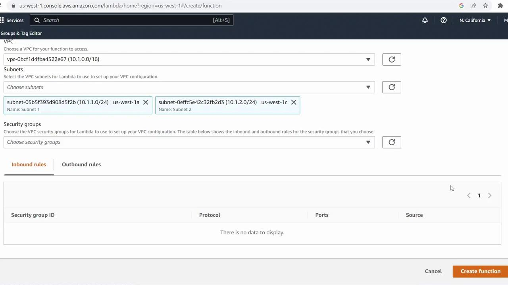

# Dockerfile example
FROM public.ecr.aws/lambda/python:3.9

# Copy application code
COPY app.py ${LAMBDA_TASK_ROOT}

# Set the command to run your handler
CMD ["app.handler"]
```



After building and pushing your image to Amazon ECR, simply create or update a Lambda function to point to that image:

```bash theme={null}
aws lambda create-function \
  --function-name my-container-function \
  --package-type Image \
  --code ImageUri=123456789012.dkr.ecr.us-east-1.amazonaws.com/my-image:latest \
  --role arn:aws:iam::123456789012:role/lambda-execution-role
```

## Conclusion

By leveraging container images on AWS Lambda, you get the portability and tooling of Docker combined with a fully managed, auto-scaling, pay-per-use serverless environment. Whether you’re running microservices, data-processing jobs, or AI workloads, Lambda Containers offer flexibility and simplicity.

## Links and References

* [AWS Lambda Container Images](https://docs.aws.amazon.com/lambda/latest/dg/images-create.html)
* [Lambda Runtime Interface Client (RIC)](https://github.com/aws/aws-lambda-runtime-interface-client)
* [Lambda Runtime API][lambda-api]

[lambda-api]: https://docs.aws.amazon.com/lambda/latest/dg/runtimes-api.html

- [Watch Video](https://learn.kodekloud.com/user/courses/aws-lambda/module/71600a46-a390-4f40-884f-7588445b5976/lesson/2748a12f-ba53-40d3-83c9-ee90e980aa81)


# Lambda Networking Demonstration Option 1

Source: https://notes.kodekloud.com/docs/AWS-Lambda/Advanced-Topics/Lambda-Networking-Demonstration-Option-1/page

Configuring AWS Lambda networking in a private VPC to securely access resources like RDS databases and internal APIs.

Configuring AWS Lambda networking in your own private VPC allows your function to securely access resources such as RDS databases, ElastiCache clusters, or internal APIs. In this guide, you’ll move a Lambda function out of the default AWS-managed VPC and into a custom VPC.

## Steps to Enable VPC Access

1. **Open or create your Lambda function**\
   In the AWS Lambda console, choose your existing function or click **Create function** to define a new one.

2. **Enable VPC configuration**\
   Scroll to **Configuration**, expand **Advanced settings**, and toggle **Enable VPC** on.

3. **Select your VPC**\
   From the **VPC** dropdown, pick the VPC you’ve already provisioned (e.g., `cold-cloud-demo-vpc`).

4. **Choose subnets for high availability**\
   Expand **Subnets** and select at least two subnets in different Availability Zones. This ensures your function remains resilient during AZ outages.
   * One subnet in **us-west-1a**
   * One subnet in **us-west-1c**

> **lightbulb** Always select subnets from multiple Availability Zones to maintain high availability. If one AZ goes down, Lambda can still execute in the other.

5. **Assign security groups**\
   Under **Security groups**, pick existing security groups or create new ones to control inbound and outbound traffic for your function’s Elastic Network Interface (ENI).

> **triangle-alert** Attaching a Lambda function to a VPC can increase cold start times because ENIs must be initialized. Review [AWS Lambda cold start considerations](https://docs.aws.amazon.com/lambda/latest/dg/runtimes-context.html) for mitigation strategies.



Once these steps are complete, your Lambda function will operate within your private VPC, able to access internal resources while being protected by your defined security groups.

***

## Links and References

* [AWS Lambda Networking](https://docs.aws.amazon.com/lambda/latest/dg/configuration-vpc.html)
* [Amazon VPC User Guide](https://docs.aws.amazon.com/vpc/latest/userguide/)
* [AWS Security Groups](https://docs.aws.amazon.com/vpc/latest/userguide/VPC_SecurityGroups.html)

- [Watch Video](https://learn.kodekloud.com/user/courses/aws-lambda/module/71600a46-a390-4f40-884f-7588445b5976/lesson/383b3c12-1670-4a07-9f8c-a9874d47b55e)
