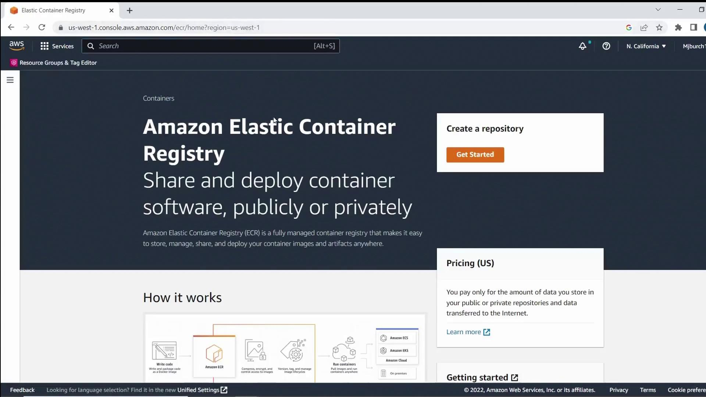
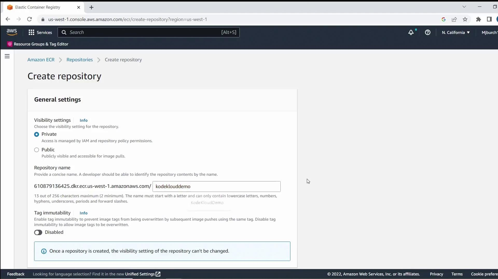
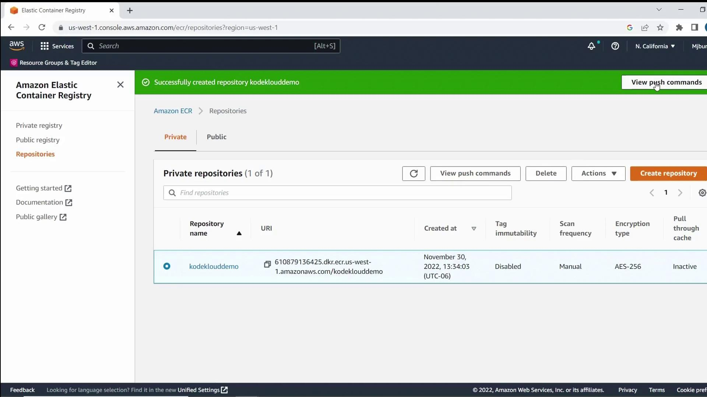
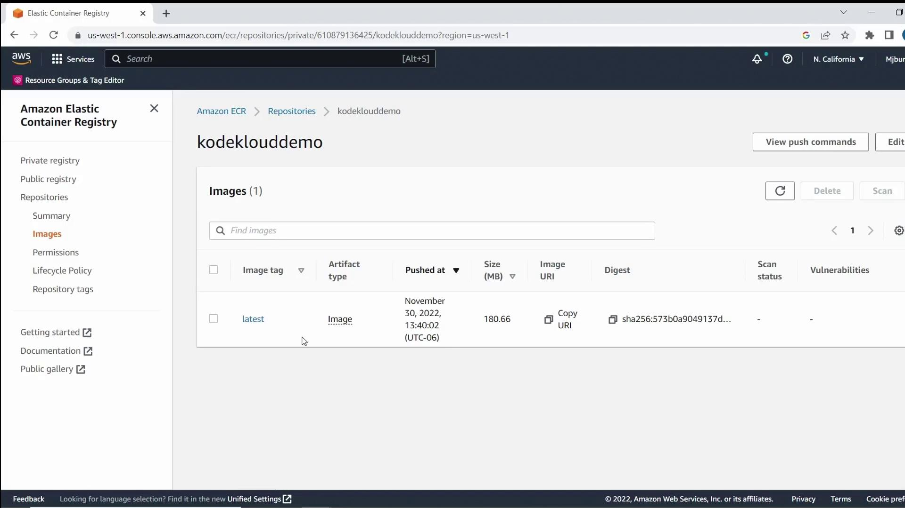
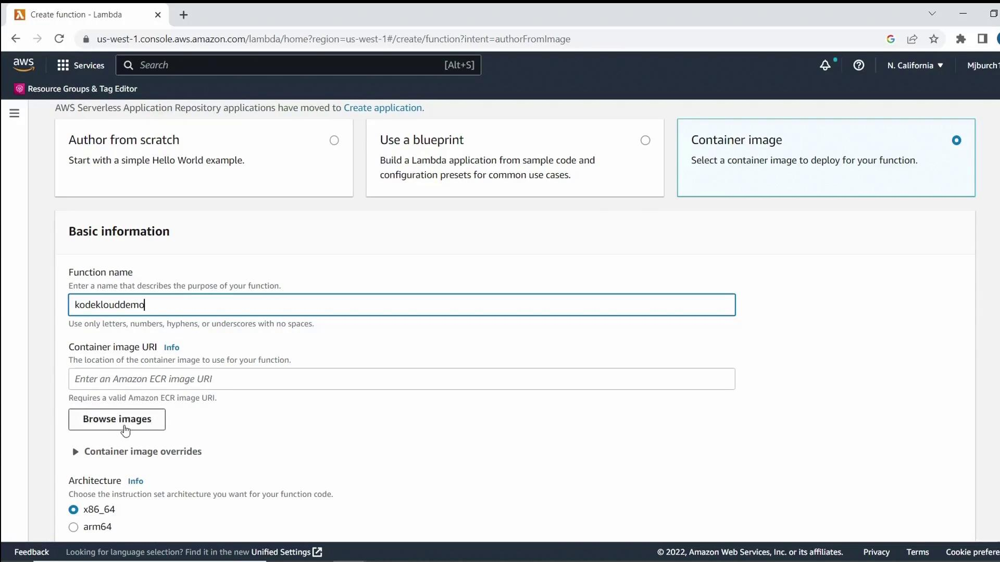
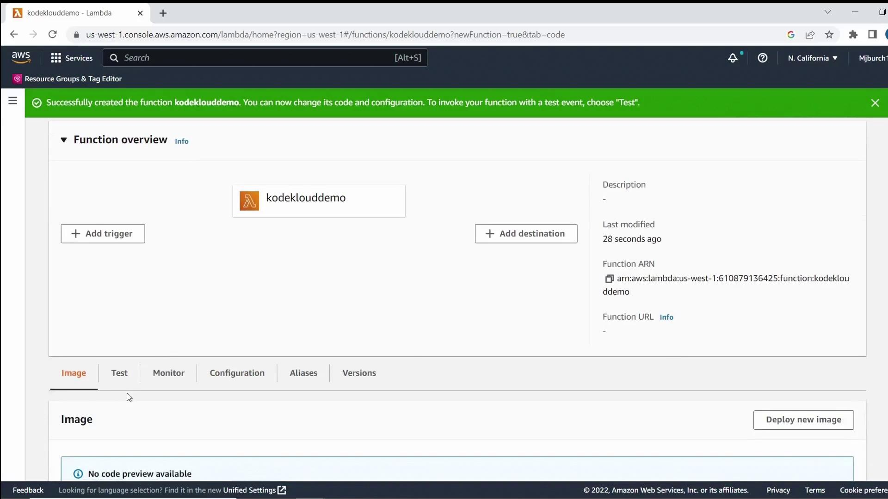
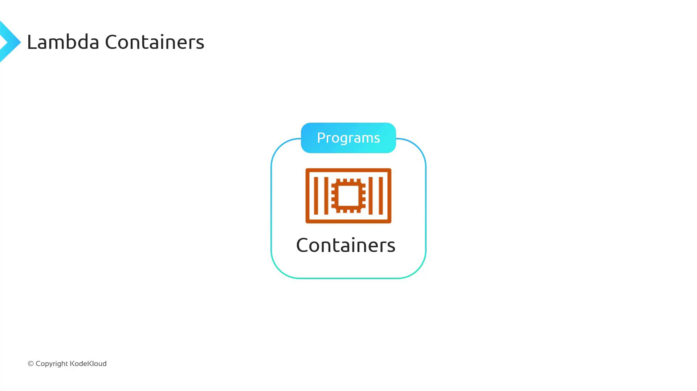
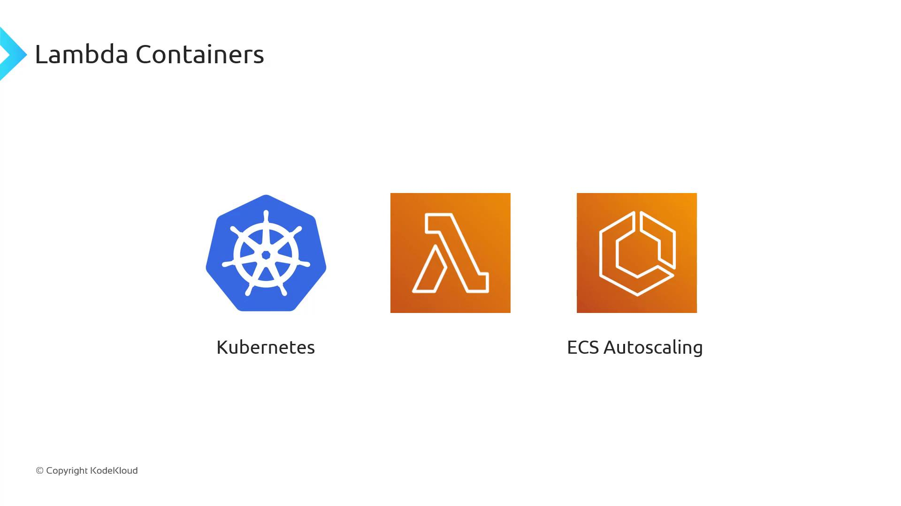
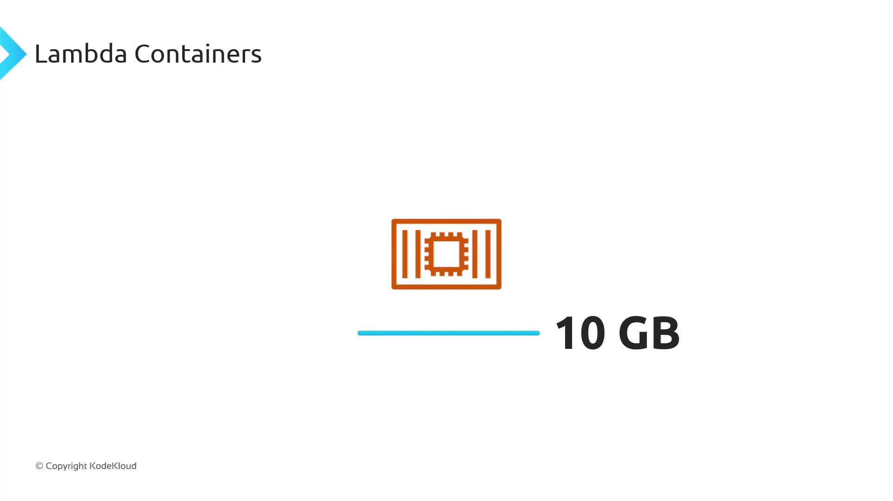

# Install dependencies
COPY requirements.txt .
RUN pip3 install -r requirements.txt --target "${LAMBDA_TASK_ROOT}"

# Copy function code
COPY app.py ${LAMBDA_TASK_ROOT}

# Define the handler
CMD [ "app.handler" ]
```

## Create an ECR Repository

The AWS Elastic Container Registry (ECR) hosts your container images. In the [AWS Management Console](https://aws.amazon.com/console/), navigate to **Elastic Container Registry**.



Click **Create repository**, set visibility to **Private**, and name it `KodeKloudDemo`. Optionally enable image scanning on push, then click **Create repository**.



Once the repository appears, select **View push commands**.



## Build and Push the Container Image

Open your terminal and follow these steps, replacing `<region>` and `<account-id>` with your AWS Region and account number.

> **triangle-alert** Keep your AWS credentials secure. Do not hard-code them in scripts.

1. Authenticate Docker to ECR:

   ```bash theme={null}
   aws ecr get-login-password --region <region> \
     | docker login --username AWS --password-stdin <account-id>.dkr.ecr.<region>.amazonaws.com
   ```

2. Build your image locally:

   ```bash theme={null}
   docker build -t kodeklouddemo .
   ```

3. Tag the image for your repository:

   ```bash theme={null}
   docker tag kodeklouddemo:latest \
     <account-id>.dkr.ecr.<region>.amazonaws.com/kodeklouddemo:latest
   ```

4. Push the image to ECR:

   ```bash theme={null}
   docker push <account-id>.dkr.ecr.<region>.amazonaws.com/kodeklouddemo:latest
   ```

Example response after login:

```plaintext theme={null}
Login Succeeded
```

Successful push output:

```plaintext theme={null}
... latest: digest: sha256:573b0a9049137d606c681c973b197727ace46f6ebbed4bff7eb2e61f0f1 size: 2205
```

Refresh the ECR console to verify the **latest** tag.



## Deploy the Lambda Function

1. Go to **AWS Lambda** in the [AWS Management Console](https://aws.amazon.com/console/).
2. Click **Create function**, choose **Container image**, and enter `KodeKloudDemo` as the function name.
3. Under **Container image**, click **Browse images**, select your `kodeklouddemo:latest` image, and click **Select image**.
4. Keep the remaining settings at their defaults and click **Create function**.



After provisioning, you’ll see your new function listed in the console.



## Test the Lambda Function

1. In your Lambda function console, click **Test**.
2. Choose **Create new test event** (the default template is fine) and save.
3. Click **Test** again to invoke the function.
4. Confirm the **Execution results** show your greeting message and Python version.

## Summary

In this demo, you learned how to:

* Structure a simple Python Lambda project
* Create a Dockerfile compatible with AWS Lambda
* Build and push a container image to Amazon ECR
* Deploy a Lambda function from your container image
* Invoke and test the Lambda function via the AWS Console

## Links and References

* [AWS Lambda Documentation](https://aws.amazon.com/lambda/)
* [Amazon ECR Documentation](https://aws.amazon.com/ecr/)
* [AWS CLI Reference](https://aws.amazon.com/cli/)
* [Docker Desktop](https://www.docker.com/products/docker-desktop/)
* [Visual Studio Code](https://code.visualstudio.com/)

- [Watch Video](https://learn.kodekloud.com/user/courses/aws-lambda/module/71600a46-a390-4f40-884f-7588445b5976/lesson/cb5358f9-f4dd-43ad-b55f-e12846cd2f91)


# Lambda Containers

Source: https://notes.kodekloud.com/docs/AWS-Lambda/Advanced-Topics/Lambda-Containers/page

AWS Lambda now supports container images, allowing you to package applications with Docker for serverless execution without managing servers.

AWS Lambda originally supported ZIP file deployments, and now you can also upload container images—combining the portability of Docker with Lambda’s serverless execution model. With container images, you package your application code, dependencies, and configuration into a single, portable image. AWS then runs that image in a fully managed, serverless environment without you needing to manage servers or clusters.



## Why Use AWS Lambda Container Images?

Running containers on Lambda delivers the following advantages:

| Feature             | Description                                                                                                                             |
| ------------------- | --------------------------------------------------------------------------------------------------------------------------------------- |
| Serverless          | No servers or clusters to provision, manage, or scale—just push your image and AWS handles the rest.                                    |
| Automatic Scaling   | Lambda scales your container instantly to handle thousands of concurrent invocations, then scales down to zero when idle.               |
| Pay-per-Use Billing | You’re billed only for the compute time your container consumes, eliminating charges for idle capacity.                                 |
| Large Image Support | While ZIPs are capped at 250 MB, Lambda container images can be up to 10 GB—ideal for heavy workloads like AI/ML or big data analytics. |



### Large Image Support

Lambda container images support sizes up to 10 GB, so you can bundle large frameworks, machine learning models, or data-processing libraries.



> **lightbulb** Large image support opens the door to CPU- and memory-intensive workloads—everything from AI inference to ETL pipelines—without worrying about ZIP size limits.

## Building and Deploying Your Lambda Container

To deploy a container image on Lambda, your Docker image must include the Lambda Runtime Interface Client (RIC) or Runtime Interface Emulator for local testing.

> **triangle-alert** All Lambda container images require the Lambda Runtime Interface Client (RIC). Failing to include the RIC will cause your function to fail at invocation time.

AWS provides several official base images:

| Runtime Type     | Base Image Reference                            |
| ---------------- | ----------------------------------------------- |
| Managed Runtimes | `public.ecr.aws/lambda/<runtime>:<tag>`         |
| Custom Runtimes  | Build via the [Lambda Runtime API][lambda-api]  |
| Local Testing    | Use the Lambda Runtime Interface Emulator (LRE) |

Here’s a sample `Dockerfile` that uses the Python 3.9 managed runtime base image:

```dockerfile theme={null}
