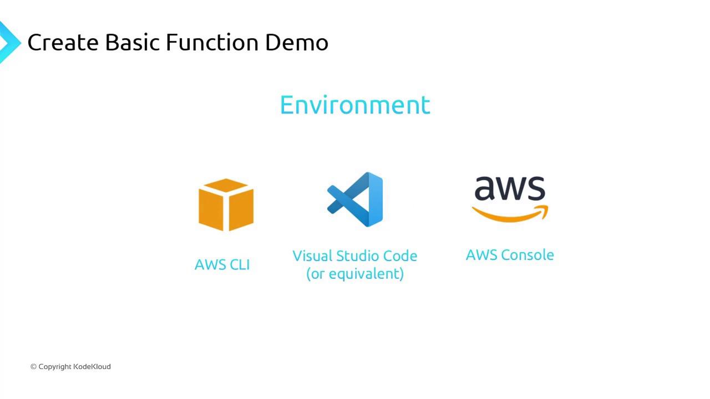
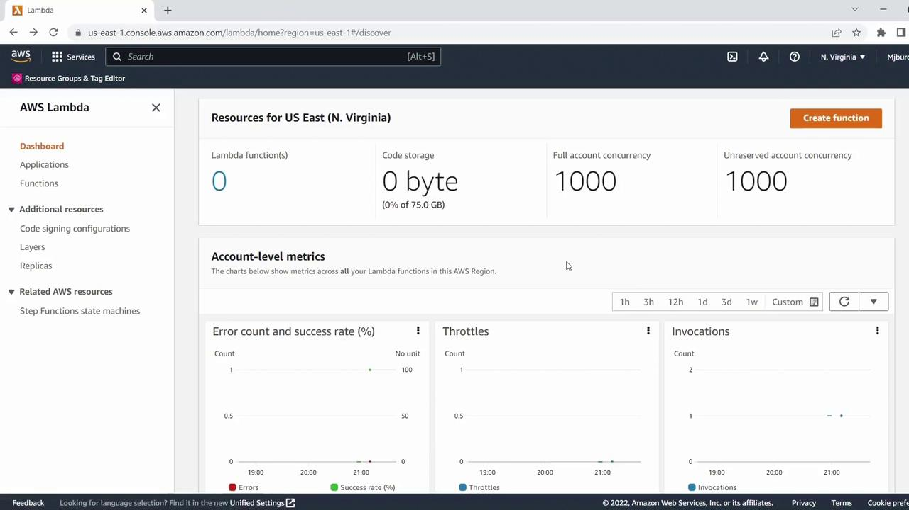
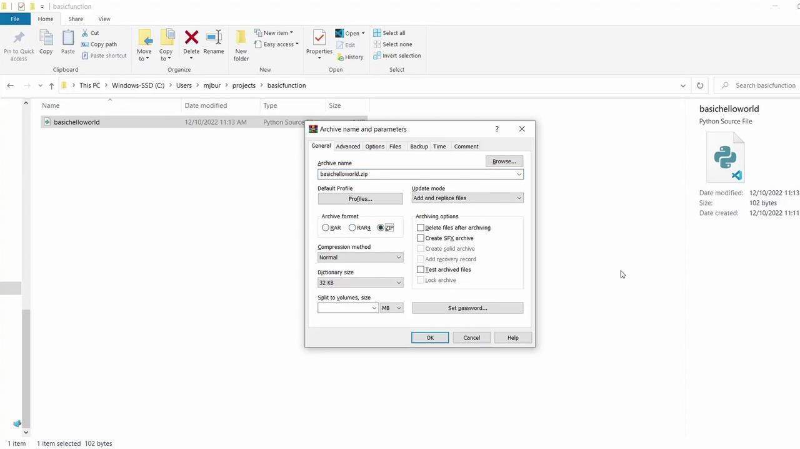
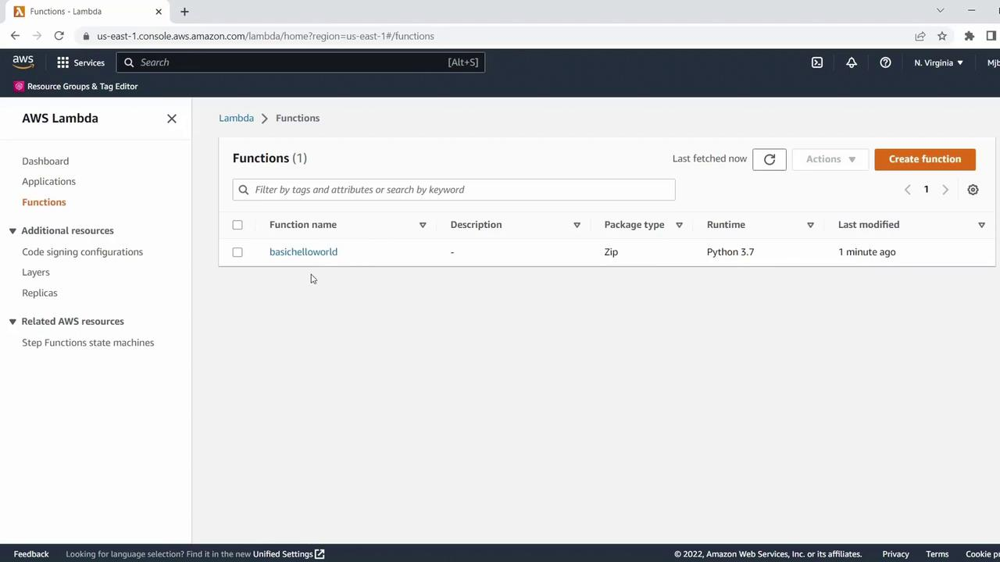
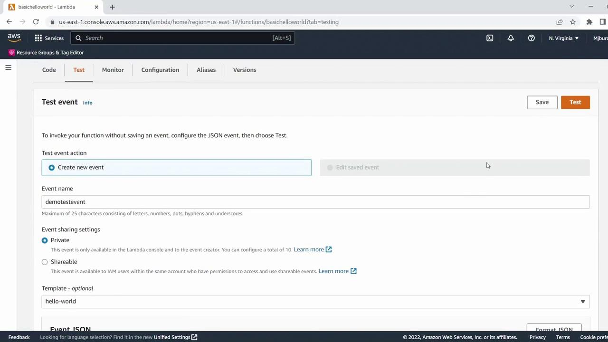

# Create a Basic Lambda Function using CLI

Source: https://notes.kodekloud.com/docs/AWS-Lambda/Configuring-Lambda/Create-a-Basic-Lambda-Function-using-CLI/page

Learn to write, package, deploy, and test a simple Python-based Lambda function using the AWS Command Line Interface.

Building serverless applications with AWS Lambda becomes seamless when you automate deployments using the AWS Command Line Interface (CLI). In this tutorial, you’ll learn how to write, package, deploy, and test a simple Python-based Lambda function from start to finish.

## Environment Setup

Before we dive in, ensure you have the following:

* AWS CLI installed and configured
* Python 3.x installed on your local machine
* An IDE or text editor (e.g., Visual Studio Code)
* AWS account with permissions to create IAM roles and Lambda functions

<Callout icon="lightbulb">
  Run `aws configure` to set up your credentials, default region (e.g., `us-east-1`), and output format (`json`).
</Callout>

<Frame>
  
</Frame>

To begin, verify there are no existing Lambda functions in your target region:

<Frame>
  
</Frame>

***

## 1. Write the Lambda Function

Create a file named `basic_hello_world.py` and add:

```python theme={null}
def lambda_handler(event, context):
    if event.get("name") == "KodeKloud":
        return "Successful"
    return "Failed"
```

This handler inspects the `name` key in the incoming event and returns `"Successful"` when it matches `"KodeKloud"`.

***

## 2. Package Your Code

AWS Lambda requires your function code in a ZIP archive. On Windows:

1. Right-click `basic_hello_world.py`
2. Select **Send to → Compressed (zipped) folder**
3. Name it `basic_hello_world.zip`

<Frame>
  
</Frame>

***

## 3. Create an IAM Execution Role

Your function needs permission to write logs to CloudWatch. In the IAM console:

* Create or select a role (e.g., **LambdaDemoRole**)
* Attach the **AWSLambdaBasicExecutionRole** policy
* Copy the Role ARN for use in the CLI

<Frame>
  
</Frame>

<Callout icon="triangle-alert">
  Keep your IAM credentials secure. Grant only the permissions your function requires.
</Callout>

***

## 4. Deploy the Function with AWS CLI

Use the `create-function` command to deploy:

```bash theme={null}
aws lambda create-function \
  --function-name basic_hello_world \
  --runtime python3.7 \
  --role arn:aws:iam::610879136425:role/LambdaDemoRole \
  --handler basic_hello_world.lambda_handler \
  --zip-file fileb://basic_hello_world.zip
```

On success, you’ll see a JSON payload with details like function name, runtime, role, and handler.

***

## 5. Verify Deployment

Refresh the AWS Lambda console in the **us-east-1** region. Your function should appear in the list:

<Frame>
  
</Frame>

***

## 6. Test Your Lambda Function

1. Click **Test** in the function’s detail page.
2. Create a new event named **Demo Test Event**.
3. Replace the sample JSON with:

   ```json theme={null}
   {
     "name": "KodeKloud"
   }
   ```

<Frame>
  
</Frame>

4. Save and run. The execution result should return:

   ```text theme={null}
   Successful
   ```

***

## Summary of AWS CLI Commands

| Step                          | Command                             | Description                                |
| ----------------------------- | ----------------------------------- | ------------------------------------------ |
| Configure AWS CLI             | `aws configure`                     | Set credentials, region, and output format |
| Create Lambda function        | `aws lambda create-function …`      | Deploy code as a new Lambda function       |
| Update function code (future) | `aws lambda update-function-code …` | Replace function ZIP with new code         |

***

Congratulations! You now have a working Python Lambda function entirely managed through the AWS CLI.

## References

* [AWS Lambda Developer Guide](https://docs.aws.amazon.com/lambda/latest/dg/welcome.html)
* [AWS CLI Command Reference](https://docs.aws.amazon.com/cli/latest/reference/lambda/index.html)
* [IAM Best Practices](https://docs.aws.amazon.com/IAM/latest/UserGuide/best-practices.html)

<CardGroup>
  <Card title="Watch Video" icon="video" href="https://learn.kodekloud.com/user/courses/aws-lambda/module/8fef3e34-137a-46d4-8dec-61fb5bae4e0e/lesson/55f2fb20-b644-4f18-b5a0-7ba48ecde7cd" />

  <Card title="Practice Lab" icon="installation" href="https://learn.kodekloud.com/user/courses/aws-lambda/module/8fef3e34-137a-46d4-8dec-61fb5bae4e0e/lesson/404681fd-0109-4088-a44b-2edc38e7b9cc" />
</CardGroup>
