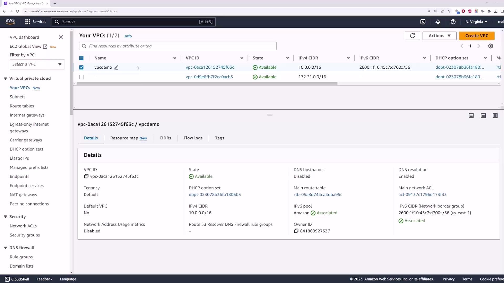
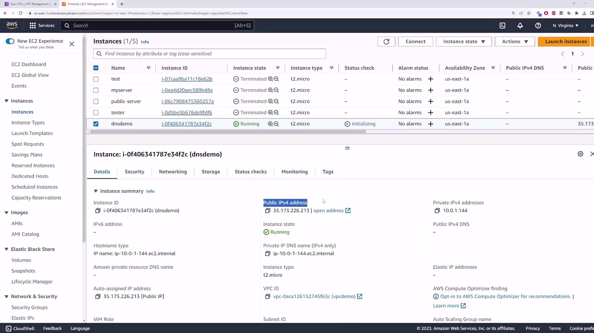
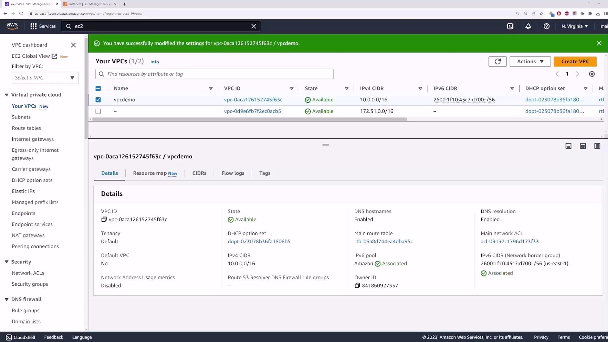
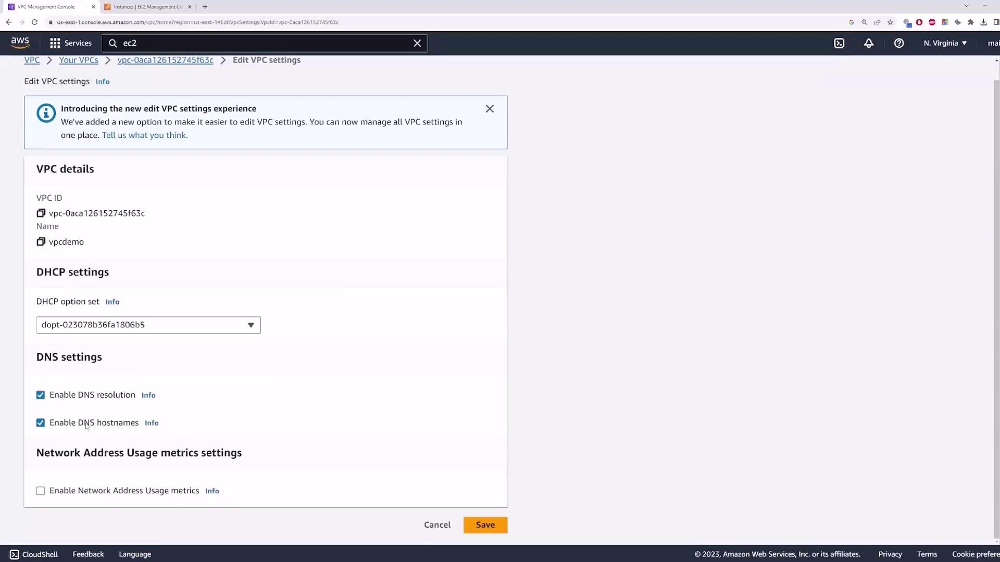

# DNS VPC Demo

Source: https://notes.kodekloud.com/docs/AWS-Networking-Fundamentals/Core-Networking-Services/DNS-VPC-Demo/page

This guide explores DNS settings in an AWS VPC and their effects on EC2 instances.

In this guide, we’ll explore the two DNS settings available on an AWS Virtual Private Cloud (VPC)—**Enable DNS resolution** and **Enable DNS hostnames**—and demonstrate their effects on EC2 instances.

## Overview of VPC DNS Settings

When you create a custom VPC without modifying defaults, the VPC DNS settings look like this (an Internet Gateway is also attached by default):

<Frame>
  
</Frame>

| Setting               | Description                                                                                | Default | Use Case                                                   |
| --------------------- | ------------------------------------------------------------------------------------------ | ------- | ---------------------------------------------------------- |
| Enable DNS resolution | Allows instances to forward hostname lookups to the Amazon‐provided DNS server (10.0.0.2). | true    | Required for any DNS-based name resolution inside the VPC. |
| Enable DNS hostnames  | Assigns a public DNS hostname to instances that have a public IPv4 address.                | false   | Useful for mapping public IPs to friendly DNS names.       |

<Callout icon="lightbulb">
  The Amazon‐provided DNS server is always at the second IP address in the VPC CIDR block (for example, 10.0.0.2 in a 10.0.0.0/16 VPC).
</Callout>

***

## 1. Enable DNS Hostnames

By default, **Enable DNS hostnames** is disabled. Launch an EC2 instance in this VPC with these settings:

* **AMI**: Amazon Linux 2
* **Instance type**: t2.micro
* **Key pair**: your existing key
* **Network**: vpcdemo
* **Auto-assign Public IP**: Enabled
* **Security group**: allow SSH (port 22) and ICMP (All ICMP) from 0.0.0.0/0

Once it’s running, you’ll see only the private DNS name:

<Frame>
  
</Frame>

1. Go to **Actions → Edit VPC settings**.
2. Check **Enable DNS hostnames** and click **Save**.
3. Refresh the EC2 Instances view.

The **Public DNS (IPv4)** column is now populated:

```bash theme={null}
$ ping ec2-35-173-226-213.compute-1.amazonaws.com
PING ec2-35-173-226-213.compute-1.amazonaws.com (35.173.226.213): 56 data bytes
64 bytes from 35.173.226.213: icmp_seq=0 ttl=54 time=35.1 ms
```

***

## 2. Enable DNS Resolution

Next, verify **Enable DNS resolution**. SSH into your instance:

```bash theme={null}
$ ssh -i path/to/key.pem ec2-user@35.173.226.213
```

Return to the VPC console to confirm the CIDR block:

<Frame>
  
</Frame>

On the instance, inspect `/etc/resolv.conf`:

```bash theme={null}
[ec2-user@ip-10-0-1-144 ~]$ cat /etc/resolv.conf
nameserver 10.0.0.2
search ec2.internal
```

Perform a DNS lookup:

```bash theme={null}
[ec2-user@ip-10-0-1-144 ~]$ nslookup google.com
Server:         10.0.0.2
Address:        10.0.0.2#53

Non-authoritative answer:
Name:   google.com
Address: 142.251.163.100
```

Because **Enable DNS resolution** is turned on, lookups succeed. To see what happens when you disable it:

1. In the VPC console, choose **Actions → Edit VPC settings**.
2. Uncheck **Enable DNS resolution** and click **Save**.
3. Back on your instance, try:

```bash theme={null}
[ec2-user@ip-10-0-1-144 ~]$ nslookup youtube.com
;; connection timed out; no servers could be reached
```

<Frame>
  
</Frame>

<Callout icon="triangle-alert">
  With DNS resolution disabled, instances cannot use the Amazon‐provided DNS server. You must configure an alternate DNS server (for example, 8.8.8.8) in your DHCP options or run your own DNS service within the VPC.
</Callout>

***

## References

* [AWS VPC Documentation](https://docs.aws.amazon.com/vpc/latest/userguide/what-is-amazon-vpc.html)
* [Amazon EC2 User Guide – Networking](https://docs.aws.amazon.com/AWSEC2/latest/UserGuide/using-instance-addressing.html)
* [Route 53 Resolver – Amazon VPC DNS](https://docs.aws.amazon.com/Route53/latest/DeveloperGuide/resolver.html)

<CardGroup>
  <Card title="Watch Video" icon="video" href="https://learn.kodekloud.com/user/courses/aws-networking-fundamentals/module/406e4440-01a6-45f6-ab45-e14485d333c3/lesson/dfa079f3-73e5-4c65-bb7b-15a73836f0e7" />
</CardGroup>
