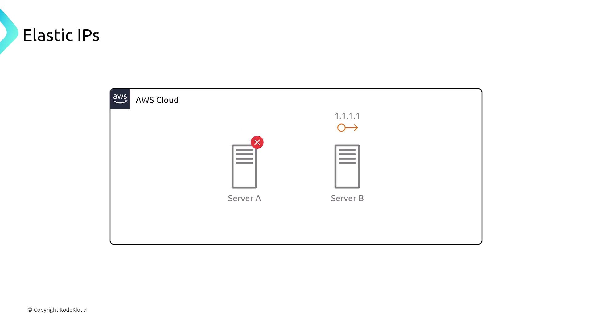

# Elastic IP

Source: https://notes.kodekloud.com/docs/AWS-Networking-Fundamentals/Core-Networking-Services/Elastic-IP/page

This article explains AWS Elastic IP addresses, their benefits, management, pricing, and how they ensure consistent connectivity for applications.

Understanding how AWS handles public IPs and leveraging Elastic IPs can help you maintain consistent connectivity for your applications.

## Why Dynamic Public IPs Can Be Problematic

When you launch an EC2 instance in a public subnet, AWS automatically assigns a **public IPv4 address** (for example, `1.1.1.1`). However, this IP is drawn from AWS’s shared pool and is **not** reserved for your account. Stopping or restarting the instance may result in a new IP, causing:

* Downtime if clients have hardcoded the old address
* Configuration drift in DNS records or security groups
* Operational overhead to track changing IPs

## Introducing Elastic IPs

**Elastic IP addresses** are static IPv4 addresses that you allocate and control within a specific AWS Region. Key benefits include:

* Static mapping: The IP stays yours until you explicitly release it
* Flexibility: Associate or disassociate the address from EC2 instances or ENIs at any time
* High availability: Instantly remap to a standby instance during maintenance or failure

### Example: Failover with Elastic IPs

If **Server A** goes down, simply disassociate its Elastic IP and reassign it to **Server B**. Clients continue to reach your application at the same address (`1.1.1.1`), eliminating DNS propagation delays.

<Frame>
  
</Frame>

## Allocating and Managing Elastic IPs

You can manage Elastic IPs via the AWS Management Console or AWS CLI. Below is a sample CLI workflow.

```bash theme={null}
