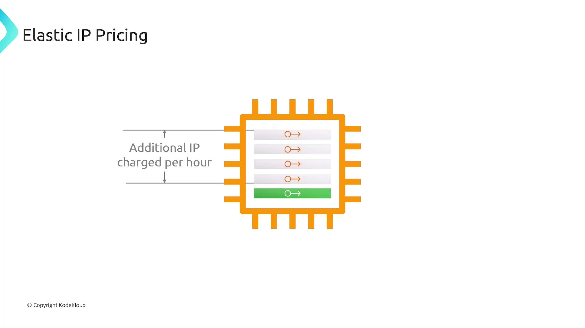
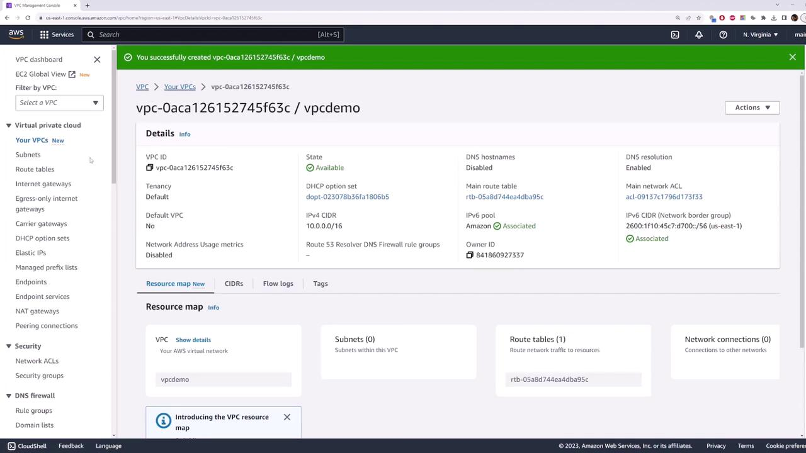
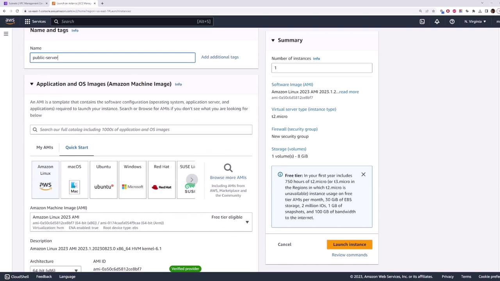
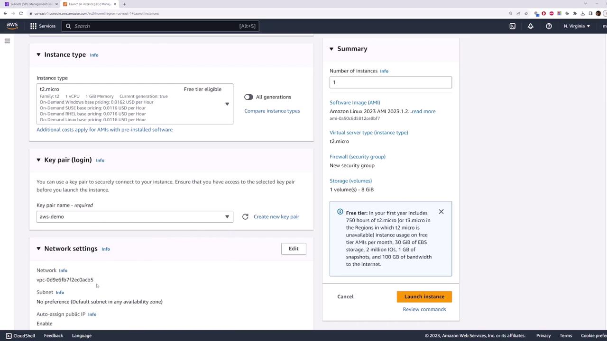
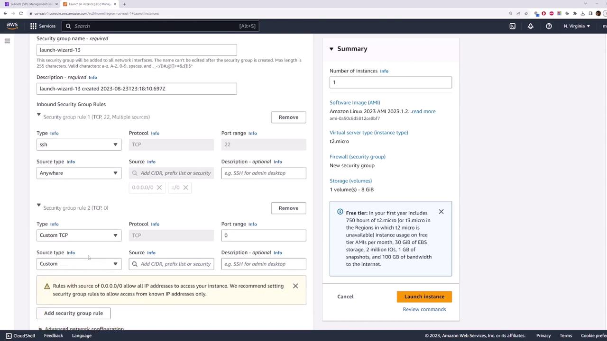
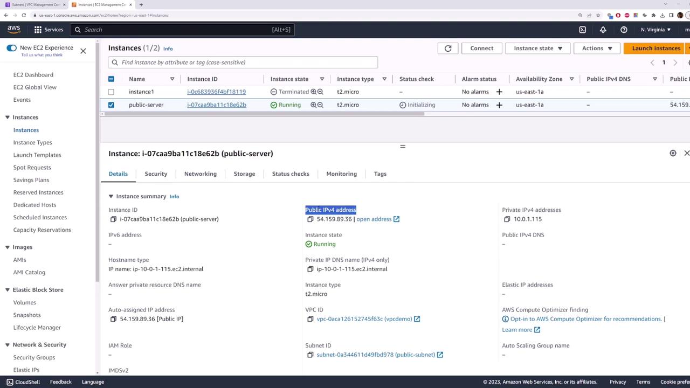

# Allocate a new Elastic IP in your default VPC
aws ec2 allocate-address --domain vpc

# Associate the Elastic IP with an EC2 instance
aws ec2 associate-address \
  --instance-id i-0123456789abcdef0 \
  --allocation-id eipalloc-12345678

# Disassociate the Elastic IP when needed
aws ec2 disassociate-address --association-id eipassoc-87654321
```

> **lightbulb** You can also manage Elastic IPs using AWS SDKs, CloudFormation, or Terraform. Refer to the [AWS Elastic IP Documentation](https://docs.aws.amazon.com/AWSEC2/latest/UserGuide/elastic-ip-addresses-eip.html) for more details.

## Elastic IP Pricing

| Scenario                                            | Cost             |
| --------------------------------------------------- | ---------------- |
| First Elastic IP associated with a running instance | Free             |
| Additional Elastic IPs on the same instance         | Charged per hour |
| Allocated but unattached Elastic IPs                | Small hourly fee |

> **triangle-alert** Unattached Elastic IPs incur charges. Always release unused addresses to avoid unexpected costs.



## Key Considerations

* Elastic IPs are **region-specific** and cannot be moved across regions.
* You can associate them only with **EC2 instances** or **network interfaces (ENIs)** in the same region.
* Choose between AWS’s public IPv4 pool or bring your own custom IPv4 address block.

## Summary

* AWS **public IPv4 addresses** are dynamic and may change on instance stop/start.
* **Elastic IP addresses** provide a static, portable IPv4 address under your control.
* Workflow to use an Elastic IP:
  1. Allocate it to your AWS account.
  2. Associate it with an EC2 instance or ENI.
  3. Reassociate as needed during failover or maintenance.


## Links and References

* [Elastic IP Addresses – AWS EC2 User Guide](https://docs.aws.amazon.com/AWSEC2/latest/UserGuide/elastic-ip-addresses-eip.html)
* [AWS CLI Command Reference – allocate-address](https://docs.aws.amazon.com/cli/latest/reference/ec2/allocate-address.html)
* [AWS CLI Command Reference – associate-address](https://docs.aws.amazon.com/cli/latest/reference/ec2/associate-address.html)

- [Watch Video](https://learn.kodekloud.com/user/courses/aws-networking-fundamentals/module/406e4440-01a6-45f6-ab45-e14485d333c3/lesson/a5dfb38f-8233-4f66-a59b-d7dfe1c37e14)


# Internet Gateway Demo

Source: https://notes.kodekloud.com/docs/AWS-Networking-Fundamentals/Core-Networking-Services/Internet-Gateway-Demo/page

This tutorial explains how to convert a private subnet into a public subnet by attaching an Internet Gateway and updating the route table.

In this tutorial, you’ll convert a private subnet into a public subnet by attaching an Internet Gateway and updating the route table. After completing these steps, any EC2 instance launched in your public subnet will have Internet access.

## Overview

| Step | Description                                   |
| ---- | --------------------------------------------- |
| 1    | Create a VPC & Subnet                         |
| 2    | Launch an EC2 instance in the public subnet   |
| 3    | Verify default connectivity (should fail)     |
| 4    | Create & attach an Internet Gateway           |
| 5    | Configure the route table for Internet access |
| 6    | Test Internet connectivity (should succeed)   |

## Prerequisites

* An AWS account with permissions to manage VPCs and EC2.
* A generated SSH key pair (for example, `aws-demo.pem`).

> **lightbulb** You can refer to the [AWS VPC Documentation](https://docs.aws.amazon.com/vpc/latest/userguide/) for more details on VPC components.

***

## 1. Create a VPC and Public Subnet

1. In the AWS Console, go to **VPC > Your VPCs** and click **Create VPC**.
2. Set the IPv4 CIDR block to `10.0.0.0/16`. Optionally add an IPv6 block.
3. Click **Create VPC**.



4. Navigate to **Subnets > Create subnet**:
   * **Name tag**: `public-subnet`
   * **VPC**: your newly created VPC
   * **IPv4 CIDR block**: `10.0.1.0/24`
5. Click **Create subnet**.

***

## 2. Launch an EC2 Instance in the Public Subnet

1. Open **EC2 Console** > **Instances > Launch instances**.
2. For **Name**, enter `my-public-server`.
3. Choose **Amazon Linux 2023** under **Application and OS Images (AMI)**.



4. Select the **t2.micro** instance type (free tier).
5. Under **Key pair**, choose `aws-demo.pem`.
6. Expand **Network settings > Edit** and configure:
   * **VPC**: your new VPC
   * **Subnet**: `public-subnet`
   * **Auto-assign public IP**: **Enable**



7. Under **Security group**, allow SSH (port 22) from `0.0.0.0/0`. Optionally add ICMP for ping.



8. Click **Launch instance** and wait for it to switch to **running**.

***

## 3. Verify Default Connectivity (Should Fail)

After your instance is running, copy its public IP (example: `54.159.89.36`) and test connectivity:



```bash theme={null}
ping 54.159.89.36
ssh -i aws-demo.pem ec2-user@54.159.89.36
