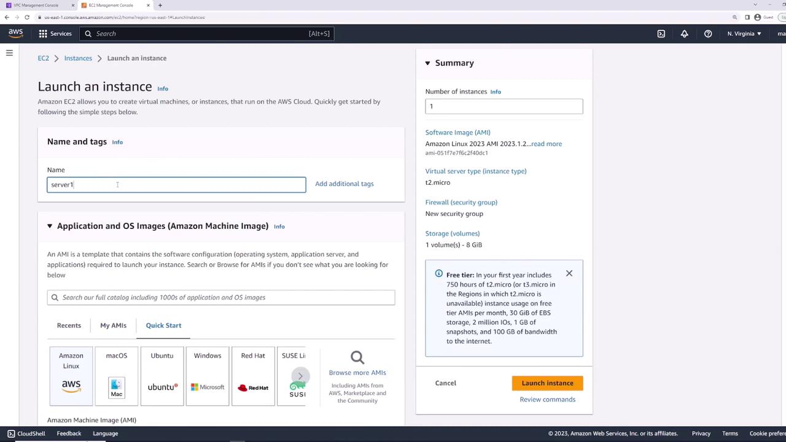
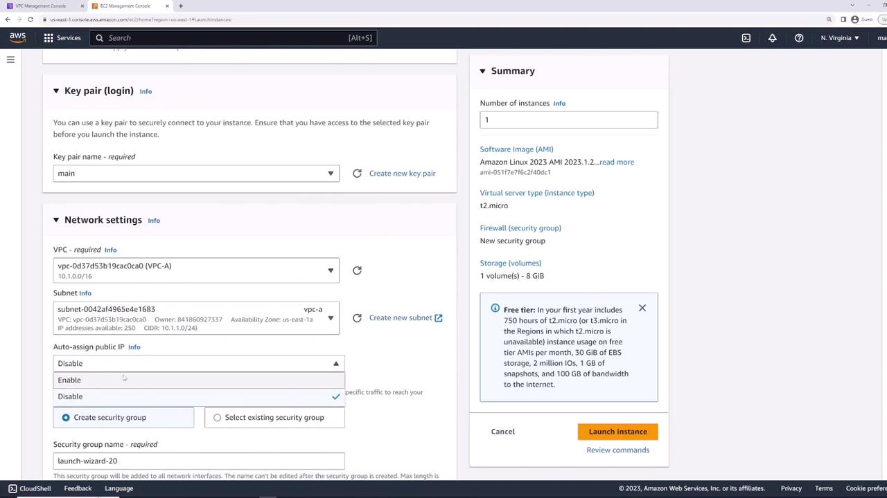
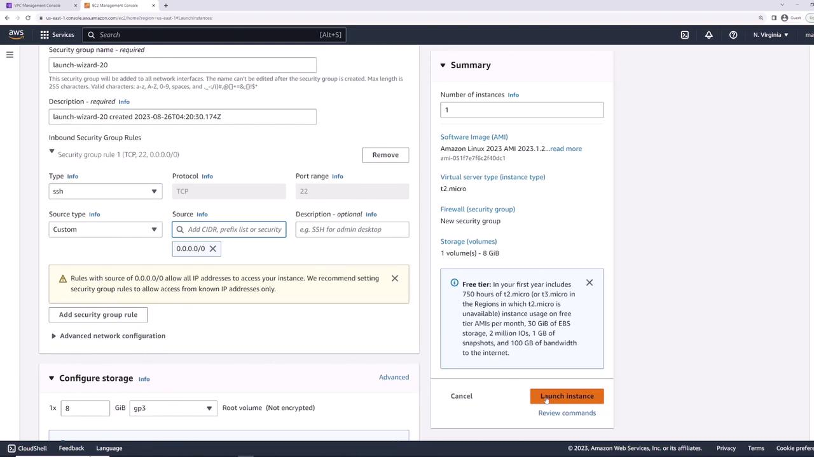
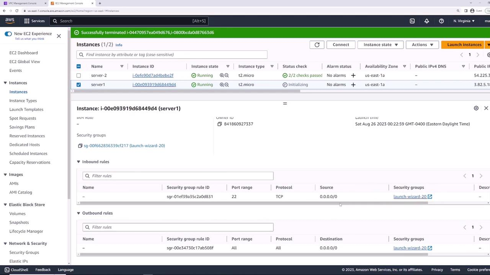
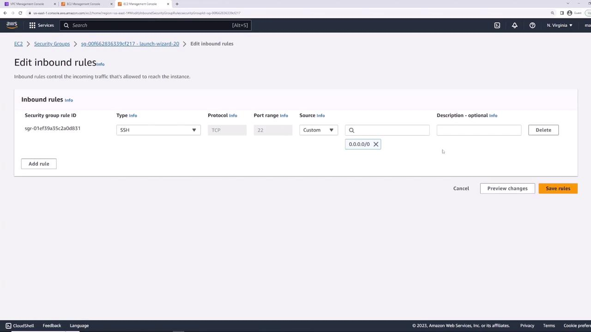

# Security Groups Demo

Source: https://notes.kodekloud.com/docs/AWS-Networking-Fundamentals/Core-Networking-Services/Security-Groups-Demo/page

This lesson explores securing AWS resources using Security Groups and Network ACLs, covering EC2 instance launch, traffic control, and best practices for network security.

In this lesson, we’ll explore how to secure AWS resources using Security Groups and Network ACLs (NACLs). You’ll learn to:

* Launch an EC2 instance
* Configure Security Groups to control inbound/outbound traffic
* Demonstrate stateful behavior
* Split and reuse groups for modular access control
* Reference Security Groups in other rules

By the end, you’ll have hands-on experience with AWS best practices for network security.

## Launching the EC2 Instance

Start by launching an EC2 instance named **server-one** with the default Amazon Linux 2 AMI.



On the **Networking** page, choose your VPC. AWS automatically creates a default Security Group allowing inbound SSH (TCP 22) from `0.0.0.0/0`. You can restrict this later.



Review your settings and click **Launch**.



## Verifying Initial Connectivity

Once **server-one** is in the **running** state, select it and open the **Security** tab. You should see:

* Inbound: SSH (TCP 22) from `0.0.0.0/0`
* Outbound: All traffic to `0.0.0.0/0`



Connect via SSH to confirm:

```bash theme={null}
ssh -i main.pem ec2-user@<Public-IP>
```

If you see the EC2 prompt, SSH is working.

## Blocking All Inbound Traffic

To illustrate rule enforcement, remove SSH access:

1. Go to **Security Groups** → select the default group.
2. Click **Edit inbound rules**.
3. Delete the SSH (22) rule and **Save**.



> **triangle-alert** By removing all inbound rules, you will lose SSH access to your instance. Be prepared to re-attach a group that allows SSH.

Now SSH attempts will time out:

```bash theme={null}
ssh -i main.pem ec2-user@<Public-IP>
