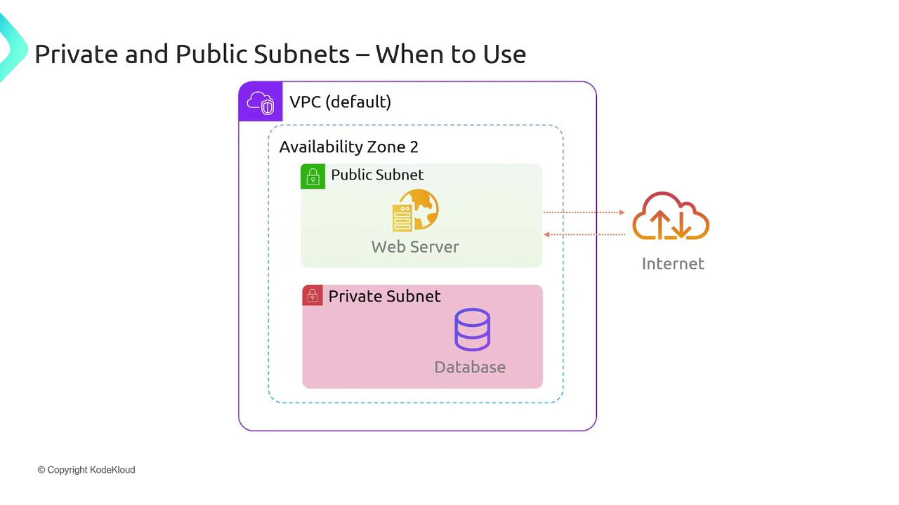
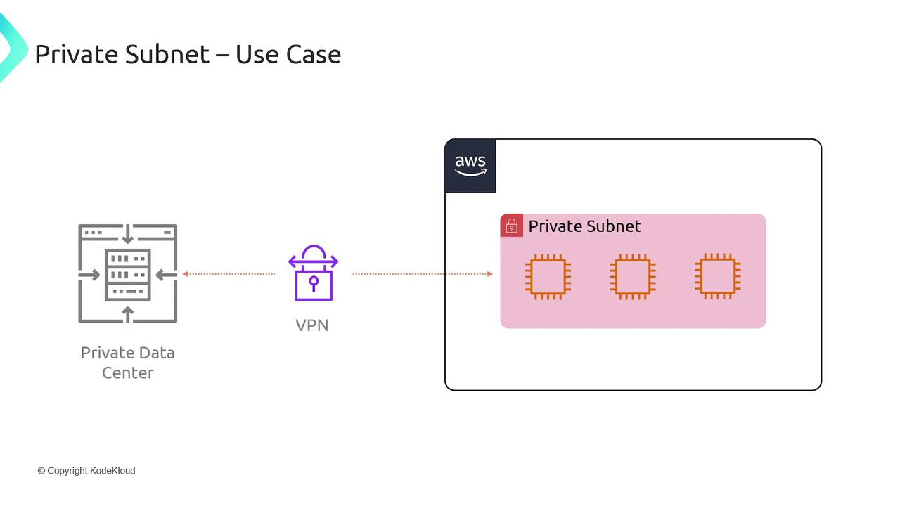

# Private and Public Subnets

Source: https://notes.kodekloud.com/docs/AWS-Solutions-Architect-Associate-Certification/Services-Networking/Private-and-Public-Subnets/page

This article explains the differences between private and public subnets in AWS and their roles in secure infrastructure design.

Understanding the differences between private and public subnets is fundamental when designing AWS environments. Knowing when to use each type is key to maintaining secure and scalable infrastructure.

When deciding whether a subnet should be public or private, ask yourself: Should internet devices interact directly with the resources deployed on the subnet? If the answer is yes, that subnet should be public; if no, it should be private.

For instance, consider a web server that serves content to internet users. This web server should reside in a public subnet. In contrast, a backend database that stores sensitive data must not be directly accessible from the internet. Instead, the database should be placed in a private subnet, where only trusted resources—like the aforementioned web server—can access it.

<Frame>
  
</Frame>

<Callout icon="lightbulb">
  Place internet-facing resources, such as web servers, in public subnets while keeping sensitive backend services like databases in private subnets to ensure enhanced security.
</Callout>

In practice, this configuration means that end users interact with a public-facing web server, which in turn securely communicates with a private database. This setup prevents direct internet access to the database, significantly reducing potential attack vectors.

Another common scenario involves extending a private on-premises data center into AWS. In such cases, the cloud resources are treated as an extension of your existing private network and are typically deployed in private subnets. A secure VPN connection links your on-premises data center to the AWS infrastructure, thereby eliminating the need to expose these resources to the internet.

<Frame>
  
</Frame>

<Callout icon="lightbulb">
  Resources in public subnets are designed to be accessible from the internet, while resources in private subnets remain isolated from direct external access. Gateways and routing configurations play a crucial role in defining these access levels.
</Callout>

<CardGroup>
  <Card title="Watch Video" icon="video" href="https://learn.kodekloud.com/user/courses/aws-solutions-architect-associate-certification/module/e03ffb87-3345-4fbb-9576-cb53d21d7a6a/lesson/ac1ac437-5359-4818-b67e-dfb18af7de67" />

  <Card title="Practice Lab" icon="installation" href="https://learn.kodekloud.com/user/courses/aws-solutions-architect-associate-certification/module/e03ffb87-3345-4fbb-9576-cb53d21d7a6a/lesson/d34433fa-8346-4bfa-85de-77b434a7972a" />
</CardGroup>
