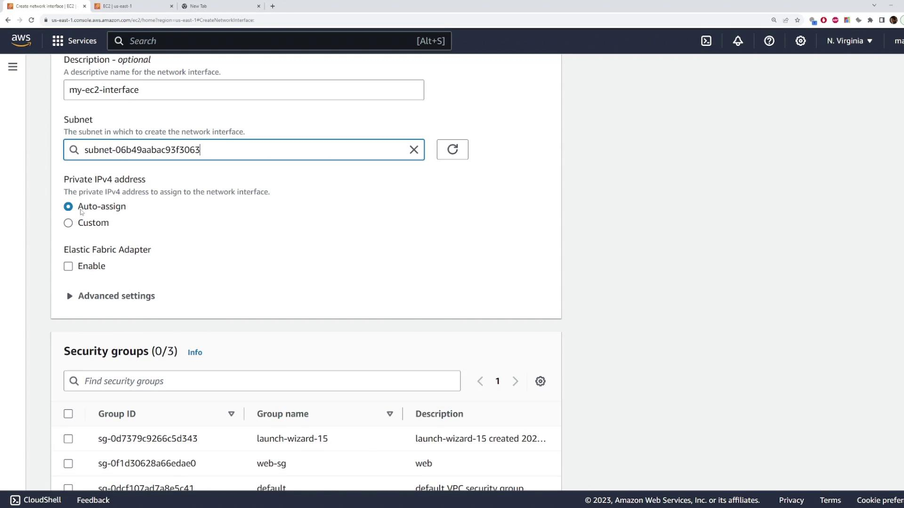
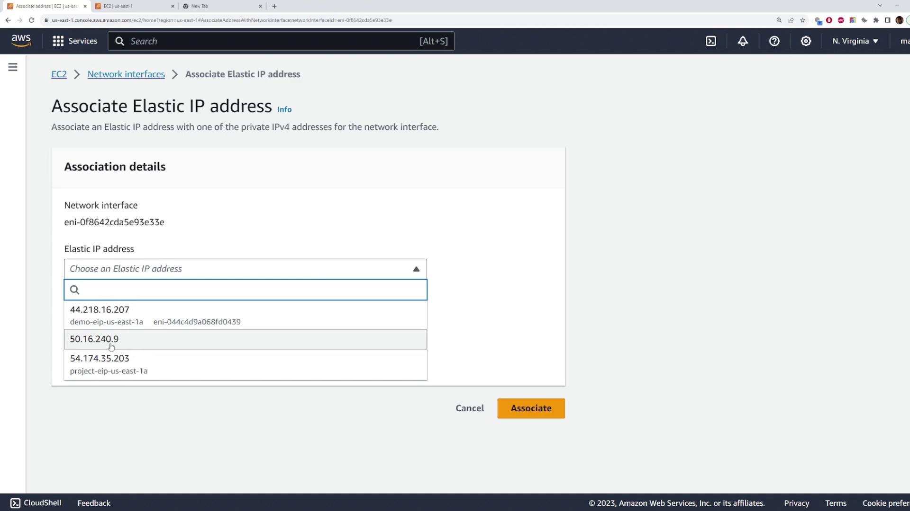
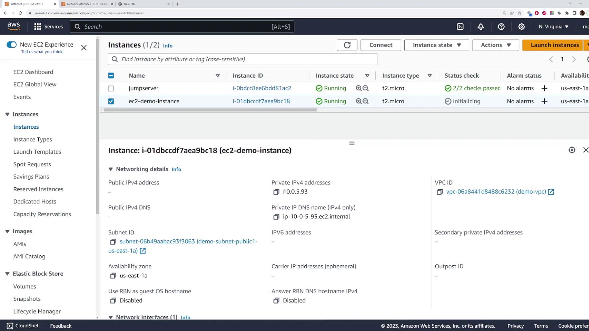
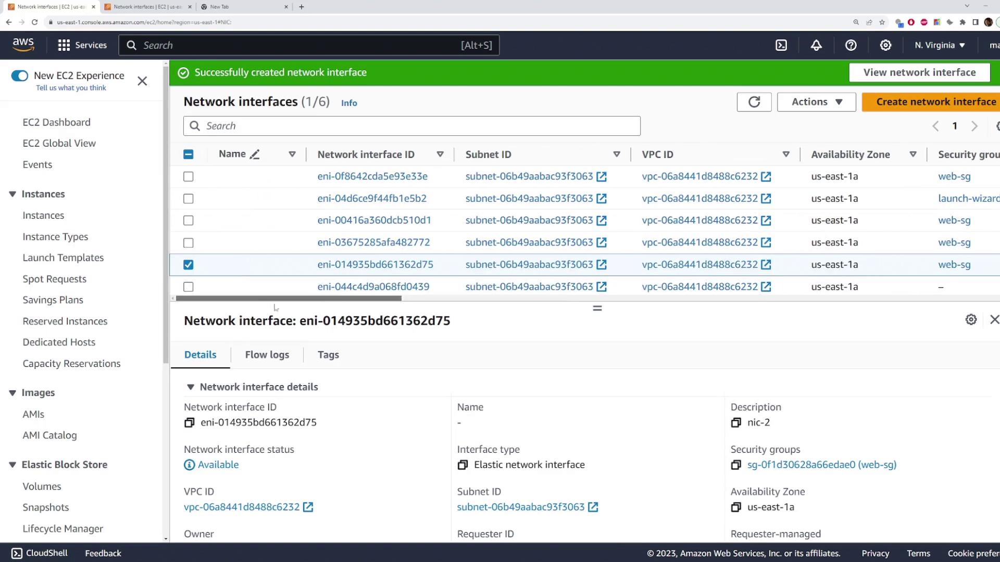
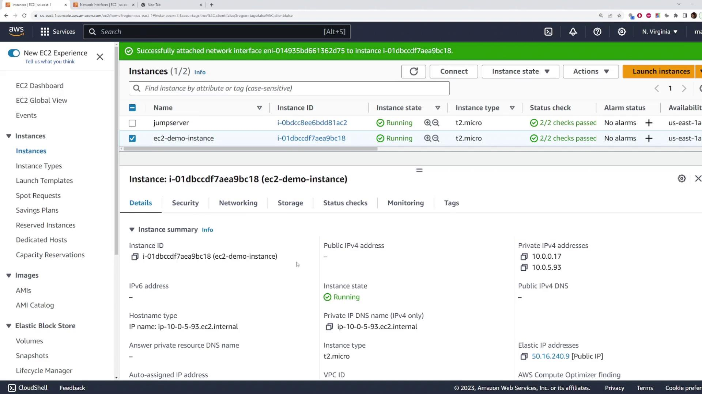

# Elastic Network Interfaces Demo

Source: https://notes.kodekloud.com/docs/AWS-Solutions-Architect-Associate-Certification/Services-Compute/Elastic-Network-Interfaces-Demo/page

Learn to use AWS network interfaces for flexible management of EC2 instances, including creation, attachment, and configuration of network settings.

In this lesson, you'll learn how to work with AWS network interfaces to improve the flexibility and management of your EC2 instances. Instead of configuring network settings directly on your EC2 instance, you can create a standalone network interface that encapsulates key network configurations—such as subnet placement, IP address, and security groups. This modular approach allows you to attach network interfaces to one or more EC2 instances as needed.

## Creating a Network Interface

Follow these steps to create a network interface in AWS:

1. Open the EC2 page in the AWS Management Console.
2. Scroll down and select "Network Interfaces."
3. Click on the option to create a network interface.
4. Provide a clear description (for example, "my EC2 interface").
5. Choose the appropriate subnet for the interface.
6. For the private IP address, decide whether to auto-assign it or specify a custom IP (in this example, auto-assign is used).
7. Select the desired security group, such as "Web SG."

After configuring these details, create the network interface. You should see the new interface in your list (e.g., "my EC2 interface").



At this point, you have the option to attach the network interface to an existing EC2 instance or assign it during the launch of a new instance. AWS also allows you to associate an Elastic IP with the network interface so that a reserved public IP remains consistently linked to the interface.


When associating an Elastic IP, simply select the Elastic IP from the dropdown menu:



## Launching an EC2 Instance with an Existing Network Interface

Next, you'll learn how to launch an EC2 instance using an existing network interface:

1. Start by launching a new instance and assign a descriptive name (for example, "EC2 Interface Demo").
2. Select the Amazon Linux AMI, choose the T2 micro instance type, and pick the appropriate key pair.
3. In the network settings section, select "Edit" to review the VPC, subnet, and security group configurations.
4. Open the "Advanced network configuration" section to view the default network interface (device index 0) that will be used.
5. Instead of keeping the default configuration, select the existing network interface you created earlier (look for an ID like "eni-3E3E..."). You might need to search for the specific interface ID.
6. Leave the other settings unchanged and launch the instance.

Once the instance is up and running, inspect its network configuration to verify the assigned private IP address. Even though no public IP is directly assigned to the instance, AWS maps a public Elastic IP to the instance via network address translation (NAT).



## Attaching Additional Network Interfaces

An EC2 instance can have multiple network interfaces. To attach an additional interface, proceed as follows:

1. Create a new network interface (e.g., named "NIC 2") in the same availability zone as your EC2 instance. This interface can reside in a different subnet, provided it's within the same zone. You may use the same security group if desired.
2. Optionally, associate an Elastic IP with "NIC 2" by selecting one from your Elastic IP addresses.



3. Return to the EC2 instances page, select your demo instance, and choose the attach option for network interfaces.
4. Select "NIC 2" from the list and attach it. This action can be performed while the instance is running.

After the attachment, your instance will have two network interfaces: the original one and "NIC 2" (with its associated Elastic IP if configured).



> **lightbulb** Using the public Elastic IP associated with "NIC 2," you can SSH into the server without directly exposing the instance’s primary network configuration.

Here is an example of logging in via SSH from a Windows command prompt:

```bash theme={null}
