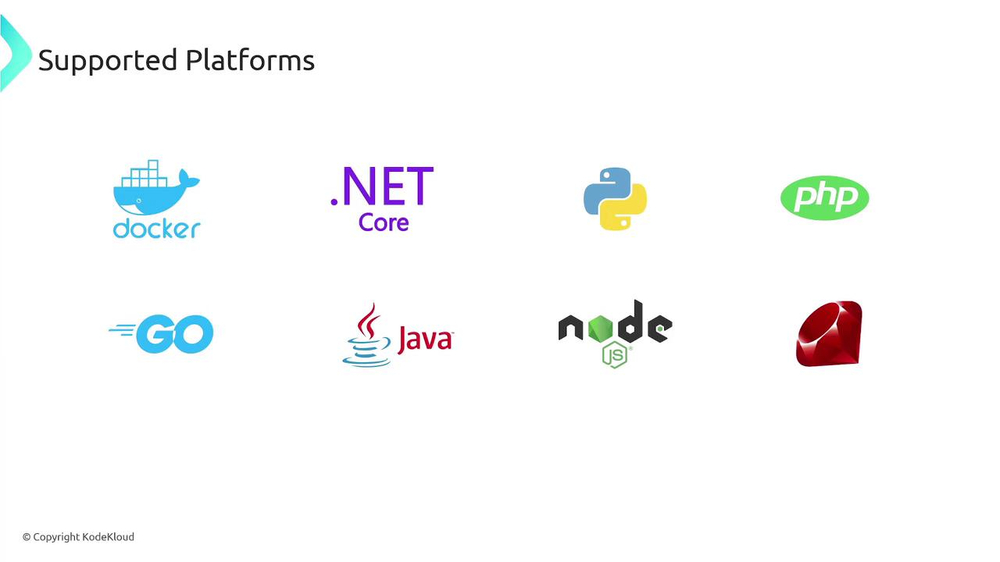
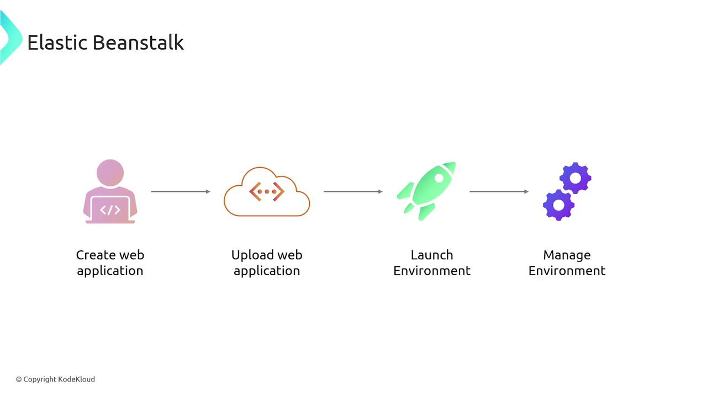
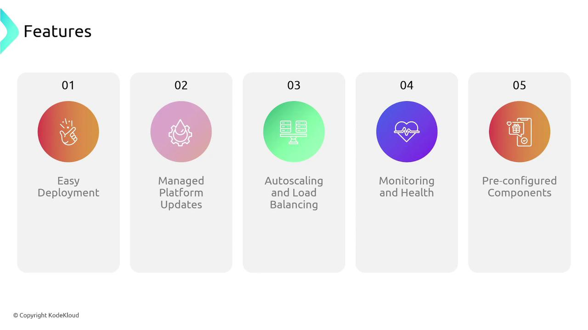

# Elastic Beanstalk

Source: https://notes.kodekloud.com/docs/AWS-Solutions-Architect-Associate-Certification/Services-Compute/Elastic-Beanstalk/page

AWS Elastic Beanstalk simplifies application deployment and management on AWS by automating infrastructure provisioning and allowing developers to focus on their application code.

AWS Elastic Beanstalk is a powerful service that simplifies the deployment and management of applications on AWS. By abstracting the complexity of configuring multiple AWS services—such as VPCs, subnets, EC2 instances, load balancers, databases (RDS), S3 buckets, and CDNs—Elastic Beanstalk lets you focus on your application code while it automatically provisions and manages the underlying infrastructure.

## How It Works

When building a web application, you first upload your source code (HTML, CSS, JavaScript, etc.) to a storage location. Then, you configure Elastic Beanstalk with your deployment specifications, which include environment variables, instance types, runtime settings, and the desired platform. Once your code is uploaded, Elastic Beanstalk automatically deploys all the required resources, such as VPCs, subnets, EC2 instances, load balancers, and databases if needed. The result is a fully operational web application with managed infrastructure.

<Callout icon="lightbulb">
  Elastic Beanstalk introduces the concept of environments—a collection of AWS resources required for your application to run. You can create separate environments for development, staging, and production, ensuring consistent service configurations across all stages of your development lifecycle.
</Callout>

## Supported Platforms

Elastic Beanstalk supports a wide range of programming languages and platforms, including Docker, .NET Core, Python, PHP, Go, Java, Node.js, and Ruby. The process is straightforward: upload your code, select the appropriate runtime, and let Elastic Beanstalk handle the rest.

<Frame>
  
</Frame>

## Deployment Workflow

The deployment process with Elastic Beanstalk involves three core steps:

1. **Create an Application:** Start by creating an application in the Elastic Beanstalk console.
2. **Upload Your Code:** Upload your application source code along with deployment configurations.
3. **Deploy to an Environment:** Deploy the code to a designated environment, allowing you to test and manage the application.

Once set up, you can monitor application health, conduct tests, and deploy new versions seamlessly. For instance, deploy updates in your staging environment to evaluate performance before releasing them in production.

<Frame>
  
</Frame>

## Key Benefits and Features

Elastic Beanstalk offers several advantages that can accelerate your development process and ensure efficient management of your applications:

| Feature                            | Description                                                                                                 |
| ---------------------------------- | ----------------------------------------------------------------------------------------------------------- |
| **Easy Deployment**                | Simplifies the deployment process by letting AWS handle the creation and management of services.            |
| **Managed Platform Updates**       | Automatically updates the underlying platform, including the OS, application server, and runtime.           |
| **Autoscaling and Load Balancing** | Distributes incoming traffic across EC2 instances and scales resources based on demand.                     |
| **Monitoring and Health Checks**   | Provides built-in monitoring through AWS CloudWatch for continuous application health checks.               |
| **Pre-configured Stacks**          | Offers ready-to-use stacks for popular programming languages such as Node.js, Python, Ruby, Go, and Docker. |

<Frame>
  
</Frame>

<Callout icon="lightbulb">
  With Elastic Beanstalk, you can focus on developing your application without worrying about the underlying infrastructure. AWS manages the heavy lifting, ensuring that your environment is secure, scalable, and optimized for performance.
</Callout>

## Conclusion

AWS Elastic Beanstalk is the ideal solution for developers who want a hassle-free deployment process. Its powerful features, such as managed platform updates, autoscaling, and integrated monitoring, allow you to launch and maintain web applications with confidence. Explore more about AWS Elastic Beanstalk to boost your development workflow and reduce operational overhead.

<CardGroup>
  <Card title="Watch Video" icon="video" href="https://learn.kodekloud.com/user/courses/aws-solutions-architect-associate-certification/module/afe0c951-fe76-47f2-9fc4-18858721be70/lesson/47adc5c2-7b55-4789-aaec-0820415084b0" />
</CardGroup>
