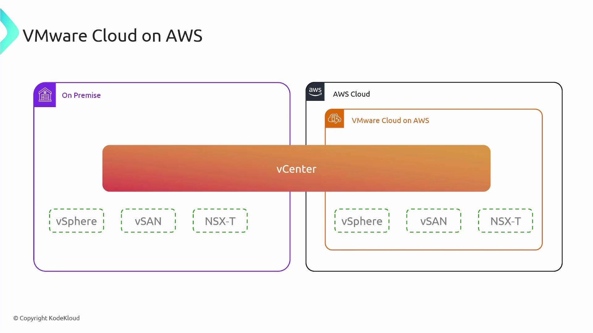
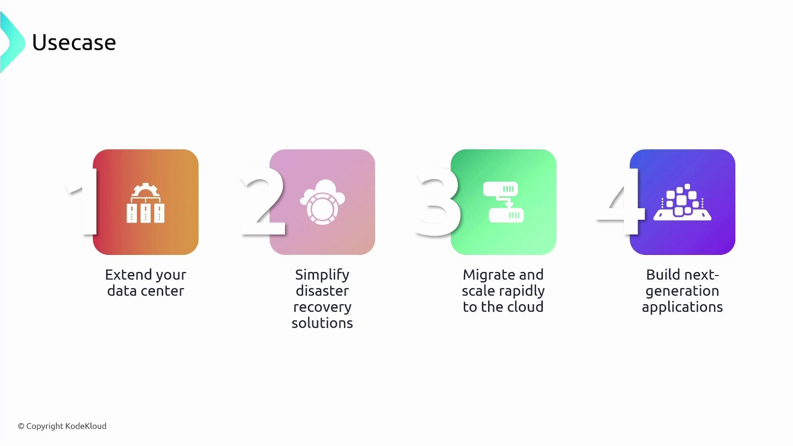

# VMware Cloud on AWS

Source: https://notes.kodekloud.com/docs/AWS-Solutions-Architect-Associate-Certification/Services-Compute/VMware-Cloud-on-AWS/page

This article explores VMware Cloud on AWS and its benefits in creating a unified hybrid cloud environment.

In this article, we delve into VMware Cloud on AWS and explore its numerous benefits in a hybrid cloud environment. This innovative solution combines the robust capabilities of VMware's on-premises tools with the scalability and flexibility of AWS cloud services.

## Understanding VMware Technologies

VMware is well-known for its virtualization platform, primarily used in on-premises data centers. Key VMware products include:

* **vSphere:** The virtualization layer (hypervisor) that creates and manages virtual machines (VMs) on physical servers.
* **vSAN:** A software-defined storage solution for efficient storage management.
* **NSX-T:** A network virtualization and security platform that enhances network operations.

While many organizations continue to rely on VMware for on-premises operations, adopting AWS services (such as EC2 and VPCs) can create management challenges due to distinct operational tools and procedures.

<Callout icon="lightbulb">
  VMware Cloud on AWS addresses these challenges by offering a unified, hybrid environment where the on-premises experience seamlessly extends into the cloud. With this integration, you continue to leverage familiar VMware tools like vSphere, vCenter, vSAN, and NSX-T while AWS takes care of the infrastructure.
</Callout>

## Integrating VMware with AWS

VMware Cloud on AWS enables you to deploy VMware VMs in AWS using the familiar vCenter interface. AWS manages the underlying infrastructure, thus allowing you to focus on your applications without directly engaging with native AWS services.

<Frame>
  
</Frame>

### Key Benefits

Using a consistent VMware infrastructure across both on-premises and cloud environments provides several significant advantages:

* **Consistent Management:** IT teams work with a single set of tools, eliminating the need for extensive retraining.
* **Effortless Workload Balancing:** Seamlessly migrate VMs between environments. When on-premises servers experience capacity challenges, workloads can be shifted to the cloud with just a few clicks.
* **Simplified Disaster Recovery:** Effortlessly replicate and recover workloads as both environments are built on the same technology.
* **Extended Data Center Capabilities:** Use AWS as an extension of your on-premises data center, enabling rapid production workload migration without the need for re-architecting.

<Callout icon="lightbulb">
  This unified approach not only streamlines operations but also opens opportunities for integrating advanced AWS services. This enables the development of next-generation applications that combine the strengths of both VMware's virtualization and AWS’s cutting-edge cloud offerings.
</Callout>

<Frame>
  
</Frame>

## Conclusion

VMware Cloud on AWS delivers a consolidated infrastructure that simplifies hybrid cloud operations. With the consistent management of on-premises and cloud environments, organizations can efficiently balance workloads, ensure robust disaster recovery, and drive innovation by harnessing both VMware and AWS technologies.

For additional resources on cloud integration and hybrid architectures, please check out:

* [Kubernetes Basics](https://kubernetes.io/docs/concepts/overview/what-is-kubernetes/)
* [AWS Documentation](https://docs.aws.amazon.com/)

Embrace the future of IT infrastructure by leveraging the seamless connectivity between VMware and AWS, ensuring your operations are agile, resilient, and ready for modern application development.

<CardGroup>
  <Card title="Watch Video" icon="video" href="https://learn.kodekloud.com/user/courses/aws-solutions-architect-associate-certification/module/afe0c951-fe76-47f2-9fc4-18858721be70/lesson/eca73201-89cd-46e5-9161-625a4d15a21a" />
</CardGroup>
